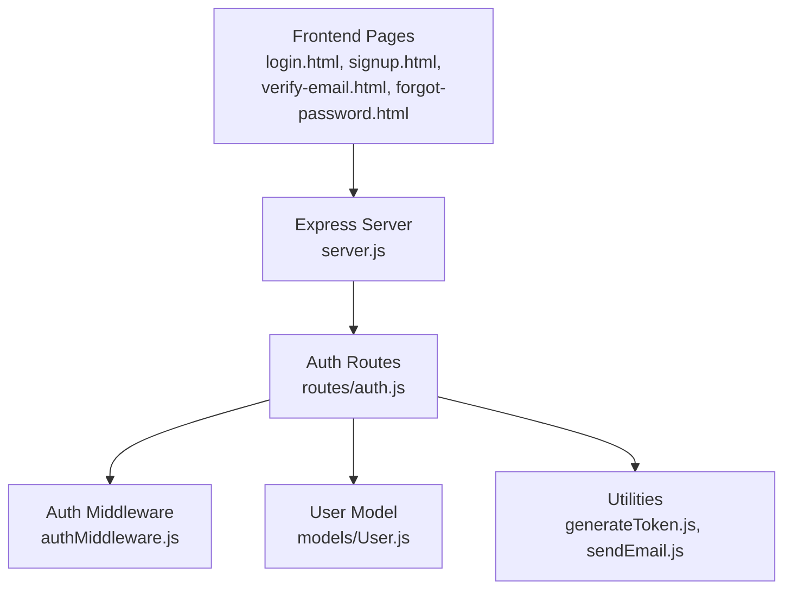
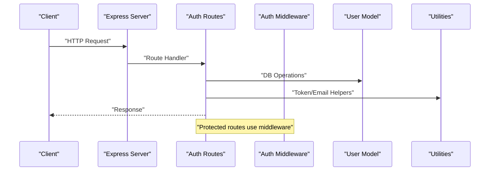
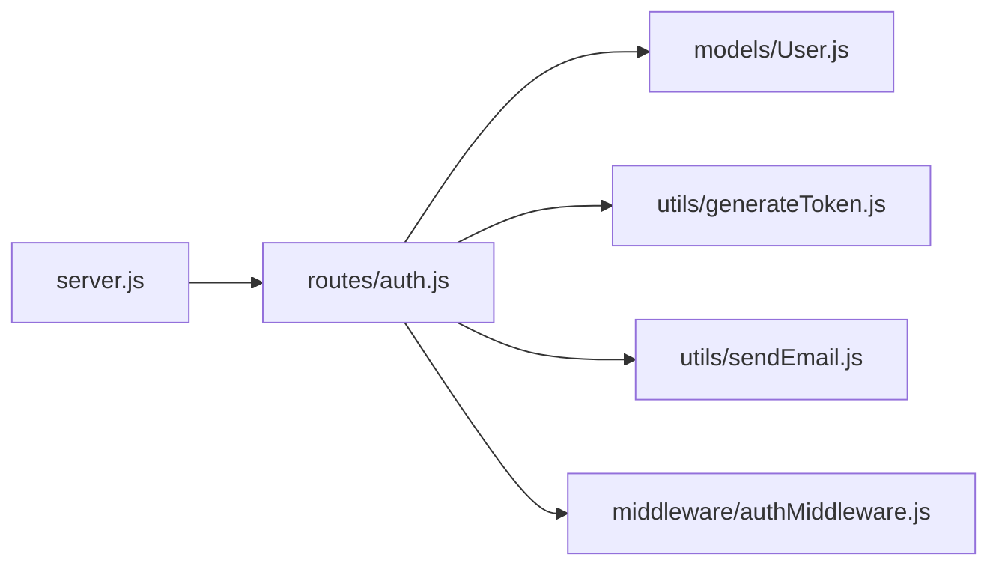

# API Documentation

<cite>
**Referenced Files in This Document**
- [server.js](file://backend/server.js)
- [auth.js](file://backend/routes/auth.js)
- [authMiddleware.js](file://backend/middleware/authMiddleware.js)
- [User.js](file://backend/models/User.js)
- [generateToken.js](file://backend/utils/generateToken.js)
- [sendEmail.js](file://backend/utils/sendEmail.js)
- [package.json](file://backend/package.json)
- [login.html](file://frontend/login.html)
- [signup.html](file://frontend/signup.html)
- [verify-email.html](file://frontend/verify-email.html)
- [forgot-password.html](file://frontend/forgot-password.html)
</cite>

## Table of Contents
1. [Introduction](#introduction)
2. [Project Structure](#project-structure)
3. [Core Components](#core-components)
4. [Architecture Overview](#architecture-overview)
5. [Detailed Component Analysis](#detailed-component-analysis)
6. [Dependency Analysis](#dependency-analysis)
7. [Performance Considerations](#performance-considerations)
8. [Troubleshooting Guide](#troubleshooting-guide)
9. [Conclusion](#conclusion)
10. [Appendices](#appendices)

## Introduction
This document provides comprehensive API documentation for authentication and user management endpoints. It covers HTTP methods, URL patterns, request/response schemas, authentication requirements, validation rules, rate limiting policies, and security considerations for the following endpoints:
- POST /api/auth/signup
- POST /api/auth/verify-email
- POST /api/auth/login
- POST /api/auth/forgot-password
- GET /api/auth/me

It also includes practical curl examples, response code explanations, and error handling patterns. The backend is built with Express.js, MongoDB via Mongoose, JWT tokens, and Nodemailer for email delivery. The frontend pages demonstrate how clients integrate with these endpoints.

## Project Structure
The backend exposes authentication routes under /api/auth. Middleware enforces authentication and authorization, while utilities handle token generation and email sending. The frontend pages consume these endpoints to implement user flows.

**Diagram sources**
- [server.js](file://backend/server.js#L69-L75)
- [auth.js](file://backend/routes/auth.js#L1-L10)
- [authMiddleware.js](file://backend/middleware/authMiddleware.js#L8-L79)
- [User.js](file://backend/models/User.js#L1-L208)
- [generateToken.js](file://backend/utils/generateToken.js#L1-L18)
- [sendEmail.js](file://backend/utils/sendEmail.js#L1-L159)

**Section sources**
- [server.js](file://backend/server.js#L69-L75)
- [auth.js](file://backend/routes/auth.js#L1-L10)

## Core Components
- Authentication middleware protects routes and validates JWT tokens.
- User model defines schema, indexes, and helper methods for OTP/password handling.
- Utilities generate JWT tokens and send transactional emails.
- Rate limiters enforce per-endpoint throttling.

Key responsibilities:
- Authentication middleware: extract token from Authorization header or cookie, verify, attach user to request, enforce verification and activity checks.
- User model: hashing, OTP generation/verification, password comparison, last login updates.
- Utilities: JWT signing with expiration and issuer, email transport configuration and templates.

**Section sources**
- [authMiddleware.js](file://backend/middleware/authMiddleware.js#L8-L79)
- [User.js](file://backend/models/User.js#L92-L177)
- [generateToken.js](file://backend/utils/generateToken.js#L4-L16)
- [sendEmail.js](file://backend/utils/sendEmail.js#L7-L31)

## Architecture Overview
High-level flow:
- Clients call authentication endpoints.
- Routes validate inputs, interact with the User model, and use utilities for tokens and emails.
- Protected endpoints use middleware to ensure authenticated, verified, and active users.

**Diagram sources**
- [server.js](file://backend/server.js#L69-L75)
- [auth.js](file://backend/routes/auth.js#L81-L178)
- [authMiddleware.js](file://backend/middleware/authMiddleware.js#L8-L79)
- [User.js](file://backend/models/User.js#L108-L177)
- [generateToken.js](file://backend/utils/generateToken.js#L4-L16)
- [sendEmail.js](file://backend/utils/sendEmail.js#L51-L157)

## Detailed Component Analysis

### Endpoint: POST /api/auth/signup
- Method: POST
- URL: /api/auth/signup
- Purpose: Register a new user and send a verification email with an OTP.

Request
- Content-Type: application/json
- Body fields:
  - name: string, required, trimmed, validated length 2–50
  - email: string, required, lowercased, trimmed, validated email
  - password: string, required, minimum 6 characters, enforced by validator
- Validation rules:
  - Missing fields return 400 with error message.
  - Invalid email returns 400 with error message.
  - Weak password returns 400 with error message.
  - Existing verified user returns 400 with message indicating login prompt.
  - Existing unverified user resends OTP and returns 200 with message and email.
- Behavior:
  - Creates user with hashed password.
  - Generates OTP and expiry, saves user.
  - Sends verification email template.
  - Returns success with email and message; on resend, returns 200.

Response
- 201 Created: On successful creation and email dispatch.
- 200 OK: On resending OTP to existing unverified user.
- 400 Bad Request: On validation failures or duplicate verified email.
- 500 Internal Server Error: On server errors.

Rate limiting
- Signup limiter: 5 attempts per 1 hour.

Security considerations
- Input sanitization and trimming.
- Strong password validation.
- Email uniqueness enforced by schema.
- OTP stored as hash with expiry.

curl example
- curl -X POST https://your-api-base/api/auth/signup -H "Content-Type: application/json" -d '{"name":"John Doe","email":"john@example.com","password":"SecurePass1!"}'

Authentication requirements
- None.

**Section sources**
- [auth.js](file://backend/routes/auth.js#L81-L178)
- [User.js](file://backend/models/User.js#L5-L83)
- [sendEmail.js](file://backend/utils/sendEmail.js#L51-L86)

### Endpoint: POST /api/auth/verify-email
- Method: POST
- URL: /api/auth/verify-email
- Purpose: Verify user’s email using OTP.

Request
- Content-Type: application/json
- Body fields:
  - email: string, required, lowercased, trimmed
  - otp: string, required, trimmed
- Validation rules:
  - Missing fields return 400 with error message.
  - Unknown user returns 404 with error message.
  - Already verified user returns 400 with message.
  - Invalid/expired OTP returns 400 with error message.
- Behavior:
  - Marks user as verified, clears OTP.
  - Sends welcome email.
  - Responds with token and user profile via cookie and JSON.

Response
- 200 OK: On successful verification, includes token and user.
- 400 Bad Request: On invalid/expired OTP or already verified.
- 404 Not Found: On unknown user.
- 500 Internal Server Error: On server errors.

Rate limiting
- None configured for this endpoint.

Security considerations
- OTP verification compares hashed OTP against input.
- Expiry enforced before acceptance.
- Token set as HttpOnly cookie with secure flags.

curl example
- curl -X POST https://your-api-base/api/auth/verify-email -H "Content-Type: application/json" -d '{"email":"john@example.com","otp":"123456"}'

Authentication requirements
- None.

**Section sources**
- [auth.js](file://backend/routes/auth.js#L183-L241)
- [User.js](file://backend/models/User.js#L123-L139)
- [sendEmail.js](file://backend/utils/sendEmail.js#L128-L157)

### Endpoint: POST /api/auth/login
- Method: POST
- URL: /api/auth/login
- Purpose: Authenticate user and issue session token via cookie.

Request
- Content-Type: application/json
- Body fields:
  - email: string, required, lowercased, trimmed, validated email
  - password: string, required
- Validation rules:
  - Missing fields return 400 with error message.
  - Invalid email returns 400 with error message.
  - Unknown user returns 401 with error message.
  - Deactivated user returns 403 with message.
  - Unverified user generates OTP, sends email, returns 403 with requiresVerification flag.
  - Incorrect password returns 401 with error message.
- Behavior:
  - Updates last login timestamp.
  - Issues token via cookie with HttpOnly, secure, sameSite strict.

Response
- 200 OK: On successful login, includes token and user.
- 400 Bad Request: On validation failures.
- 401 Unauthorized: On invalid credentials.
- 403 Forbidden: On deactivated/unverified user.
- 500 Internal Server Error: On server errors.

Rate limiting
- Login limiter: 10 attempts per 15 minutes; successful requests are skipped.

Security considerations
- Password comparison via bcrypt.
- Verified and active user checks in middleware.
- Token cookie with security flags.

curl example
- curl -X POST https://your-api-base/api/auth/login -H "Content-Type: application/json" -d '{"email":"john@example.com","password":"SecurePass1!"}'

Authentication requirements
- None.

**Section sources**
- [auth.js](file://backend/routes/auth.js#L300-L377)
- [authMiddleware.js](file://backend/middleware/authMiddleware.js#L8-L79)
- [User.js](file://backend/models/User.js#L108-L111)

### Endpoint: POST /api/auth/forgot-password
- Method: POST
- URL: /api/auth/forgot-password
- Purpose: Initiate password reset by sending a reset OTP.

Request
- Content-Type: application/json
- Body fields:
  - email: string, required, lowercased, trimmed, validated email
- Validation rules:
  - Missing email returns 400 with error message.
  - Invalid email returns 400 with error message.
- Behavior:
  - Generates OTP and expiry, saves user.
  - Sends password reset email template.
  - Returns success message regardless of whether user exists (security: no account enumeration).

Response
- 200 OK: On successful initiation or non-existent user.
- 400 Bad Request: On validation failures.
- 500 Internal Server Error: On server errors.

Rate limiting
- OTP limiter: 5 attempts per 15 minutes.

Security considerations
- No disclosure of account existence.
- OTP stored as hash with expiry.

curl example
- curl -X POST https://your-api-base/api/auth/forgot-password -H "Content-Type: application/json" -d '{"email":"john@example.com"}'

Authentication requirements
- None.

**Section sources**
- [auth.js](file://backend/routes/auth.js#L382-L432)
- [sendEmail.js](file://backend/utils/sendEmail.js#L91-L123)

### Endpoint: GET /api/auth/me
- Method: GET
- URL: /api/auth/me
- Purpose: Retrieve currently authenticated user profile.

Request
- Headers:
  - Authorization: Bearer <token> or Cookie: token=<token>
- Validation rules:
  - Missing token returns 401 with error message.
  - Invalid/expired token returns 401 with error message.
  - Nonexistent user returns 401 with error message.
  - Unverified user returns 403 with message.
  - Deactivated user returns 403 with message.
- Behavior:
  - Returns user profile fields excluding sensitive data.

Response
- 200 OK: Returns user object with selected fields.
- 401 Unauthorized: On missing/invalid/expired token.
- 403 Forbidden: On unverified/deactivated user.
- 500 Internal Server Error: On server errors.

Rate limiting
- Global limiter applies to /api/ routes; per-route limiter not configured.

Security considerations
- Requires authenticated, verified, active user.
- Token extracted from Authorization header or cookie.

curl example
- curl -H "Authorization: Bearer YOUR_JWT_TOKEN" https://your-api-base/api/auth/me
- curl -b "token=YOUR_JWT_COOKIE" https://your-api-base/api/auth/me

Authentication requirements
- Bearer token or HttpOnly cookie required.

**Section sources**
- [auth.js](file://backend/routes/auth.js#L512-L537)
- [authMiddleware.js](file://backend/middleware/authMiddleware.js#L8-L79)

## Dependency Analysis
- Route handlers depend on:
  - User model for database operations and helper methods.
  - JWT utilities for token generation.
  - Email utilities for transactional emails.
  - Rate limiters for throttling.
  - Validator for input sanitization and validation.
- Middleware depends on JWT library and User model.
- Server integrates routes and applies global rate limiting and CORS.

**Diagram sources**
- [auth.js](file://backend/routes/auth.js#L1-L10)
- [authMiddleware.js](file://backend/middleware/authMiddleware.js#L1-L10)
- [User.js](file://backend/models/User.js#L1-L10)
- [generateToken.js](file://backend/utils/generateToken.js#L1-L10)
- [sendEmail.js](file://backend/utils/sendEmail.js#L1-L10)
- [server.js](file://backend/server.js#L69-L75)

**Section sources**
- [auth.js](file://backend/routes/auth.js#L1-L10)
- [authMiddleware.js](file://backend/middleware/authMiddleware.js#L1-L10)
- [User.js](file://backend/models/User.js#L1-L10)
- [generateToken.js](file://backend/utils/generateToken.js#L1-L10)
- [sendEmail.js](file://backend/utils/sendEmail.js#L1-L10)
- [server.js](file://backend/server.js#L69-L75)

## Performance Considerations
- Global rate limiter: 100 requests per 15 minutes on /api/.
- Per-endpoint rate limiters:
  - Signup: 5 per hour
  - Login: 10 per 15 minutes (skips successful requests)
  - OTP endpoints: 5 per 15 minutes
- JWT cookie settings:
  - HttpOnly prevents XSS.
  - Secure flag enabled in production.
  - SameSite strict mitigates CSRF.
- Email transport is configured for Gmail SMTP with TLS logging enabled.

[No sources needed since this section provides general guidance]

## Troubleshooting Guide
Common issues and resolutions:
- Invalid credentials during login:
  - Ensure email and password are correct.
  - Unverified accounts trigger OTP resend; handle requiresVerification flag in client.
- Email verification failures:
  - Confirm OTP length and validity.
  - Check OTP expiry and resend if needed.
- Forgotten password failures:
  - Ensure OTP is 6 digits and not expired.
  - Re-send code if needed.
- Authentication errors:
  - Verify token presence and validity.
  - Ensure user is verified and active.
- Rate limiting:
  - Wait for cooldown windows before retrying.
- CORS and cookies:
  - Ensure credentials are included in client requests when using cookies.

**Section sources**
- [auth.js](file://backend/routes/auth.js#L300-L377)
- [auth.js](file://backend/routes/auth.js#L183-L241)
- [auth.js](file://backend/routes/auth.js#L382-L432)
- [authMiddleware.js](file://backend/middleware/authMiddleware.js#L8-L79)

## Conclusion
The authentication system provides robust endpoints for user registration, verification, login, password reset, and profile retrieval. It enforces input validation, rate limiting, and security best practices including token cookies, OTP hashing, and email templates. Clients should follow the documented request/response patterns and handle error codes appropriately.

[No sources needed since this section summarizes without analyzing specific files]

## Appendices

### A. Request/Response Schemas

- POST /api/auth/signup
  - Request: { name, email, password }
  - Response: { success, message, email }
  - Additional on resend: { success, message, email }

- POST /api/auth/verify-email
  - Request: { email, otp }
  - Response: { success, message, token, user }

- POST /api/auth/login
  - Request: { email, password }
  - Response: { success, message, token, user } or { success, message, requiresVerification, email }

- POST /api/auth/forgot-password
  - Request: { email }
  - Response: { success, message }

- GET /api/auth/me
  - Response: { success, user: { id, name, email, avatar, phone, bio, role, isVerified, createdAt, lastLogin } }

**Section sources**
- [auth.js](file://backend/routes/auth.js#L81-L178)
- [auth.js](file://backend/routes/auth.js#L183-L241)
- [auth.js](file://backend/routes/auth.js#L300-L377)
- [auth.js](file://backend/routes/auth.js#L382-L432)
- [auth.js](file://backend/routes/auth.js#L512-L537)

### B. Rate Limiting Policies
- Global API limiter: 100 requests per 15 minutes on /api/.
- Signup: 5 per hour.
- Login: 10 per 15 minutes (successful requests skipped).
- OTP endpoints: 5 per 15 minutes.

**Section sources**
- [server.js](file://backend/server.js#L59-L64)
- [auth.js](file://backend/routes/auth.js#L14-L33)

### C. Security Considerations
- Token storage: HttpOnly, secure, sameSite strict cookie.
- JWT secret and expiry controlled via environment variables.
- Input sanitization and validation via validator.
- OTP hashing and expiry enforcement.
- Verified and active user checks in middleware.
- CORS configured with credentials and allowed origins.

**Section sources**
- [auth.js](file://backend/routes/auth.js#L49-L76)
- [authMiddleware.js](file://backend/middleware/authMiddleware.js#L8-L79)
- [server.js](file://backend/server.js#L38-L43)

### D. Environment Variables
Required environment variables:
- MONGODB_URI
- JWT_SECRET
- FRONTEND_URL
- EMAIL_USER
- EMAIL_PASS

**Section sources**
- [server.js](file://backend/server.js#L17-L23)
- [sendEmail.js](file://backend/utils/sendEmail.js#L7-L22)