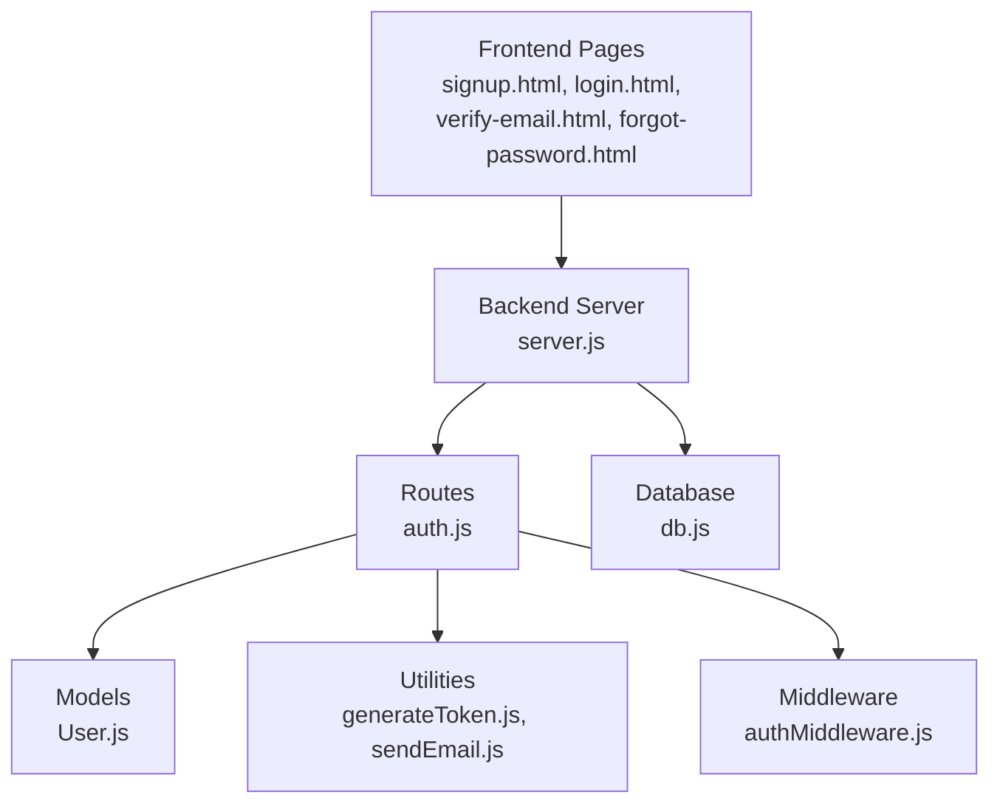
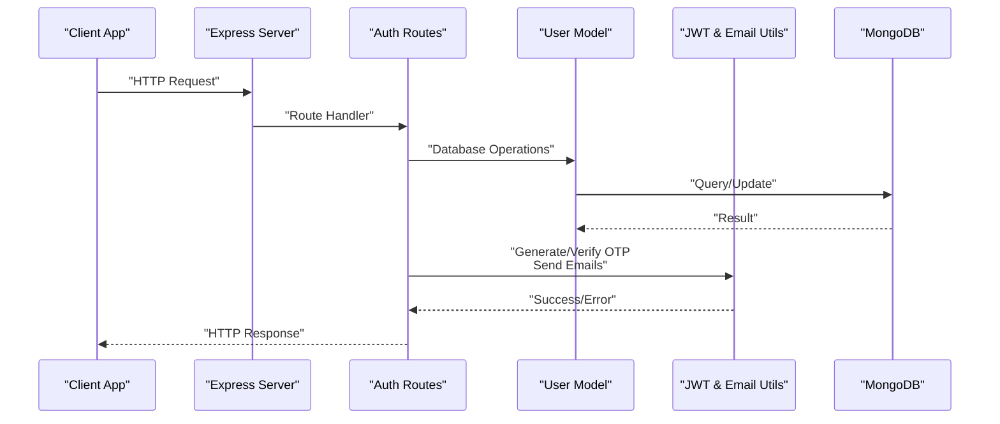
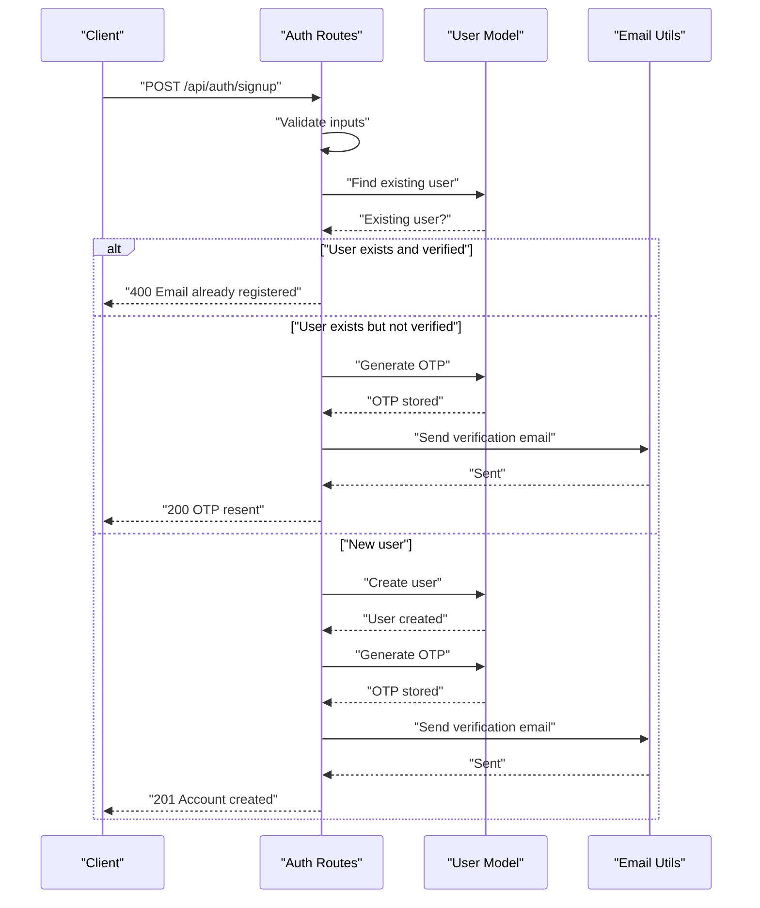
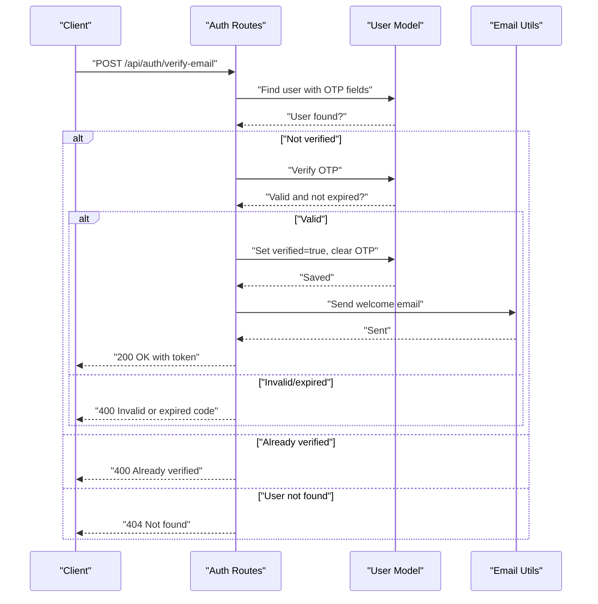
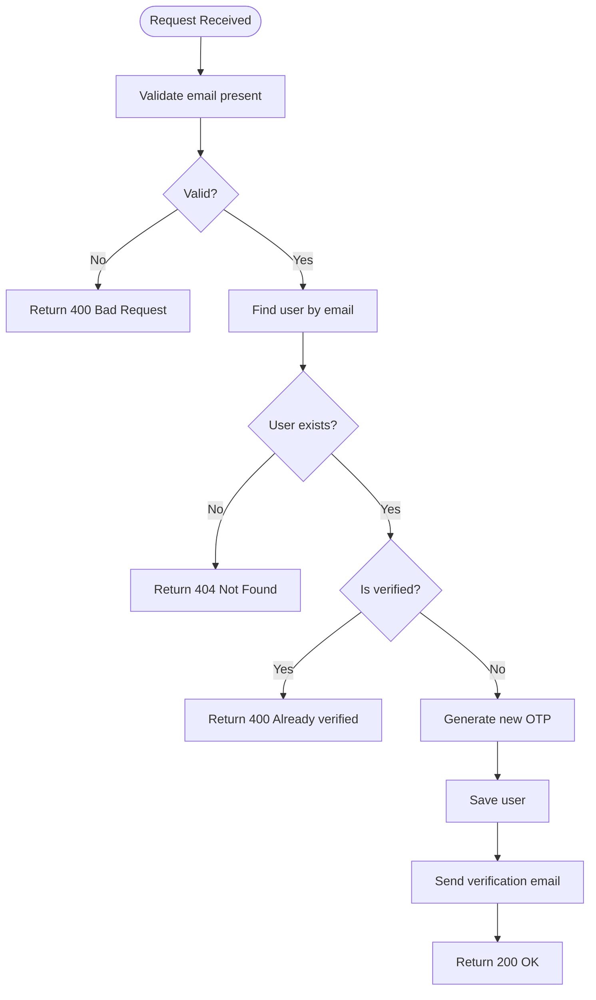
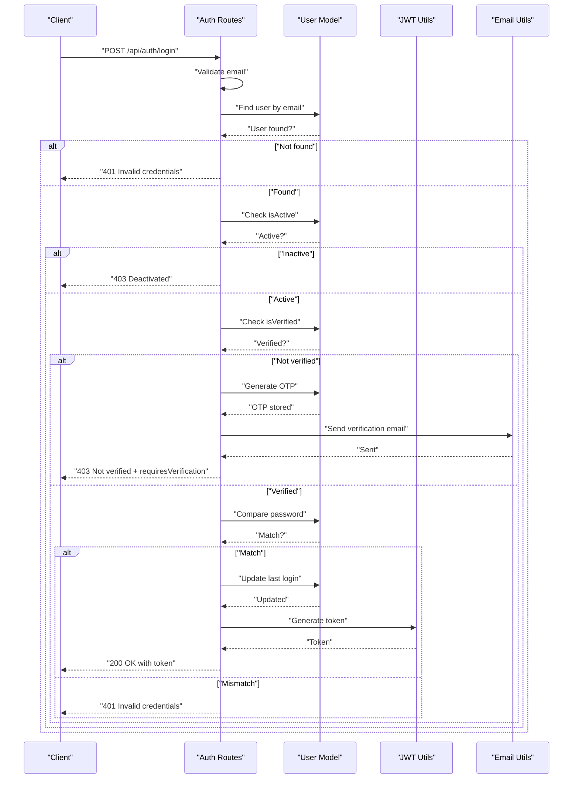
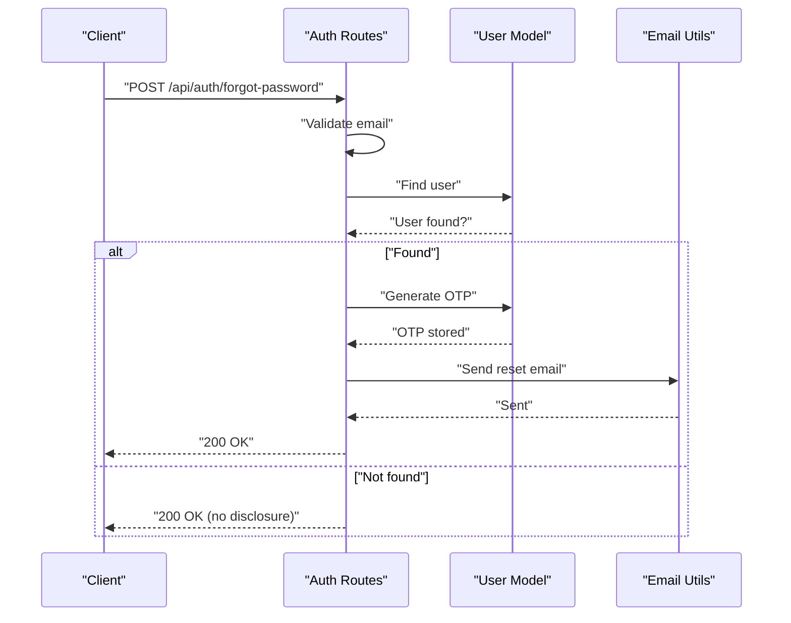
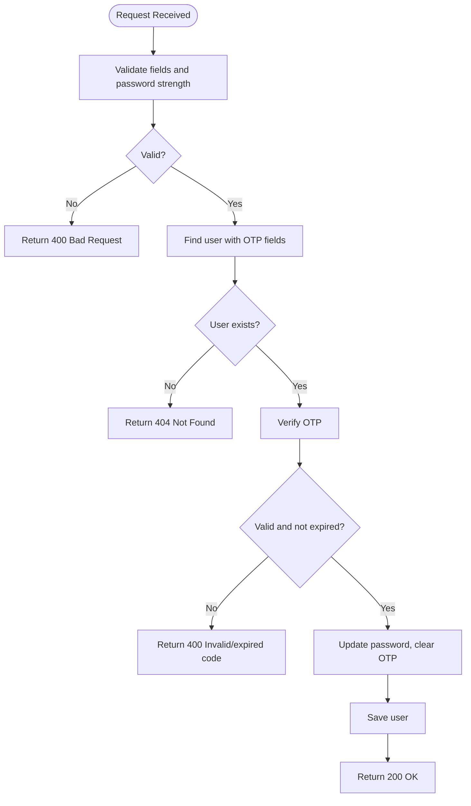
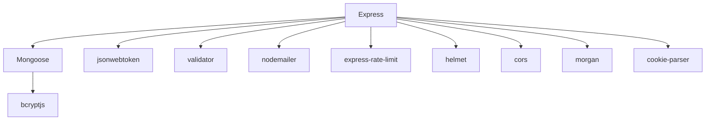

# Authentication Endpoints

<cite>
**Referenced Files in This Document**
- [server.js](file://backend/server.js)
- [auth.js](file://backend/routes/auth.js)
- [User.js](file://backend/models/User.js)
- [generateToken.js](file://backend/utils/generateToken.js)
- [sendEmail.js](file://backend/utils/sendEmail.js)
- [authMiddleware.js](file://backend/middleware/authMiddleware.js)
- [db.js](file://backend/config/db.js)
- [package.json](file://backend/package.json)
- [signup.html](file://frontend/signup.html)
- [login.html](file://frontend/login.html)
- [verify-email.html](file://frontend/verify-email.html)
- [forgot-password.html](file://frontend/forgot-password.html)
</cite>

## Table of Contents
1. [Introduction](#introduction)
2. [Project Structure](#project-structure)
3. [Core Components](#core-components)
4. [Architecture Overview](#architecture-overview)
5. [Detailed Component Analysis](#detailed-component-analysis)
6. [Dependency Analysis](#dependency-analysis)
7. [Performance Considerations](#performance-considerations)
8. [Troubleshooting Guide](#troubleshooting-guide)
9. [Conclusion](#conclusion)
10. [Appendices](#appendices)

## Introduction
This document provides comprehensive API documentation for all authentication-related endpoints in the quiz application. It covers user registration, email verification, OTP resend, login, password reset initiation, and password reset completion. For each endpoint, you will find request/response schemas, validation rules, error codes, and practical curl examples. The documentation also includes conceptual flow diagrams and implementation insights derived from the codebase.

## Project Structure
The authentication system is implemented in the backend under the backend directory. Key components include:
- Routes: Define the API endpoints for authentication
- Controllers: Handle business logic (currently implemented within routes)
- Models: User schema and OTP/password reset utilities
- Utilities: JWT token generation and email sending
- Middleware: Authentication and authorization guards
- Database: MongoDB connection configuration
- Frontend: HTML pages demonstrating client-side usage

**Diagram sources**
- [server.js](file://backend/server.js#L25-L75)
- [auth.js](file://backend/routes/auth.js#L1-L715)
- [User.js](file://backend/models/User.js#L1-L208)
- [generateToken.js](file://backend/utils/generateToken.js#L1-L18)
- [sendEmail.js](file://backend/utils/sendEmail.js#L1-L159)
- [authMiddleware.js](file://backend/middleware/authMiddleware.js#L1-L132)
- [db.js](file://backend/config/db.js#L1-L43)

**Section sources**
- [server.js](file://backend/server.js#L1-L99)
- [auth.js](file://backend/routes/auth.js#L1-L715)

## Core Components
- Authentication routes: Expose endpoints for signup, verify-email, resend-otp, login, forgot-password, and reset-password
- User model: Defines schema, validation, OTP generation/verification, and password utilities
- JWT utilities: Generates signed tokens with expiration and issuer
- Email utilities: Sends verification, password reset, and welcome emails
- Authentication middleware: Protects routes and authorizes roles
- Database connection: Connects to MongoDB with connection pooling and error handling

**Section sources**
- [auth.js](file://backend/routes/auth.js#L1-L715)
- [User.js](file://backend/models/User.js#L1-L208)
- [generateToken.js](file://backend/utils/generateToken.js#L1-L18)
- [sendEmail.js](file://backend/utils/sendEmail.js#L1-L159)
- [authMiddleware.js](file://backend/middleware/authMiddleware.js#L1-L132)
- [db.js](file://backend/config/db.js#L1-L43)

## Architecture Overview
The authentication flow integrates frontend pages with backend routes, models, utilities, and middleware. The server applies global and endpoint-specific rate limiting, sanitizes inputs, validates emails, generates and verifies OTPs, and manages JWT cookies for session persistence.

**Diagram sources**
- [server.js](file://backend/server.js#L25-L75)
- [auth.js](file://backend/routes/auth.js#L1-L715)
- [User.js](file://backend/models/User.js#L1-L208)
- [generateToken.js](file://backend/utils/generateToken.js#L1-L18)
- [sendEmail.js](file://backend/utils/sendEmail.js#L1-L159)

## Detailed Component Analysis

### Endpoint: POST /api/auth/signup
- Purpose: Register a new user, generate OTP, send verification email, and respond with success or resend instructions
- Request body:
  - name: string (required)
  - email: string (required, validated)
  - password: string (required, minimum length 6, strength requirements enforced)
- Response:
  - On success: 201 Created or 200 OK depending on whether OTP was resent
  - On validation failure: 400 Bad Request
  - On duplicate email: 400 Bad Request
  - On server error: 500 Internal Server Error
- Validation rules:
  - All fields required
  - Email must be valid
  - Password minimum length 6 and must include at least one lowercase letter and one number
  - Existing unverified users trigger OTP resend
- Error codes:
  - 400: Missing fields, invalid email, weak password, duplicate email
  - 500: Server error
- Practical curl example:
  - curl -X POST http://localhost:5000/api/auth/signup -H "Content-Type: application/json" -c cookies.txt -d '{"name":"John Doe","email":"john@example.com","password":"SecurePass1"}'

**Diagram sources**
- [auth.js](file://backend/routes/auth.js#L81-L178)
- [User.js](file://backend/models/User.js#L113-L139)
- [sendEmail.js](file://backend/utils/sendEmail.js#L51-L86)

**Section sources**
- [auth.js](file://backend/routes/auth.js#L81-L178)
- [User.js](file://backend/models/User.js#L113-L139)
- [sendEmail.js](file://backend/utils/sendEmail.js#L51-L86)

### Endpoint: POST /api/auth/verify-email
- Purpose: Verify user email using OTP and issue JWT cookie upon success
- Request body:
  - email: string (required, trimmed and lowercased)
  - otp: string (required, trimmed)
- Response:
  - On success: 200 OK with token and user info
  - On validation failure: 400 Bad Request
  - On not found: 404 Not Found
  - On server error: 500 Internal Server Error
- Validation rules:
  - Both fields required
  - User must exist and not be verified
  - OTP must match and not be expired
- Error codes:
  - 400: Missing fields, invalid/expired OTP, already verified
  - 404: User not found
  - 500: Server error
- Practical curl example:
  - curl -X POST http://localhost:5000/api/auth/verify-email -H "Content-Type: application/json" -b cookies.txt -c cookies.txt -d '{"email":"john@example.com","otp":"123456"}'

**Diagram sources**
- [auth.js](file://backend/routes/auth.js#L183-L241)
- [User.js](file://backend/models/User.js#L123-L139)
- [sendEmail.js](file://backend/utils/sendEmail.js#L128-L157)

**Section sources**
- [auth.js](file://backend/routes/auth.js#L183-L241)
- [User.js](file://backend/models/User.js#L123-L139)
- [sendEmail.js](file://backend/utils/sendEmail.js#L128-L157)

### Endpoint: POST /api/auth/resend-otp
- Purpose: Resend verification OTP to an unverified user
- Request body:
  - email: string (required, trimmed and lowercased)
- Response:
  - On success: 200 OK
  - On validation failure: 400 Bad Request
  - On not found: 404 Not Found
  - On server error: 500 Internal Server Error
- Validation rules:
  - Email required
  - User must exist and not be verified
- Error codes:
  - 400: Missing email, already verified
  - 404: User not found
  - 500: Server error
- Practical curl example:
  - curl -X POST http://localhost:5000/api/auth/resend-otp -H "Content-Type: application/json" -d '{"email":"john@example.com"}'

**Diagram sources**
- [auth.js](file://backend/routes/auth.js#L246-L295)
- [User.js](file://backend/models/User.js#L113-L139)
- [sendEmail.js](file://backend/utils/sendEmail.js#L51-L86)

**Section sources**
- [auth.js](file://backend/routes/auth.js#L246-L295)
- [User.js](file://backend/models/User.js#L113-L139)
- [sendEmail.js](file://backend/utils/sendEmail.js#L51-L86)

### Endpoint: POST /api/auth/login
- Purpose: Authenticate user, validate credentials, enforce verification, and issue JWT cookie
- Request body:
  - email: string (required, validated)
  - password: string (required)
- Response:
  - On success: 200 OK with token and user info
  - On validation failure: 400 Bad Request
  - On unauthorized: 401 Unauthorized
  - On inactive/deactivated: 403 Forbidden
  - On server error: 500 Internal Server Error
- Validation rules:
  - Email must be valid
  - User must exist and be active
  - Must be verified; if not, OTP is generated and sent, and response includes requiresVerification flag
  - Password must match
- Error codes:
  - 400: Missing fields, invalid email
  - 401: Invalid credentials
  - 403: Account deactivated or not verified (with requiresVerification flag)
  - 500: Server error
- Practical curl example:
  - curl -X POST http://localhost:5000/api/auth/login -H "Content-Type: application/json" -c cookies.txt -d '{"email":"john@example.com","password":"SecurePass1"}'

**Diagram sources**
- [auth.js](file://backend/routes/auth.js#L300-L377)
- [User.js](file://backend/models/User.js#L108-L111)
- [generateToken.js](file://backend/utils/generateToken.js#L4-L16)
- [sendEmail.js](file://backend/utils/sendEmail.js#L51-L86)

**Section sources**
- [auth.js](file://backend/routes/auth.js#L300-L377)
- [User.js](file://backend/models/User.js#L108-L111)
- [generateToken.js](file://backend/utils/generateToken.js#L4-L16)
- [sendEmail.js](file://backend/utils/sendEmail.js#L51-L86)

### Endpoint: POST /api/auth/forgot-password
- Purpose: Initiate password reset by sending a reset OTP to the user’s email
- Request body:
  - email: string (required, validated)
- Response:
  - On success: 200 OK (security: does not disclose if email exists)
  - On validation failure: 400 Bad Request
  - On server error: 500 Internal Server Error
- Validation rules:
  - Email required and valid
- Error codes:
  - 400: Missing email or invalid email
  - 500: Server error
- Practical curl example:
  - curl -X POST http://localhost:5000/api/auth/forgot-password -H "Content-Type: application/json" -d '{"email":"john@example.com"}'

**Diagram sources**
- [auth.js](file://backend/routes/auth.js#L382-L432)
- [User.js](file://backend/models/User.js#L113-L139)
- [sendEmail.js](file://backend/utils/sendEmail.js#L91-L123)

**Section sources**
- [auth.js](file://backend/routes/auth.js#L382-L432)
- [User.js](file://backend/models/User.js#L113-L139)
- [sendEmail.js](file://backend/utils/sendEmail.js#L91-L123)

### Endpoint: POST /api/auth/reset-password
- Purpose: Complete password reset using OTP and set new password
- Request body:
  - email: string (required, trimmed and lowercased)
  - otp: string (required, trimmed)
  - newPassword: string (required, minimum length 6, strength requirements enforced)
- Response:
  - On success: 200 OK
  - On validation failure: 400 Bad Request
  - On not found: 404 Not Found
  - On server error: 500 Internal Server Error
- Validation rules:
  - All fields required
  - Password minimum length 6 and must include at least one lowercase letter and one number
  - OTP must match and not be expired
- Error codes:
  - 400: Missing fields, invalid/expired OTP, weak password
  - 404: User not found
  - 500: Server error
- Practical curl example:
  - curl -X POST http://localhost:5000/api/auth/reset-password -H "Content-Type: application/json" -d '{"email":"john@example.com","otp":"123456","newPassword":"NewSecurePass1"}'

**Diagram sources**
- [auth.js](file://backend/routes/auth.js#L437-L507)
- [User.js](file://backend/models/User.js#L123-L139)
- [User.js](file://backend/models/User.js#L25-L29)

**Section sources**
- [auth.js](file://backend/routes/auth.js#L437-L507)
- [User.js](file://backend/models/User.js#L25-L29)
- [User.js](file://backend/models/User.js#L123-L139)

### Additional Endpoints (for completeness)
- GET /api/auth/me: Protected endpoint to retrieve current user profile
- PUT /api/auth/update-profile: Protected endpoint to update profile fields
- PUT /api/auth/change-password: Protected endpoint to change password
- POST /api/auth/logout: Protected endpoint to clear JWT cookie
- POST /api/auth/refresh-token: Optional endpoint to refresh token

These endpoints follow similar patterns: input validation, authentication middleware enforcement, and database/model interactions.

**Section sources**
- [auth.js](file://backend/routes/auth.js#L512-L676)
- [authMiddleware.js](file://backend/middleware/authMiddleware.js#L8-L79)

## Dependency Analysis
The authentication system relies on several external libraries and internal modules:
- Express: Web framework and routing
- Mongoose: MongoDB ODM for user model and database operations
- bcryptjs: Password hashing
- jsonwebtoken: JWT token signing and verification
- validator: Input validation and sanitization
- nodemailer: Email transport and templating
- express-rate-limit: Rate limiting for endpoints
- helmet, cors, morgan, cookie-parser: Security, CORS, logging, and cookie parsing

**Diagram sources**
- [package.json](file://backend/package.json#L18-L31)
- [server.js](file://backend/server.js#L1-L99)
- [auth.js](file://backend/routes/auth.js#L1-L10)

**Section sources**
- [package.json](file://backend/package.json#L18-L31)
- [server.js](file://backend/server.js#L1-L99)

## Performance Considerations
- Rate limiting:
  - Global limiter protects all API routes
  - Endpoint-specific limiters for signup, login, and OTP operations
- Input sanitization and validation reduce unnecessary database queries and mitigate injection risks
- JWT cookies are HttpOnly, secure, and SameSite strict for improved security
- Database indexes on email and verification status improve query performance
- Connection pooling configured for MongoDB to handle concurrent requests efficiently

[No sources needed since this section provides general guidance]

## Troubleshooting Guide
Common issues and resolutions:
- Missing environment variables:
  - Ensure MONGODB_URI, JWT_SECRET, and FRONTEND_URL are set
- Email delivery failures:
  - Verify EMAIL_USER and EMAIL_PASS are configured for Gmail SMTP
  - Check email server logs for connection errors
- Authentication errors:
  - Ensure cookies are accepted by the browser for endpoints that rely on JWT cookies
  - Confirm JWT_SECRET matches between server and client expectations
- Database connectivity:
  - Check MongoDB URI and network connectivity
  - Review connection event logs for disconnections or reconnections

**Section sources**
- [server.js](file://backend/server.js#L17-L23)
- [sendEmail.js](file://backend/utils/sendEmail.js#L24-L31)
- [authMiddleware.js](file://backend/middleware/authMiddleware.js#L8-L79)
- [db.js](file://backend/config/db.js#L29-L40)

## Conclusion
The authentication system provides robust user registration, verification, login, and password reset capabilities with strong validation, rate limiting, and secure token management. The documented endpoints and flows enable developers to integrate and troubleshoot the authentication features effectively.

[No sources needed since this section summarizes without analyzing specific files]

## Appendices

### Request/Response Schemas

- POST /api/auth/signup
  - Request: { name: string, email: string, password: string }
  - Response: { success: boolean, message: string, email?: string }
  - Example: { "success": true, "message": "Account created! Please verify your email.", "email": "john@example.com" }

- POST /api/auth/verify-email
  - Request: { email: string, otp: string }
  - Response: { success: boolean, message: string, token?: string, user?: UserInfo }
  - Example: { "success": true, "message": "Email verified successfully!", "token": "eyJhb...", "user": { "id": "...", "name": "John Doe", "email": "john@example.com", "isVerified": true } }

- POST /api/auth/resend-otp
  - Request: { email: string }
  - Response: { success: boolean, message: string }
  - Example: { "success": true, "message": "Verification code sent!" }

- POST /api/auth/login
  - Request: { email: string, password: string }
  - Response: { success: boolean, message: string, token?: string, user?: UserInfo, requiresVerification?: boolean }
  - Example: { "success": true, "message": "Login successful!", "token": "eyJhb..." }

- POST /api/auth/forgot-password
  - Request: { email: string }
  - Response: { success: boolean, message: string }
  - Example: { "success": true, "message": "Password reset code sent to your email" }

- POST /api/auth/reset-password
  - Request: { email: string, otp: string, newPassword: string }
  - Response: { success: boolean, message: string }
  - Example: { "success": true, "message": "Password reset successful! You can now login." }

### Validation Rules Summary
- Email: Required, valid format, trimmed and lowercased
- Password: Minimum 6 characters, must include at least one lowercase letter and one number
- OTP: 6-digit numeric, hashed and time-bound (10 minutes for verification, 30 minutes for reset)
- Name: 2–50 characters
- Phone: Optional, validated numeric format (10–15 digits)

### Error Codes Reference
- 400: Bad Request (validation failures, weak passwords, invalid/expired OTP)
- 401: Unauthorized (invalid credentials)
- 403: Forbidden (deactivated account, not verified)
- 404: Not Found (user not found)
- 500: Internal Server Error (server failures)

### Practical curl Examples
- Registration: curl -X POST http://localhost:5000/api/auth/signup -H "Content-Type: application/json" -c cookies.txt -d '{"name":"John Doe","email":"john@example.com","password":"SecurePass1"}'
- Email Verification: curl -X POST http://localhost:5000/api/auth/verify-email -H "Content-Type: application/json" -b cookies.txt -c cookies.txt -d '{"email":"john@example.com","otp":"123456"}'
- Resend OTP: curl -X POST http://localhost:5000/api/auth/resend-otp -H "Content-Type: application/json" -d '{"email":"john@example.com"}'
- Login: curl -X POST http://localhost:5000/api/auth/login -H "Content-Type: application/json" -c cookies.txt -d '{"email":"john@example.com","password":"SecurePass1"}'
- Forgot Password: curl -X POST http://localhost:5000/api/auth/forgot-password -H "Content-Type: application/json" -d '{"email":"john@example.com"}'
- Reset Password: curl -X POST http://localhost:5000/api/auth/reset-password -H "Content-Type: application/json" -d '{"email":"john@example.com","otp":"123456","newPassword":"NewSecurePass1"}'