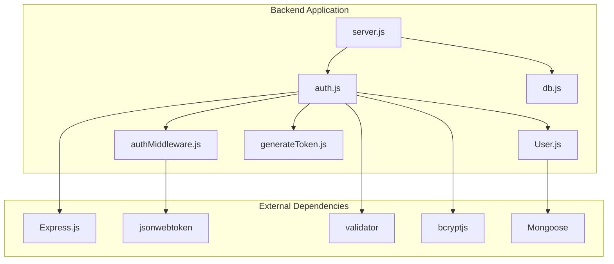
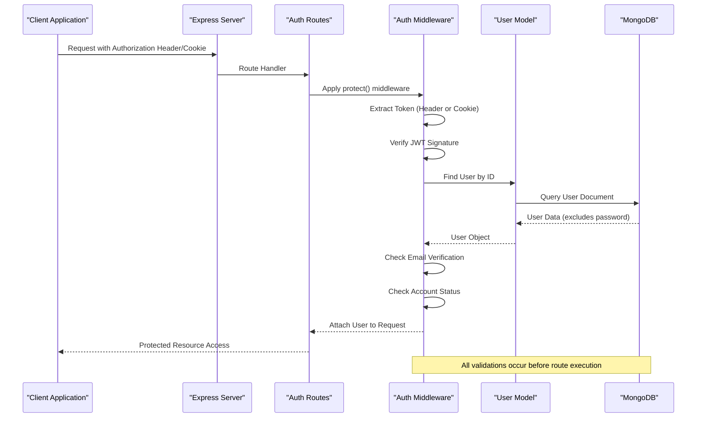
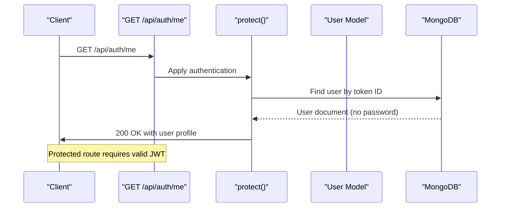
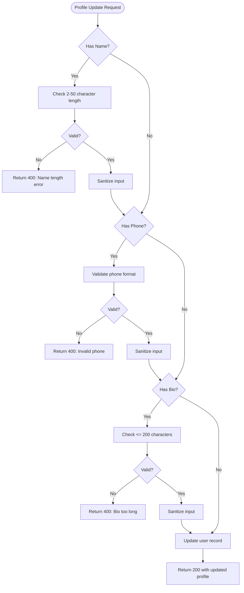
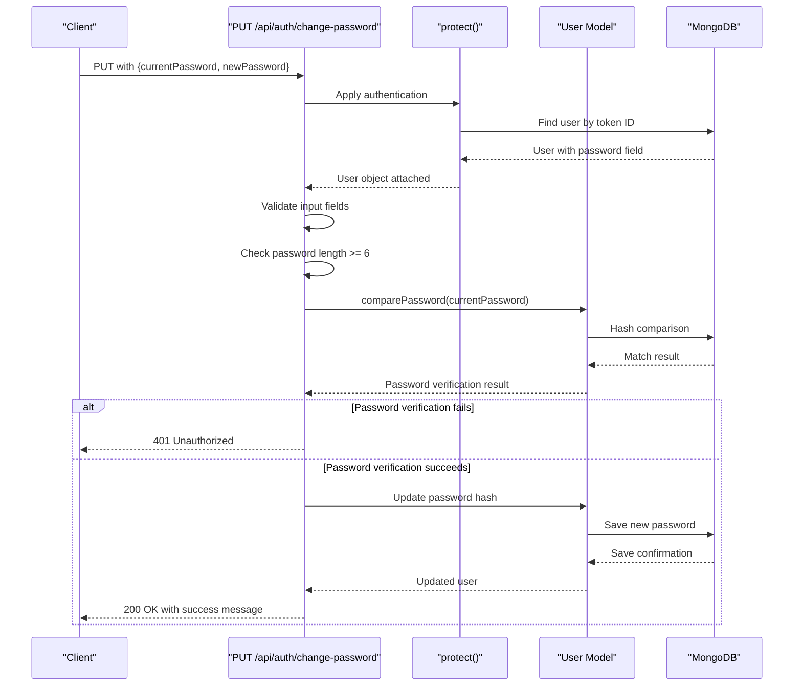
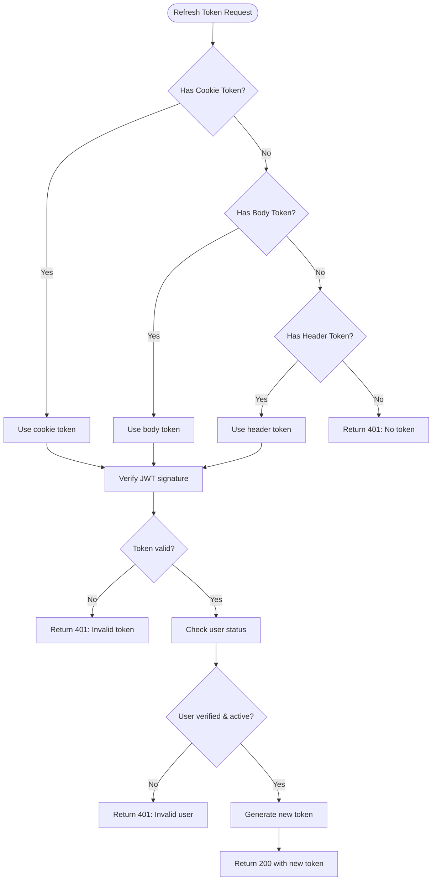
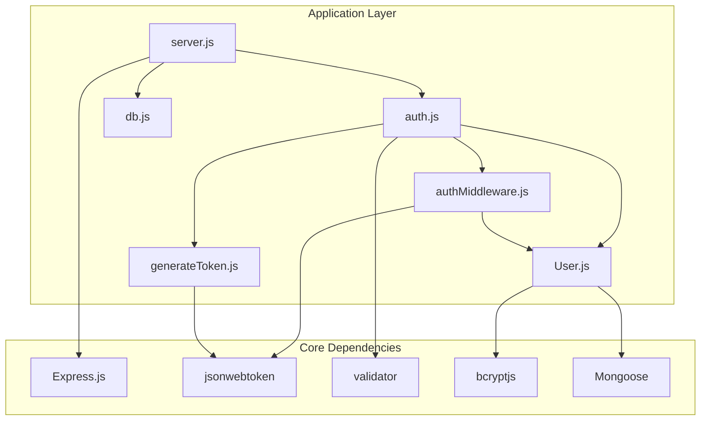

# User Management Endpoints

<cite>
**Referenced Files in This Document**
- [server.js](file://backend/server.js)
- [auth.js](file://backend/routes/auth.js)
- [authMiddleware.js](file://backend/middleware/authMiddleware.js)
- [User.js](file://backend/models/User.js)
- [generateToken.js](file://backend/utils/generateToken.js)
- [db.js](file://backend/config/db.js)
</cite>

## Table of Contents
1. [Introduction](#introduction)
2. [Project Structure](#project-structure)
3. [Core Components](#core-components)
4. [Architecture Overview](#architecture-overview)
5. [Detailed Component Analysis](#detailed-component-analysis)
6. [Dependency Analysis](#dependency-analysis)
7. [Performance Considerations](#performance-considerations)
8. [Troubleshooting Guide](#troubleshooting-guide)
9. [Conclusion](#conclusion)

## Introduction
This document provides comprehensive API documentation for user management endpoints protected by authentication middleware. It covers the complete set of protected routes for retrieving user profiles, updating profile information, changing passwords, logging out, and refreshing JWT tokens. The documentation includes authentication requirements, request/response schemas, validation rules, and error handling patterns for each endpoint.

## Project Structure
The backend follows a modular architecture with clear separation of concerns:



**Diagram sources**
- [server.js](file://backend/server.js#L1-L99)
- [auth.js](file://backend/routes/auth.js#L1-L715)
- [authMiddleware.js](file://backend/middleware/authMiddleware.js#L1-L132)
- [User.js](file://backend/models/User.js#L1-L208)

**Section sources**
- [server.js](file://backend/server.js#L1-L99)
- [auth.js](file://backend/routes/auth.js#L1-L715)

## Core Components
The authentication system consists of several key components working together:

### Authentication Middleware
The authentication middleware provides comprehensive protection for routes through JWT token validation and user verification checks.

### User Model
The User model defines the complete user schema with validation rules, password hashing, and utility methods for OTP generation and verification.

### Token Generation Utility
A dedicated utility handles JWT token creation with configurable expiration and security settings.

### Route Handlers
Individual route handlers manage specific user operations with built-in validation and error handling.

**Section sources**
- [authMiddleware.js](file://backend/middleware/authMiddleware.js#L1-L132)
- [User.js](file://backend/models/User.js#L1-L208)
- [generateToken.js](file://backend/utils/generateToken.js#L1-L18)

## Architecture Overview
The authentication architecture implements a layered security approach with multiple validation checkpoints:



**Diagram sources**
- [authMiddleware.js](file://backend/middleware/authMiddleware.js#L8-L79)
- [auth.js](file://backend/routes/auth.js#L512-L537)

The architecture ensures that:
- Tokens are validated from multiple sources (Authorization header or cookies)
- User existence and verification status are confirmed
- Account activity status is checked
- User objects are attached to requests for downstream handlers

**Section sources**
- [authMiddleware.js](file://backend/middleware/authMiddleware.js#L1-L132)
- [auth.js](file://backend/routes/auth.js#L512-L537)

## Detailed Component Analysis

### GET /api/auth/me - Current User Profile Retrieval
This endpoint retrieves the authenticated user's profile information with comprehensive validation and protection.

#### Authentication Requirements
- **Required Headers**: Authorization: Bearer <token> or valid cookie named "token"
- **Protection Middleware**: `protect()` middleware validates JWT and user status
- **User Verification**: User must have `isVerified: true`
- **Account Status**: User must be `isActive: true`

#### Request Schema
```javascript
// No request body required
// Authorization header or cookie required
```

#### Response Schema
```javascript
{
  success: boolean,
  user: {
    id: string,
    name: string,
    email: string,
    avatar: string,
    phone: string,
    bio: string,
    role: string,
    isVerified: boolean,
    createdAt: string,
    lastLogin: string
  }
}
```

#### Success Response (200 OK)
- Returns complete user profile excluding sensitive information
- Includes all profile fields: basic info, contact details, and metadata

#### Error Responses
- **401 Unauthorized**: Missing or invalid token
- **403 Forbidden**: Unverified email or deactivated account
- **500 Internal Server Error**: Server-side failures



**Diagram sources**
- [auth.js](file://backend/routes/auth.js#L512-L537)
- [authMiddleware.js](file://backend/middleware/authMiddleware.js#L8-L79)

**Section sources**
- [auth.js](file://backend/routes/auth.js#L512-L537)
- [authMiddleware.js](file://backend/middleware/authMiddleware.js#L8-L79)

### PUT /api/auth/update-profile - Profile Updates
This endpoint allows authenticated users to update their profile information with comprehensive validation rules.

#### Authentication Requirements
- **Required**: Valid JWT token (Authorization header or cookie)
- **Protection**: `protect()` middleware ensures user authentication

#### Request Schema
```javascript
{
  name?: string,
  phone?: string,
  bio?: string
}
```

#### Validation Rules
- **Name Validation**:
  - Required: 2-50 characters
  - Sanitized input using HTML escaping
  - Alphanumeric and space characters only
  
- **Phone Validation**:
  - Optional field (can be empty)
  - Must match international phone number pattern
  - Length: 10-15 digits with optional +, -, spaces, parentheses
  
- **Bio Validation**:
  - Optional field (can be empty)
  - Maximum 200 characters
  - Sanitized input

#### Response Schema
```javascript
{
  success: boolean,
  message: string,
  user: {
    id: string,
    name: string,
    email: string,
    phone: string,
    bio: string,
    avatar: string
  }
}
```

#### Success Response (200 OK)
- Updated user profile with sanitized values
- Confirmation message indicating successful update

#### Error Responses
- **400 Bad Request**: Validation failures for any field
- **500 Internal Server Error**: Database or server errors



**Diagram sources**
- [auth.js](file://backend/routes/auth.js#L542-L608)

**Section sources**
- [auth.js](file://backend/routes/auth.js#L542-L608)
- [User.js](file://backend/models/User.js#L38-L52)

### PUT /api/auth/change-password - Secure Password Change
This endpoint enables authenticated users to change their password with current password verification.

#### Authentication Requirements
- **Required**: Valid JWT token
- **Protection**: `protect()` middleware ensures user authentication

#### Request Schema
```javascript
{
  currentPassword: string,
  newPassword: string
}
```

#### Validation Rules
- **Field Requirements**:
  - Both `currentPassword` and `newPassword` are required
  - New password must be at least 6 characters long
  
- **Security Checks**:
  - Current password verification using bcrypt comparison
  - Password update only occurs after successful verification

#### Response Schema
```javascript
{
  success: boolean,
  message: string
}
```

#### Success Response (200 OK)
- Confirmation of successful password change
- No user data returned for security reasons

#### Error Responses
- **400 Bad Request**: Missing required fields or weak password
- **401 Unauthorized**: Incorrect current password
- **500 Internal Server Error**: Server-side failures



**Diagram sources**
- [auth.js](file://backend/routes/auth.js#L613-L660)
- [User.js](file://backend/models/User.js#L109-L111)

**Section sources**
- [auth.js](file://backend/routes/auth.js#L613-L660)
- [User.js](file://backend/models/User.js#L109-L111)

### POST /api/auth/logout - Session Termination
This endpoint terminates user sessions by clearing authentication cookies.

#### Authentication Requirements
- **Required**: Valid JWT token (Authorization header or cookie)
- **Protection**: `protect()` middleware ensures user authentication

#### Request Schema
```javascript
// No request body required
```

#### Response Schema
```javascript
{
  success: boolean,
  message: string
}
```

#### Success Response (200 OK)
- Confirms successful logout
- Clears authentication cookie

#### Logout Process
The logout endpoint performs immediate cookie clearing with:
- Sets cookie value to "none"
- Short expiration time (1 second)
- HttpOnly flag maintained for security
- Same cookie domain/path as original token

**Section sources**
- [auth.js](file://backend/routes/auth.js#L665-L676)

### POST /api/auth/refresh-token - JWT Token Renewal
This endpoint provides JWT token renewal functionality for automatic login scenarios.

#### Authentication Requirements
- **Optional**: Existing valid token (Authorization header or cookie)
- **No Protection**: Unlike other endpoints, this route does not require authentication

#### Request Schema
```javascript
{
  token?: string
}
```

#### Token Retrieval Logic
The endpoint attempts to extract tokens from multiple sources:
1. **Cookie**: `token` cookie value
2. **Body**: `token` field in request body
3. **Header**: `Authorization: Bearer <token>` (fallback)

#### Validation Rules
- **Token Presence**: At least one token source required
- **Token Verification**: JWT signature validation against secret
- **User Status**: Verified and active user required
- **Expiration**: Token must not be expired

#### Response Schema
```javascript
{
  success: boolean,
  message: string,
  token: string,
  user: {
    id: string,
    name: string,
    email: string,
    avatar: string,
    role: string,
    isVerified: boolean
  }
}
```

#### Success Response (200 OK)
- Returns new JWT token with renewed expiration
- Includes user profile information
- Sets new cookie with updated token

#### Error Responses
- **401 Unauthorized**: No token provided or invalid/expired token
- **401 Unauthorized**: Invalid token verification
- **401 Unauthorized**: User not verified or deactivated



**Diagram sources**
- [auth.js](file://backend/routes/auth.js#L681-L712)

**Section sources**
- [auth.js](file://backend/routes/auth.js#L681-L712)
- [generateToken.js](file://backend/utils/generateToken.js#L4-L16)

## Dependency Analysis
The authentication system exhibits strong modularity with clear dependency relationships:



**Diagram sources**
- [server.js](file://backend/server.js#L1-L99)
- [auth.js](file://backend/routes/auth.js#L1-L715)
- [authMiddleware.js](file://backend/middleware/authMiddleware.js#L1-L132)
- [User.js](file://backend/models/User.js#L1-L208)
- [generateToken.js](file://backend/utils/generateToken.js#L1-L18)

### Key Dependencies
- **Express.js**: Web framework foundation
- **jsonwebtoken**: JWT token generation and verification
- **validator**: Input validation and sanitization
- **bcryptjs**: Password hashing and comparison
- **mongoose**: MongoDB object modeling and database operations
- **cookie-parser**: Cookie parsing for token extraction

### Security Dependencies
- **helmet**: Security headers and protections
- **cors**: Cross-origin resource sharing configuration
- **express-rate-limit**: Request rate limiting for security

**Section sources**
- [server.js](file://backend/server.js#L18-L43)
- [package.json](file://backend/package.json#L18-L31)

## Performance Considerations
The authentication system implements several performance optimizations:

### Database Indexing Strategy
- **Email Index**: Automatic unique index on email field for fast lookups
- **Timestamp Indexes**: Created on `createdAt` and `isVerified` for efficient queries
- **Query Optimization**: Selective field retrieval to minimize data transfer

### Token Management
- **Token Expiration**: 7-day default expiration with refresh capability
- **Cookie Security**: HttpOnly, Secure, SameSite=Strict flags
- **Memory Efficiency**: Token verification without loading full user objects

### Request Processing
- **Early Validation**: Input validation before database queries
- **Selective Field Loading**: Password excluded from user objects
- **Rate Limiting**: Built-in rate limiting for authentication endpoints

### Caching Opportunities
- **Token Validation**: Consider Redis caching for frequent token verification
- **User Data**: Cache frequently accessed user profiles
- **Validation Results**: Cache validation outcomes for repeated requests

## Troubleshooting Guide

### Common Authentication Issues
1. **401 Unauthorized Errors**
   - Verify JWT token presence in Authorization header or cookie
   - Check token expiration and validity
   - Ensure user account is verified and active

2. **403 Forbidden Errors**
   - User email verification required
   - Account deactivation by administrator
   - Role-based access restrictions

3. **Token Refresh Failures**
   - Ensure valid token is provided in request
   - Check token expiration and signature
   - Verify user verification and activation status

### Database Connection Issues
- **Connection Timeout**: Check MongoDB URI and network connectivity
- **Authentication Failure**: Verify MongoDB credentials and permissions
- **Pool Exhaustion**: Monitor connection pool settings and usage

### Environment Configuration
- **Missing Environment Variables**: Ensure JWT_SECRET, MONGODB_URI, and FRONTEND_URL are configured
- **CORS Issues**: Verify allowed origins and credentials settings
- **Cookie Security**: Check secure flag configuration for development vs production

### Error Response Patterns
All endpoints follow consistent error response format:
```javascript
{
  success: false,
  message: string,
  error?: string // Only in development mode
}
```

**Section sources**
- [authMiddleware.js](file://backend/middleware/authMiddleware.js#L20-L78)
- [auth.js](file://backend/routes/auth.js#L512-L537)
- [db.js](file://backend/config/db.js#L29-L40)

## Conclusion
The user management endpoints provide a comprehensive and secure authentication system with multiple validation layers and protection mechanisms. The implementation demonstrates best practices in JWT-based authentication, input validation, and error handling. The modular architecture ensures maintainability and extensibility while providing robust security controls.

Key strengths of the implementation include:
- Multi-source token validation (headers and cookies)
- Comprehensive user verification and account status checks
- Strict input validation and sanitization
- Consistent error handling patterns
- Rate limiting for security
- Secure cookie configuration
- Modular and maintainable code structure

The documented endpoints provide complete functionality for modern web applications requiring secure user management capabilities.