# Authentication System

<cite>
**Referenced Files in This Document**
- [server.js](file://backend/server.js)
- [auth.js](file://backend/routes/auth.js)
- [authMiddleware.js](file://backend/middleware/authMiddleware.js)
- [User.js](file://backend/models/User.js)
- [generateToken.js](file://backend/utils/generateToken.js)
- [sendEmail.js](file://backend/utils/sendEmail.js)
- [db.js](file://backend/config/db.js)
- [package.json](file://backend/package.json)
- [login.html](file://frontend/login.html)
- [signup.html](file://frontend/signup.html)
- [forgot-password.html](file://frontend/forgot-password.html)
- [verify-email.html](file://frontend/verify-email.html)
</cite>

## Table of Contents
1. [Introduction](#introduction)
2. [Project Structure](#project-structure)
3. [Core Components](#core-components)
4. [Architecture Overview](#architecture-overview)
5. [Detailed Component Analysis](#detailed-component-analysis)
6. [Dependency Analysis](#dependency-analysis)
7. [Performance Considerations](#performance-considerations)
8. [Troubleshooting Guide](#troubleshooting-guide)
9. [Conclusion](#conclusion)

## Introduction
This document provides comprehensive documentation for the authentication system covering the complete user authentication lifecycle. It explains the registration process with email validation and OTP generation, login/logout mechanisms with JWT token management, password reset workflows, and email verification system. It also documents security implementations including password hashing with bcrypt, JWT token generation and validation, rate limiting protection, and cookie security settings. The document includes detailed API documentation for all authentication endpoints, error handling strategies, integration patterns, and security considerations.

## Project Structure
The authentication system is organized into a backend Express server with modular components and a frontend that integrates with the backend APIs. The backend includes routes, middleware, models, utilities, and configuration files. The frontend consists of HTML pages for login, signup, email verification, and password reset.

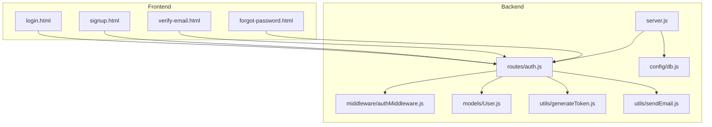

**Diagram sources**
- [server.js](file://backend/server.js#L1-L99)
- [auth.js](file://backend/routes/auth.js#L1-L715)
- [authMiddleware.js](file://backend/middleware/authMiddleware.js#L1-L132)
- [User.js](file://backend/models/User.js#L1-L208)
- [generateToken.js](file://backend/utils/generateToken.js#L1-L18)
- [sendEmail.js](file://backend/utils/sendEmail.js#L1-L159)
- [db.js](file://backend/config/db.js#L1-L43)

**Section sources**
- [server.js](file://backend/server.js#L1-L99)
- [auth.js](file://backend/routes/auth.js#L1-L715)

## Core Components
- Express server with security middleware, CORS configuration, rate limiting, and static file serving for the frontend.
- Authentication routes handling registration, email verification, login, logout, password reset, profile updates, and password changes.
- JWT-based authentication middleware protecting routes and authorizing roles.
- User model with bcrypt password hashing, OTP generation and verification, and reset token management.
- Email utilities for sending verification, password reset, and welcome emails.
- Database connection configuration with MongoDB.

**Section sources**
- [server.js](file://backend/server.js#L1-L99)
- [auth.js](file://backend/routes/auth.js#L1-L715)
- [authMiddleware.js](file://backend/middleware/authMiddleware.js#L1-L132)
- [User.js](file://backend/models/User.js#L1-L208)
- [generateToken.js](file://backend/utils/generateToken.js#L1-L18)
- [sendEmail.js](file://backend/utils/sendEmail.js#L1-L159)
- [db.js](file://backend/config/db.js#L1-L43)

## Architecture Overview
The system follows a layered architecture:
- Presentation Layer: Frontend HTML pages communicate with backend APIs.
- Application Layer: Express routes define endpoints and orchestrate business logic.
- Domain Layer: Authentication middleware enforces security policies.
- Persistence Layer: Mongoose model manages user data and OTP/reset tokens.
- Utility Layer: JWT generation and email transport utilities.

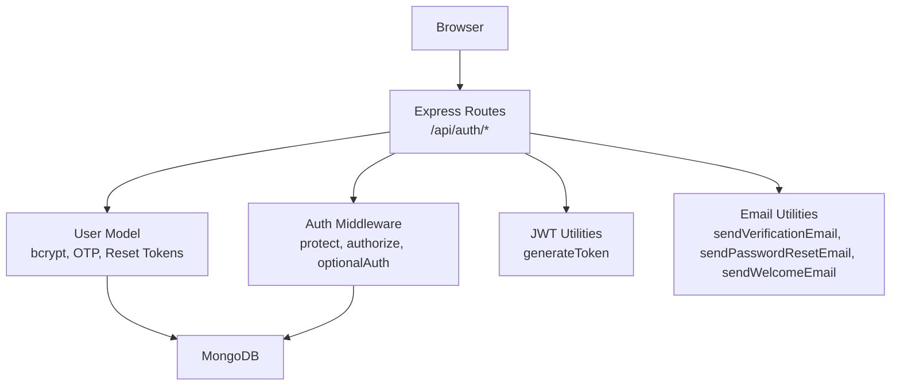

**Diagram sources**
- [auth.js](file://backend/routes/auth.js#L1-L715)
- [authMiddleware.js](file://backend/middleware/authMiddleware.js#L1-L132)
- [User.js](file://backend/models/User.js#L1-L208)
- [generateToken.js](file://backend/utils/generateToken.js#L1-L18)
- [sendEmail.js](file://backend/utils/sendEmail.js#L1-L159)
- [db.js](file://backend/config/db.js#L1-L43)

## Detailed Component Analysis

### Registration and Email Verification
The registration process validates inputs, sanitizes data, hashes passwords, generates and stores an OTP, and sends a verification email. On successful verification, the user is marked as verified and a JWT cookie is set.

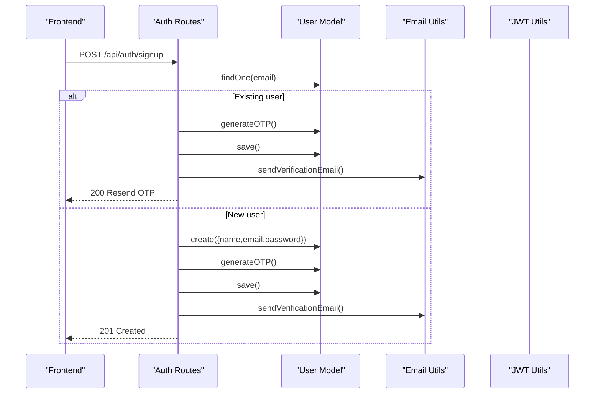

**Diagram sources**
- [auth.js](file://backend/routes/auth.js#L81-L178)
- [User.js](file://backend/models/User.js#L113-L140)
- [sendEmail.js](file://backend/utils/sendEmail.js#L51-L86)
- [generateToken.js](file://backend/utils/generateToken.js#L4-L16)

**Section sources**
- [auth.js](file://backend/routes/auth.js#L81-L178)
- [User.js](file://backend/models/User.js#L113-L140)
- [sendEmail.js](file://backend/utils/sendEmail.js#L51-L86)

### Email Verification Workflow
After registration or login attempts by unverified users, the system sends an OTP and verifies it upon submission.

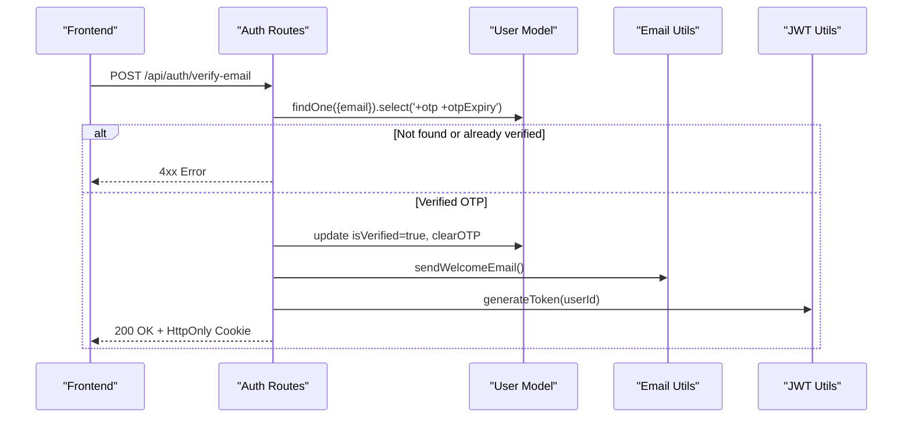

**Diagram sources**
- [auth.js](file://backend/routes/auth.js#L183-L241)
- [User.js](file://backend/models/User.js#L123-L171)
- [sendEmail.js](file://backend/utils/sendEmail.js#L128-L157)
- [generateToken.js](file://backend/utils/generateToken.js#L4-L16)

**Section sources**
- [auth.js](file://backend/routes/auth.js#L183-L241)
- [User.js](file://backend/models/User.js#L123-L171)
- [sendEmail.js](file://backend/utils/sendEmail.js#L128-L157)

### Login and Logout Mechanisms
Login validates credentials, ensures the user is verified and active, updates last login, and sets a JWT cookie. Logout clears the cookie.

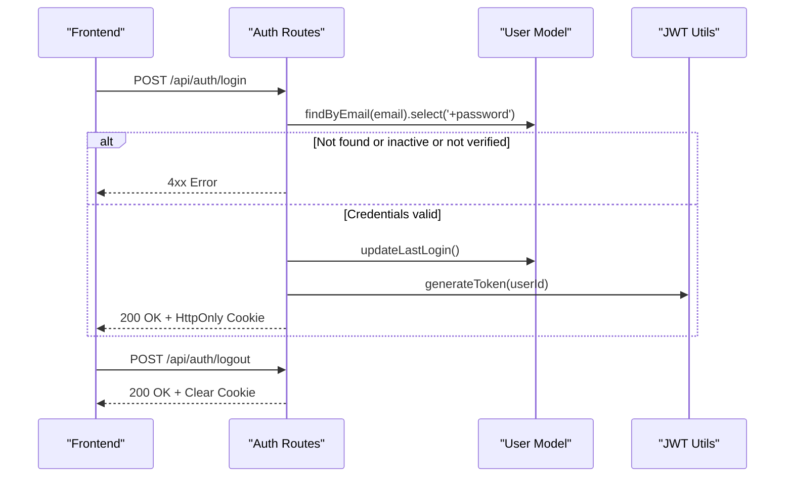

**Diagram sources**
- [auth.js](file://backend/routes/auth.js#L300-L377)
- [auth.js](file://backend/routes/auth.js#L665-L676)
- [User.js](file://backend/models/User.js#L173-L177)
- [generateToken.js](file://backend/utils/generateToken.js#L4-L16)

**Section sources**
- [auth.js](file://backend/routes/auth.js#L300-L377)
- [auth.js](file://backend/routes/auth.js#L665-L676)
- [User.js](file://backend/models/User.js#L173-L177)

### Password Reset Workflow
The password reset flow sends a temporary OTP to the user's email, validates the OTP during reset, and updates the password.

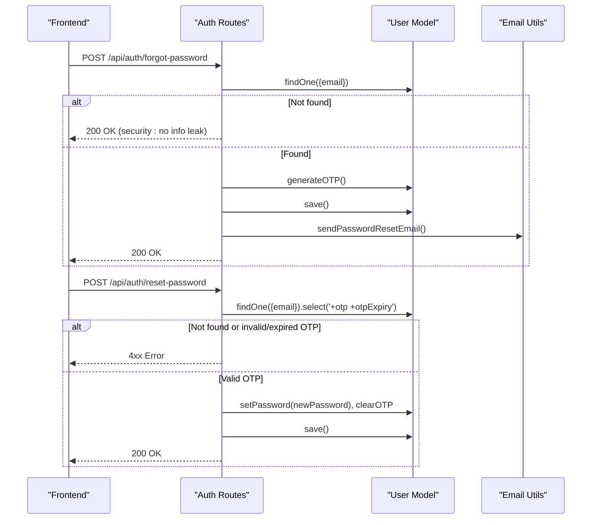

**Diagram sources**
- [auth.js](file://backend/routes/auth.js#L382-L432)
- [auth.js](file://backend/routes/auth.js#L437-L507)
- [User.js](file://backend/models/User.js#L113-L171)
- [sendEmail.js](file://backend/utils/sendEmail.js#L91-L123)

**Section sources**
- [auth.js](file://backend/routes/auth.js#L382-L432)
- [auth.js](file://backend/routes/auth.js#L437-L507)
- [User.js](file://backend/models/User.js#L113-L171)
- [sendEmail.js](file://backend/utils/sendEmail.js#L91-L123)

### JWT Token Management and Cookie Security
- Token generation includes user ID and role with a configurable expiry.
- Token response sets an HttpOnly, secure, sameSite=strict cookie in production.
- Authentication middleware validates tokens from Authorization header or cookies, excludes password from user object, and enforces verification and activity checks.

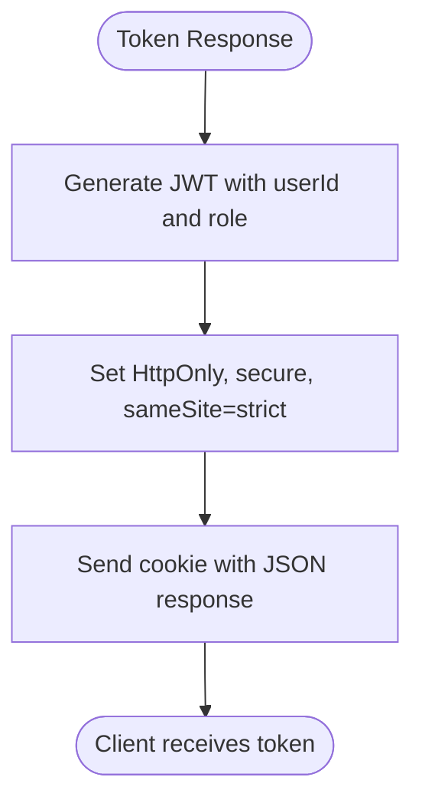

**Diagram sources**
- [generateToken.js](file://backend/utils/generateToken.js#L4-L16)
- [auth.js](file://backend/routes/auth.js#L49-L76)

**Section sources**
- [generateToken.js](file://backend/utils/generateToken.js#L4-L16)
- [auth.js](file://backend/routes/auth.js#L49-L76)
- [authMiddleware.js](file://backend/middleware/authMiddleware.js#L8-L79)

### Rate Limiting Protection
- Global limiter applies to all /api/ routes.
- Route-specific limiters for signup, login, and OTP endpoints with different windows and max requests.
- Successful login requests are skipped for login limiter.

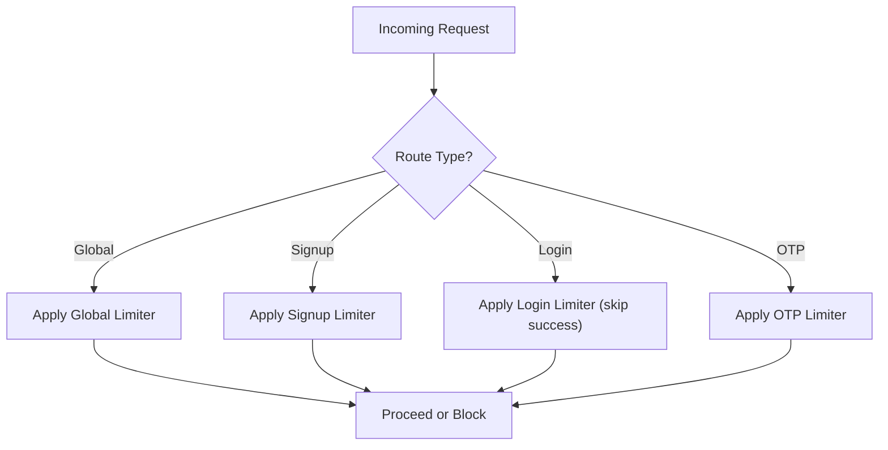

**Diagram sources**
- [server.js](file://backend/server.js#L58-L64)
- [auth.js](file://backend/routes/auth.js#L14-L33)

**Section sources**
- [server.js](file://backend/server.js#L58-L64)
- [auth.js](file://backend/routes/auth.js#L14-L33)

### Input Validation and Sanitization
- Input sanitization trims and escapes strings.
- Email validation uses validator library.
- Password strength validation enforced during signup and reset.
- Phone number validation for profile updates.

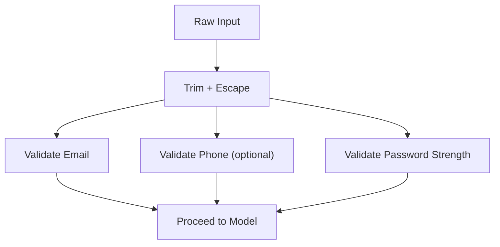

**Diagram sources**
- [auth.js](file://backend/routes/auth.js#L39-L47)
- [auth.js](file://backend/routes/auth.js#L113-L125)
- [auth.js](file://backend/routes/auth.js#L458-L469)
- [auth.js](file://backend/routes/auth.js#L559-L568)

**Section sources**
- [auth.js](file://backend/routes/auth.js#L39-L47)
- [auth.js](file://backend/routes/auth.js#L113-L125)
- [auth.js](file://backend/routes/auth.js#L458-L469)
- [auth.js](file://backend/routes/auth.js#L559-L568)

### Frontend Integration Patterns
- Frontend pages use fetch with credentials: include for cookie-based sessions.
- OTP input handling with auto-focus and paste support.
- Toast notifications for user feedback.
- Environment-aware API base URLs.

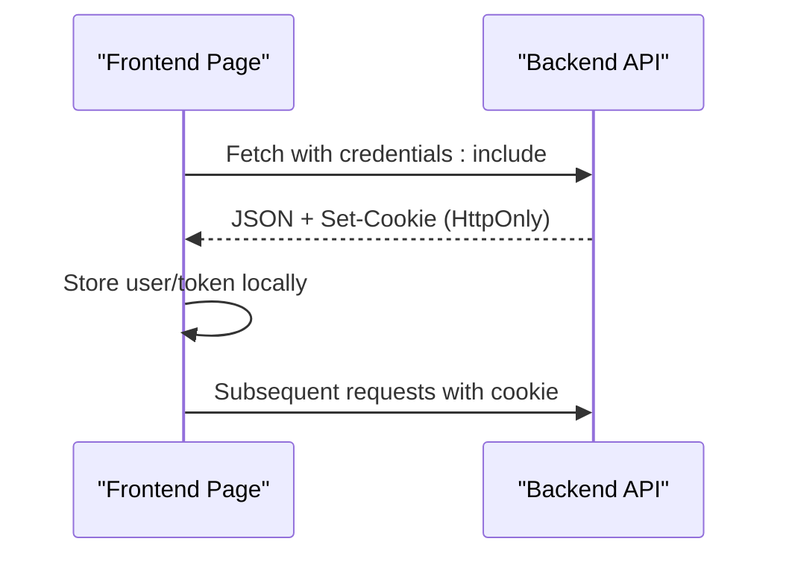

**Diagram sources**
- [login.html](file://frontend/login.html#L180-L188)
- [signup.html](file://frontend/signup.html#L287-L295)
- [verify-email.html](file://frontend/verify-email.html#L121-L126)

**Section sources**
- [login.html](file://frontend/login.html#L180-L188)
- [signup.html](file://frontend/signup.html#L287-L295)
- [verify-email.html](file://frontend/verify-email.html#L121-L126)

## Dependency Analysis
The backend depends on several libraries for security, validation, database connectivity, and email delivery. The frontend communicates with the backend via fetch requests configured for cookie-based authentication.

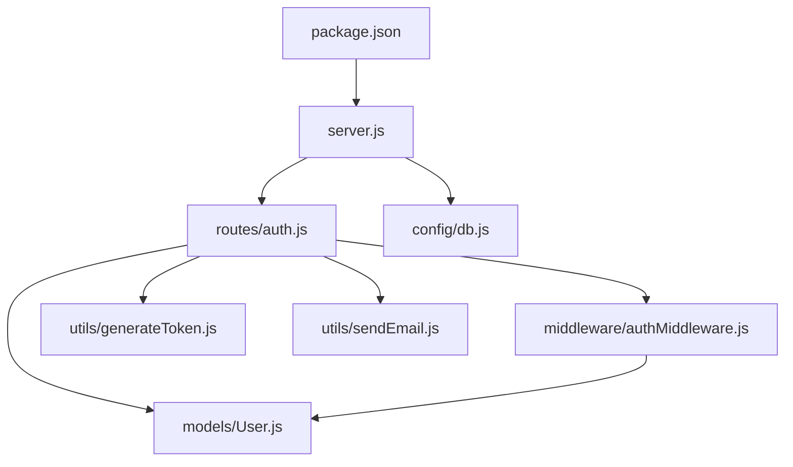

**Diagram sources**
- [server.js](file://backend/server.js#L1-L99)
- [auth.js](file://backend/routes/auth.js#L1-L715)
- [authMiddleware.js](file://backend/middleware/authMiddleware.js#L1-L132)
- [User.js](file://backend/models/User.js#L1-L208)
- [generateToken.js](file://backend/utils/generateToken.js#L1-L18)
- [sendEmail.js](file://backend/utils/sendEmail.js#L1-L159)
- [db.js](file://backend/config/db.js#L1-L43)
- [package.json](file://backend/package.json#L1-L36)

**Section sources**
- [package.json](file://backend/package.json#L18-L30)
- [server.js](file://backend/server.js#L1-L99)
- [auth.js](file://backend/routes/auth.js#L1-L715)

## Performance Considerations
- Database connection pooling and timeouts are configured for reliability.
- Rate limiting prevents abuse and protects resources.
- JWT expiry is configurable to balance security and user experience.
- Email delivery is asynchronous to avoid blocking API responses.

[No sources needed since this section provides general guidance]

## Troubleshooting Guide
Common issues and resolutions:
- Missing environment variables cause immediate server shutdown. Ensure MONGODB_URI, JWT_SECRET, and FRONTEND_URL are set.
- CORS configuration must include frontend origins and credentials: true for cookie support.
- Email transport errors indicate misconfigured SMTP settings; verify EMAIL_USER and EMAIL_PASS.
- JWT verification failures occur with invalid or expired tokens; ensure clients refresh tokens appropriately.
- Rate limit exceeded responses indicate too many requests; adjust limits or implement exponential backoff on the client.

**Section sources**
- [server.js](file://backend/server.js#L15-L23)
- [server.js](file://backend/server.js#L38-L43)
- [sendEmail.js](file://backend/utils/sendEmail.js#L24-L31)
- [authMiddleware.js](file://backend/middleware/authMiddleware.js#L60-L78)

## Conclusion
The authentication system provides a robust, secure, and user-friendly solution for user lifecycle management. It incorporates industry-standard practices including bcrypt hashing, JWT-based session management with secure cookies, comprehensive input validation, rate limiting, and email-based verification and password reset workflows. The frontend integration is designed to work seamlessly with the backend APIs while maintaining security best practices.