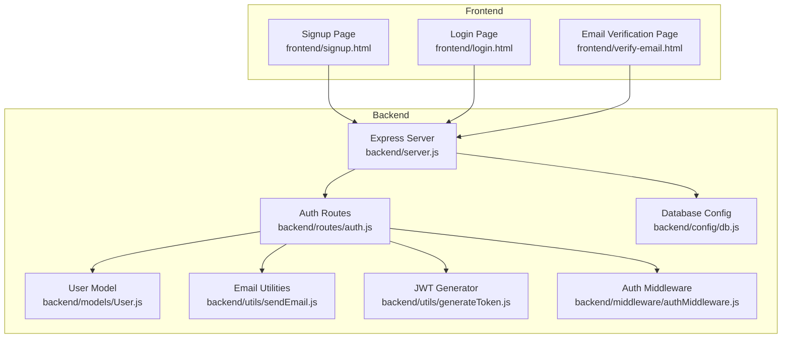
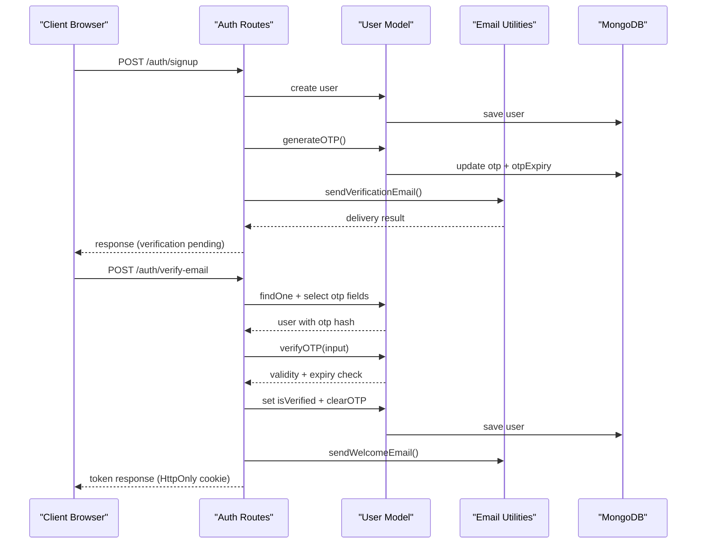
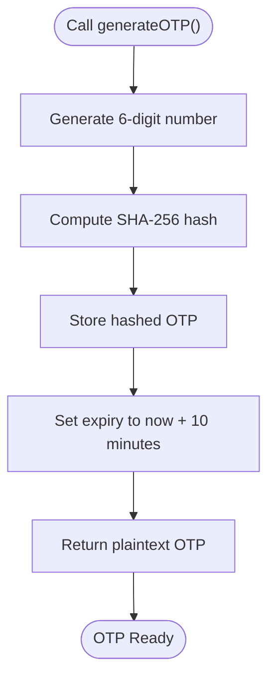
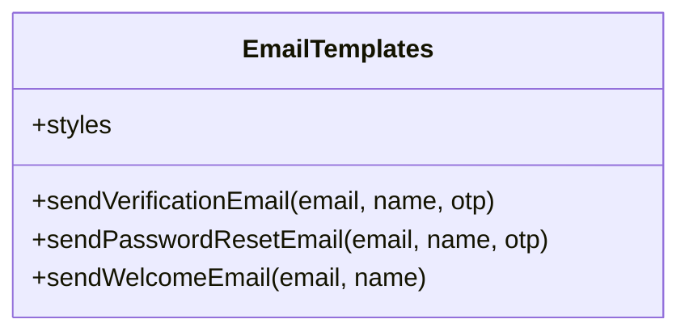
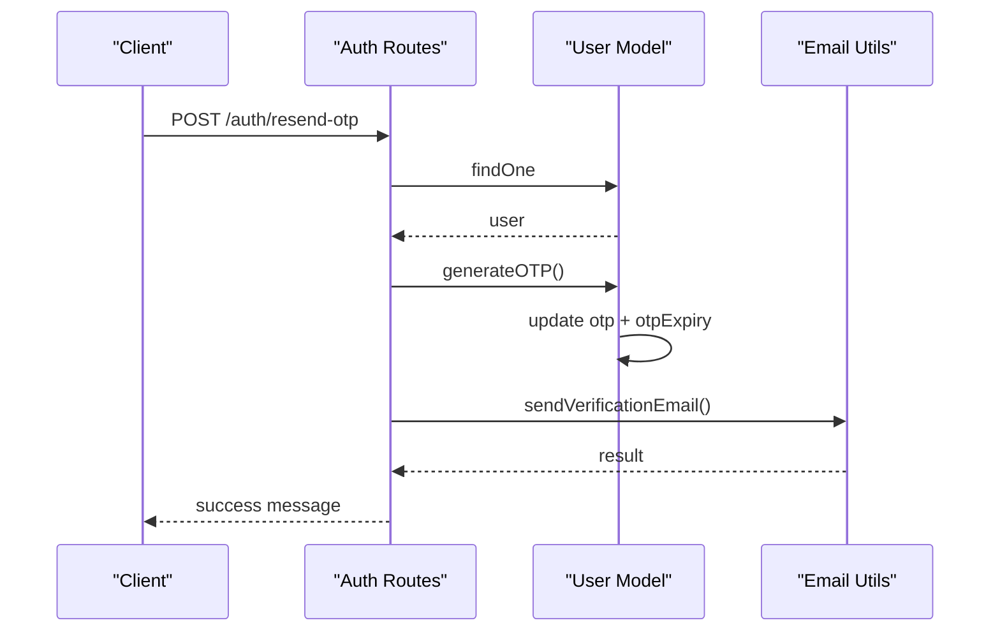
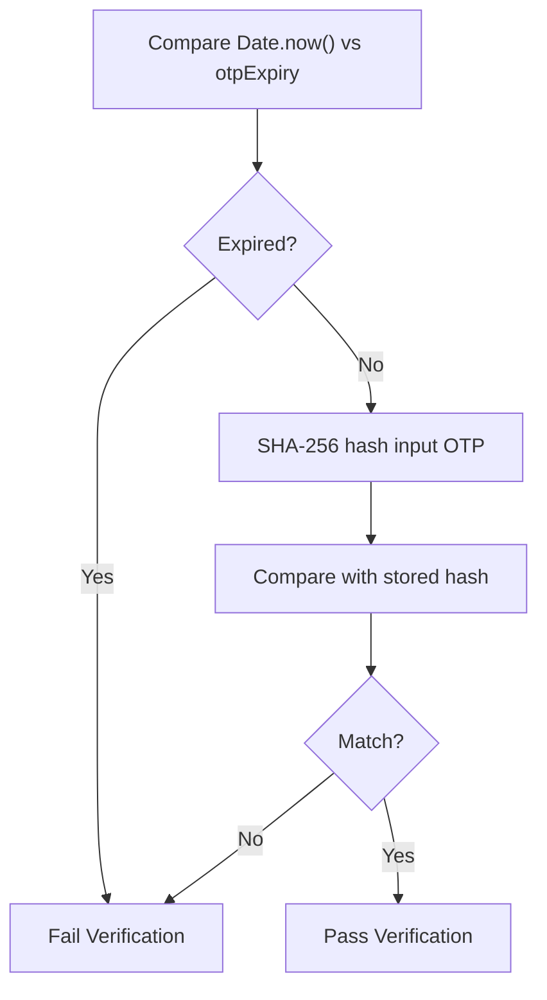
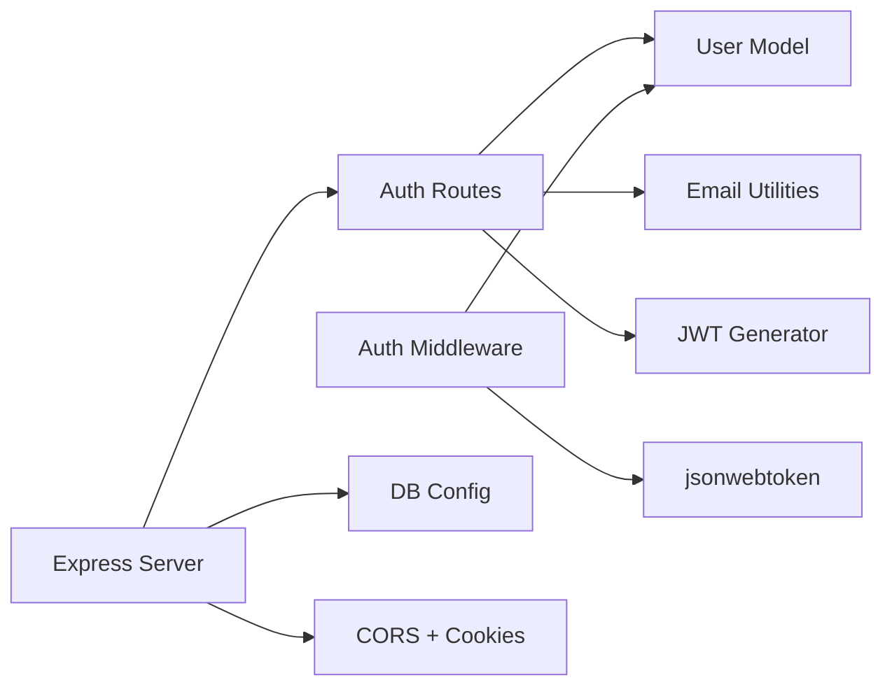

# Email Verification System

<cite>
**Referenced Files in This Document**
- [sendEmail.js](file://backend/utils/sendEmail.js)
- [User.js](file://backend/models/User.js)
- [auth.js](file://backend/routes/auth.js)
- [authMiddleware.js](file://backend/middleware/authMiddleware.js)
- [generateToken.js](file://backend/utils/generateToken.js)
- [db.js](file://backend/config/db.js)
- [server.js](file://backend/server.js)
- [verify-email.html](file://frontend/verify-email.html)
- [signup.html](file://frontend/signup.html)
- [login.html](file://frontend/login.html)
</cite>

## Table of Contents
1. [Introduction](#introduction)
2. [Project Structure](#project-structure)
3. [Core Components](#core-components)
4. [Architecture Overview](#architecture-overview)
5. [Detailed Component Analysis](#detailed-component-analysis)
6. [Dependency Analysis](#dependency-analysis)
7. [Performance Considerations](#performance-considerations)
8. [Troubleshooting Guide](#troubleshooting-guide)
9. [Conclusion](#conclusion)

## Introduction
This document provides comprehensive documentation for the email verification system used in the quiz application. It explains the OTP generation algorithm, email template structure, verification process workflow, and security measures. It also covers OTP expiry mechanisms, verification code validation, re-sending OTP functionality, integration with email service providers, error handling for failed deliveries, and security considerations against brute force attacks. Examples of verification flows, common issues, and troubleshooting steps are included to assist developers and operators.

## Project Structure
The email verification system spans the backend (Express server, Mongoose model, email utilities, and routes) and the frontend (client-side pages for sign-up, login, and email verification). The backend handles OTP generation, storage, validation, and email delivery via Nodemailer. The frontend manages user interactions, OTP input, and re-sending OTP with rate-limited controls.

**Diagram sources**
- [server.js](file://backend/server.js#L25-L75)
- [auth.js](file://backend/routes/auth.js#L1-L715)
- [User.js](file://backend/models/User.js#L1-L208)
- [sendEmail.js](file://backend/utils/sendEmail.js#L1-L159)
- [generateToken.js](file://backend/utils/generateToken.js#L1-L18)
- [db.js](file://backend/config/db.js#L1-L43)
- [authMiddleware.js](file://backend/middleware/authMiddleware.js#L1-L132)
- [verify-email.html](file://frontend/verify-email.html#L1-L213)
- [signup.html](file://frontend/signup.html#L1-L341)
- [login.html](file://frontend/login.html#L1-L260)

**Section sources**
- [server.js](file://backend/server.js#L1-L99)
- [auth.js](file://backend/routes/auth.js#L1-L715)
- [User.js](file://backend/models/User.js#L1-L208)
- [sendEmail.js](file://backend/utils/sendEmail.js#L1-L159)
- [generateToken.js](file://backend/utils/generateToken.js#L1-L18)
- [db.js](file://backend/config/db.js#L1-L43)
- [authMiddleware.js](file://backend/middleware/authMiddleware.js#L1-L132)
- [verify-email.html](file://frontend/verify-email.html#L1-L213)
- [signup.html](file://frontend/signup.html#L1-L341)
- [login.html](file://frontend/login.html#L1-L260)

## Core Components
- OTP Generation and Storage: The User model generates a 6-digit numeric OTP, stores its SHA-256 hash, and sets an expiry time of 10 minutes.
- Email Templates: HTML templates for verification emails, password reset emails, and welcome emails are rendered with styled OTP displays.
- Verification Workflow: Endpoints handle sign-up, verification, and OTP re-sending with rate limiting and input sanitization.
- Security Measures: Rate limiting, input validation, JWT-based session tokens, HttpOnly cookies, and strict SameSite policies.
- Frontend Integration: Client pages manage OTP input, auto-submission, re-sending with cooldown timers, and token storage upon successful verification.

**Section sources**
- [User.js](file://backend/models/User.js#L113-L139)
- [sendEmail.js](file://backend/utils/sendEmail.js#L51-L86)
- [auth.js](file://backend/routes/auth.js#L81-L178)
- [auth.js](file://backend/routes/auth.js#L183-L241)
- [auth.js](file://backend/routes/auth.js#L246-L295)
- [authMiddleware.js](file://backend/middleware/authMiddleware.js#L8-L79)
- [verify-email.html](file://frontend/verify-email.html#L51-L211)

## Architecture Overview
The system follows a layered architecture:
- Presentation Layer: HTML pages handle user input and feedback.
- Application Layer: Express routes orchestrate business logic, validation, and external integrations.
- Domain Layer: Mongoose User model encapsulates OTP lifecycle and persistence.
- Infrastructure Layer: Nodemailer delivers emails; JWT tokens manage sessions; rate limiters enforce policy.

**Diagram sources**
- [auth.js](file://backend/routes/auth.js#L81-L178)
- [auth.js](file://backend/routes/auth.js#L183-L241)
- [User.js](file://backend/models/User.js#L113-L139)
- [sendEmail.js](file://backend/utils/sendEmail.js#L51-L86)

## Detailed Component Analysis

### OTP Generation Algorithm
- The algorithm produces a random 6-digit numeric code.
- The plaintext OTP is stored as a SHA-256 hash alongside a 10-minute expiry timestamp.
- Expiry is computed by adding 10 minutes to the current time.

**Diagram sources**
- [User.js](file://backend/models/User.js#L113-L121)

**Section sources**
- [User.js](file://backend/models/User.js#L113-L121)

### Email Template Structure
- Verification Email: Includes a styled container, gradient OTP box, and footer with expiration notice.
- Password Reset Email: Similar structure with a distinct gradient theme.
- Welcome Email: Confirms account verification and encourages engagement.
- All templates use embedded styles and dynamic placeholders for name and OTP.

**Diagram sources**
- [sendEmail.js](file://backend/utils/sendEmail.js#L36-L157)

**Section sources**
- [sendEmail.js](file://backend/utils/sendEmail.js#L36-L157)

### Verification Process Workflow
- Sign-up: Creates a user, generates OTP, saves hashed OTP and expiry, and sends verification email. On duplicate unverified users, resends OTP.
- Verify Email: Validates OTP by hashing input and comparing with stored hash, ensuring expiry is still valid. Marks user as verified, clears OTP, sends welcome email, and issues JWT via HttpOnly cookie.
- Re-send OTP: Generates a new OTP, updates expiry, and sends verification email with rate limiting.

**Diagram sources**
- [auth.js](file://backend/routes/auth.js#L246-L295)
- [User.js](file://backend/models/User.js#L113-L121)
- [sendEmail.js](file://backend/utils/sendEmail.js#L51-L86)

**Section sources**
- [auth.js](file://backend/routes/auth.js#L137-L148)
- [auth.js](file://backend/routes/auth.js#L183-L241)
- [auth.js](file://backend/routes/auth.js#L246-L295)

### OTP Expiry Mechanism
- OTP expiry is enforced by comparing the current time against the stored expiry timestamp.
- Verification fails if the OTP is missing, expired, or mismatched.

**Diagram sources**
- [User.js](file://backend/models/User.js#L124-L133)

**Section sources**
- [User.js](file://backend/models/User.js#L124-L133)

### Verification Code Validation
- Input sanitization trims and validates presence of email and OTP.
- The backend selects OTP fields explicitly to prevent accidental exposure.
- Validation uses SHA-256 comparison and expiry checks.

**Section sources**
- [auth.js](file://backend/routes/auth.js#L183-L241)
- [User.js](file://backend/models/User.js#L124-L133)

### Re-sending OTP Functionality
- Rate limiting prevents abuse during OTP re-sends.
- The resend endpoint regenerates OTP, updates expiry, and sends a new email.
- Frontend enforces a 60-second cooldown with a disabled button until reset.

**Section sources**
- [auth.js](file://backend/routes/auth.js#L246-L295)
- [verify-email.html](file://frontend/verify-email.html#L148-L180)

### Integration with Email Service Providers
- Nodemailer transport configured for Gmail SMTP with credentials from environment variables.
- Transport verification runs on startup to detect configuration issues early.
- Emails are sent asynchronously; errors are logged and surfaced to the caller.

**Section sources**
- [sendEmail.js](file://backend/utils/sendEmail.js#L7-L31)
- [sendEmail.js](file://backend/utils/sendEmail.js#L51-L86)
- [sendEmail.js](file://backend/utils/sendEmail.js#L91-L123)
- [sendEmail.js](file://backend/utils/sendEmail.js#L128-L157)

### Error Handling for Failed Deliveries
- Email sending wraps transport errors and throws descriptive errors.
- Frontend displays user-friendly messages and disables retry until cooldown.
- Backend logs detailed error traces for diagnostics.

**Section sources**
- [sendEmail.js](file://backend/utils/sendEmail.js#L82-L85)
- [sendEmail.js](file://backend/utils/sendEmail.js#L119-L122)
- [sendEmail.js](file://backend/utils/sendEmail.js#L154-L156)
- [verify-email.html](file://frontend/verify-email.html#L152-L164)

### Security Considerations Against Brute Force Attacks
- Rate Limiting: Separate limits for sign-ups, logins, and OTP requests with sliding windows.
- Input Validation: Escaped and trimmed inputs; email format validated.
- Secure Tokens: JWT issued with HttpOnly, Secure, and SameSite=Strict cookies; configurable per environment.
- OTP Storage: Only hashed OTP is persisted; plaintext returned only during generation for immediate email delivery.
- Middleware: Protects routes by verifying JWT and checking user verification and activity status.

**Section sources**
- [auth.js](file://backend/routes/auth.js#L14-L33)
- [auth.js](file://backend/routes/auth.js#L39-L47)
- [authMiddleware.js](file://backend/middleware/authMiddleware.js#L8-L79)
- [User.js](file://backend/models/User.js#L113-L139)
- [generateToken.js](file://backend/utils/generateToken.js#L4-L16)

### Frontend Integration Details
- OTP Input: Six single-character numeric inputs with auto-focus and paste handling.
- Auto-submit: Submits automatically when six digits are entered.
- Resend Timer: Disables resend button for 60 seconds after each request.
- Token Handling: Stores JWT in HttpOnly cookie upon successful verification; optional local/session storage for convenience.

**Section sources**
- [verify-email.html](file://frontend/verify-email.html#L51-L211)
- [signup.html](file://frontend/signup.html#L238-L324)
- [login.html](file://frontend/login.html#L164-L226)

## Dependency Analysis
The system exhibits clear separation of concerns:
- Routes depend on the User model for persistence and OTP operations.
- Routes depend on email utilities for notifications.
- Middleware depends on JWT and the User model for authentication enforcement.
- Server configuration integrates CORS, cookies, rate limiting, and static file serving.

**Diagram sources**
- [auth.js](file://backend/routes/auth.js#L1-L715)
- [User.js](file://backend/models/User.js#L1-L208)
- [sendEmail.js](file://backend/utils/sendEmail.js#L1-L159)
- [generateToken.js](file://backend/utils/generateToken.js#L1-L18)
- [authMiddleware.js](file://backend/middleware/authMiddleware.js#L1-L132)
- [server.js](file://backend/server.js#L25-L75)

**Section sources**
- [auth.js](file://backend/routes/auth.js#L1-L715)
- [User.js](file://backend/models/User.js#L1-L208)
- [sendEmail.js](file://backend/utils/sendEmail.js#L1-L159)
- [generateToken.js](file://backend/utils/generateToken.js#L1-L18)
- [authMiddleware.js](file://backend/middleware/authMiddleware.js#L1-L132)
- [server.js](file://backend/server.js#L25-L75)

## Performance Considerations
- Database Indexes: Unique index on email and additional indexes improve lookup performance for user queries.
- Connection Pooling: Mongoose connection pool settings enhance scalability under load.
- Rate Limiting: Reduces server load by throttling repeated requests.
- Asynchronous Email Delivery: Non-blocking email sending improves response times.

**Section sources**
- [User.js](file://backend/models/User.js#L86-L89)
- [db.js](file://backend/config/db.js#L6-L11)
- [auth.js](file://backend/routes/auth.js#L14-L33)

## Troubleshooting Guide
Common Issues and Steps:
- Email Delivery Failures
  - Verify SMTP credentials and service configuration.
  - Check transport verification logs on startup.
  - Inspect error logs for detailed failure reasons.
  - Ensure environment variables for email provider are set.

- OTP Not Received
  - Confirm user exists and OTP was generated and saved.
  - Check rate limiter thresholds for resend requests.
  - Validate email address format and case normalization.

- Verification Fails
  - Ensure OTP is not expired (10-minute window).
  - Confirm input matches stored hash (case-insensitive OTP).
  - Verify user is not already verified.

- Frontend Issues
  - Check browser console for network errors.
  - Confirm CORS settings allow frontend origin and credentials.
  - Validate that cookies are accepted and HttpOnly behavior is respected.

- Authentication Errors
  - Ensure JWT secret is configured and consistent.
  - Verify cookie security flags (Secure, SameSite) align with deployment environment.
  - Confirm middleware is applied to protected routes.

**Section sources**
- [sendEmail.js](file://backend/utils/sendEmail.js#L24-L31)
- [auth.js](file://backend/routes/auth.js#L14-L33)
- [auth.js](file://backend/routes/auth.js#L183-L241)
- [auth.js](file://backend/routes/auth.js#L246-L295)
- [authMiddleware.js](file://backend/middleware/authMiddleware.js#L8-L79)
- [server.js](file://backend/server.js#L38-L43)

## Conclusion
The email verification system combines robust OTP generation and storage, secure email delivery, and strong client-server integration. Its layered design, comprehensive validation, and built-in rate limiting provide a solid foundation for secure user onboarding. By following the documented workflows, security measures, and troubleshooting steps, teams can maintain reliability and resilience in email-based authentication.