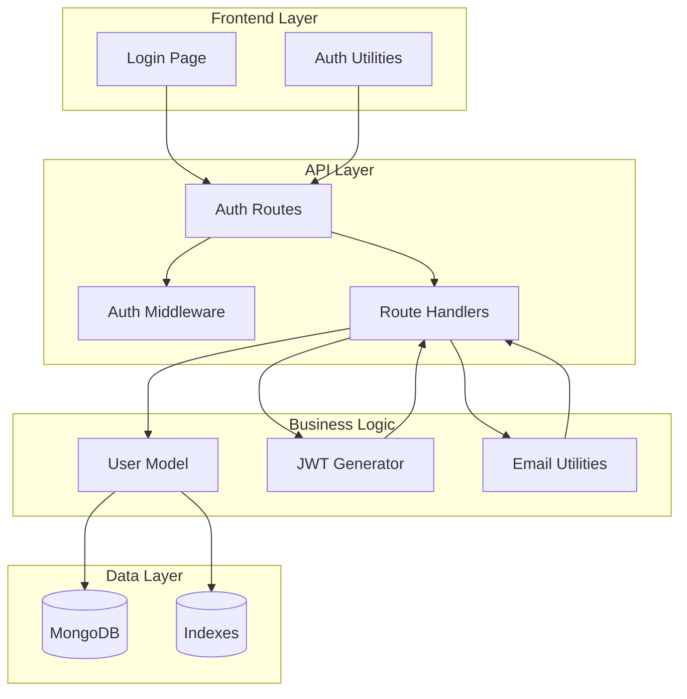
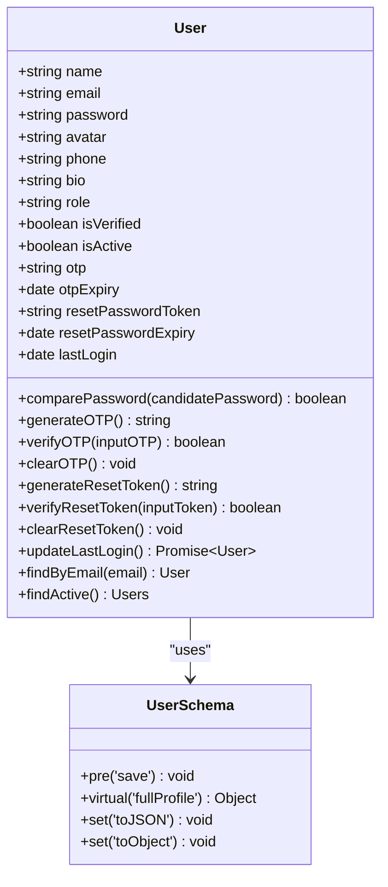
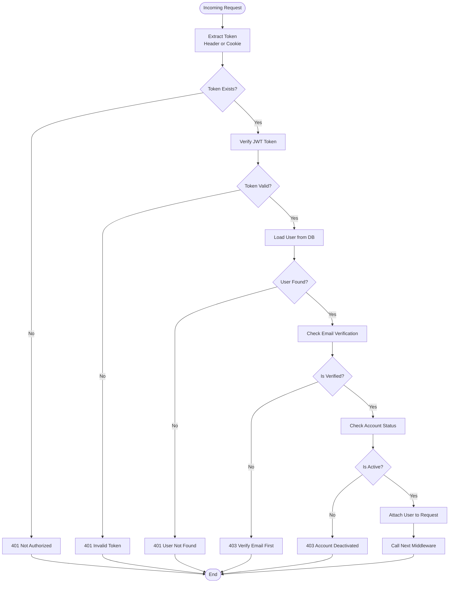
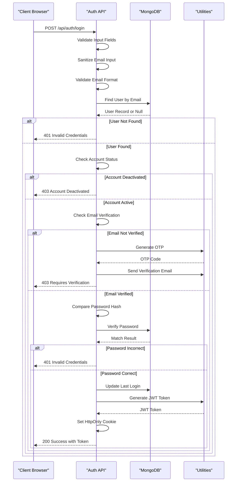
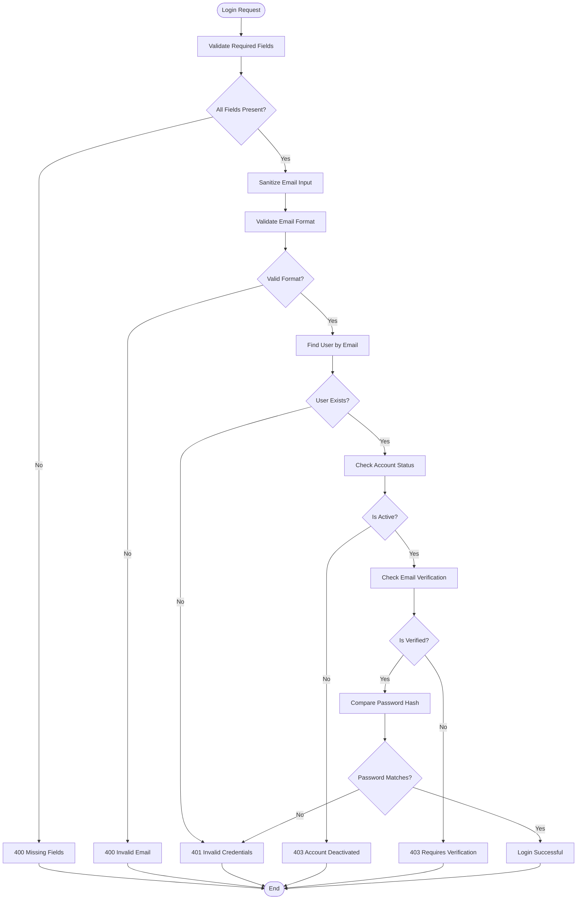

# Authentication Flow

<cite>
**Referenced Files in This Document**
- [server.js](file://backend/server.js)
- [auth.js](file://backend/routes/auth.js)
- [User.js](file://backend/models/User.js)
- [authMiddleware.js](file://backend/middleware/authMiddleware.js)
- [generateToken.js](file://backend/utils/generateToken.js)
- [sendEmail.js](file://backend/utils/sendEmail.js)
- [login.html](file://frontend/login.html)
- [db.js](file://backend/config/db.js)
</cite>

## Table of Contents
1. [Introduction](#introduction)
2. [System Architecture](#system-architecture)
3. [Core Components](#core-components)
4. [Authentication Flow Analysis](#authentication-flow-analysis)
5. [Step-by-Step Login Process](#step-by-step-login-process)
6. [Error Handling Scenarios](#error-handling-scenarios)
7. [Security Measures](#security-measures)
8. [Performance Considerations](#performance-considerations)
9. [Troubleshooting Guide](#troubleshooting-guide)
10. [Conclusion](#conclusion)

## Introduction

This document provides a comprehensive analysis of the authentication system in the quiz application, focusing on the complete authentication flow from login request to successful user access. The system implements modern security practices including JWT-based authentication, email verification, password hashing, and comprehensive error handling.

The authentication system consists of three main layers: frontend client interface, backend API endpoints, and database persistence with security measures. The implementation follows RESTful principles while maintaining robust security protocols for credential validation, account verification, and user activation status verification.

## System Architecture

The authentication system follows a layered architecture pattern with clear separation of concerns:



**Diagram sources**
- [server.js](file://backend/server.js#L25-L99)
- [auth.js](file://backend/routes/auth.js#L1-L715)
- [User.js](file://backend/models/User.js#L1-L208)

**Section sources**
- [server.js](file://backend/server.js#L25-L99)
- [auth.js](file://backend/routes/auth.js#L1-L715)

## Core Components

### Database Model (User)

The User model defines the complete authentication schema with comprehensive field validation and security features:



**Diagram sources**
- [User.js](file://backend/models/User.js#L5-L208)

### Authentication Middleware

The middleware layer provides comprehensive authentication and authorization capabilities:



**Diagram sources**
- [authMiddleware.js](file://backend/middleware/authMiddleware.js#L8-L79)

**Section sources**
- [User.js](file://backend/models/User.js#L1-L208)
- [authMiddleware.js](file://backend/middleware/authMiddleware.js#L1-L132)

## Authentication Flow Analysis

### Complete Login Authentication Flow

The authentication process follows a strict sequence of validations and verifications:



**Diagram sources**
- [auth.js](file://backend/routes/auth.js#L297-L377)
- [User.js](file://backend/models/User.js#L108-L111)

### Credential Validation Process

The system implements multi-layered credential validation:



**Diagram sources**
- [auth.js](file://backend/routes/auth.js#L300-L377)

**Section sources**
- [auth.js](file://backend/routes/auth.js#L297-L377)
- [User.js](file://backend/models/User.js#L108-L111)

## Step-by-Step Login Process

### Step 1: Input Validation and Sanitization

The login process begins with comprehensive input validation:

1. **Field Presence Check**: Validates that both email and password are provided
2. **Email Sanitization**: Trims whitespace and converts to lowercase
3. **Email Format Validation**: Uses validator library for RFC-compliant email checking
4. **Rate Limiting**: Enforces 10 attempts per 15 minutes for login requests

### Step 2: Database Query and User Retrieval

The system queries the database using the email address:

```javascript
const user = await User.findByEmail(email);
```

This static method performs:
- Case-insensitive email lookup
- Password field inclusion for authentication
- Efficient database indexing on email field

### Step 3: Account Status Verification

The system checks multiple account status indicators:

1. **Activation Status**: Verifies `isActive` flag prevents access to deactivated accounts
2. **Email Verification**: Ensures `isVerified` flag is true for security compliance
3. **OTP Generation**: Automatically generates verification codes for unverified users

### Step 4: Password Comparison and Hash Verification

The password verification process uses bcrypt:

```javascript
const isMatch = await user.comparePassword(password);
```

This method:
- Uses bcrypt.compare for timing-safe comparison
- Prevents timing attacks through constant-time comparison
- Leverages stored hash for verification

### Step 5: Token Generation and Response Handling

Upon successful authentication:

1. **JWT Token Generation**: Creates signed token with user ID and role
2. **HttpOnly Cookie Setting**: Sets secure authentication cookie
3. **Response Formatting**: Returns structured JSON with user data
4. **Last Login Update**: Updates user's last login timestamp

**Section sources**
- [auth.js](file://backend/routes/auth.js#L300-L377)
- [User.js](file://backend/models/User.js#L108-L111)
- [generateToken.js](file://backend/utils/generateToken.js#L1-L18)

## Error Handling Scenarios

### Invalid Credentials

**Conditions**: Non-existent user or incorrect password
**Response**: 401 Unauthorized with "Invalid credentials" message
**Security**: No user enumeration through error messages

### Unverified Accounts

**Conditions**: User exists but `isVerified` is false
**Response**: 403 Forbidden with "Email not verified" message
**Behavior**: Automatically generates and emails new verification code
**Client Handling**: Special flag `requiresVerification` enables redirect to verification page

### Deactivated Users

**Conditions**: User exists but `isActive` is false
**Response**: 403 Forbidden with "Your account has been deactivated" message
**Prevention**: Prevents access to suspended or banned users

### Rate Limiting

**Login Attempts**: Maximum 10 attempts per 15 minutes
**Response**: 429 Too Many Requests with helpful message
**Skip Logic**: Successful logins don't count toward rate limit

### Database and Server Errors

**Conditions**: Database connectivity or server failures
**Response**: 500 Internal Server Error with sanitized error details
**Development**: Full error details in development mode only

**Section sources**
- [auth.js](file://backend/routes/auth.js#L324-L377)
- [authMiddleware.js](file://backend/middleware/authMiddleware.js#L33-L54)

## Security Measures

### Password Security

1. **Hashing**: Passwords are hashed using bcrypt with 12 rounds
2. **Timing-Safe Comparison**: Prevents timing attacks during authentication
3. **Salt Generation**: Unique salt generated for each password hash

### Token Security

1. **JWT Implementation**: Signed tokens with expiration (default 7 days)
2. **HttpOnly Cookies**: Prevents XSS attacks through client-side access restriction
3. **Secure Flags**: HTTPS-only cookies in production environment
4. **SameSite Protection**: CSRF protection against cross-site requests

### Input Sanitization

1. **HTML Escaping**: Prevents XSS attacks through input sanitization
2. **SQL Injection Prevention**: MongoDB queries prevent injection attacks
3. **Email Normalization**: Lowercase conversion prevents case-sensitive attacks

### Account Protection

1. **Verification Requirement**: Mandatory email verification for all accounts
2. **Deactivation Capability**: Ability to deactivate compromised accounts
3. **Rate Limiting**: Prevents brute force attack attempts
4. **Session Management**: Automatic session timeout and renewal

**Section sources**
- [User.js](file://backend/models/User.js#L93-L103)
- [auth.js](file://backend/routes/auth.js#L49-L76)
- [authMiddleware.js](file://backend/middleware/authMiddleware.js#L54-L58)

## Performance Considerations

### Database Optimization

1. **Index Creation**: Automatic indexes on email, verification status, and creation date
2. **Query Efficiency**: Single query lookup by email address
3. **Field Selection**: Selective field loading to minimize data transfer

### Memory Management

1. **Password Field Exclusion**: Password field not included in user objects by default
2. **Token Generation**: Efficient JWT creation without database round trips
3. **Cookie Storage**: Minimal cookie size (only token identifier)

### Network Optimization

1. **Rate Limiting**: Configurable limits prevent abuse
2. **Response Compression**: Built-in compression for smaller payloads
3. **Connection Pooling**: MongoDB connection pooling for efficient database access

**Section sources**
- [User.js](file://backend/models/User.js#L86-L90)
- [db.js](file://backend/config/db.js#L4-L11)

## Troubleshooting Guide

### Common Authentication Issues

**Issue**: "Invalid credentials" response
**Possible Causes**:
- Wrong email or password combination
- Account has been deactivated
- User account deleted or migrated

**Solution**: Verify credentials and check account status

**Issue**: "Email not verified" response  
**Possible Causes**:
- User registered but never completed email verification
- Verification email delivery failure
- Expired verification code

**Solution**: Check email inbox for verification code or resend verification

**Issue**: "Account deactivated" response
**Possible Causes**:
- Administrator manually deactivated account
- Security violation detected
- User requested deactivation

**Solution**: Contact system administrator for assistance

**Issue**: Rate limit exceeded
**Possible Causes**:
- Too many failed login attempts
- Automated bot activity
- Testing or development environment

**Solution**: Wait for 15-minute cooldown period

### Debugging Authentication Flow

**Enable Logging**: Check server logs for detailed error traces
**Environment Variables**: Verify JWT_SECRET and database connection strings
**Database Connectivity**: Test MongoDB connection separately
**Email Configuration**: Verify SMTP settings for email functionality

**Section sources**
- [auth.js](file://backend/routes/auth.js#L369-L377)
- [server.js](file://backend/server.js#L80-L86)

## Conclusion

The authentication system implements a comprehensive, secure, and user-friendly login process that follows modern security best practices. The system provides multiple layers of validation, robust error handling, and comprehensive security measures including password hashing, JWT-based authentication, and email verification.

Key strengths of the implementation include:
- **Security**: Multi-factor authentication through email verification and password hashing
- **Usability**: Clear error messages and automatic verification code generation
- **Performance**: Optimized database queries and efficient token management
- **Maintainability**: Modular architecture with clear separation of concerns
- **Scalability**: Rate limiting and connection pooling for high-load scenarios

The system successfully handles various authentication scenarios while maintaining security and providing clear feedback to users. The implementation serves as a solid foundation for secure user authentication in web applications.