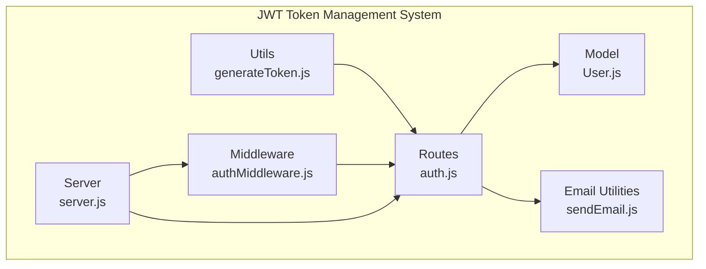
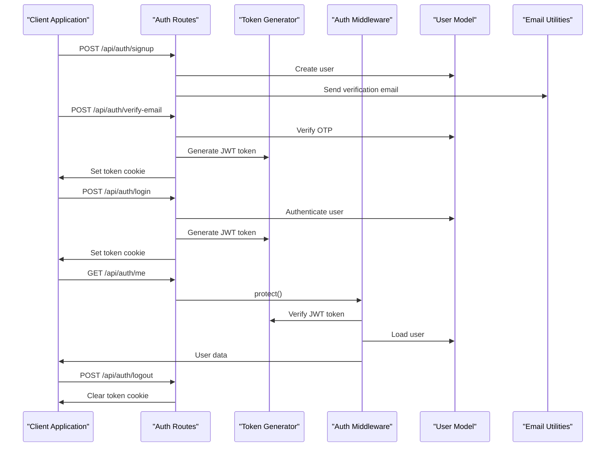
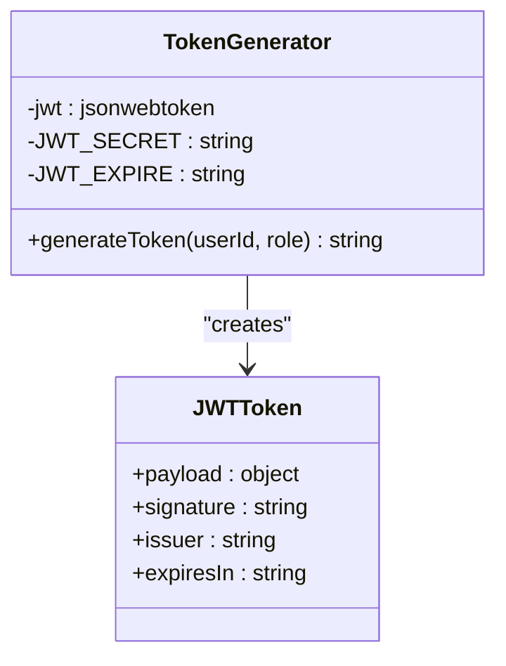
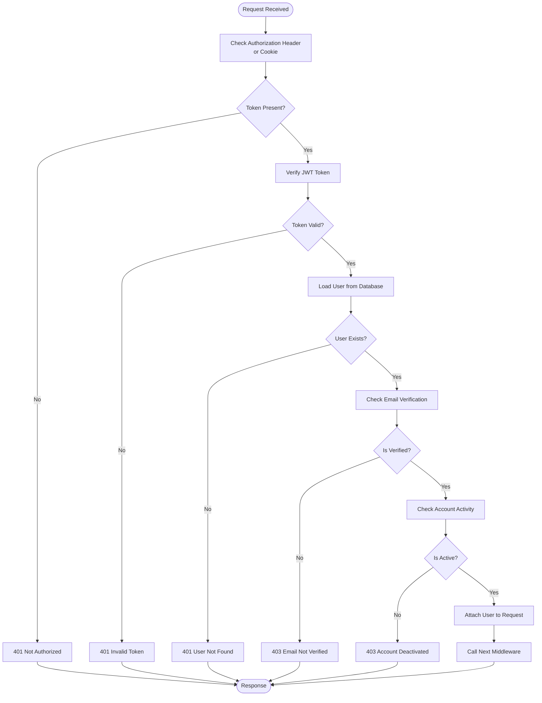
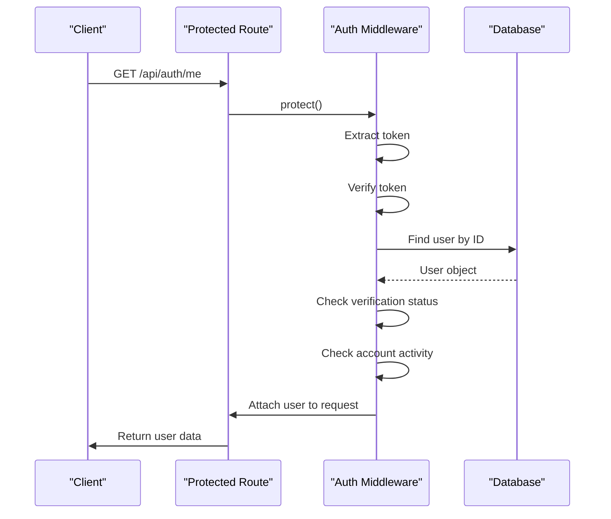
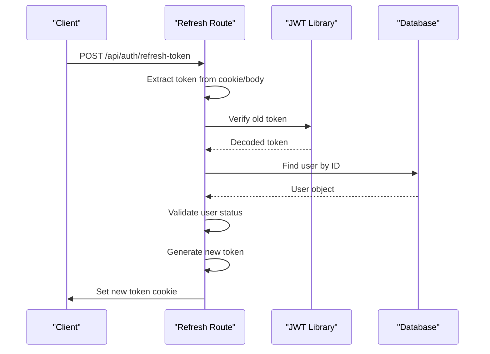
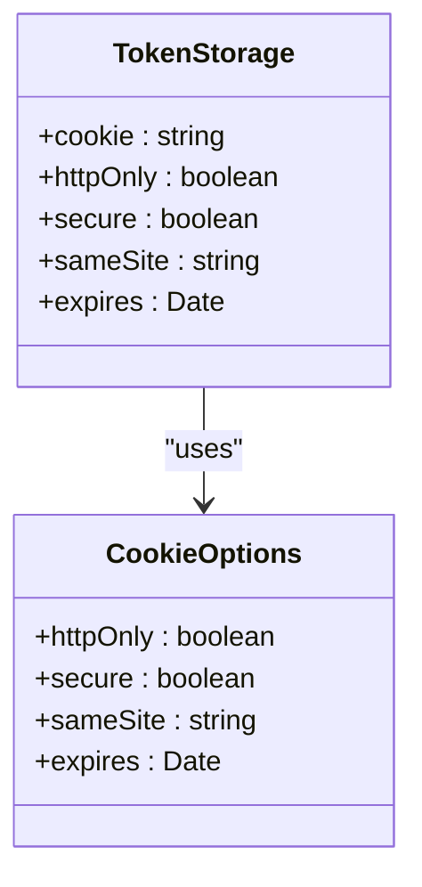
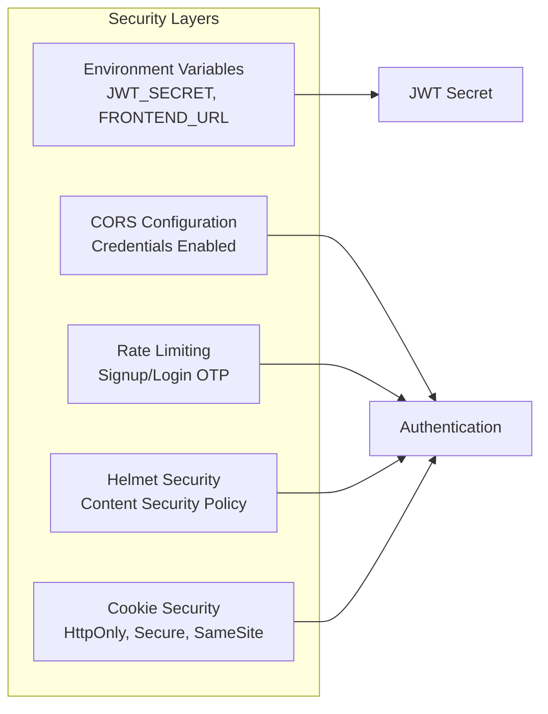
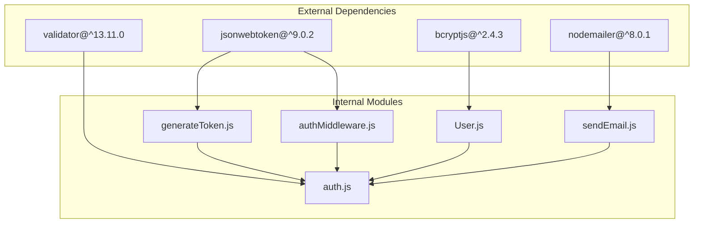

# JWT Token Management

<cite>
**Referenced Files in This Document**
- [generateToken.js](file://backend/utils/generateToken.js)
- [authMiddleware.js](file://backend/middleware/authMiddleware.js)
- [auth.js](file://backend/routes/auth.js)
- [User.js](file://backend/models/User.js)
- [server.js](file://backend/server.js)
- [sendEmail.js](file://backend/utils/sendEmail.js)
- [package.json](file://backend/package.json)
</cite>

## Table of Contents
1. [Introduction](#introduction)
2. [Project Structure](#project-structure)
3. [Core Components](#core-components)
4. [Architecture Overview](#architecture-overview)
5. [Detailed Component Analysis](#detailed-component-analysis)
6. [Dependency Analysis](#dependency-analysis)
7. [Performance Considerations](#performance-considerations)
8. [Troubleshooting Guide](#troubleshooting-guide)
9. [Conclusion](#conclusion)

## Introduction
This document provides comprehensive documentation for JWT token management in the quiz application backend. It covers token generation, validation, refresh mechanisms, token structure, expiration handling, security configurations, verification middleware, protected route access, and token refresh functionality. The implementation uses JSON Web Tokens (JWT) with cookie-based storage and includes robust security measures such as rate limiting, CORS configuration, and environment variable validation.

## Project Structure
The JWT token management system is organized across several key modules:
- Token generation utility for creating signed JWT tokens
- Authentication middleware for protecting routes and validating tokens
- Authentication routes handling user registration, login, logout, and token refresh
- User model with OTP and password reset functionality
- Server configuration with security middleware and CORS settings
- Email utilities for verification and password reset notifications

**Diagram sources**
- [generateToken.js](file://backend/utils/generateToken.js#L1-L18)
- [authMiddleware.js](file://backend/middleware/authMiddleware.js#L1-L132)
- [auth.js](file://backend/routes/auth.js#L1-L715)
- [User.js](file://backend/models/User.js#L1-L208)
- [server.js](file://backend/server.js#L1-L99)
- [sendEmail.js](file://backend/utils/sendEmail.js#L1-L159)

**Section sources**
- [server.js](file://backend/server.js#L1-L99)
- [package.json](file://backend/package.json#L1-L36)

## Core Components
The JWT token management system consists of four primary components:

### Token Generation Utility
The token generation utility creates signed JWT tokens with configurable expiration and issuer information. It accepts user ID and role parameters and signs them using the JWT secret from environment variables.

### Authentication Middleware
The authentication middleware provides three layers of authentication:
- Protect routes with mandatory authentication
- Role-based authorization for admin/moderator access
- Optional authentication for hybrid public/private routes

### Authentication Routes
The authentication routes handle user lifecycle operations including registration, email verification, login, password reset, profile updates, and logout with token refresh capability.

### User Model
The User model includes OTP generation and verification, password reset functionality, and role-based access control with verification and activity status checks.

**Section sources**
- [generateToken.js](file://backend/utils/generateToken.js#L1-L18)
- [authMiddleware.js](file://backend/middleware/authMiddleware.js#L1-L132)
- [auth.js](file://backend/routes/auth.js#L1-L715)
- [User.js](file://backend/models/User.js#L1-L208)

## Architecture Overview
The JWT token management architecture follows a layered approach with clear separation of concerns:

**Diagram sources**
- [auth.js](file://backend/routes/auth.js#L1-L715)
- [generateToken.js](file://backend/utils/generateToken.js#L1-L18)
- [authMiddleware.js](file://backend/middleware/authMiddleware.js#L1-L132)
- [User.js](file://backend/models/User.js#L1-L208)
- [sendEmail.js](file://backend/utils/sendEmail.js#L1-L159)

## Detailed Component Analysis

### Token Generation Implementation
The token generation utility creates JWT tokens with the following structure and properties:

**Diagram sources**
- [generateToken.js](file://backend/utils/generateToken.js#L1-L18)

Key characteristics of token generation:
- Payload includes user ID and role for authorization
- Uses HS256 signing algorithm (default for jsonwebtoken)
- Configurable expiration period (default: 7 days)
- Issuer identification for token tracking
- Environment variable configuration for secrets

**Section sources**
- [generateToken.js](file://backend/utils/generateToken.js#L1-L18)

### Authentication Middleware Architecture
The authentication middleware provides three distinct authentication layers:

**Diagram sources**
- [authMiddleware.js](file://backend/middleware/authMiddleware.js#L1-L132)

The middleware handles:
- Token extraction from Authorization header or cookies
- JWT verification using shared secret
- User loading and verification status checks
- Role-based authorization enforcement
- Optional authentication mode for hybrid routes

**Section sources**
- [authMiddleware.js](file://backend/middleware/authMiddleware.js#L1-L132)

### Protected Route Access Pattern
Protected routes are implemented using the authentication middleware:

**Diagram sources**
- [auth.js](file://backend/routes/auth.js#L510-L537)
- [authMiddleware.js](file://backend/middleware/authMiddleware.js#L8-L79)

Protected routes include:
- User profile retrieval (`/api/auth/me`)
- Profile updates (`/api/auth/update-profile`)
- Password changes (`/api/auth/change-password`)

**Section sources**
- [auth.js](file://backend/routes/auth.js#L510-L660)
- [authMiddleware.js](file://backend/middleware/authMiddleware.js#L84-L102)

### Token Refresh Mechanism
The token refresh functionality provides automatic token renewal:

**Diagram sources**
- [auth.js](file://backend/routes/auth.js#L681-L712)

The refresh mechanism:
- Accepts tokens from cookies or request body
- Verifies token authenticity and user status
- Generates new tokens with updated expiration
- Updates cookie with refreshed token

**Section sources**
- [auth.js](file://backend/routes/auth.js#L681-L712)

### Token Storage and Transmission
Token storage follows industry best practices:

**Diagram sources**
- [auth.js](file://backend/routes/auth.js#L49-L76)

Cookie configuration includes:
- HttpOnly flag prevents client-side JavaScript access
- Secure flag ensures HTTPS transmission in production
- SameSite strict protection against CSRF attacks
- 7-day expiration period
- Automatic token setting during login and refresh

**Section sources**
- [auth.js](file://backend/routes/auth.js#L49-L76)

### Token Payload Structure
The JWT token payload contains essential user information:

| Field | Type | Description | Example |
|-------|------|-------------|---------|
| `id` | string | MongoDB ObjectId | "64a5f3b2e8c9d4001c8b4567" |
| `role` | string | User role level | "user" |
| `iat` | number | Issued at timestamp | 1688888888 |
| `exp` | number | Expiration timestamp | 1689493688 |
| `iss` | string | Token issuer | "guddu-quiz" |

Token validation includes:
- Signature verification using shared secret
- Expiration time checking
- Issuer verification
- User existence validation

**Section sources**
- [generateToken.js](file://backend/utils/generateToken.js#L4-L16)
- [authMiddleware.js](file://backend/middleware/authMiddleware.js#L28-L31)

### Security Configurations
Multiple security layers protect the token system:

**Diagram sources**
- [server.js](file://backend/server.js#L15-L43)
- [auth.js](file://backend/routes/auth.js#L14-L33)

Security measures include:
- Environment variable validation for required secrets
- CORS configuration allowing credentials
- Rate limiting for authentication endpoints
- Helmet security headers
- Cookie security flags
- Token verification error handling

**Section sources**
- [server.js](file://backend/server.js#L15-L43)
- [auth.js](file://backend/routes/auth.js#L14-L33)

## Dependency Analysis
The JWT token management system has well-defined dependencies:

**Diagram sources**
- [package.json](file://backend/package.json#L18-L31)
- [generateToken.js](file://backend/utils/generateToken.js#L2)
- [authMiddleware.js](file://backend/middleware/authMiddleware.js#L2)
- [auth.js](file://backend/routes/auth.js#L1-L10)

Key dependencies:
- jsonwebtoken: JWT token creation and verification
- bcryptjs: Password hashing and comparison
- validator: Input sanitization and validation
- nodemailer: Email notification system

**Section sources**
- [package.json](file://backend/package.json#L18-L31)

## Performance Considerations
The JWT token management system incorporates several performance optimizations:

### Token Caching Strategy
- Token verification results are cached in memory for the duration of the request lifecycle
- User data is loaded only when authentication passes
- Database queries are optimized with proper indexing on email field

### Rate Limiting Implementation
- Different rate limits for signup (5 attempts/hour), login (10 attempts/15 minutes), and OTP (5 attempts/15 minutes)
- Skip successful login attempts in rate limiter configuration
- Global API rate limiting to prevent abuse

### Memory Management
- Tokens are validated synchronously for immediate feedback
- No persistent token storage reduces database overhead
- Cleanup of OTP data after verification

## Troubleshooting Guide

### Common Authentication Issues

**Invalid Token Errors**
- Occur when JWT signature verification fails
- Usually caused by tampered tokens or wrong secret
- Response: 401 Unauthorized with "Invalid token" message

**Expired Token Errors**
- Occur when token expiration timestamp has passed
- Requires user re-authentication
- Response: 401 Unauthorized with "Token expired" message

**Missing Token Errors**
- Occur when no authorization header or cookie is present
- Response: 401 Unauthorized with "Not authorized" message

**User Status Issues**
- Unverified users cannot access protected routes
- Deactivated accounts receive 403 Forbidden
- Response: 403 Forbidden with appropriate message

### Debugging Steps
1. Verify JWT_SECRET environment variable is set correctly
2. Check token expiration settings in environment variables
3. Confirm user verification status in database
4. Review authentication middleware logs
5. Validate CORS configuration for cross-origin requests

**Section sources**
- [authMiddleware.js](file://backend/middleware/authMiddleware.js#L60-L78)
- [auth.js](file://backend/routes/auth.js#L339-L351)

## Conclusion
The JWT token management system provides a robust, secure, and scalable solution for authentication in the quiz application. Key strengths include:

- Comprehensive authentication middleware with multiple security layers
- Cookie-based token storage with industry-standard security flags
- Flexible role-based authorization system
- Integrated rate limiting and security middleware
- Complete user lifecycle management with OTP verification
- Modular architecture supporting easy maintenance and extension

The implementation balances security requirements with developer usability while providing clear patterns for token generation, validation, and refresh operations. The system is production-ready with proper error handling, logging, and security configurations.