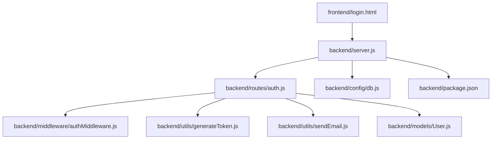
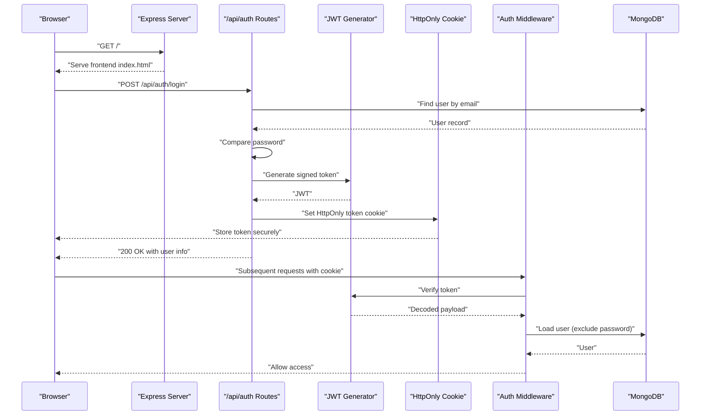
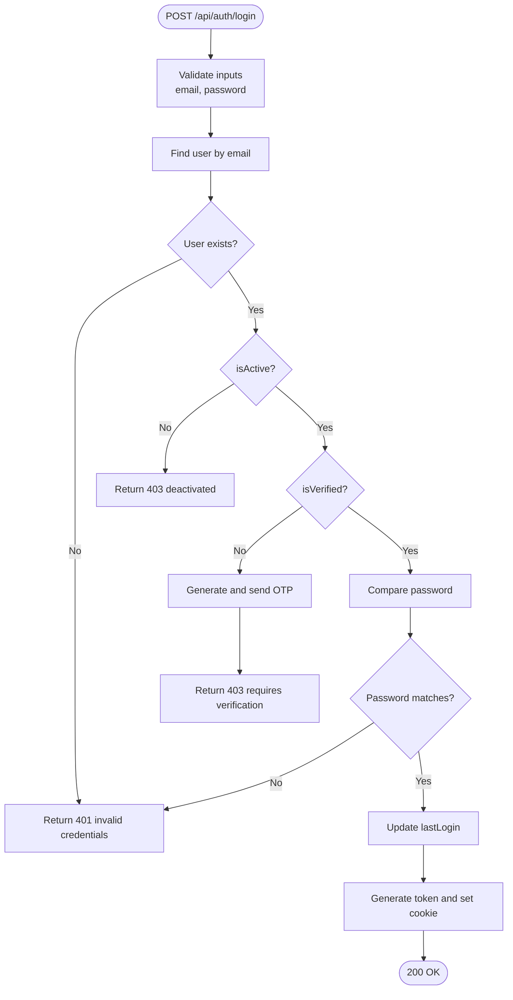
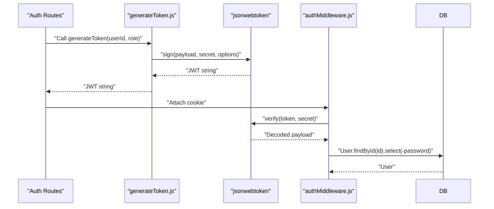
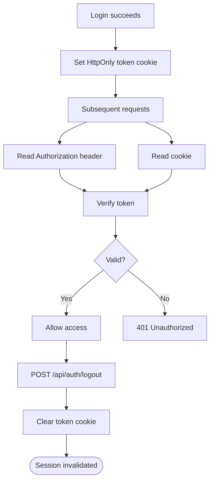
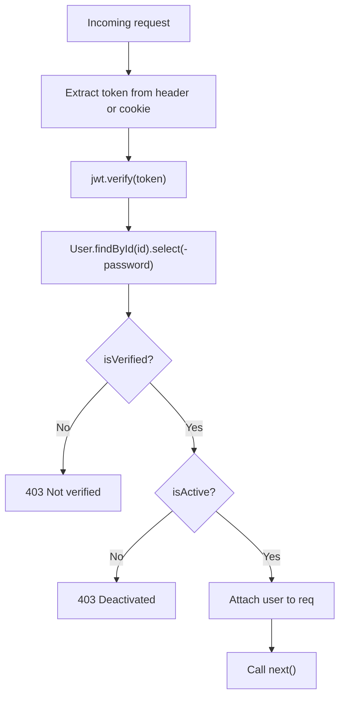
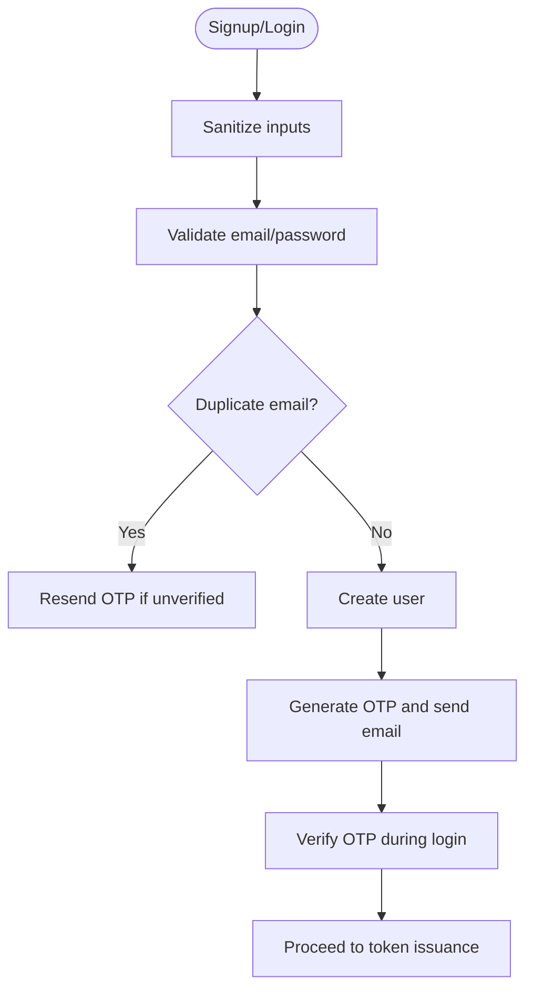
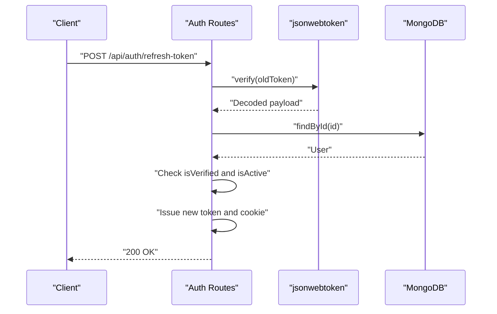
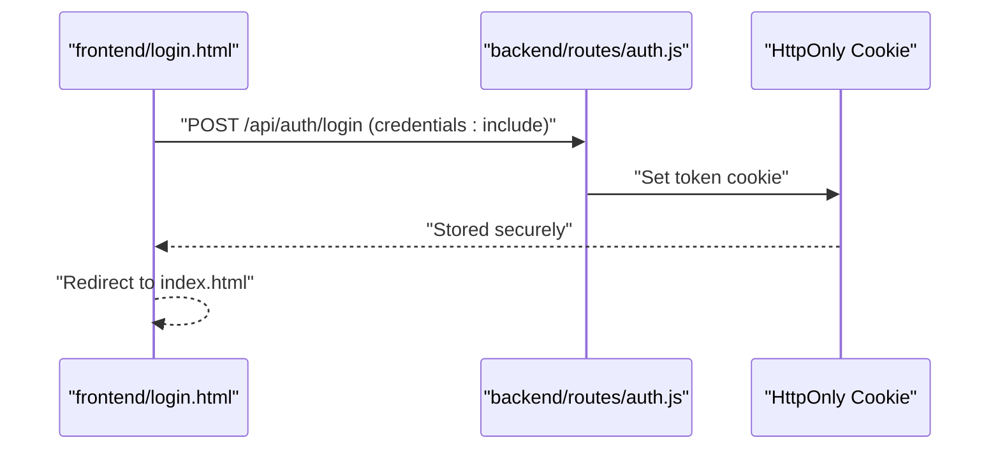
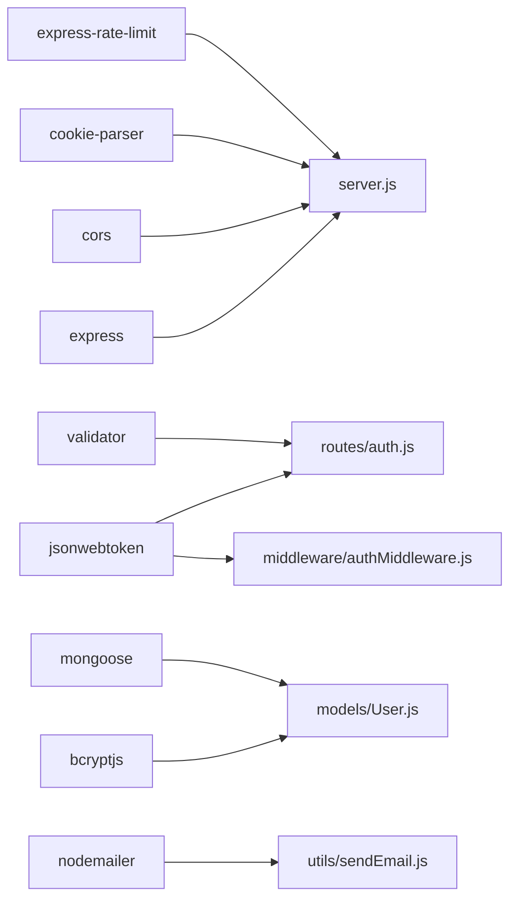

# Login & Session Management

<cite>
**Referenced Files in This Document**
- [server.js](file://backend/server.js)
- [auth.js](file://backend/routes/auth.js)
- [authMiddleware.js](file://backend/middleware/authMiddleware.js)
- [generateToken.js](file://backend/utils/generateToken.js)
- [sendEmail.js](file://backend/utils/sendEmail.js)
- [User.js](file://backend/models/User.js)
- [db.js](file://backend/config/db.js)
- [package.json](file://backend/package.json)
- [login.html](file://frontend/login.html)
</cite>

## Table of Contents
1. [Introduction](#introduction)
2. [Project Structure](#project-structure)
3. [Core Components](#core-components)
4. [Architecture Overview](#architecture-overview)
5. [Detailed Component Analysis](#detailed-component-analysis)
6. [Dependency Analysis](#dependency-analysis)
7. [Performance Considerations](#performance-considerations)
8. [Troubleshooting Guide](#troubleshooting-guide)
9. [Conclusion](#conclusion)
10. [Appendices](#appendices)

## Introduction
This document explains the login and session management system for the quiz application. It covers the authentication flow, JWT token generation and validation, cookie-based session handling, and protected route access control. It also details credential validation, account verification checks, token refresh, logout, and session persistence. Practical examples and security best practices are included to guide both developers and operators.

## Project Structure
The authentication system spans the backend server, routes, middleware, utilities, and models, with the frontend login page initiating the authentication flow.



**Diagram sources**
- [server.js](file://backend/server.js#L1-L99)
- [auth.js](file://backend/routes/auth.js#L1-L715)
- [authMiddleware.js](file://backend/middleware/authMiddleware.js#L1-L132)
- [generateToken.js](file://backend/utils/generateToken.js#L1-L18)
- [sendEmail.js](file://backend/utils/sendEmail.js#L1-L159)
- [User.js](file://backend/models/User.js#L1-L208)
- [db.js](file://backend/config/db.js#L1-L43)
- [package.json](file://backend/package.json#L1-L36)

**Section sources**
- [server.js](file://backend/server.js#L1-L99)
- [auth.js](file://backend/routes/auth.js#L1-L715)

## Core Components
- Authentication routes: signup, verify email, resend OTP, login, forgot password, reset password, get current user, update profile, change password, logout, refresh token.
- JWT token generator: signs tokens with user ID and role, sets expiration and issuer.
- Authentication middleware: protects routes, verifies tokens from headers or cookies, enforces verification and activity checks, and supports optional auth.
- User model: password hashing, OTP generation/verification, reset token lifecycle, last login tracking, and role-based fields.
- Email utilities: SMTP transport and templated emails for verification, password reset, and welcome.
- Server bootstrap: CORS, cookies, rate limiting, static frontend serving, and environment validation.

**Section sources**
- [auth.js](file://backend/routes/auth.js#L1-L715)
- [generateToken.js](file://backend/utils/generateToken.js#L1-L18)
- [authMiddleware.js](file://backend/middleware/authMiddleware.js#L1-L132)
- [User.js](file://backend/models/User.js#L1-L208)
- [sendEmail.js](file://backend/utils/sendEmail.js#L1-L159)
- [server.js](file://backend/server.js#L1-L99)

## Architecture Overview
The system uses cookie-based sessions with JWT tokens stored in HttpOnly cookies for security. Authentication middleware validates tokens and enforces account verification and activity checks. Protected routes require a valid, verified, and active user.



**Diagram sources**
- [auth.js](file://backend/routes/auth.js#L297-L377)
- [authMiddleware.js](file://backend/middleware/authMiddleware.js#L8-L79)
- [generateToken.js](file://backend/utils/generateToken.js#L4-L16)
- [server.js](file://backend/server.js#L38-L48)

## Detailed Component Analysis

### Authentication Flow: Login
- Input validation: email and password presence, email format, and password length.
- User lookup: finds user with password included for comparison.
- Account checks: deactivation and verification enforcement; sends OTP if unverified.
- Password verification: bcrypt comparison.
- Session creation: generates JWT and sets HttpOnly cookie with secure flags.
- Response: returns success, message, token, and user profile.



**Diagram sources**
- [auth.js](file://backend/routes/auth.js#L297-L377)

**Section sources**
- [auth.js](file://backend/routes/auth.js#L297-L377)

### JWT Token Generation and Validation
- Generation: signs payload containing user ID and role with secret, sets expiration and issuer.
- Validation: middleware reads token from Authorization header or cookie, verifies signature, loads user, excludes password, and enforces verification and activity checks.



**Diagram sources**
- [generateToken.js](file://backend/utils/generateToken.js#L4-L16)
- [authMiddleware.js](file://backend/middleware/authMiddleware.js#L27-L31)

**Section sources**
- [generateToken.js](file://backend/utils/generateToken.js#L1-L18)
- [authMiddleware.js](file://backend/middleware/authMiddleware.js#L1-L132)

### Cookie-Based Session Handling
- Token storage: HttpOnly cookie prevents XSS exposure; secure flag enabled in production; sameSite strict mitigates CSRF.
- Retrieval: middleware accepts token from Authorization header or cookie.
- Logout: clears cookie with short expiry to invalidate session.



**Diagram sources**
- [auth.js](file://backend/routes/auth.js#L49-L76)
- [auth.js](file://backend/routes/auth.js#L665-L676)
- [authMiddleware.js](file://backend/middleware/authMiddleware.js#L12-L17)

**Section sources**
- [auth.js](file://backend/routes/auth.js#L49-L76)
- [auth.js](file://backend/routes/auth.js#L665-L676)
- [authMiddleware.js](file://backend/middleware/authMiddleware.js#L12-L17)

### Protected Route Access Control
- protect middleware: extracts token from header or cookie, verifies it, attaches user to request, enforces verification and activity checks, and handles token errors.
- authorize middleware: role-based authorization for admin/moderator routes.
- optionalAuth middleware: allows requests without failing if token is absent or invalid.



**Diagram sources**
- [authMiddleware.js](file://backend/middleware/authMiddleware.js#L8-L79)

**Section sources**
- [authMiddleware.js](file://backend/middleware/authMiddleware.js#L84-L102)
- [authMiddleware.js](file://backend/middleware/authMiddleware.js#L107-L130)

### Credential Validation and Account Verification Checks
- Signup: sanitization, email validation, password strength, duplicate detection, OTP generation and resend logic.
- Login: email validation, account activation check, verification requirement, password comparison.
- Verification: OTP generation, expiry, verification, and welcome email.
- Forgot password: OTP-based reset flow with security-friendly messaging.



**Diagram sources**
- [auth.js](file://backend/routes/auth.js#L81-L178)
- [auth.js](file://backend/routes/auth.js#L183-L241)
- [auth.js](file://backend/routes/auth.js#L300-L377)

**Section sources**
- [auth.js](file://backend/routes/auth.js#L81-L178)
- [auth.js](file://backend/routes/auth.js#L183-L241)
- [auth.js](file://backend/routes/auth.js#L300-L377)

### Token Refresh Mechanism
- Endpoint: POST /api/auth/refresh-token.
- Behavior: accepts token from cookie or body, verifies it, ensures user is verified and active, and issues a new token with cookie.



**Diagram sources**
- [auth.js](file://backend/routes/auth.js#L681-L712)

**Section sources**
- [auth.js](file://backend/routes/auth.js#L681-L712)

### Logout Functionality and Session Persistence
- Logout endpoint: clears token cookie with immediate expiry and httpOnly flag.
- Persistence: token is stored in HttpOnly cookie; client-side storage is optional and used for convenience.

```mermaid
sequenceDiagram
participant Client as "Client"
participant Auth as "Auth Routes"
participant Cookie as "HttpOnly Cookie"
Client->>Auth : "POST /api/auth/logout"
Auth->>Cookie : "Set token=none; expires=now"
Cookie-->>Client : "Remove token"
Auth-->>Client : "200 OK logged out"
```

**Diagram sources**
- [auth.js](file://backend/routes/auth.js#L665-L676)

**Section sources**
- [auth.js](file://backend/routes/auth.js#L665-L676)

### Frontend Integration Example: Successful Authentication
- Client initiates login with credentials and credentials: include.
- On success, client stores user info and token (optional) and redirects to home.
- Subsequent requests automatically include the HttpOnly cookie.



**Diagram sources**
- [login.html](file://frontend/login.html#L180-L226)
- [auth.js](file://backend/routes/auth.js#L49-L76)

**Section sources**
- [login.html](file://frontend/login.html#L164-L226)

## Dependency Analysis
The system relies on Express, JWT, bcrypt, validator, nodemailer, and MongoDB. CORS and cookie parsing enable cross-origin requests with credentials. Rate limiting protects endpoints from abuse.



**Diagram sources**
- [package.json](file://backend/package.json#L18-L31)
- [server.js](file://backend/server.js#L1-L99)
- [auth.js](file://backend/routes/auth.js#L1-L10)

**Section sources**
- [package.json](file://backend/package.json#L1-L36)
- [server.js](file://backend/server.js#L1-L99)

## Performance Considerations
- Token expiration: default 7 days; adjust based on risk tolerance.
- Rate limiting: per-endpoint limits reduce brute-force attempts.
- Indexes: email uniqueness and verification index improve lookup performance.
- Password hashing cost: salt rounds configured for security/performance balance.
- Connection pooling: MongoDB pool size tuned for throughput.

[No sources needed since this section provides general guidance]

## Troubleshooting Guide
Common issues and resolutions:
- Missing environment variables: ensure MONGODB_URI, JWT_SECRET, FRONTEND_URL are set.
- CORS errors: confirm origin list includes frontend URLs and credentials are enabled.
- Cookie not received: verify SameSite strict and secure flags; ensure credentials: include on client.
- Token invalid/expired: regenerate token via refresh endpoint or re-login.
- Email delivery failures: check SMTP credentials and network connectivity.

**Section sources**
- [server.js](file://backend/server.js#L17-L23)
- [server.js](file://backend/server.js#L38-L43)
- [authMiddleware.js](file://backend/middleware/authMiddleware.js#L60-L78)
- [sendEmail.js](file://backend/utils/sendEmail.js#L24-L31)

## Conclusion
The system implements robust authentication using JWT stored in HttpOnly cookies, enforced verification and activity checks, and layered protections including rate limiting and CORS. The frontend integrates seamlessly with cookie-based sessions, while the backend centralizes security logic in middleware and utilities.

[No sources needed since this section summarizes without analyzing specific files]

## Appendices

### Security Best Practices for Session Management
- Use HttpOnly, Secure, and SameSite cookies for tokens.
- Enforce email verification and account activity checks.
- Implement rate limiting on sensitive endpoints.
- Rotate secrets and review token expiration policies.
- Log and monitor authentication events for anomalies.

[No sources needed since this section provides general guidance]