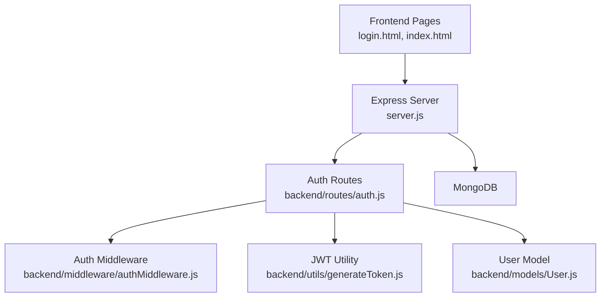
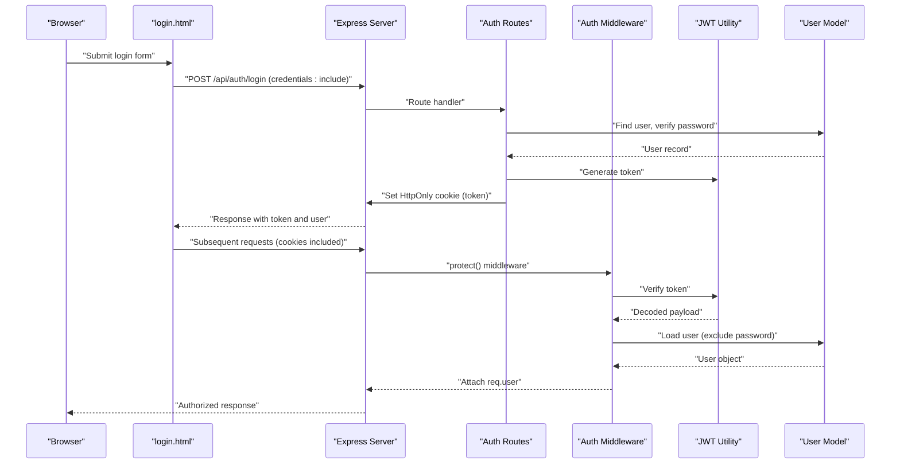
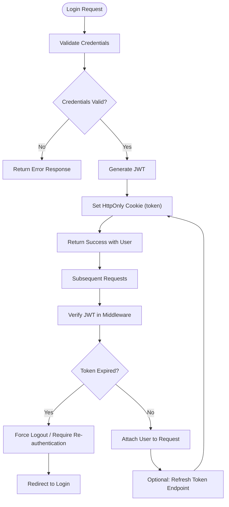
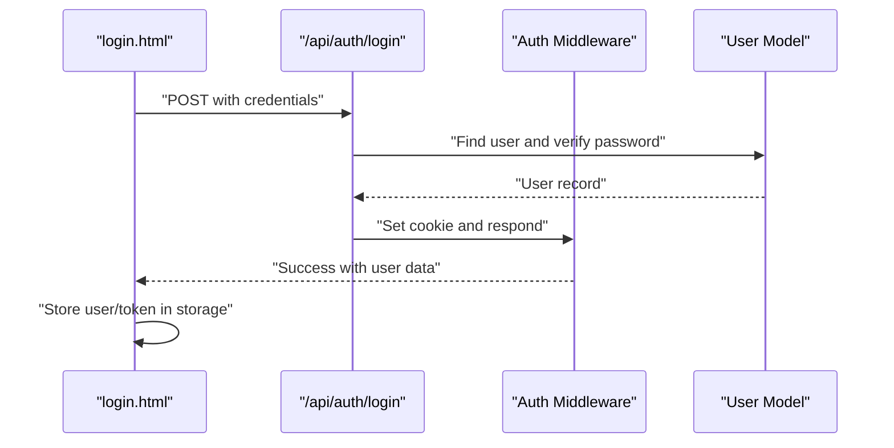
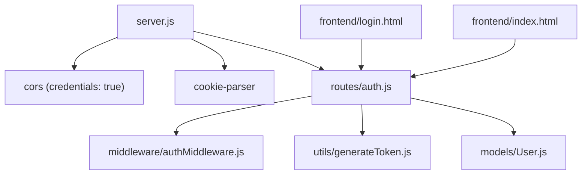

# Session Persistence

<cite>
**Referenced Files in This Document**
- [server.js](file://backend/server.js)
- [auth.js](file://backend/routes/auth.js)
- [authMiddleware.js](file://backend/middleware/authMiddleware.js)
- [generateToken.js](file://backend/utils/generateToken.js)
- [User.js](file://backend/models/User.js)
- [login.html](file://frontend/login.html)
- [index.html](file://frontend/index.html)
</cite>

## Table of Contents
1. [Introduction](#introduction)
2. [Project Structure](#project-structure)
3. [Core Components](#core-components)
4. [Architecture Overview](#architecture-overview)
5. [Detailed Component Analysis](#detailed-component-analysis)
6. [Dependency Analysis](#dependency-analysis)
7. [Performance Considerations](#performance-considerations)
8. [Troubleshooting Guide](#troubleshooting-guide)
9. [Conclusion](#conclusion)

## Introduction
This document explains how session persistence and cookie-based authentication are implemented in the quiz application. It focuses on cookie configuration (security settings, expiration handling, cross-site request protection), session lifecycle management, automatic logout mechanisms, and user state maintenance. Practical patterns and security best practices for cookie attributes (HttpOnly, Secure, SameSite, domain/path) are included to ensure robust and secure operation.

## Project Structure
The authentication system spans the backend Express server, route handlers, middleware, JWT utilities, and the frontend pages that coordinate with the backend via cookies and bearer tokens.



**Diagram sources**
- [server.js](file://backend/server.js#L25-L99)
- [auth.js](file://backend/routes/auth.js#L1-L715)
- [authMiddleware.js](file://backend/middleware/authMiddleware.js#L1-L132)
- [generateToken.js](file://backend/utils/generateToken.js#L1-L18)
- [User.js](file://backend/models/User.js#L1-L208)

**Section sources**
- [server.js](file://backend/server.js#L25-L99)
- [auth.js](file://backend/routes/auth.js#L1-L715)

## Core Components
- Backend server initializes security middleware, CORS, cookie parsing, and serves static frontend files.
- Authentication routes handle signup, email verification, resend OTP, login, forgot/reset password, profile updates, change password, logout, and token refresh.
- Authentication middleware protects routes by validating JWT tokens from headers or cookies, enforcing email verification and active status.
- JWT utility generates signed tokens with configurable expiry and issuer.
- User model defines schema, indexes, and helper methods for OTP, reset tokens, and last login tracking.
- Frontend pages coordinate with backend using credentials-enabled fetch and manage local/session storage for user state.

Key cookie configuration points:
- Token cookie is set with HttpOnly, Secure (in production), SameSite strict, and 7-day expiry.
- Logout clears the token cookie with an immediate expiry and HttpOnly.
- Frontend fetch requests include credentials to enable cross-origin cookie handling.

**Section sources**
- [server.js](file://backend/server.js#L32-L48)
- [auth.js](file://backend/routes/auth.js#L49-L76)
- [auth.js](file://backend/routes/auth.js#L665-L676)
- [authMiddleware.js](file://backend/middleware/authMiddleware.js#L8-L79)
- [generateToken.js](file://backend/utils/generateToken.js#L4-L16)
- [User.js](file://backend/models/User.js#L55-L81)
- [login.html](file://frontend/login.html#L180-L188)
- [index.html](file://frontend/index.html#L5238-L5246)

## Architecture Overview
The authentication flow integrates cookie-based sessions with JWT for stateless verification. On successful login, the backend sets an HttpOnly cookie containing the JWT. Subsequent protected requests rely on either Authorization header or the cookie. Middleware validates the token and attaches user context to the request.



**Diagram sources**
- [auth.js](file://backend/routes/auth.js#L299-L377)
- [authMiddleware.js](file://backend/middleware/authMiddleware.js#L8-L79)
- [generateToken.js](file://backend/utils/generateToken.js#L4-L16)
- [User.js](file://backend/models/User.js#L108-L111)
- [login.html](file://frontend/login.html#L180-L188)

## Detailed Component Analysis

### Cookie Configuration and Security Settings
- Token cookie options:
  - Expires: 7 days from creation.
  - HttpOnly: Enabled to prevent client-side script access.
  - Secure: Enabled in production to ensure transmission over HTTPS only.
  - SameSite: Strict to mitigate CSRF risks.
- Logout cookie:
  - Immediately expires the token cookie with HttpOnly to force client removal.
- Frontend fetch:
  - Uses credentials: include to allow cookies to be sent with cross-origin requests.

Cookie attribute mapping and rationale:
- HttpOnly: Blocks XSS by preventing JavaScript access to the cookie.
- Secure: Enforces HTTPS-only transport in production environments.
- SameSite=Strict: Mitigates CSRF by restricting cookie sending to same-site requests.
- Expires: Controls session longevity; combined with token expiry for layered safety.

**Section sources**
- [auth.js](file://backend/routes/auth.js#L54-L59)
- [auth.js](file://backend/routes/auth.js#L667-L670)
- [server.js](file://backend/server.js#L38-L43)
- [login.html](file://frontend/login.html#L185-L186)
- [index.html](file://frontend/index.html#L5252-L5263)

### Session Lifecycle Management
- Creation:
  - On successful login, the backend generates a JWT and sets an HttpOnly cookie named token with configured attributes.
- Maintenance:
  - Subsequent requests carry the cookie automatically; middleware verifies the token and attaches user context.
  - Optional bearer token fallback allows clients to send Authorization: Bearer <token> when needed.
- Expiration:
  - Token expiry is enforced by the JWT utility; cookie expiry is set to 7 days.
  - Token refresh endpoint regenerates the cookie with a new token when provided with a valid existing token.
- Automatic logout:
  - Logout endpoint clears the token cookie immediately and responds with success.
  - Frontend logout clears local/session storage and redirects to login.



**Diagram sources**
- [auth.js](file://backend/routes/auth.js#L299-L377)
- [auth.js](file://backend/routes/auth.js#L681-L712)
- [authMiddleware.js](file://backend/middleware/authMiddleware.js#L28-L79)
- [generateToken.js](file://backend/utils/generateToken.js#L11-L12)

**Section sources**
- [auth.js](file://backend/routes/auth.js#L49-L76)
- [auth.js](file://backend/routes/auth.js#L665-L676)
- [auth.js](file://backend/routes/auth.js#L681-L712)
- [authMiddleware.js](file://backend/middleware/authMiddleware.js#L8-L79)
- [generateToken.js](file://backend/utils/generateToken.js#L4-L16)

### User State Maintenance
- Frontend maintains user state in localStorage or sessionStorage depending on "Remember me" selection during login.
- The backend enforces verification and activity checks during authentication, ensuring only verified and active users proceed.
- Profile retrieval endpoint returns user data for UI hydration.



**Diagram sources**
- [login.html](file://frontend/login.html#L208-L211)
- [auth.js](file://backend/routes/auth.js#L366-L367)
- [authMiddleware.js](file://backend/middleware/authMiddleware.js#L40-L54)
- [User.js](file://backend/models/User.js#L108-L111)

**Section sources**
- [login.html](file://frontend/login.html#L164-L226)
- [auth.js](file://backend/routes/auth.js#L512-L537)
- [authMiddleware.js](file://backend/middleware/authMiddleware.js#L40-L54)

### Logout Mechanisms
- Backend logout:
  - Clears the token cookie with an immediate expiry and HttpOnly.
  - Responds with success.
- Frontend logout:
  - Clears localStorage and sessionStorage, then redirects to login.

```mermaid
sequenceDiagram
participant FE as "index.html"
participant API as "/api/auth/logout"
participant CL as "Client Browser"
FE->>FE : "User clicks Logout"
FE->>FE : "Clear localStorage/sessionStorage"
FE->>API : "POST /api/auth/logout (credentials : include)"
API->>CL : "Set-Cookie : token=none; Expires=now; HttpOnly"
API-->>FE : "Success response"
FE->>FE : "Redirect to login.html"
```

**Diagram sources**
- [index.html](file://frontend/index.html#L5238-L5246)
- [auth.js](file://backend/routes/auth.js#L665-L676)

**Section sources**
- [auth.js](file://backend/routes/auth.js#L665-L676)
- [index.html](file://frontend/index.html#L5238-L5246)

### Cookie Attributes and Best Practices
- HttpOnly: Prevents XSS by disallowing client-side access to the cookie.
- Secure: Ensures cookies are transmitted only over HTTPS in production.
- SameSite=Strict: Reduces CSRF risk by restricting cross-site cookie usage.
- Expires: Balances usability and security; combined with JWT expiry for defense-in-depth.
- Domain/Path: Not explicitly configured in the code; defaults apply. Consider setting explicit domain/path for stricter control in production deployments.

Practical patterns:
- Use HttpOnly cookies for session tokens.
- Enable Secure in production environments.
- Prefer SameSite=Strict for sensitive routes.
- Implement logout by clearing the cookie with immediate expiry.
- Optionally support Authorization: Bearer fallback for non-browser clients.

**Section sources**
- [auth.js](file://backend/routes/auth.js#L54-L59)
- [auth.js](file://backend/routes/auth.js#L667-L670)
- [server.js](file://backend/server.js#L38-L43)

## Dependency Analysis
The authentication stack depends on Express middleware, CORS configuration, cookie parsing, JWT signing, and MongoDB via Mongoose. The frontend depends on the backend API and manages client-side state.



**Diagram sources**
- [server.js](file://backend/server.js#L38-L48)
- [auth.js](file://backend/routes/auth.js#L1-L10)
- [authMiddleware.js](file://backend/middleware/authMiddleware.js#L1-L10)
- [generateToken.js](file://backend/utils/generateToken.js#L1-L10)
- [User.js](file://backend/models/User.js#L1-L10)
- [login.html](file://frontend/login.html#L98-L100)
- [index.html](file://frontend/index.html#L5252-L5254)

**Section sources**
- [server.js](file://backend/server.js#L38-L48)
- [auth.js](file://backend/routes/auth.js#L1-L10)
- [authMiddleware.js](file://backend/middleware/authMiddleware.js#L1-L10)
- [generateToken.js](file://backend/utils/generateToken.js#L1-L10)
- [User.js](file://backend/models/User.js#L1-L10)
- [login.html](file://frontend/login.html#L98-L100)
- [index.html](file://frontend/index.html#L5252-L5254)

## Performance Considerations
- Token verification overhead is minimal due to JWT decoding and database lookup only for user existence and verification status.
- Cookie-based authentication avoids frequent re-authentication while maintaining security through short-lived tokens and immediate cookie expiry on logout.
- Consider implementing token refresh strategies to reduce repeated login prompts for long sessions.

## Troubleshooting Guide
Common issues and resolutions:
- Missing required environment variables:
  - Ensure MONGODB_URI, JWT_SECRET, and FRONTEND_URL are set; otherwise the server exits early.
- CORS and cookies:
  - credentials: true must be enabled on the backend and credentials: include must be used on the frontend for cross-origin cookie handling.
- Token validation failures:
  - Invalid or expired tokens trigger specific error responses; ensure clients renew tokens or re-authenticate.
- Verification and activity checks:
  - Non-verified or deactivated accounts receive appropriate errors; guide users to verify emails or contact support.

**Section sources**
- [server.js](file://backend/server.js#L17-L23)
- [server.js](file://backend/server.js#L38-L43)
- [login.html](file://frontend/login.html#L185-L186)
- [authMiddleware.js](file://backend/middleware/authMiddleware.js#L40-L54)
- [auth.js](file://backend/routes/auth.js#L339-L351)

## Conclusion
The quiz application implements secure, cookie-based authentication with robust session persistence. HttpOnly, Secure, and SameSite=Strict cookies protect against common attacks, while JWT-based verification ensures efficient, stateless authorization. The system supports seamless login, optional bearer token fallback, automatic logout, and user state maintenance across frontend pages. Adhering to the outlined cookie attributes and patterns helps maintain both security and usability.