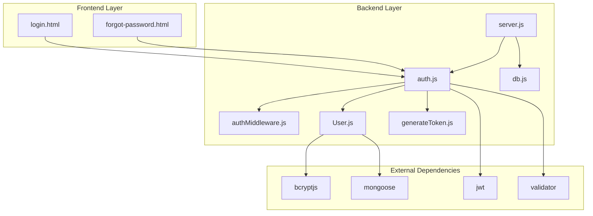
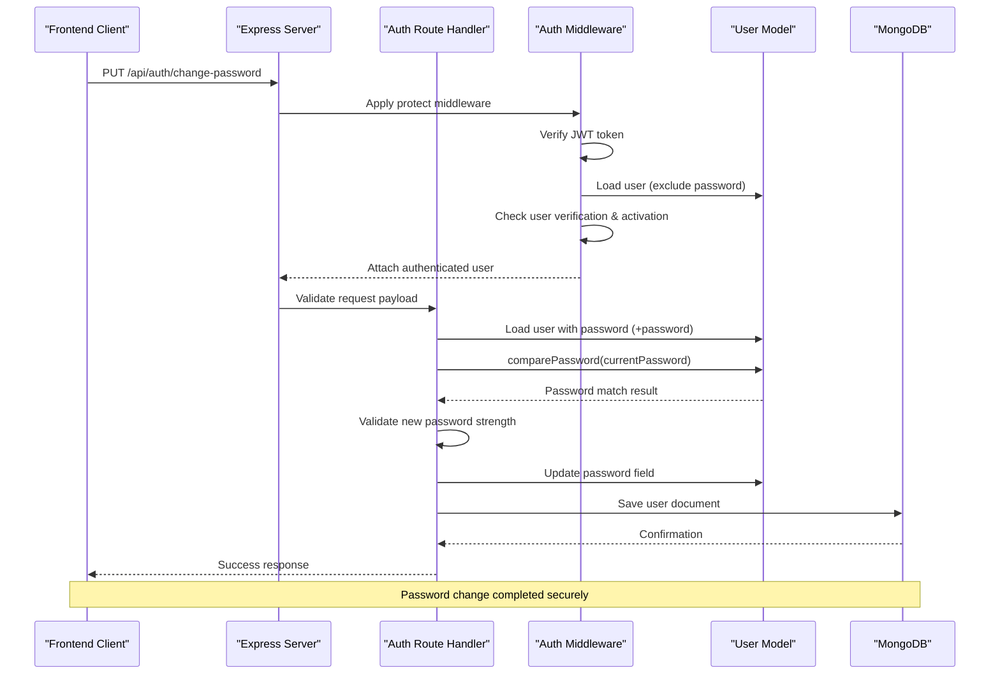
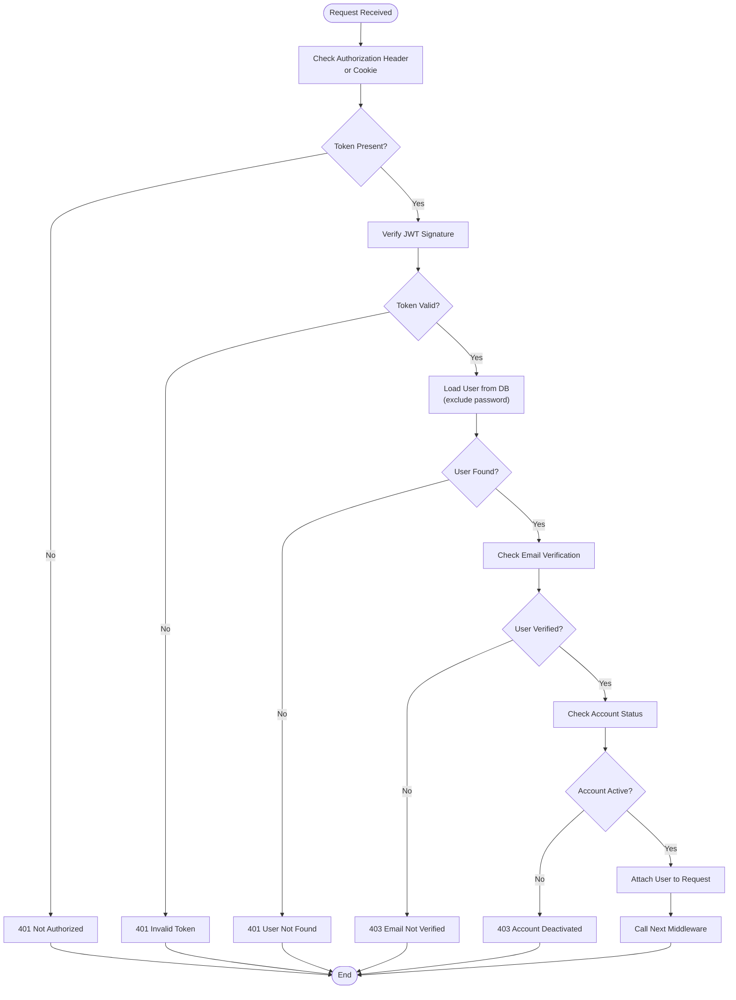
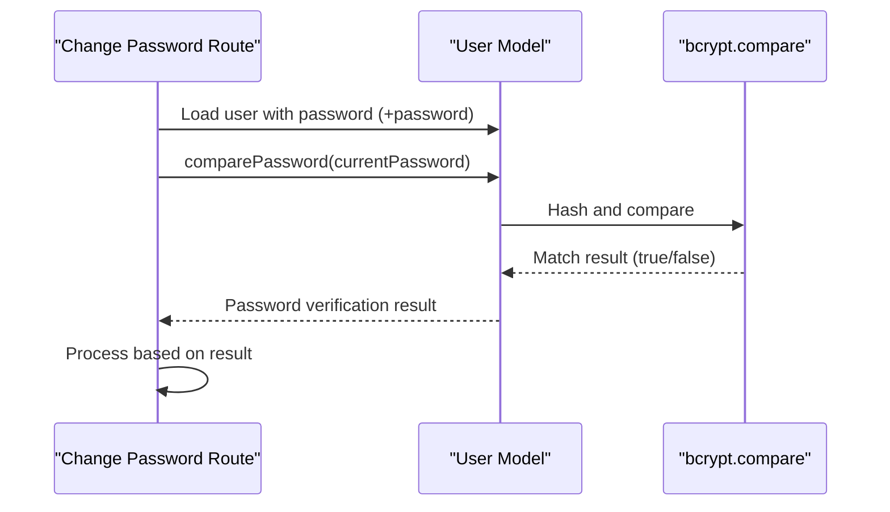
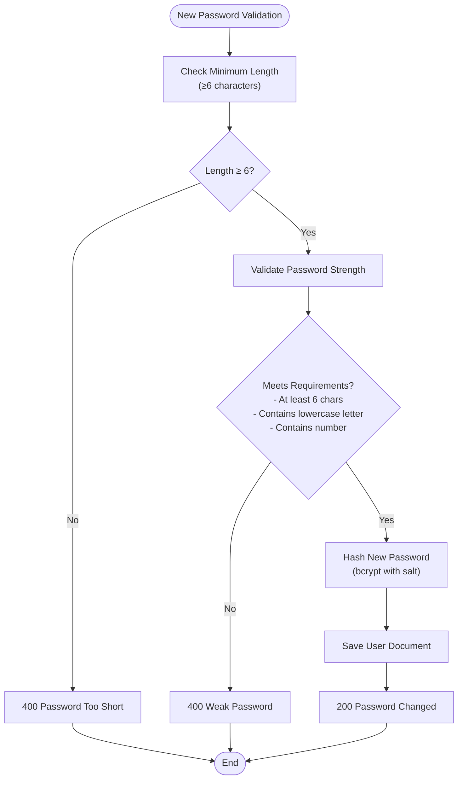
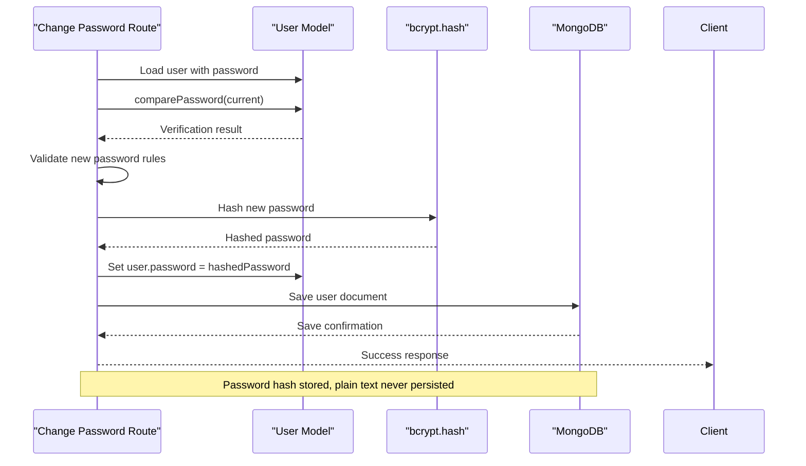
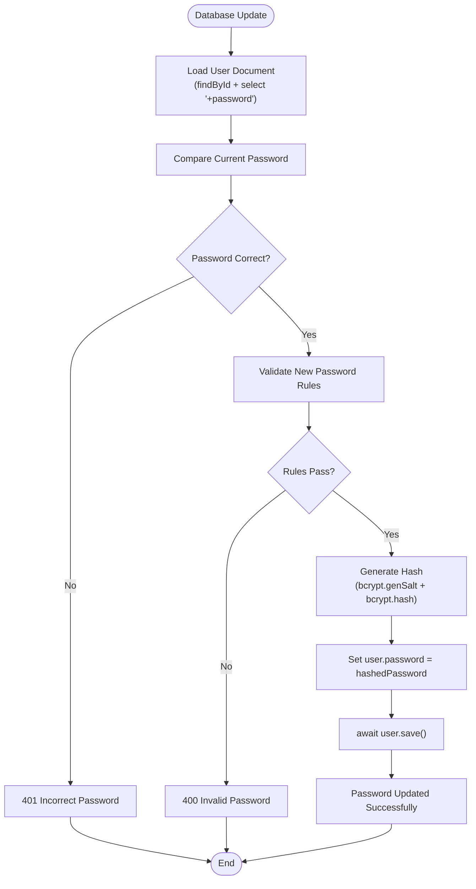
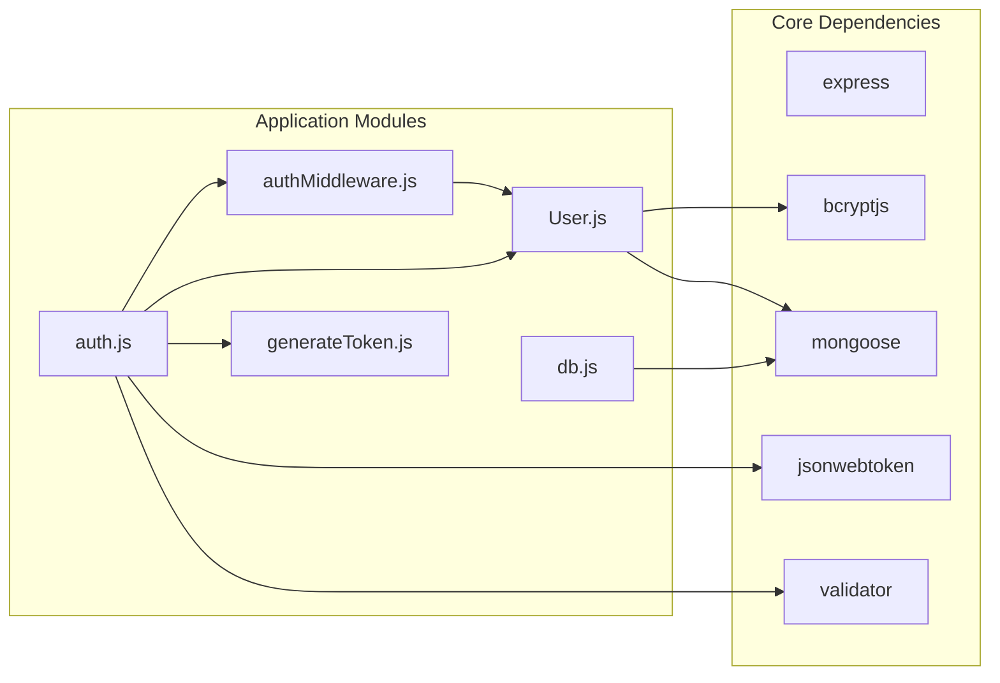

# Change Password

<cite>
**Referenced Files in This Document**
- [server.js](file://backend/server.js)
- [auth.js](file://backend/routes/auth.js)
- [authMiddleware.js](file://backend/middleware/authMiddleware.js)
- [User.js](file://backend/models/User.js)
- [generateToken.js](file://backend/utils/generateToken.js)
- [db.js](file://backend/config/db.js)
- [package.json](file://backend/package.json)
- [login.html](file://frontend/login.html)
- [forgot-password.html](file://frontend/forgot-password.html)
</cite>

## Table of Contents
1. [Introduction](#introduction)
2. [Project Structure](#project-structure)
3. [Core Components](#core-components)
4. [Architecture Overview](#architecture-overview)
5. [Detailed Component Analysis](#detailed-component-analysis)
6. [Dependency Analysis](#dependency-analysis)
7. [Performance Considerations](#performance-considerations)
8. [Troubleshooting Guide](#troubleshooting-guide)
9. [Conclusion](#conclusion)

## Introduction
This document provides comprehensive technical documentation for the change password functionality in the authenticated quiz application. It covers the complete flow from current password verification to secure password update, including authentication middleware requirements, password validation rules, and database persistence mechanisms. The documentation explains security measures such as current password confirmation, password strength enforcement, and session management during password changes.

## Project Structure
The change password feature is implemented within a modular Express.js backend architecture with clear separation of concerns:

**Diagram sources**
- [server.js](file://backend/server.js#L1-L99)
- [auth.js](file://backend/routes/auth.js#L1-L715)
- [authMiddleware.js](file://backend/middleware/authMiddleware.js#L1-L132)
- [User.js](file://backend/models/User.js#L1-L208)

**Section sources**
- [server.js](file://backend/server.js#L1-L99)
- [package.json](file://backend/package.json#L1-L36)

## Core Components
The change password functionality relies on several core components working together:

### Authentication Middleware
The `protect` middleware enforces authentication and authorization for protected routes, ensuring only authenticated users can change their passwords.

### User Model
The User model provides password comparison capabilities and handles password hashing through bcrypt during save operations.

### Route Handler
The `/change-password` endpoint validates input, verifies current password, enforces new password rules, and updates the user's password securely.

### Token Generation
JWT tokens are generated for session management and authentication persistence.

**Section sources**
- [authMiddleware.js](file://backend/middleware/authMiddleware.js#L8-L79)
- [User.js](file://backend/models/User.js#L108-L111)
- [auth.js](file://backend/routes/auth.js#L613-L660)
- [generateToken.js](file://backend/utils/generateToken.js#L1-L18)

## Architecture Overview
The change password flow follows a secure, layered architecture with comprehensive validation and error handling:

**Diagram sources**
- [auth.js](file://backend/routes/auth.js#L613-L660)
- [authMiddleware.js](file://backend/middleware/authMiddleware.js#L8-L79)
- [User.js](file://backend/models/User.js#L108-L111)

## Detailed Component Analysis

### Authentication Middleware Requirements
The change password endpoint requires robust authentication through the `protect` middleware:

**Diagram sources**
- [authMiddleware.js](file://backend/middleware/authMiddleware.js#L8-L79)

The middleware performs multiple security checks:
- Token extraction from Authorization header or cookies
- JWT signature verification using environment secret
- User existence validation
- Email verification status check
- Account activation status verification

**Section sources**
- [authMiddleware.js](file://backend/middleware/authMiddleware.js#L8-L79)

### Current Password Verification Process
The current password verification uses bcrypt comparison for secure authentication:

**Diagram sources**
- [auth.js](file://backend/routes/auth.js#L631-L641)
- [User.js](file://backend/models/User.js#L108-L111)

The verification process ensures:
- Secure password comparison using bcrypt
- Prevention of timing attacks through constant-time comparison
- Immediate rejection for incorrect passwords

**Section sources**
- [auth.js](file://backend/routes/auth.js#L631-L641)
- [User.js](file://backend/models/User.js#L108-L111)

### New Password Validation Rules
The new password validation enforces comprehensive security requirements:

**Diagram sources**
- [auth.js](file://backend/routes/auth.js#L613-L660)

Validation criteria include:
- Minimum length requirement (6 characters)
- Presence of lowercase letters
- Presence of numeric digits
- Additional strength indicators (uppercase letters, special characters)

**Section sources**
- [auth.js](file://backend/routes/auth.js#L613-L660)

### Secure Password Update Mechanism
The password update process maintains security throughout the operation:

**Diagram sources**
- [auth.js](file://backend/routes/auth.js#L643-L645)
- [User.js](file://backend/models/User.js#L93-L103)

Security measures implemented:
- Password hashing with bcrypt before storage
- Salt generation for each password hash
- No plaintext password transmission or storage
- Atomic database update within save operation

**Section sources**
- [auth.js](file://backend/routes/auth.js#L643-L645)
- [User.js](file://backend/models/User.js#L93-L103)

### Database Update Process
The database update follows MongoDB best practices for user password changes:

**Diagram sources**
- [auth.js](file://backend/routes/auth.js#L631-L645)
- [User.js](file://backend/models/User.js#L93-L103)

**Section sources**
- [auth.js](file://backend/routes/auth.js#L631-L645)
- [User.js](file://backend/models/User.js#L93-L103)

## Dependency Analysis
The change password functionality depends on several external libraries and internal modules:

**Diagram sources**
- [package.json](file://backend/package.json#L18-L31)
- [auth.js](file://backend/routes/auth.js#L1-L10)
- [authMiddleware.js](file://backend/middleware/authMiddleware.js#L1-L4)

Key dependencies and their roles:
- **jsonwebtoken**: JWT token generation and verification for authentication
- **bcryptjs**: Secure password hashing and comparison
- **validator**: Input validation and sanitization
- **mongoose**: MongoDB object modeling and database operations
- **express**: Web framework for API routing and middleware

**Section sources**
- [package.json](file://backend/package.json#L18-L31)

## Performance Considerations
The change password implementation incorporates several performance and security optimizations:

### Security Optimizations
- **Bcrypt Cost Factor**: Salt generation uses 12 rounds for balanced security/performance
- **Constant-Time Comparison**: bcrypt.compare prevents timing attacks
- **Input Sanitization**: Validator library prevents injection attacks
- **Rate Limiting**: Built-in rate limiting protects against brute force attempts

### Database Performance
- **Selective Field Loading**: User documents exclude password field by default
- **Atomic Operations**: Single database write operation for password update
- **Index Utilization**: Proper indexing on email and verification fields

### Memory Management
- **Proper Error Handling**: Prevents memory leaks through structured error handling
- **Resource Cleanup**: Automatic cleanup of temporary variables and promises

## Troubleshooting Guide

### Common Error Scenarios

#### Authentication Failures
- **401 Not Authorized**: Missing or invalid authentication token
- **401 Invalid Token**: Expired or malformed JWT token
- **401 User Not Found**: Token valid but user deleted or inactive
- **403 Email Not Verified**: User account requires email verification
- **403 Account Deactivated**: User account has been deactivated

#### Password Validation Errors
- **400 Current and new password required**: Missing required fields in request
- **400 New password must be at least 6 characters**: Password too short
- **401 Current password is incorrect**: Wrong current password provided
- **400 Password must contain at least one lowercase letter and one number**: Weak password

#### Database Issues
- **500 Server Error**: Database connection or operation failures
- **Connection Timeouts**: MongoDB server selection timeout errors

### Debugging Steps
1. **Verify Authentication**: Ensure valid JWT token is present in request
2. **Check Password Rules**: Validate new password meets complexity requirements
3. **Test Current Password**: Confirm current password matches stored hash
4. **Monitor Database**: Check for connection and write operation errors
5. **Review Logs**: Examine server logs for detailed error information

**Section sources**
- [auth.js](file://backend/routes/auth.js#L613-L660)
- [authMiddleware.js](file://backend/middleware/authMiddleware.js#L60-L78)

## Conclusion
The change password functionality implements a comprehensive, secure authentication mechanism with multiple layers of validation and protection. The system ensures:

- **Robust Authentication**: Multi-factor authentication through JWT tokens and user verification
- **Secure Password Handling**: Bcrypt-based hashing with salt generation and constant-time comparison
- **Comprehensive Validation**: Both length and strength requirements for new passwords
- **Error Handling**: Structured error responses with appropriate HTTP status codes
- **Performance Optimization**: Efficient database operations and resource management

The implementation follows security best practices while maintaining usability and providing clear feedback to users throughout the password change process. The modular architecture allows for easy maintenance and potential enhancements to the authentication system.