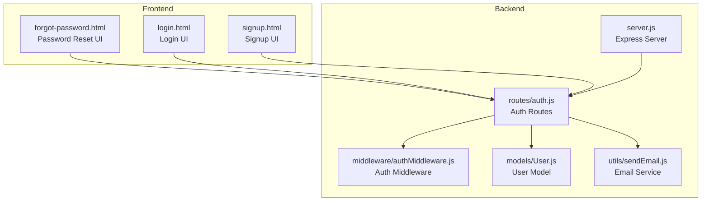
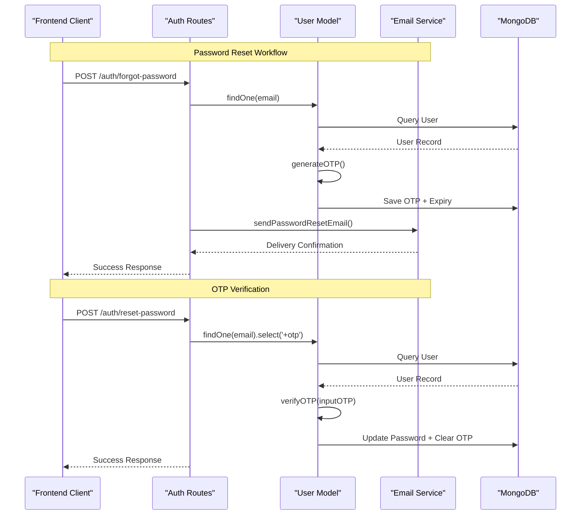
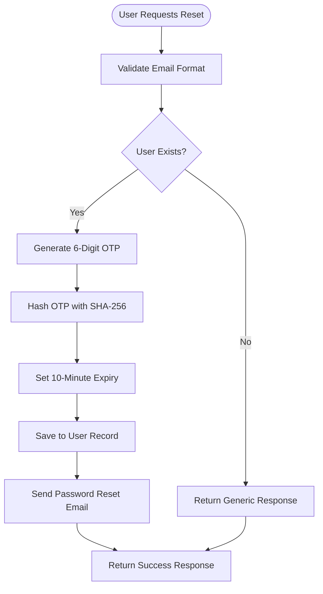
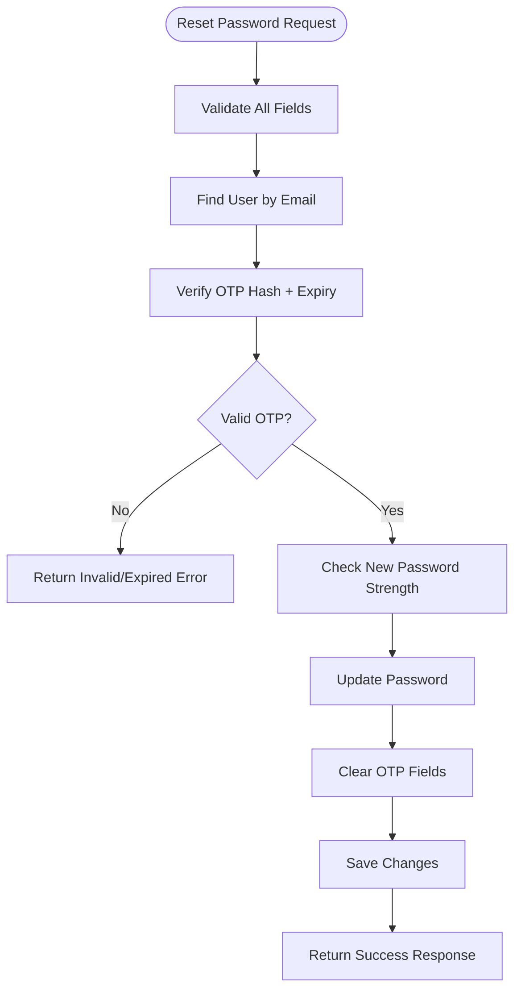
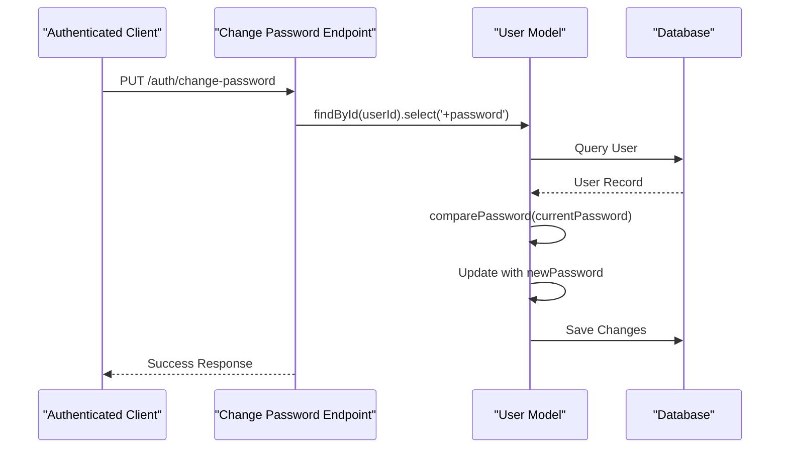
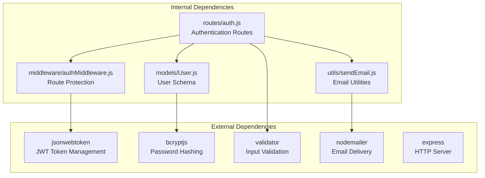

# Password Management

<cite>
**Referenced Files in This Document**
- [server.js](file://backend/server.js)
- [auth.js](file://backend/routes/auth.js)
- [authMiddleware.js](file://backend/middleware/authMiddleware.js)
- [User.js](file://backend/models/User.js)
- [sendEmail.js](file://backend/utils/sendEmail.js)
- [forgot-password.html](file://frontend/forgot-password.html)
- [login.html](file://frontend/login.html)
- [signup.html](file://frontend/signup.html)
</cite>

## Table of Contents
1. [Introduction](#introduction)
2. [Project Structure](#project-structure)
3. [Core Components](#core-components)
4. [Architecture Overview](#architecture-overview)
5. [Detailed Component Analysis](#detailed-component-analysis)
6. [Dependency Analysis](#dependency-analysis)
7. [Performance Considerations](#performance-considerations)
8. [Troubleshooting Guide](#troubleshooting-guide)
9. [Conclusion](#conclusion)

## Introduction
This document provides comprehensive documentation for password management functionality in the quiz application. It covers the complete password reset workflow including OTP generation for recovery, email notification system, and secure password update process. It also explains password validation rules, strength requirements, and security measures to prevent common vulnerabilities. Additionally, it documents the change password functionality for authenticated users and security considerations for password updates. The document includes practical examples of password reset scenarios and troubleshooting guidance for common issues.

## Project Structure
The password management system spans both backend and frontend components:

**Diagram sources**
- [server.js](file://backend/server.js#L50-L75)
- [auth.js](file://backend/routes/auth.js#L1-L10)
- [authMiddleware.js](file://backend/middleware/authMiddleware.js#L1-L20)
- [User.js](file://backend/models/User.js#L1-L20)
- [sendEmail.js](file://backend/utils/sendEmail.js#L1-L20)

**Section sources**
- [server.js](file://backend/server.js#L50-L75)
- [auth.js](file://backend/routes/auth.js#L1-L10)

## Core Components
The password management system consists of several interconnected components:

### Backend Components
- **Authentication Routes**: Handles all password-related operations
- **User Model**: Manages password storage, OTP generation, and validation
- **Email Service**: Sends password reset notifications
- **Authentication Middleware**: Protects password update endpoints

### Frontend Components
- **Password Reset UI**: Interactive form for OTP entry and new password
- **Login UI**: Provides forgot password link
- **Responsive Design**: Mobile-friendly password validation feedback

**Section sources**
- [auth.js](file://backend/routes/auth.js#L380-L507)
- [User.js](file://backend/models/User.js#L113-L171)
- [sendEmail.js](file://backend/utils/sendEmail.js#L88-L123)

## Architecture Overview
The password management architecture follows a layered approach with clear separation of concerns:

**Diagram sources**
- [auth.js](file://backend/routes/auth.js#L382-L432)
- [auth.js](file://backend/routes/auth.js#L437-L507)
- [User.js](file://backend/models/User.js#L113-L171)
- [sendEmail.js](file://backend/utils/sendEmail.js#L88-L123)

## Detailed Component Analysis

### Password Reset Workflow
The password reset process involves two main phases: OTP generation and password update.

#### Phase 1: OTP Generation and Email Delivery

**Diagram sources**
- [auth.js](file://backend/routes/auth.js#L382-L432)
- [User.js](file://backend/models/User.js#L113-L121)
- [sendEmail.js](file://backend/utils/sendEmail.js#L88-L123)

#### Phase 2: OTP Verification and Password Update

**Diagram sources**
- [auth.js](file://backend/routes/auth.js#L437-L507)
- [User.js](file://backend/models/User.js#L123-L171)

**Section sources**
- [auth.js](file://backend/routes/auth.js#L382-L507)
- [User.js](file://backend/models/User.js#L113-L171)

### Password Validation Rules
The system enforces strict password validation rules:

#### Backend Validation
- **Minimum Length**: 6 characters
- **Strength Requirements**: At least one lowercase letter and one number
- **Format Validation**: Uses validator library for comprehensive checks

#### Frontend Validation
- **Real-time Strength Meter**: Visual feedback during password creation
- **Character Type Detection**: Tracks lowercase, uppercase, numbers, symbols
- **Immediate Error Feedback**: Real-time validation errors

**Section sources**
- [auth.js](file://backend/routes/auth.js#L105-L125)
- [auth.js](file://backend/routes/auth.js#L458-L469)
- [forgot-password.html](file://frontend/forgot-password.html#L172-L199)

### Change Password Functionality
Authenticated users can change their passwords through a protected endpoint:

**Diagram sources**
- [auth.js](file://backend/routes/auth.js#L613-L660)
- [authMiddleware.js](file://backend/middleware/authMiddleware.js#L8-L79)

**Section sources**
- [auth.js](file://backend/routes/auth.js#L613-L660)
- [authMiddleware.js](file://backend/middleware/authMiddleware.js#L8-L79)

### Email Notification System
The email service handles multiple notification types:

#### Password Reset Emails
- **Template**: Gradient-styled OTP display
- **Delivery**: Immediate SMTP delivery via Gmail
- **Security**: OTP expiry after 10 minutes

#### Verification Emails
- **Welcome Messages**: Sent after successful verification
- **Consistent Styling**: Unified brand appearance

**Section sources**
- [sendEmail.js](file://backend/utils/sendEmail.js#L88-L123)
- [sendEmail.js](file://backend/utils/sendEmail.js#L51-L86)

## Dependency Analysis
The password management system has well-defined dependencies:

**Diagram sources**
- [auth.js](file://backend/routes/auth.js#L1-L10)
- [User.js](file://backend/models/User.js#L1-L4)
- [authMiddleware.js](file://backend/middleware/authMiddleware.js#L1-L4)
- [sendEmail.js](file://backend/utils/sendEmail.js#L1-L4)

**Section sources**
- [auth.js](file://backend/routes/auth.js#L1-L10)
- [package.json](file://backend/package.json#L18-L31)

## Performance Considerations
The system implements several performance optimizations:

### Rate Limiting
- **Global API Rate Limit**: 100 requests per 15 minutes
- **Signup Rate Limit**: 5 attempts per hour
- **Login Rate Limit**: 10 attempts per 15 minutes
- **OTP Request Limit**: 5 attempts per 15 minutes

### Security Measures
- **Password Hashing**: bcrypt with 12 rounds
- **OTP Expiration**: 10-minute validity period
- **Secure Cookies**: HttpOnly, Secure, SameSite=Strict
- **Input Sanitization**: Comprehensive XSS prevention

### Database Optimization
- **Index Creation**: Automatic email uniqueness index
- **Selective Field Loading**: Minimizing data transfer
- **Connection Pooling**: Efficient database connections

**Section sources**
- [server.js](file://backend/server.js#L58-L64)
- [auth.js](file://backend/routes/auth.js#L14-L33)
- [User.js](file://backend/models/User.js#L93-L103)

## Troubleshooting Guide

### Common Password Reset Issues

#### Issue: "Invalid or expired reset code"
**Symptoms**: User receives error when submitting OTP
**Causes**:
- OTP expired (more than 10 minutes)
- Incorrect OTP digits
- User account deleted or modified

**Solutions**:
1. Request new OTP via resend functionality
2. Verify OTP matches exactly (case-sensitive)
3. Check email spam/junk folder

#### Issue: "Password must be at least 6 characters"
**Symptoms**: Validation error during reset
**Causes**:
- New password below minimum length
- Password strength requirements not met

**Solutions**:
1. Ensure password meets minimum 6 characters
2. Include at least one lowercase letter and one number
3. Use the frontend strength meter for guidance

#### Issue: "Email not found" during reset
**Symptoms**: Error when requesting reset
**Causes**:
- Non-existent email address
- Case sensitivity issues

**Solutions**:
1. Verify email spelling and format
2. Check if user has completed registration
3. Use the same email used during signup

### Authentication Issues

#### Issue: "Current password is incorrect"
**Symptoms**: Error when changing existing password
**Causes**:
- Wrong current password
- Account deactivation

**Solutions**:
1. Use the correct current password
2. Verify account is active
3. Reset password if forgotten

#### Issue: "Email not verified"
**Symptoms**: Login blocked until verification
**Causes**:
- New account without email verification
- Verification email not received

**Solutions**:
1. Complete email verification process
2. Check spam/junk folder for verification email
3. Use resend OTP functionality

### Frontend-Specific Issues

#### Issue: OTP Input Not Working
**Symptoms**: Cannot enter OTP digits
**Causes**:
- JavaScript disabled
- Browser compatibility issues

**Solutions**:
1. Enable JavaScript in browser
2. Use supported modern browser
3. Try paste functionality for OTP

#### Issue: Password Strength Meter Not Showing
**Symptoms**: No visual feedback for password strength
**Causes**:
- JavaScript disabled
- Network issues preventing script loading

**Solutions**:
1. Enable JavaScript
2. Check network connectivity
3. Refresh page to reload scripts

**Section sources**
- [auth.js](file://backend/routes/auth.js#L412-L431)
- [auth.js](file://backend/routes/auth.js#L481-L487)
- [auth.js](file://backend/routes/auth.js#L634-L641)

## Conclusion
The password management system provides robust, secure, and user-friendly functionality for handling password resets and updates. The implementation follows industry best practices including proper password hashing, secure OTP generation, comprehensive validation, and layered security measures. The system balances security with usability through clear error messaging, real-time validation feedback, and intuitive user interfaces.

Key strengths of the implementation include:
- **Security**: Proper password hashing, OTP expiration, and input validation
- **Usability**: Real-time feedback, mobile-responsive design, and clear error messages
- **Reliability**: Comprehensive error handling and rate limiting
- **Maintainability**: Clean separation of concerns and modular architecture

The system successfully addresses common password management challenges while maintaining high security standards suitable for production deployment.