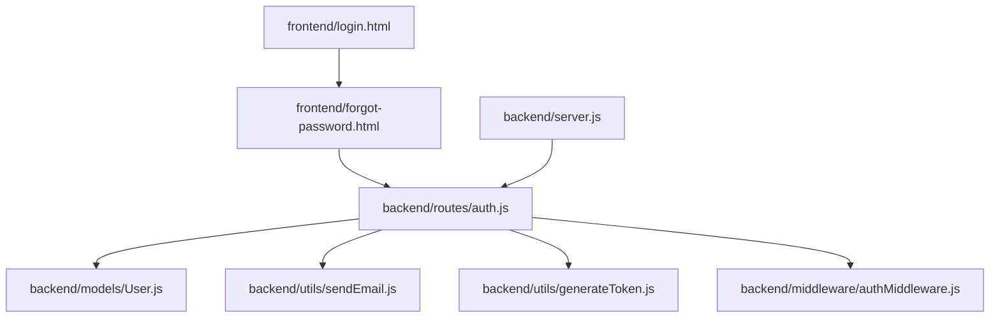
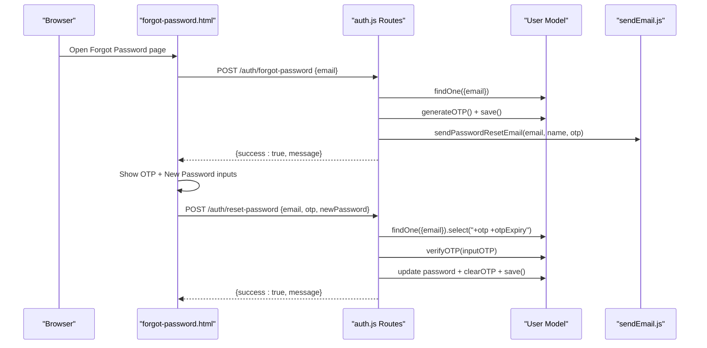
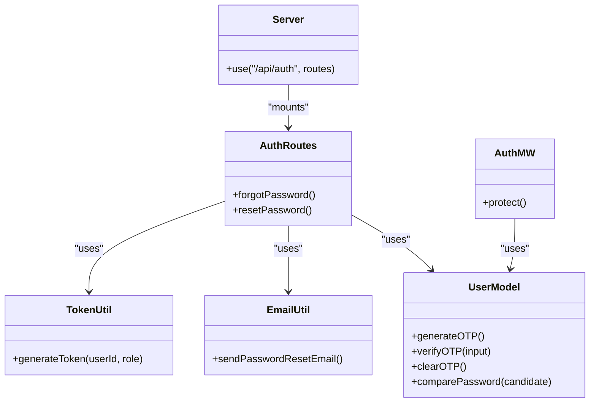

# Password Reset

<cite>
**Referenced Files in This Document**
- [backend/routes/auth.js](file://backend/routes/auth.js)
- [backend/models/User.js](file://backend/models/User.js)
- [backend/utils/sendEmail.js](file://backend/utils/sendEmail.js)
- [backend/utils/generateToken.js](file://backend/utils/generateToken.js)
- [backend/middleware/authMiddleware.js](file://backend/middleware/authMiddleware.js)
- [backend/server.js](file://backend/server.js)
- [frontend/forgot-password.html](file://frontend/forgot-password.html)
- [frontend/login.html](file://frontend/login.html)
- [frontend/css/auth.css](file://frontend/css/auth.css)
</cite>

## Table of Contents
1. [Introduction](#introduction)
2. [Project Structure](#project-structure)
3. [Core Components](#core-components)
4. [Architecture Overview](#architecture-overview)
5. [Detailed Component Analysis](#detailed-component-analysis)
6. [Dependency Analysis](#dependency-analysis)
7. [Performance Considerations](#performance-considerations)
8. [Troubleshooting Guide](#troubleshooting-guide)
9. [Conclusion](#conclusion)

## Introduction
This document explains the complete password reset workflow from initiation to completion. It covers the forgot password process, OTP generation and email delivery, reset code validation, and secure password update. It also details security measures including OTP expiry, rate limiting, and account verification requirements. Examples of successful scenarios and common failure cases are included, along with implementation details for the forgot-password endpoint, OTP generation algorithm, email template structure, and reset-password endpoint validation process.

## Project Structure
The password reset flow spans frontend and backend components:
- Frontend pages collect user input and manage UI steps for password reset.
- Backend routes implement the forgot-password and reset-password endpoints with validation and rate limiting.
- The User model encapsulates OTP lifecycle and password hashing.
- Email utilities send templated emails for password reset.
- Authentication middleware enforces account verification and active status.

**Diagram sources**
- [backend/routes/auth.js](file://backend/routes/auth.js#L382-L432)
- [backend/models/User.js](file://backend/models/User.js#L113-L171)
- [backend/utils/sendEmail.js](file://backend/utils/sendEmail.js#L91-L123)
- [backend/utils/generateToken.js](file://backend/utils/generateToken.js#L4-L16)
- [backend/middleware/authMiddleware.js](file://backend/middleware/authMiddleware.js#L8-L79)
- [backend/server.js](file://backend/server.js#L70-L75)
- [frontend/forgot-password.html](file://frontend/forgot-password.html#L320-L424)
- [frontend/login.html](file://frontend/login.html#L62-L62)

**Section sources**
- [backend/server.js](file://backend/server.js#L70-L75)
- [frontend/forgot-password.html](file://frontend/forgot-password.html#L1-L448)
- [frontend/login.html](file://frontend/login.html#L1-L260)

## Core Components
- Forgot Password Endpoint: Validates email, generates a 6-digit OTP, stores a hashed OTP with expiry, sends an email, and responds without revealing whether the email exists.
- Reset Password Endpoint: Validates OTP against the stored hash and expiry, ensures password meets strength criteria, updates the password, clears OTP fields, and returns success.
- User Model OTP Lifecycle: Generates OTP, hashes it, sets expiry, verifies OTP, and clears OTP after use.
- Email Templates: Dedicated template for password reset with a prominent OTP display.
- Rate Limiting: Applies per-route limits to prevent abuse.
- Frontend UI: Multi-step form with OTP input, password strength meter, resend timer, and success page.

**Section sources**
- [backend/routes/auth.js](file://backend/routes/auth.js#L382-L432)
- [backend/routes/auth.js](file://backend/routes/auth.js#L437-L507)
- [backend/models/User.js](file://backend/models/User.js#L113-L171)
- [backend/utils/sendEmail.js](file://backend/utils/sendEmail.js#L91-L123)
- [frontend/forgot-password.html](file://frontend/forgot-password.html#L320-L424)

## Architecture Overview
The password reset flow integrates frontend UI with backend endpoints and database operations.

**Diagram sources**
- [backend/routes/auth.js](file://backend/routes/auth.js#L382-L432)
- [backend/routes/auth.js](file://backend/routes/auth.js#L437-L507)
- [backend/models/User.js](file://backend/models/User.js#L113-L171)
- [backend/utils/sendEmail.js](file://backend/utils/sendEmail.js#L91-L123)
- [frontend/forgot-password.html](file://frontend/forgot-password.html#L320-L424)

## Detailed Component Analysis

### Forgot Password Endpoint
- Purpose: Initiate password reset by sending a reset code to the user’s email.
- Input validation: Requires email, validates format, and applies sanitization.
- Behavior:
  - Finds user by email.
  - If user does not exist, responds with a generic success message to avoid leaking account existence.
  - If user exists, generates OTP via model method, saves hashed OTP with expiry, and sends email.
- Response: Always returns success to prevent enumeration attacks.

Security measures:
- OTP expiry enforced by model method.
- Rate limiting applied to this endpoint.

Common failure cases:
- Invalid or missing email.
- Non-existent email (returns success for safety).
- Email delivery failures (handled by email utility).

**Section sources**
- [backend/routes/auth.js](file://backend/routes/auth.js#L382-L432)
- [backend/models/User.js](file://backend/models/User.js#L113-L121)
- [backend/utils/sendEmail.js](file://backend/utils/sendEmail.js#L91-L123)

### OTP Generation and Storage
- Algorithm:
  - Generate a random 6-digit code.
  - Hash the code using SHA-256.
  - Store the hash and set expiry to 10 minutes from now.
- Verification:
  - Hash the provided OTP and compare with stored hash.
  - Ensure current time is less than expiry.
- Clearing:
  - After successful reset, clear OTP fields.

Security measures:
- OTP stored as a hash, not plaintext.
- Strict expiry enforcement.

**Section sources**
- [backend/models/User.js](file://backend/models/User.js#L113-L140)

### Email Template for Password Reset
- Template structure: Includes a prominent OTP display area and footer branding.
- Delivery: Uses Nodemailer transport configured with environment credentials.
- Error handling: Catches and logs failures during send.

**Section sources**
- [backend/utils/sendEmail.js](file://backend/utils/sendEmail.js#L91-L123)

### Reset Password Endpoint
- Purpose: Validate OTP and update the user’s password.
- Input validation: Requires email, OTP, and new password; checks length and strength.
- Validation:
  - Finds user with OTP fields selected.
  - Verifies OTP hash and expiry.
- Update:
  - Replaces password with new value (hashed by model pre-save hook).
  - Clears OTP fields and persists.
- Response: Success message upon completion.

Security measures:
- OTP expiry and hash verification.
- Password strength enforcement.
- Account verification requirement enforced by middleware for protected routes; though reset-password is public, OTP expiry prevents replay.

**Section sources**
- [backend/routes/auth.js](file://backend/routes/auth.js#L437-L507)
- [backend/models/User.js](file://backend/models/User.js#L141-L171)

### Frontend Password Reset UI
- Steps:
  - Step 1: Email input and submission triggers forgot-password endpoint.
  - Step 2: OTP inputs (6 digits), new password with strength meter, confirm password, resend timer.
  - Step 3: Success page with link to login.
- Interactions:
  - OTP auto-focus and paste handling.
  - Resend code with cooldown timer.
  - Toast notifications for feedback.

**Section sources**
- [frontend/forgot-password.html](file://frontend/forgot-password.html#L18-L142)
- [frontend/forgot-password.html](file://frontend/forgot-password.html#L242-L276)
- [frontend/forgot-password.html](file://frontend/forgot-password.html#L358-L424)
- [frontend/css/auth.css](file://frontend/css/auth.css#L379-L443)

### Rate Limiting and Security Controls
- Rate limiting:
  - OTP limiter applied to forgot-password endpoint.
  - Additional global limiter for /api/ routes.
- Account verification:
  - Authentication middleware enforces isVerified and isActive checks for protected routes.
- Token generation:
  - JWT issued with configurable expiry and issuer.

**Section sources**
- [backend/routes/auth.js](file://backend/routes/auth.js#L14-L33)
- [backend/routes/auth.js](file://backend/routes/auth.js#L59-L64)
- [backend/middleware/authMiddleware.js](file://backend/middleware/authMiddleware.js#L8-L79)
- [backend/utils/generateToken.js](file://backend/utils/generateToken.js#L4-L16)

## Dependency Analysis

**Diagram sources**
- [backend/routes/auth.js](file://backend/routes/auth.js#L382-L507)
- [backend/models/User.js](file://backend/models/User.js#L113-L171)
- [backend/utils/sendEmail.js](file://backend/utils/sendEmail.js#L91-L123)
- [backend/utils/generateToken.js](file://backend/utils/generateToken.js#L4-L16)
- [backend/middleware/authMiddleware.js](file://backend/middleware/authMiddleware.js#L8-L79)
- [backend/server.js](file://backend/server.js#L70-L75)

**Section sources**
- [backend/routes/auth.js](file://backend/routes/auth.js#L382-L507)
- [backend/models/User.js](file://backend/models/User.js#L113-L171)
- [backend/utils/sendEmail.js](file://backend/utils/sendEmail.js#L91-L123)
- [backend/utils/generateToken.js](file://backend/utils/generateToken.js#L4-L16)
- [backend/middleware/authMiddleware.js](file://backend/middleware/authMiddleware.js#L8-L79)
- [backend/server.js](file://backend/server.js#L70-L75)

## Performance Considerations
- OTP expiry is short (10 minutes) to reduce risk and memory footprint.
- Password hashing is handled by the model’s pre-save hook, ensuring consistent and secure storage.
- Email delivery is asynchronous; errors are logged and surfaced to the client as generic failures.
- Rate limiting reduces load and prevents brute-force attempts.

[No sources needed since this section provides general guidance]

## Troubleshooting Guide
Common failure cases and resolutions:
- Invalid or missing email:
  - Ensure the email is present and valid before submitting.
  - The endpoint returns an error if email is missing or invalid.
- Non-existent email:
  - The endpoint returns success to avoid leaking account existence.
  - Ask the user to verify the email address or sign up.
- OTP expired or incorrect:
  - The user must request a new code or wait for the timer to expire.
  - The verification compares a hashed OTP with expiry.
- Password too weak:
  - Enforce minimum length and include at least one lowercase letter and one digit.
- Email delivery failure:
  - Check SMTP credentials and network connectivity.
  - Review logs for detailed error messages.
- Rate limit exceeded:
  - Wait for the window to reset before retrying.
- Frontend issues:
  - Ensure OTP inputs accept numeric values and auto-focus transitions.
  - Verify resend timer logic and toast notifications.

**Section sources**
- [backend/routes/auth.js](file://backend/routes/auth.js#L382-L432)
- [backend/routes/auth.js](file://backend/routes/auth.js#L437-L507)
- [backend/models/User.js](file://backend/models/User.js#L124-L133)
- [backend/utils/sendEmail.js](file://backend/utils/sendEmail.js#L119-L122)
- [frontend/forgot-password.html](file://frontend/forgot-password.html#L358-L424)

## Conclusion
The password reset workflow is designed with security and usability in mind. OTP hashing, strict expiry, rate limiting, and careful error messaging mitigate risks while providing a smooth user experience. The frontend offers clear feedback and guided steps, and the backend enforces robust validation and secure storage of sensitive data.