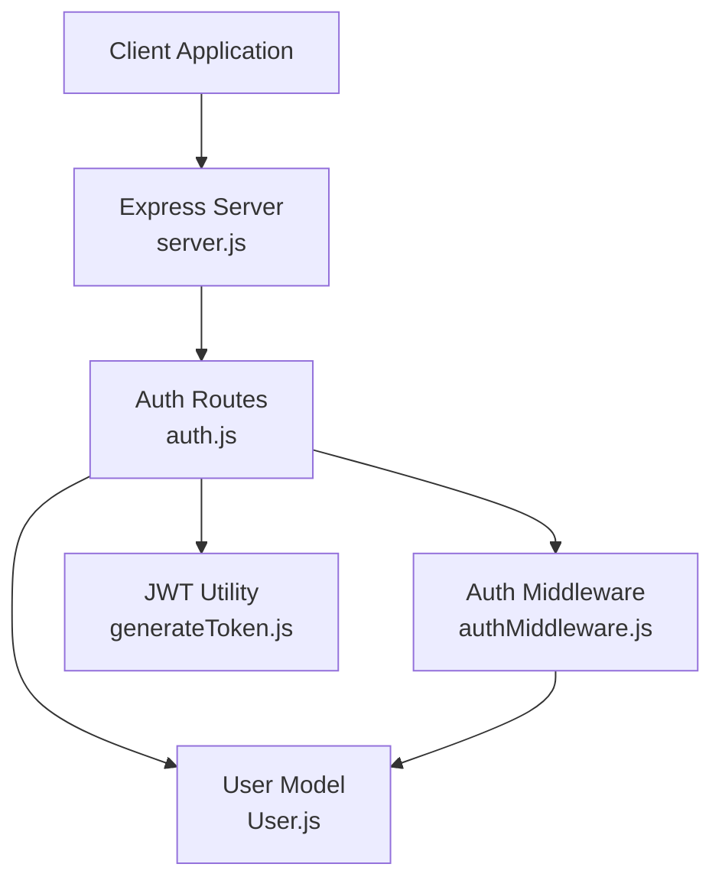
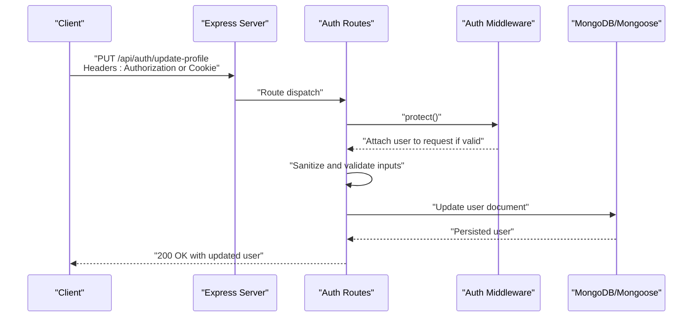
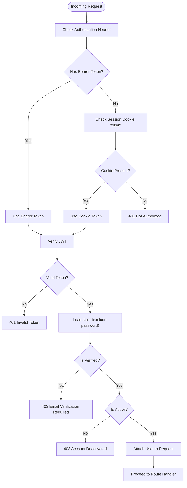
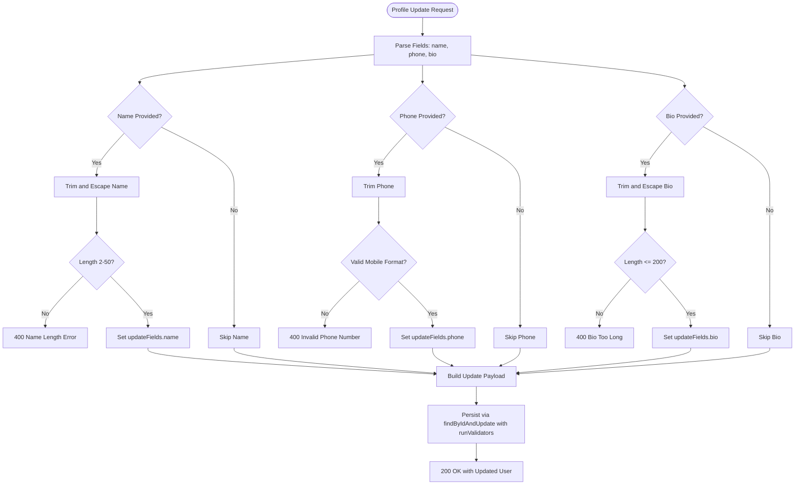
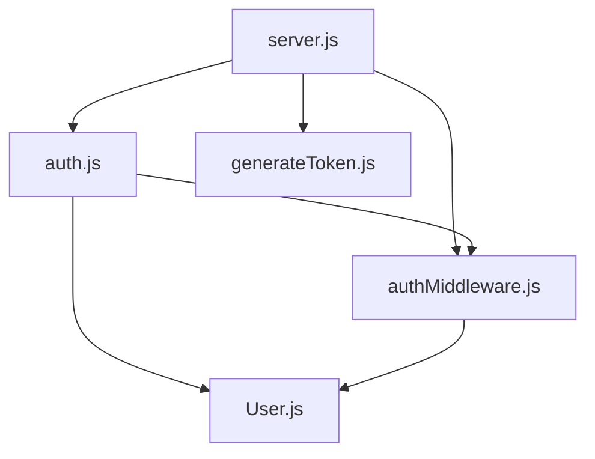

# Profile Management

<cite>
**Referenced Files in This Document**
- [auth.js](file://backend/routes/auth.js)
- [authMiddleware.js](file://backend/middleware/authMiddleware.js)
- [User.js](file://backend/models/User.js)
- [server.js](file://backend/server.js)
- [generateToken.js](file://backend/utils/generateToken.js)
- [package.json](file://backend/package.json)
</cite>

## Table of Contents
1. [Introduction](#introduction)
2. [Project Structure](#project-structure)
3. [Core Components](#core-components)
4. [Architecture Overview](#architecture-overview)
5. [Detailed Component Analysis](#detailed-component-analysis)
6. [Dependency Analysis](#dependency-analysis)
7. [Performance Considerations](#performance-considerations)
8. [Troubleshooting Guide](#troubleshooting-guide)
9. [Conclusion](#conclusion)

## Introduction
This document explains the user profile management functionality, focusing on updating personal details such as name, phone number, and bio. It covers the complete flow from request initiation to response delivery, including input validation, sanitization, data integrity checks enforced by the database schema, protected route access requirements, and error handling mechanisms. It also provides examples of successful updates and typical validation error scenarios with their corresponding error messages.

## Project Structure
The profile update feature is implemented within the backend authentication routes and middleware stack. The relevant components are organized as follows:
- Routes: Authentication routes expose the profile update endpoint under a protected route.
- Middleware: Authentication middleware enforces token-based access and verifies user status.
- Models: Mongoose schema defines field constraints and validation rules.
- Utilities: JWT generation and response formatting helpers.
- Server: Express server configuration enabling CORS, cookies, and rate limiting.

**Diagram sources**
- [server.js](file://backend/server.js#L25-L75)
- [auth.js](file://backend/routes/auth.js#L540-L608)
- [authMiddleware.js](file://backend/middleware/authMiddleware.js#L8-L79)
- [User.js](file://backend/models/User.js#L5-L83)
- [generateToken.js](file://backend/utils/generateToken.js#L4-L16)

**Section sources**
- [server.js](file://backend/server.js#L25-L75)
- [auth.js](file://backend/routes/auth.js#L540-L608)
- [authMiddleware.js](file://backend/middleware/authMiddleware.js#L8-L79)
- [User.js](file://backend/models/User.js#L5-L83)
- [generateToken.js](file://backend/utils/generateToken.js#L4-L16)

## Core Components
- Protected route: The profile update endpoint is protected and requires a valid bearer token or session cookie.
- Input sanitization: Inputs are sanitized to remove whitespace and escape special characters.
- Validation rules: Name length constraints, phone number format validation, and bio character limit enforcement occur both at the route level and via Mongoose schema validators.
- Data integrity: Updates are performed atomically with MongoDB, and Mongoose validators ensure schema compliance.
- Error handling: Centralized error handling returns structured JSON responses with appropriate HTTP status codes.

Key implementation references:
- Protected route decorator usage and route definition: [auth.js](file://backend/routes/auth.js#L540-L608)
- Authentication middleware logic: [authMiddleware.js](file://backend/middleware/authMiddleware.js#L8-L79)
- Schema-level validations for name, phone, and bio: [User.js](file://backend/models/User.js#L7-L52)

**Section sources**
- [auth.js](file://backend/routes/auth.js#L540-L608)
- [authMiddleware.js](file://backend/middleware/authMiddleware.js#L8-L79)
- [User.js](file://backend/models/User.js#L7-L52)

## Architecture Overview
The profile update flow involves the client sending a PUT request to the protected endpoint with sanitized and validated payload fields. The middleware authenticates and authorizes the request, while the route handler applies additional validation and persists changes to the database.

**Diagram sources**
- [auth.js](file://backend/routes/auth.js#L540-L608)
- [authMiddleware.js](file://backend/middleware/authMiddleware.js#L8-L79)
- [User.js](file://backend/models/User.js#L5-L83)

## Detailed Component Analysis

### Protected Route Access Requirements
- Token retrieval: The middleware accepts either an Authorization header (Bearer token) or a session cookie named token.
- Token verification: The token is verified against the configured JWT secret.
- User existence and status: The middleware ensures the user exists, is verified, and is active before allowing access.
- Request continuation: On success, the authenticated user object is attached to the request for downstream handlers.

**Diagram sources**
- [authMiddleware.js](file://backend/middleware/authMiddleware.js#L8-L79)

**Section sources**
- [authMiddleware.js](file://backend/middleware/authMiddleware.js#L8-L79)

### Input Validation, Sanitization, and Data Integrity Checks
The profile update endpoint enforces the following checks:

- Name validation:
  - Sanitized and trimmed.
  - Length constraint: minimum 2 and maximum 50 characters.
  - Additional schema-level constraints apply at persistence time.

- Phone number validation:
  - Trimmed input.
  - Format validated using a mobile phone validator.
  - Optional field; if present, must conform to accepted formats.

- Bio validation:
  - Sanitized and trimmed.
  - Maximum length of 200 characters.
  - Additional schema-level constraints apply at persistence time.

Data integrity is ensured by:
- Mongoose schema validators for name, phone, and bio.
- Update operation with runValidators enabled to enforce schema-level validation during updates.
- Atomic update via findByIdAndUpdate.

**Diagram sources**
- [auth.js](file://backend/routes/auth.js#L542-L598)
- [User.js](file://backend/models/User.js#L7-L52)

**Section sources**
- [auth.js](file://backend/routes/auth.js#L542-L598)
- [User.js](file://backend/models/User.js#L7-L52)

### Error Handling for Profile Updates
The route implements robust error handling:
- Validation errors return 400 with a descriptive message.
- Database or server errors return 500 with a generic message in production and include the error in development.
- Authentication and authorization failures are handled by the middleware with appropriate status codes.

Common error scenarios:
- Missing or invalid token: 401 Not Authorized or Invalid Token.
- Unverified user: 403 Email Verification Required.
- Deactivated account: 403 Account Deactivated.
- Validation failures:
  - Name length outside 2–50 characters.
  - Invalid phone number format.
  - Bio exceeding 200 characters.
- General server errors: 500 Internal Server Error.

**Section sources**
- [auth.js](file://backend/routes/auth.js#L542-L608)
- [authMiddleware.js](file://backend/middleware/authMiddleware.js#L8-L79)

### Successful Profile Update Example
A successful update returns a 200 OK with a success flag and the updated user object containing the modified fields.

Typical request payload:
- name: string (optional)
- phone: string (optional)
- bio: string (optional)

Response structure:
- success: boolean
- message: string
- user: object (id, name, email, phone, bio, avatar)

Example response keys:
- success: true
- message: "Profile updated successfully"
- user: { id, name, email, phone, bio, avatar }

**Section sources**
- [auth.js](file://backend/routes/auth.js#L587-L598)

### Validation Error Scenarios and Messages
Below are typical validation failures and their associated error messages returned by the endpoint:

- Name validation failure:
  - Message: "Name must be between 2-50 characters"
  - Status: 400

- Phone validation failure:
  - Message: "Invalid phone number"
  - Status: 400

- Bio validation failure:
  - Message: "Bio cannot exceed 200 characters"
  - Status: 400

- General server error:
  - Message: "Server error"
  - Status: 500

Note: In development mode, the response may include an error field with the underlying error message.

**Section sources**
- [auth.js](file://backend/routes/auth.js#L550-L578)
- [auth.js](file://backend/routes/auth.js#L600-L607)

## Dependency Analysis
The profile update feature depends on several modules and configurations:

- Express server configuration enables:
  - CORS for frontend communication.
  - Cookie parsing for session-based authentication.
  - Rate limiting for API endpoints.
  - Static serving for frontend assets.

- Route dependencies:
  - Authentication middleware for protecting endpoints.
  - Mongoose model for data persistence and schema validation.
  - JWT utility for token generation and refresh flows.

**Diagram sources**
- [server.js](file://backend/server.js#L25-L75)
- [auth.js](file://backend/routes/auth.js#L540-L608)
- [authMiddleware.js](file://backend/middleware/authMiddleware.js#L8-L79)
- [User.js](file://backend/models/User.js#L5-L83)
- [generateToken.js](file://backend/utils/generateToken.js#L4-L16)

**Section sources**
- [server.js](file://backend/server.js#L25-L75)
- [auth.js](file://backend/routes/auth.js#L540-L608)
- [authMiddleware.js](file://backend/middleware/authMiddleware.js#L8-L79)
- [User.js](file://backend/models/User.js#L5-L83)
- [generateToken.js](file://backend/utils/generateToken.js#L4-L16)

## Performance Considerations
- Input sanitization and validation occur before database writes, reducing unnecessary database round-trips.
- Mongoose validators are executed during updates, ensuring schema compliance without additional manual checks.
- Rate limiting is applied globally to the API base path to prevent abuse.
- JWT verification is lightweight; ensure the JWT secret is securely configured.

[No sources needed since this section provides general guidance]

## Troubleshooting Guide
Common issues and resolutions:
- 401 Not Authorized:
  - Cause: Missing or invalid token in header or cookie.
  - Resolution: Ensure Authorization header uses "Bearer <token>" or a valid session cookie is present.

- 403 Email Verification Required:
  - Cause: User account is not verified.
  - Resolution: Complete email verification flow before accessing protected routes.

- 403 Account Deactivated:
  - Cause: User account is inactive.
  - Resolution: Contact support to reactivate the account.

- 400 Validation Errors:
  - Name too short/long: Adjust to 2–50 characters.
  - Invalid phone format: Use a recognized mobile phone format.
  - Bio too long: Reduce to ≤200 characters.

- 500 Internal Server Error:
  - Cause: Unexpected server-side issue.
  - Resolution: Check server logs and environment configuration.

**Section sources**
- [authMiddleware.js](file://backend/middleware/authMiddleware.js#L8-L79)
- [auth.js](file://backend/routes/auth.js#L542-L608)

## Conclusion
The profile update functionality is secure, validated, and resilient. It enforces strict input sanitization and validation at both the route and schema levels, protects access through robust middleware, and provides clear error messaging. By adhering to the documented validation rules and access requirements, clients can reliably update user profiles while maintaining data integrity and security.