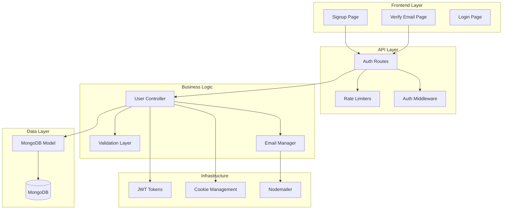
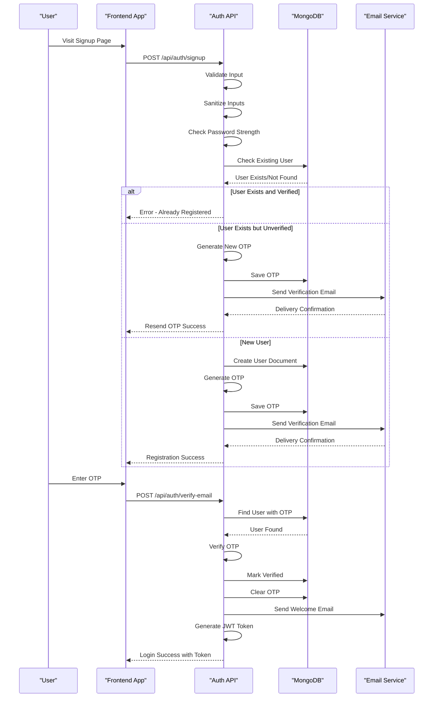
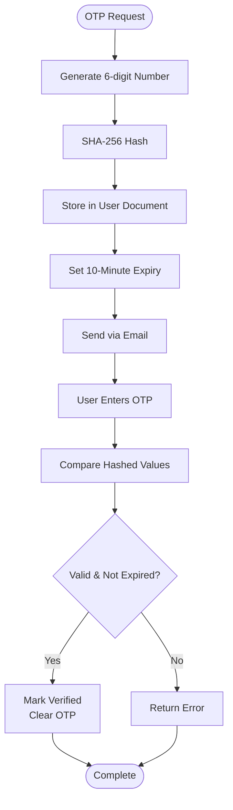
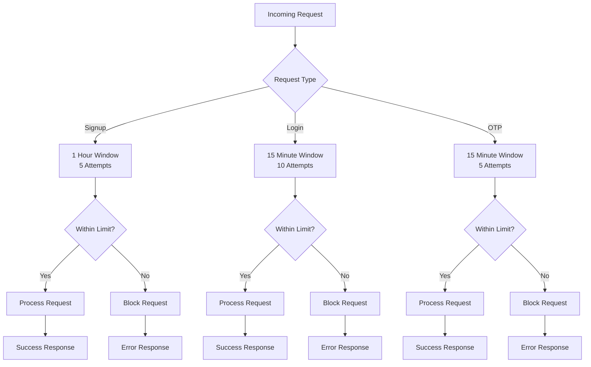

# User Registration

<cite>
**Referenced Files in This Document**
- [User.js](file://backend/models/User.js)
- [auth.js](file://backend/routes/auth.js)
- [sendEmail.js](file://backend/utils/sendEmail.js)
- [generateToken.js](file://backend/utils/generateToken.js)
- [authMiddleware.js](file://backend/middleware/authMiddleware.js)
- [server.js](file://backend/server.js)
- [db.js](file://backend/config/db.js)
- [package.json](file://backend/package.json)
- [signup.html](file://frontend/signup.html)
- [verify-email.html](file://frontend/verify-email.html)
</cite>

## Table of Contents
1. [Introduction](#introduction)
2. [System Architecture](#system-architecture)
3. [Registration Workflow](#registration-workflow)
4. [Input Validation](#input-validation)
5. [Email Verification System](#email-verification-system)
6. [OTP Generation and Storage](#otp-generation-and-storage)
7. [User Creation Process](#user-creation-process)
8. [Email Notification System](#email-notification-system)
9. [Security Measures](#security-measures)
10. [Rate Limiting](#rate-limiting)
11. [Error Handling](#error-handling)
12. [Integration Points](#integration-points)
13. [Troubleshooting Guide](#troubleshooting-guide)
14. [Best Practices](#best-practices)

## Introduction

The user registration system is a comprehensive authentication solution built with Node.js, Express, MongoDB, and React. It provides a complete user registration workflow with email verification, OTP-based authentication, and robust security measures. The system ensures secure user onboarding while maintaining excellent user experience through intuitive frontend interfaces and reliable backend processing.

## System Architecture

The registration system follows a layered architecture with clear separation of concerns:



**Diagram sources**
- [auth.js](file://backend/routes/auth.js#L1-L715)
- [User.js](file://backend/models/User.js#L1-L208)
- [sendEmail.js](file://backend/utils/sendEmail.js#L1-L159)

## Registration Workflow

The registration process follows a structured multi-step workflow designed to ensure user verification and security:



**Diagram sources**
- [auth.js](file://backend/routes/auth.js#L81-L178)
- [auth.js](file://backend/routes/auth.js#L183-L241)

**Section sources**
- [auth.js](file://backend/routes/auth.js#L81-L178)
- [auth.js](file://backend/routes/auth.js#L183-L241)

## Input Validation

The system implements comprehensive input validation at multiple levels to ensure data integrity and security:

### Frontend Validation
- **Name Validation**: Minimum 2 characters, maximum 50 characters
- **Email Validation**: RFC-compliant email format with real-time validation
- **Password Validation**: Minimum 6 characters with strength indicator
- **Confirmation Validation**: Password matching with real-time feedback

### Backend Validation
- **Sanitization**: Input cleaning using validator library
- **Format Validation**: Strict email format checking
- **Length Validation**: Comprehensive character length restrictions
- **Duplicate Prevention**: Database-level unique constraint enforcement

**Section sources**
- [signup.html](file://frontend/signup.html#L253-L282)
- [auth.js](file://backend/routes/auth.js#L85-L125)

## Email Verification System

The email verification system ensures that user accounts are legitimate and actively managed:

### Verification Process
1. **OTP Generation**: 6-digit numeric code with SHA-256 hashing
2. **Storage**: Temporary storage with 10-minute expiry
3. **Delivery**: HTML email templates with styled OTP display
4. **Verification**: Secure comparison with expiry validation

### Email Templates
- **Verification Emails**: Gradient-styled OTP display with expiration notice
- **Welcome Emails**: Celebration-themed welcome message
- **Password Reset**: Dedicated reset code delivery

**Section sources**
- [User.js](file://backend/models/User.js#L113-L139)
- [sendEmail.js](file://backend/utils/sendEmail.js#L51-L86)
- [sendEmail.js](file://backend/utils/sendEmail.js#L128-L157)

## OTP Generation and Storage

The OTP system implements secure temporary credential generation:

### OTP Implementation


**Diagram sources**
- [User.js](file://backend/models/User.js#L113-L139)

### Storage Strategy
- **Hashed Storage**: OTP stored as SHA-256 hash for security
- **Temporary Nature**: Automatic cleanup after verification
- **Expiry Management**: Real-time expiry validation
- **Database Indexing**: Optimized query performance

**Section sources**
- [User.js](file://backend/models/User.js#L71-L78)
- [User.js](file://backend/models/User.js#L113-L139)

## User Creation Process

The user creation process involves multiple security and validation steps:

### Creation Flow
1. **Input Collection**: Name, email, password from form
2. **Validation**: Comprehensive field validation
3. **Sanitization**: Input cleaning and normalization
4. **Duplicate Check**: Database uniqueness verification
5. **Password Hashing**: bcrypt with 12-round salt
6. **Document Creation**: MongoDB user document creation
7. **OTP Generation**: Verification code assignment
8. **Notification**: Email delivery initiation

### Security Features
- **Password Hashing**: Industry-standard bcrypt encryption
- **Unique Constraints**: Database-level email uniqueness
- **Input Sanitization**: XSS prevention through escaping
- **Role Assignment**: Default user role assignment

**Section sources**
- [auth.js](file://backend/routes/auth.js#L150-L155)
- [User.js](file://backend/models/User.js#L92-L103)

## Email Notification System

The email notification system provides comprehensive communication capabilities:

### Email Transport Configuration
- **SMTP Setup**: Gmail SMTP with TLS encryption
- **Connection Verification**: Automated health checks
- **Template System**: Reusable HTML email templates
- **Error Handling**: Graceful failure with logging

### Notification Types
- **Verification Emails**: Account activation codes
- **Welcome Messages**: Post-registration acknowledgment
- **Password Resets**: Secure reset code delivery
- **System Notifications**: Administrative alerts

**Section sources**
- [sendEmail.js](file://backend/utils/sendEmail.js#L7-L31)
- [sendEmail.js](file://backend/utils/sendEmail.js#L51-L86)

## Security Measures

The system implements multiple layers of security to protect user data and prevent abuse:

### Authentication Security
- **JWT Tokens**: 7-day expiration with secure cookie storage
- **CSRF Protection**: SameSite strict cookies
- **XSS Prevention**: HttpOnly cookies, input sanitization
- **Rate Limiting**: IP-based request throttling

### Data Protection
- **Password Encryption**: bcrypt with 12 rounds
- **Input Validation**: Comprehensive sanitization
- **Duplicate Prevention**: Database unique constraints
- **Session Management**: Secure token handling

### Frontend Security
- **Password Visibility Toggle**: Secure input masking
- **Real-time Validation**: Immediate feedback without server calls
- **Cross-origin Protection**: CORS configuration for security

**Section sources**
- [auth.js](file://backend/routes/auth.js#L49-L76)
- [authMiddleware.js](file://backend/middleware/authMiddleware.js#L8-L79)

## Rate Limiting

The system implements intelligent rate limiting to prevent abuse and ensure fair usage:

### Rate Limit Configuration


**Diagram sources**
- [auth.js](file://backend/routes/auth.js#L14-L33)

### Implementation Details
- **Signup Limiter**: Prevents bulk account creation
- **Login Limiter**: Protects against brute force attacks
- **OTP Limiter**: Controls verification attempts
- **Global Limiter**: Overall API request throttling

**Section sources**
- [auth.js](file://backend/routes/auth.js#L14-L33)

## Error Handling

The system provides comprehensive error handling with clear user feedback:

### Error Categories
- **Validation Errors**: Input format and completeness issues
- **Business Logic Errors**: Duplicate users, invalid credentials
- **System Errors**: Database connectivity, email failures
- **Security Errors**: Rate limiting, unauthorized access

### Error Response Format
```javascript
{
  success: false,
  message: "Descriptive error message",
  error: process.env.NODE_ENV === 'development' ? errorDetails : undefined
}
```

### Frontend Error Handling
- **Real-time Validation**: Immediate input feedback
- **Toast Notifications**: Non-blocking error messages
- **Form State Management**: Error highlighting and recovery
- **Graceful Degradation**: User-friendly error recovery

**Section sources**
- [auth.js](file://backend/routes/auth.js#L170-L177)
- [auth.js](file://backend/routes/auth.js#L233-L240)

## Integration Points

The registration system integrates seamlessly with various components:

### Database Integration
- **MongoDB Schema**: Comprehensive user model with indexes
- **Connection Pooling**: Optimized database connections
- **Index Management**: Performance-optimized query patterns

### External Services
- **Email Service**: Nodemailer integration with Gmail SMTP
- **Authentication**: JWT-based session management
- **Frontend**: React-based user interface with real-time feedback

### Environment Configuration
- **Environment Variables**: Secure credential management
- **Deployment Ready**: Production-ready configuration options
- **Development Support**: Local development environment setup

**Section sources**
- [db.js](file://backend/config/db.js#L4-L11)
- [server.js](file://backend/server.js#L17-L23)

## Troubleshooting Guide

Common issues and their solutions:

### Registration Issues
- **Duplicate Email**: User already exists and is verified
  - Solution: Direct login or password reset
- **Email Delivery Failure**: SMTP configuration issues
  - Solution: Check environment variables and network connectivity
- **OTP Expiration**: Verification code timeout
  - Solution: Request new OTP via resend endpoint

### Frontend Issues
- **Form Validation Errors**: Input format problems
  - Solution: Check browser console for validation messages
- **CORS Errors**: Cross-origin request failures
  - Solution: Verify frontend URL configuration
- **Token Issues**: Session persistence problems
  - Solution: Clear browser cookies and cache

### Backend Issues
- **Database Connection**: MongoDB connectivity problems
  - Solution: Check connection string and network access
- **Rate Limiting**: Too many requests blocked
  - Solution: Wait for cooldown period or adjust limits
- **JWT Errors**: Token verification failures
  - Solution: Check secret key and token format

**Section sources**
- [auth.js](file://backend/routes/auth.js#L130-L148)
- [auth.js](file://backend/routes/auth.js#L200-L212)

## Best Practices

### Security Best Practices
- **Password Security**: Enforce minimum 6-character passwords with mixed case and numbers
- **Input Sanitization**: Always sanitize user inputs to prevent injection attacks
- **Rate Limiting**: Implement appropriate rate limits for all endpoints
- **Secure Storage**: Never store plain text passwords or sensitive tokens

### Performance Best Practices
- **Database Indexing**: Use appropriate indexes for frequently queried fields
- **Connection Pooling**: Optimize database connection usage
- **Caching**: Implement caching for frequently accessed data
- **Resource Management**: Properly manage memory and CPU resources

### User Experience Best Practices
- **Real-time Feedback**: Provide immediate validation feedback
- **Clear Error Messages**: Use descriptive error messages without exposing system details
- **Progress Indicators**: Show loading states during long operations
- **Accessibility**: Ensure forms are accessible to users with disabilities

### Monitoring and Maintenance
- **Logging**: Implement comprehensive logging for debugging and monitoring
- **Health Checks**: Regular system health monitoring
- **Backup Strategy**: Regular database backups and recovery testing
- **Security Updates**: Regular updates to dependencies and security patches