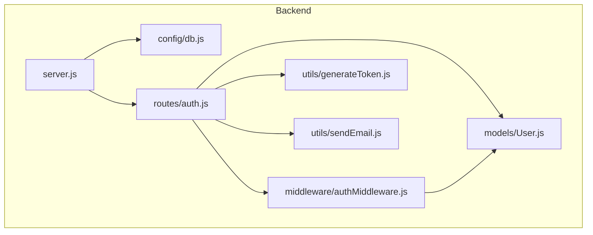
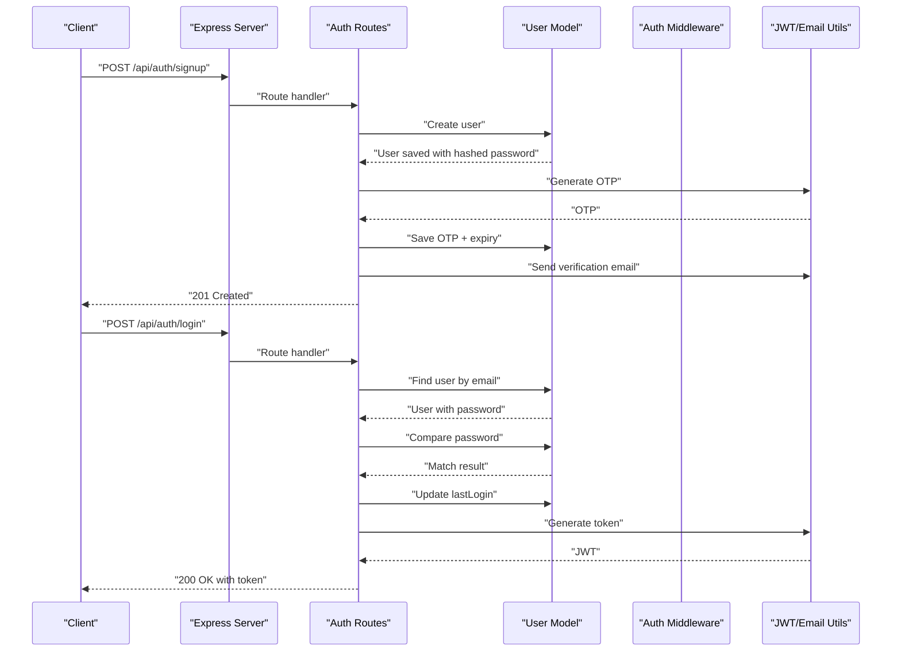
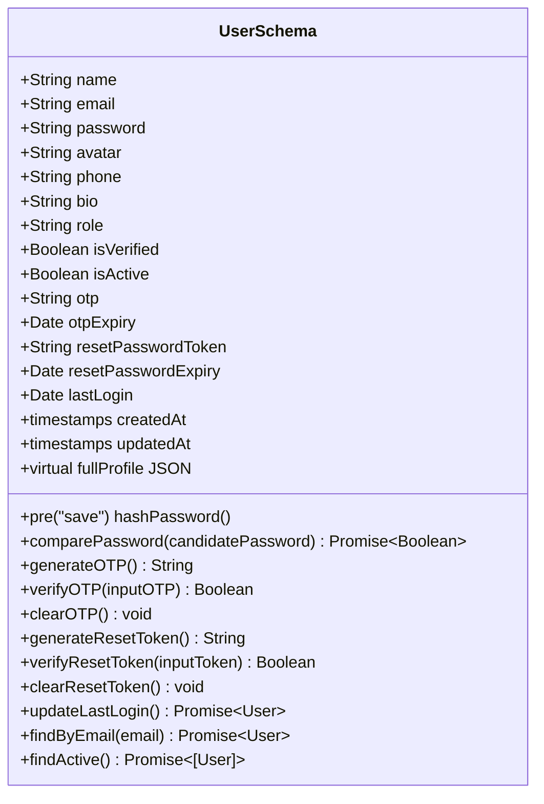
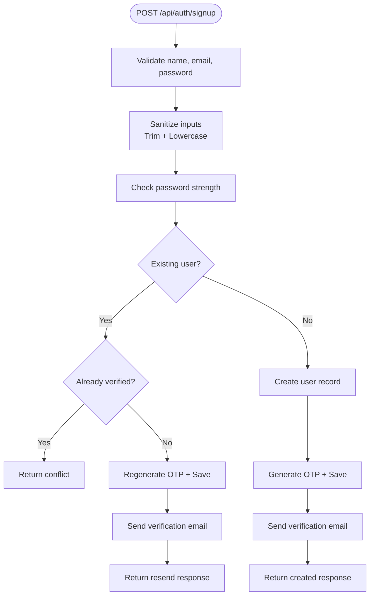
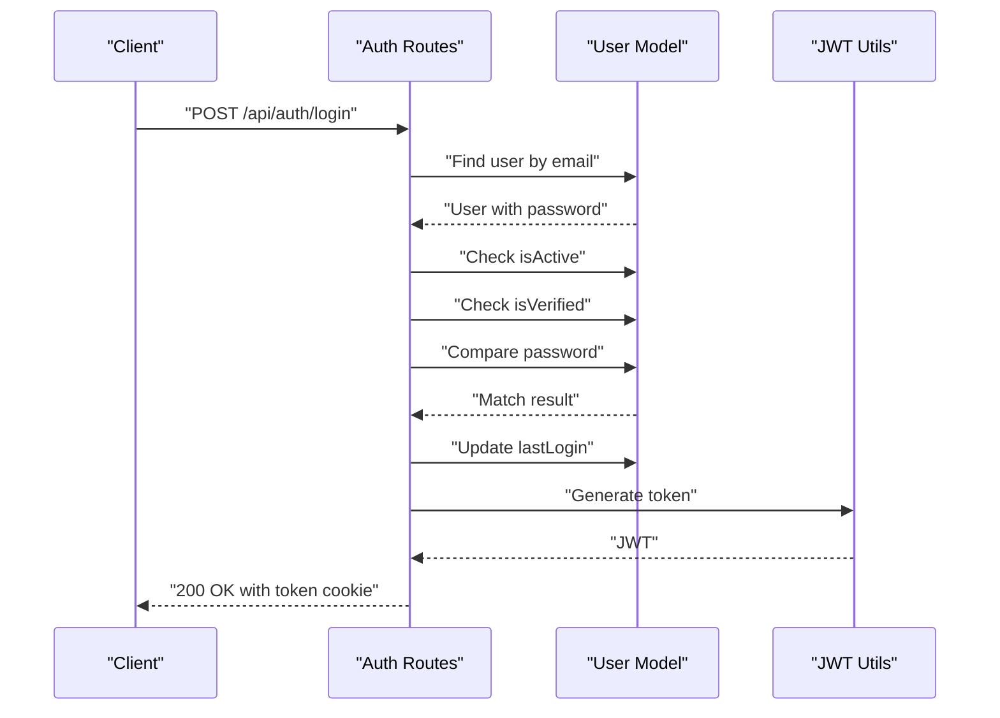
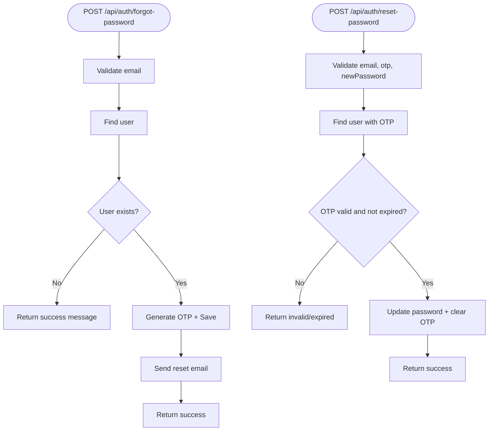
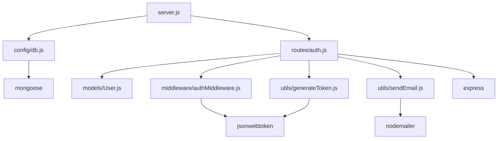

# Database Schema & Models

<cite>
**Referenced Files in This Document**
- [User.js](file://backend/models/User.js)
- [db.js](file://backend/config/db.js)
- [auth.js](file://backend/routes/auth.js)
- [authMiddleware.js](file://backend/middleware/authMiddleware.js)
- [generateToken.js](file://backend/utils/generateToken.js)
- [sendEmail.js](file://backend/utils/sendEmail.js)
- [server.js](file://backend/server.js)
- [package.json](file://backend/package.json)
</cite>

## Table of Contents
1. [Introduction](#introduction)
2. [Project Structure](#project-structure)
3. [Core Components](#core-components)
4. [Architecture Overview](#architecture-overview)
5. [Detailed Component Analysis](#detailed-component-analysis)
6. [Dependency Analysis](#dependency-analysis)
7. [Performance Considerations](#performance-considerations)
8. [Troubleshooting Guide](#troubleshooting-guide)
9. [Conclusion](#conclusion)
10. [Appendices](#appendices)

## Introduction
This document provides comprehensive data model documentation for the MongoDB schema design used in the authentication system. It details the User model structure, field definitions, validation rules, constraints, indexes, and performance considerations. It also covers database connection configuration, connection pooling, error handling, and security/access control mechanisms. Sample data examples, query patterns, and data lifecycle management are included to guide developers and operators.

## Project Structure
The authentication-related components are organized into clear layers:
- Models: Define the User schema and methods
- Config: Database connection and pool configuration
- Routes: Authentication endpoints and rate limiting
- Middleware: Authentication and authorization guards
- Utils: JWT token generation and email sending
- Server: Application bootstrap, environment validation, and middleware stack

**Diagram sources**
- [server.js](file://backend/server.js#L1-L99)
- [db.js](file://backend/config/db.js#L1-L43)
- [User.js](file://backend/models/User.js#L1-L208)
- [auth.js](file://backend/routes/auth.js#L1-L715)
- [authMiddleware.js](file://backend/middleware/authMiddleware.js#L1-L132)
- [generateToken.js](file://backend/utils/generateToken.js#L1-L18)
- [sendEmail.js](file://backend/utils/sendEmail.js#L1-L159)

**Section sources**
- [server.js](file://backend/server.js#L1-L99)
- [package.json](file://backend/package.json#L1-L36)

## Core Components
This section documents the User model and related components that collectively define the data schema and authentication flow.

### User Model Schema
The User model defines the MongoDB collection structure with strict validation, indexes, and helper methods for authentication and lifecycle management.

Key schema attributes:
- Basic Information
  - name: String, required, trimmed, length bounds
  - email: String, required, unique, lowercased, trimmed, validated format
  - password: String, required, hashed on save, hidden from queries
- Profile
  - avatar: String, default placeholder URL
  - phone: String, optional, validated numeric format
  - bio: String, optional, length-limited
- Role and Status
  - role: Enumerated role with default
  - isVerified: Boolean flag for email verification
  - isActive: Boolean flag for account activation
- Security Tokens
  - otp, otpExpiry: Temporary verification token and expiry
  - resetPasswordToken, resetPasswordExpiry: Password reset token and expiry
- Metadata
  - lastLogin: Timestamp of last login
  - timestamps: createdAt, updatedAt managed automatically

Indexes:
- email: unique index created by unique constraint
- createdAt: descending index
- isVerified: ascending index

Pre-save hooks:
- Hash password using bcrypt with configurable salt rounds

Instance methods:
- comparePassword: verify candidate password against stored hash
- generateOTP / verifyOTP / clearOTP: manage email verification tokens
- generateResetToken / verifyResetToken / clearResetToken: manage password reset tokens
- updateLastLogin: update lastLogin timestamp without validation

Static methods:
- findByEmail: find user including password field
- findActive: query active users

Virtuals:
- fullProfile: JSON representation of user profile for serialization

**Section sources**
- [User.js](file://backend/models/User.js#L5-L83)
- [User.js](file://backend/models/User.js#L86-L90)
- [User.js](file://backend/models/User.js#L93-L103)
- [User.js](file://backend/models/User.js#L108-L177)
- [User.js](file://backend/models/User.js#L182-L188)
- [User.js](file://backend/models/User.js#L191-L206)

### Database Connection and Pooling
The database connection is configured with connection pooling and timeout settings for reliability and performance.

Connection configuration:
- maxPoolSize: 10 concurrent connections
- serverSelectionTimeoutMS: 5000 ms selection timeout
- socketTimeoutMS: 45000 ms socket timeout

Connection event handlers:
- disconnected: logs disconnection
- error: logs errors
- reconnected: logs reconnection

Error handling:
- Logs credential and network-related errors
- Exits process on connection failure

**Section sources**
- [db.js](file://backend/config/db.js#L4-L11)
- [db.js](file://backend/config/db.js#L16-L27)
- [db.js](file://backend/config/db.js#L29-L40)

### Authentication and Authorization Middleware
Authentication middleware enforces token-based authentication and role-based authorization.

Authentication flow:
- Extract token from Authorization header or cookie
- Verify JWT signature and decode payload
- Load user excluding password field
- Validate user is verified and active
- Attach user object to request

Authorization helpers:
- authorize: role-based guard for protected routes
- optionalAuth: allows unauthenticated access when token absent

**Section sources**
- [authMiddleware.js](file://backend/middleware/authMiddleware.js#L8-L79)
- [authMiddleware.js](file://backend/middleware/authMiddleware.js#L84-L102)
- [authMiddleware.js](file://backend/middleware/authMiddleware.js#L107-L130)

### Token Generation and Email Utilities
Token generation:
- JWT includes user ID and role with configurable expiration
- Issuer set for token provenance

Email utilities:
- Nodemailer transport configured for Gmail SMTP
- Email templates for verification, password reset, and welcome
- Connection verification on startup

**Section sources**
- [generateToken.js](file://backend/utils/generateToken.js#L4-L16)
- [sendEmail.js](file://backend/utils/sendEmail.js#L7-L31)
- [sendEmail.js](file://backend/utils/sendEmail.js#L51-L86)
- [sendEmail.js](file://backend/utils/sendEmail.js#L91-L123)
- [sendEmail.js](file://backend/utils/sendEmail.js#L128-L157)

## Architecture Overview
The authentication system integrates Express routes, Mongoose models, middleware, and utilities to provide a secure and scalable user lifecycle.

**Diagram sources**
- [auth.js](file://backend/routes/auth.js#L81-L178)
- [auth.js](file://backend/routes/auth.js#L300-L377)
- [User.js](file://backend/models/User.js#L108-L111)
- [User.js](file://backend/models/User.js#L174-L177)
- [generateToken.js](file://backend/utils/generateToken.js#L4-L16)

## Detailed Component Analysis

### User Model Class Diagram
The User model encapsulates schema definition, indexes, hooks, and methods.

**Diagram sources**
- [User.js](file://backend/models/User.js#L5-L83)
- [User.js](file://backend/models/User.js#L93-L103)
- [User.js](file://backend/models/User.js#L108-L177)
- [User.js](file://backend/models/User.js#L182-L188)
- [User.js](file://backend/models/User.js#L191-L206)

### Authentication Flow: Signup
The signup endpoint validates inputs, checks for existing users, creates a new user, generates and stores an OTP, and sends a verification email.

**Diagram sources**
- [auth.js](file://backend/routes/auth.js#L81-L178)
- [User.js](file://backend/models/User.js#L114-L121)

### Authentication Flow: Login
The login endpoint authenticates users, verifies email and activity status, updates last login, and issues a JWT cookie.

**Diagram sources**
- [auth.js](file://backend/routes/auth.js#L300-L377)
- [User.js](file://backend/models/User.js#L174-L177)
- [generateToken.js](file://backend/utils/generateToken.js#L4-L16)

### Password Reset Lifecycle
The password reset flow uses OTP-based verification for security.

**Diagram sources**
- [auth.js](file://backend/routes/auth.js#L382-L432)
- [auth.js](file://backend/routes/auth.js#L437-L507)
- [User.js](file://backend/models/User.js#L142-L152)
- [User.js](file://backend/models/User.js#L155-L165)

## Dependency Analysis
The system relies on several key libraries and their interactions.

**Diagram sources**
- [server.js](file://backend/server.js#L1-L99)
- [db.js](file://backend/config/db.js#L1-L43)
- [auth.js](file://backend/routes/auth.js#L1-L715)
- [User.js](file://backend/models/User.js#L1-L208)
- [authMiddleware.js](file://backend/middleware/authMiddleware.js#L1-L132)
- [generateToken.js](file://backend/utils/generateToken.js#L1-L18)
- [sendEmail.js](file://backend/utils/sendEmail.js#L1-L159)
- [package.json](file://backend/package.json#L18-L31)

**Section sources**
- [package.json](file://backend/package.json#L18-L31)

## Performance Considerations
- Connection Pooling: maxPoolSize controls concurrency; tune based on workload and database capacity.
- Indexes: email unique index, createdAt descending, isVerified ascending optimize common queries.
- Pre-save Hashing: bcrypt cost can be tuned; higher cost increases security but CPU usage.
- Query Selectivity: Use selective fields and indexes to reduce query overhead.
- Rate Limiting: Route-specific limits prevent abuse and reduce load spikes.
- Cookie Security: httpOnly, secure, sameSite mitigate XSS and CSRF risks.

[No sources needed since this section provides general guidance]

## Troubleshooting Guide
Common issues and resolutions:
- Database Connection Failures
  - Credential errors: verify MONGODB_URI and credentials
  - Network errors: check URI and connectivity
  - Timeout errors: adjust serverSelectionTimeoutMS/socketTimeoutMS
- Authentication Errors
  - Invalid token: regenerate token or handle expired token
  - User not found: ensure user exists and is verified
  - Password mismatch: confirm password hashing and comparison
- Email Delivery Issues
  - Transport configuration: verify EMAIL_USER and EMAIL_PASS
  - TLS/SMTP settings: ensure correct host/port/service
- Rate Limiting
  - Adjust windowMs and max for signup/login/OTP endpoints
- Environment Variables
  - Missing required variables: MONGODB_URI, JWT_SECRET, FRONTEND_URL

**Section sources**
- [db.js](file://backend/config/db.js#L29-L40)
- [authMiddleware.js](file://backend/middleware/authMiddleware.js#L60-L78)
- [sendEmail.js](file://backend/utils/sendEmail.js#L24-L31)
- [server.js](file://backend/server.js#L17-L23)

## Conclusion
The User model and associated components provide a robust foundation for user registration, authentication, and profile management. The schema enforces strong validation, includes security tokens for verification and resets, and leverages indexes and connection pooling for performance. The middleware and utilities ensure secure token handling and reliable email delivery. Proper environment configuration and rate limiting further enhance system stability and security.

[No sources needed since this section summarizes without analyzing specific files]

## Appendices

### Field Definitions and Constraints
- name: String, required, trimmed, min 2, max 50
- email: String, required, unique, lowercase, trimmed, email format
- password: String, required, min 6, hashed on save, hidden from queries
- avatar: String, default placeholder URL
- phone: String, optional, numeric format validation
- bio: String, optional, max 200
- role: Enum ['user','admin','moderator'], default 'user'
- isVerified: Boolean, default false
- isActive: Boolean, default true
- otp, otpExpiry: String, Date, select:false
- resetPasswordToken, resetPasswordExpiry: String, Date, select:false
- lastLogin: Date
- timestamps: createdAt, updatedAt

**Section sources**
- [User.js](file://backend/models/User.js#L7-L81)

### Sample Data Examples
- Minimal User Record
  - name: "John Doe"
  - email: "john.doe@example.com"
  - password: "<hashed>"
  - role: "user"
  - isVerified: false
  - isActive: true
- Verified User Record
  - isVerified: true
  - lastLogin: "2025-01-01T00:00:00Z"
- Admin User Record
  - role: "admin"

[No sources needed since this section provides general examples]

### Query Patterns
- Find by email: findOne({ email })
- Find active users: find({ isActive: true })
- Update profile: findByIdAndUpdate with runValidators
- Change password: findById with password, compare, then save
- Verify OTP: findOne with otp fields, verifyOTP, then save

**Section sources**
- [User.js](file://backend/models/User.js#L182-L188)
- [auth.js](file://backend/routes/auth.js#L581-L585)
- [auth.js](file://backend/routes/auth.js#L632-L645)

### Data Lifecycle Management
- Registration: create user, generate OTP, send verification email
- Verification: verify OTP, mark isVerified true, clear OTP
- Login: authenticate, update lastLogin, issue token
- Password Reset: generate OTP, verify OTP, update password
- Deactivation: set isActive false via admin controls

**Section sources**
- [auth.js](file://backend/routes/auth.js#L150-L168)
- [auth.js](file://backend/routes/auth.js#L183-L241)
- [auth.js](file://backend/routes/auth.js#L300-L377)
- [auth.js](file://backend/routes/auth.js#L382-L507)

### Security and Access Control
- Password Security: bcrypt hashing, hidden password field, strong password validation
- Token Security: JWT with httpOnly, secure, sameSite cookies; role included in token
- Email Security: OTP-based verification and reset, expirable tokens
- Middleware: protect, authorize, optionalAuth enforce authentication and roles
- Rate Limiting: per-route limits to prevent brute force attacks

**Section sources**
- [User.js](file://backend/models/User.js#L25-L30)
- [auth.js](file://backend/routes/auth.js#L49-L76)
- [authMiddleware.js](file://backend/middleware/authMiddleware.js#L84-L102)
- [auth.js](file://backend/routes/auth.js#L14-L33)