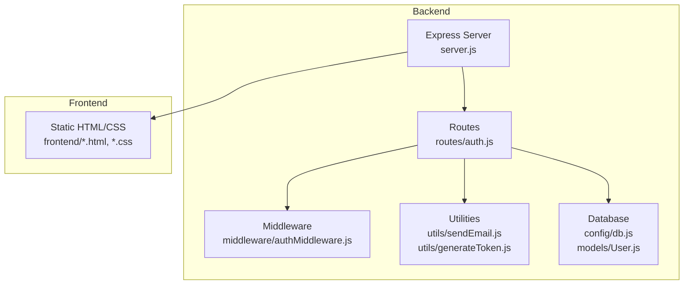
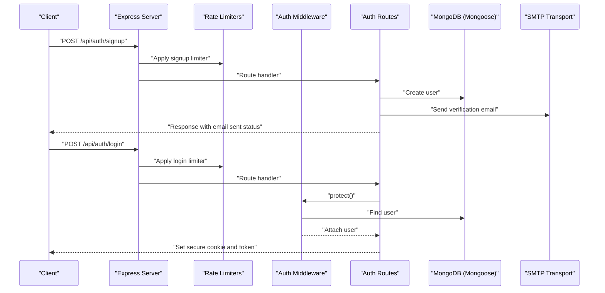
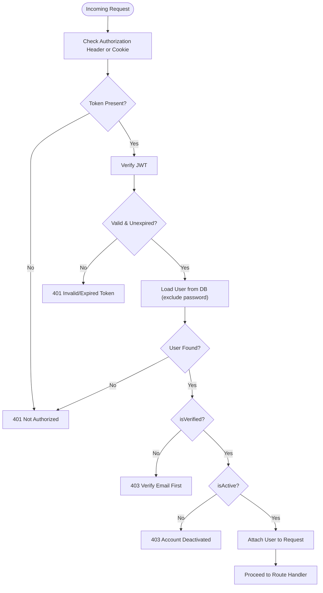
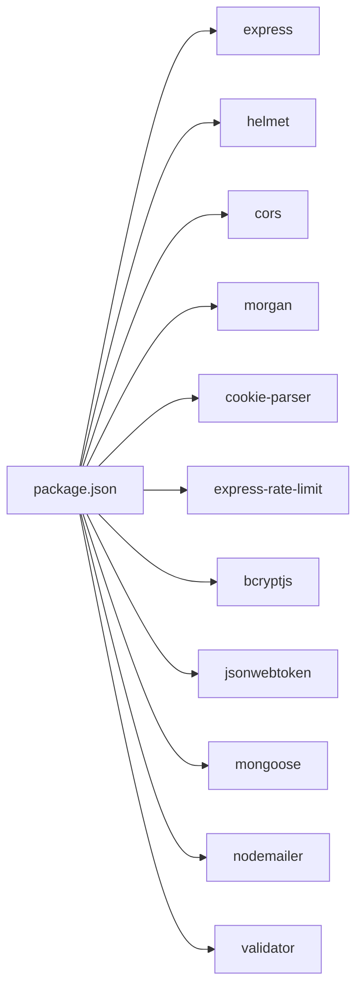

# Deployment Guide

<cite>
**Referenced Files in This Document**
- [backend/package.json](file://backend/package.json)
- [backend/server.js](file://backend/server.js)
- [backend/config/db.js](file://backend/config/db.js)
- [backend/utils/sendEmail.js](file://backend/utils/sendEmail.js)
- [backend/middleware/authMiddleware.js](file://backend/middleware/authMiddleware.js)
- [backend/routes/auth.js](file://backend/routes/auth.js)
- [backend/models/User.js](file://backend/models/User.js)
- [backend/utils/generateToken.js](file://backend/utils/generateToken.js)
</cite>

## Table of Contents
1. [Introduction](#introduction)
2. [Project Structure](#project-structure)
3. [Core Components](#core-components)
4. [Architecture Overview](#architecture-overview)
5. [Detailed Component Analysis](#detailed-component-analysis)
6. [Dependency Analysis](#dependency-analysis)
7. [Performance Considerations](#performance-considerations)
8. [Troubleshooting Guide](#troubleshooting-guide)
9. [Conclusion](#conclusion)
10. [Appendices](#appendices)

## Introduction
This guide provides production-grade deployment and operational procedures for the Quiz Application backend. It covers environment configuration, database deployment, email service setup, containerization options, reverse proxy and load balancing, monitoring and logging, performance optimization, security hardening, backup and disaster recovery, scaling and capacity planning, and maintenance procedures.

## Project Structure
The backend is a Node.js/Express application with integrated frontend static assets. Key runtime characteristics:
- Express server with Helmet, CORS, Morgan, cookie parser, rate limiting, and static file serving
- MongoDB via Mongoose with connection pooling and event logging
- JWT-based authentication with cookie-based sessions
- Nodemailer integration for email notifications
- Authentication endpoints for sign-up, email verification, login, password reset, and profile management

**Diagram sources**
- [backend/server.js](file://backend/server.js#L25-L99)
- [backend/routes/auth.js](file://backend/routes/auth.js#L1-L715)
- [backend/middleware/authMiddleware.js](file://backend/middleware/authMiddleware.js#L1-L132)
- [backend/utils/sendEmail.js](file://backend/utils/sendEmail.js#L1-L159)
- [backend/utils/generateToken.js](file://backend/utils/generateToken.js#L1-L18)
- [backend/config/db.js](file://backend/config/db.js#L1-L43)
- [backend/models/User.js](file://backend/models/User.js#L1-L208)

**Section sources**
- [backend/server.js](file://backend/server.js#L1-L99)
- [backend/package.json](file://backend/package.json#L1-L36)

## Core Components
- Environment validation enforces required variables for production readiness.
- Security middleware stack includes CSP bypass for inline scripts and COEP adjustments, strict cookies, and rate limiting.
- Database connection with pooling and robust error handling.
- Email transport configured for a third-party SMTP service with startup verification.
- Authentication middleware supports bearer tokens and cookies, with role-based authorization helpers.
- Authentication routes implement comprehensive flows with per-route rate limiting and input sanitization.

**Section sources**
- [backend/server.js](file://backend/server.js#L15-L24)
- [backend/server.js](file://backend/server.js#L32-L48)
- [backend/server.js](file://backend/server.js#L58-L64)
- [backend/config/db.js](file://backend/config/db.js#L4-L41)
- [backend/utils/sendEmail.js](file://backend/utils/sendEmail.js#L7-L31)
- [backend/middleware/authMiddleware.js](file://backend/middleware/authMiddleware.js#L8-L79)
- [backend/routes/auth.js](file://backend/routes/auth.js#L14-L33)

## Architecture Overview
The backend exposes REST endpoints under /api/auth and serves the frontend statically. Authentication relies on signed JWTs stored in secure, same-site cookies. Emails are dispatched via Nodemailer to a configured SMTP provider.

**Diagram sources**
- [backend/server.js](file://backend/server.js#L58-L75)
- [backend/routes/auth.js](file://backend/routes/auth.js#L81-L178)
- [backend/middleware/authMiddleware.js](file://backend/middleware/authMiddleware.js#L8-L79)
- [backend/utils/sendEmail.js](file://backend/utils/sendEmail.js#L51-L86)
- [backend/config/db.js](file://backend/config/db.js#L4-L41)

## Detailed Component Analysis

### Environment Configuration
Production requires the following environment variables:
- MONGODB_URI: MongoDB connection string
- JWT_SECRET: Secret for signing JWTs
- FRONTEND_URL: Origin of the frontend for CORS
- EMAIL_USER: SMTP username
- EMAIL_PASS: SMTP password or app-specific token
- NODE_ENV: Set to production for secure cookie behavior

Validation ensures these variables are present before startup.

**Section sources**
- [backend/server.js](file://backend/server.js#L17-L23)
- [backend/server.js](file://backend/server.js#L57-L57)
- [backend/routes/auth.js](file://backend/routes/auth.js#L53-L62)
- [backend/utils/sendEmail.js](file://backend/utils/sendEmail.js#L14-L15)
- [backend/utils/generateToken.js](file://backend/utils/generateToken.js#L10-L10)

### Database Deployment Strategies
- Connection pooling: Configure maxPoolSize and socket timeouts for throughput and responsiveness.
- Monitoring: Leverage Mongoose connection events to detect disconnects, errors, and reconnections.
- High availability: Use a managed MongoDB cluster or replica set behind a single endpoint.
- Backup: Enable automated backups and point-in-time recovery; regularly snapshot collections.
- Maintenance: Schedule index rebuilds and collection compactions during low-traffic windows.

Operational checks:
- Confirm connectivity at startup and handle failures gracefully.
- Log meaningful diagnostics for credential and network errors.

**Section sources**
- [backend/config/db.js](file://backend/config/db.js#L6-L11)
- [backend/config/db.js](file://backend/config/db.js#L17-L27)
- [backend/config/db.js](file://backend/config/db.js#L29-L40)

### Email Service Setup
- Transport: SMTP with TLS enabled; credentials loaded from environment variables.
- Templates: HTML templates for verification, password reset, and welcome emails.
- Delivery: Onboarding actions trigger verification emails; password resets send reset codes.
- Reliability: Verify transport configuration at startup; monitor delivery logs.

Security considerations:
- Use app passwords or OAuth credentials.
- Restrict TLS settings to production-safe defaults.

**Section sources**
- [backend/utils/sendEmail.js](file://backend/utils/sendEmail.js#L7-L22)
- [backend/utils/sendEmail.js](file://backend/utils/sendEmail.js#L51-L86)
- [backend/utils/sendEmail.js](file://backend/utils/sendEmail.js#L91-L123)
- [backend/utils/sendEmail.js](file://backend/utils/sendEmail.js#L128-L157)

### Authentication and Authorization
- Token generation includes user ID and role; configurable expiry.
- Cookie policy: httpOnly, secure in production, sameSite strict, 7-day expiry.
- Protection middleware validates tokens, verifies email and activity status, and attaches user context.
- Role-based authorization helper restricts routes by user roles.
- Optional auth allows public/private hybrid routes.

**Diagram sources**
- [backend/middleware/authMiddleware.js](file://backend/middleware/authMiddleware.js#L8-L79)
- [backend/models/User.js](file://backend/models/User.js#L61-L69)

**Section sources**
- [backend/utils/generateToken.js](file://backend/utils/generateToken.js#L4-L16)
- [backend/routes/auth.js](file://backend/routes/auth.js#L49-L76)
- [backend/middleware/authMiddleware.js](file://backend/middleware/authMiddleware.js#L84-L102)
- [backend/middleware/authMiddleware.js](file://backend/middleware/authMiddleware.js#L107-L130)
- [backend/models/User.js](file://backend/models/User.js#L61-L69)

### Rate Limiting and Input Validation
- Global API limiter protects against abuse.
- Per-endpoint limiters:
  - Signup: bounded attempts per hour
  - Login: bounded attempts per window
  - OTP resend: throttled requests
- Input sanitization and validation for emails, passwords, and profile fields.

**Section sources**
- [backend/server.js](file://backend/server.js#L58-L64)
- [backend/routes/auth.js](file://backend/routes/auth.js#L14-L33)
- [backend/routes/auth.js](file://backend/routes/auth.js#L39-L47)
- [backend/routes/auth.js](file://backend/routes/auth.js#L105-L125)

### Containerization Options
- Build a minimal Node.js image with production dependencies only.
- Copy backend code and install dependencies; set NODE_ENV=production.
- Expose the port defined by PORT (default 5000).
- Mount persistent volumes for application logs and any cache directories if needed.
- Use health checks to probe the application’s readiness and liveness.

[No sources needed since this section provides general guidance]

### Reverse Proxy and Load Balancing
- Place a reverse proxy (e.g., Nginx, Traefik, HAProxy) in front of backend instances.
- Terminate TLS at the proxy; forward HTTP to backend nodes.
- Enable sticky sessions if required, otherwise ensure stateless session handling via cookies and JWT.
- Configure upstream health checks and circuit breakers.
- Set appropriate timeouts and buffer sizes for uploads and streaming.

[No sources needed since this section provides general guidance]

### Monitoring and Logging
- Logging: Use Morgan for HTTP access logs; capture structured JSON logs for centralized logging systems.
- Metrics: Instrument endpoints with latency and error counters; track database connection pool metrics.
- Health checks: Expose a /health endpoint returning status and DB connectivity.
- Alerting: Monitor error rates, response times, memory usage, and database connection failures.

[No sources needed since this section provides general guidance]

### Performance Optimization
- Database:
  - Use connection pooling and tune socket timeouts.
  - Add indexes for frequent queries (e.g., email, verification status).
- Application:
  - Compress responses and cache static assets at the proxy.
  - Tune rate limit windows and thresholds based on traffic patterns.
- CDN: Serve frontend assets via CDN for improved global latency.

**Section sources**
- [backend/config/db.js](file://backend/config/db.js#L8-L11)
- [backend/models/User.js](file://backend/models/User.js#L87-L89)

### Security Hardening
- Secrets management: Store secrets in environment variables or a secret manager.
- Network: Restrict inbound ports; enforce firewall rules.
- Headers: Keep security middleware enabled; review CSP and COEP policies.
- Cookies: Enforce secure, httpOnly, sameSite=strict; adjust for HTTPS-only in production.
- Authentication: Rotate JWT_SECRET; enforce strong password policies; invalidate sessions on logout.
- Email: Use app passwords; avoid sending sensitive data in plaintext.

**Section sources**
- [backend/server.js](file://backend/server.js#L32-L43)
- [backend/server.js](file://backend/server.js#L57-L57)
- [backend/routes/auth.js](file://backend/routes/auth.js#L53-L62)
- [backend/utils/sendEmail.js](file://backend/utils/sendEmail.js#L14-L15)

### Backup and Disaster Recovery
- Database:
  - Automated snapshots and continuous archiving.
  - Regular restore drills to validate backups.
- Application:
  - Versioned artifacts and immutable images.
  - Rollback strategy using blue/green or rolling updates.
- DR Plan:
  - Define RTO/RPO targets.
  - Replicate critical data across regions.
  - Automate failover and alert escalation.

[No sources needed since this section provides general guidance]

### Scaling and Capacity Planning
- Horizontal scaling: Run multiple backend instances behind a load balancer.
- Vertical scaling: Increase CPU/memory for higher concurrency.
- Auto-scaling: Scale based on CPU, memory, or request rate; ensure database can handle increased connections.
- Capacity planning: Track growth trends, peak usage, and resource saturation points.

[No sources needed since this section provides general guidance]

### Maintenance Procedures
- Patch Node.js and dependencies regularly.
- Review and rotate secrets periodically.
- Audit logs and alerts weekly; investigate anomalies.
- Perform database maintenance tasks during scheduled downtime.

[No sources needed since this section provides general guidance]

## Dependency Analysis
Runtime dependencies include Express, Helmet, CORS, Morgan, cookie-parser, rate limiter, bcrypt, JWT, Mongoose, Nodemailer, and validator. These form the backbone of the server, security, authentication, persistence, and communication layers.

**Diagram sources**
- [backend/package.json](file://backend/package.json#L18-L31)

**Section sources**
- [backend/package.json](file://backend/package.json#L18-L31)

## Performance Considerations
- Tune Mongoose connection pool and timeouts for throughput.
- Apply rate limiting judiciously to prevent abuse while maintaining usability.
- Optimize frontend delivery via CDN and caching.
- Monitor slow queries and add indexes as needed.

[No sources needed since this section provides general guidance]

## Troubleshooting Guide
Common issues and resolutions:
- Missing environment variables: Startup fails fast with explicit messages; ensure all required variables are set.
- Database connection failures: Check URI, credentials, and network reachability; inspect error logs for DNS or selection timeout indicators.
- Email delivery failures: Verify SMTP credentials and TLS settings; confirm transport verification at startup.
- Authentication errors: Validate JWT_SECRET, token expiration, and user verification/activity status.
- CORS or cookie problems: Confirm FRONTEND_URL matches origin and cookie flags align with HTTPS and SameSite policy.

**Section sources**
- [backend/server.js](file://backend/server.js#L17-L23)
- [backend/config/db.js](file://backend/config/db.js#L29-L40)
- [backend/utils/sendEmail.js](file://backend/utils/sendEmail.js#L24-L31)
- [backend/middleware/authMiddleware.js](file://backend/middleware/authMiddleware.js#L60-L78)
- [backend/routes/auth.js](file://backend/routes/auth.js#L53-L62)

## Conclusion
This guide consolidates production deployment practices for the Quiz Application backend. By enforcing environment validation, securing authentication and communications, optimizing database and application performance, and establishing robust monitoring, backups, and scaling strategies, you can operate a reliable and secure platform.

## Appendices

### Environment Variables Reference
- MONGODB_URI: MongoDB connection string
- JWT_SECRET: Secret for signing JWTs
- FRONTEND_URL: Origin for CORS
- EMAIL_USER: SMTP username
- EMAIL_PASS: SMTP password or app-specific token
- NODE_ENV: production for secure cookie behavior
- PORT: Listening port (default 5000)

**Section sources**
- [backend/server.js](file://backend/server.js#L17-L23)
- [backend/server.js](file://backend/server.js#L91-L91)
- [backend/routes/auth.js](file://backend/routes/auth.js#L53-L62)
- [backend/utils/sendEmail.js](file://backend/utils/sendEmail.js#L14-L15)
- [backend/utils/generateToken.js](file://backend/utils/generateToken.js#L10-L10)