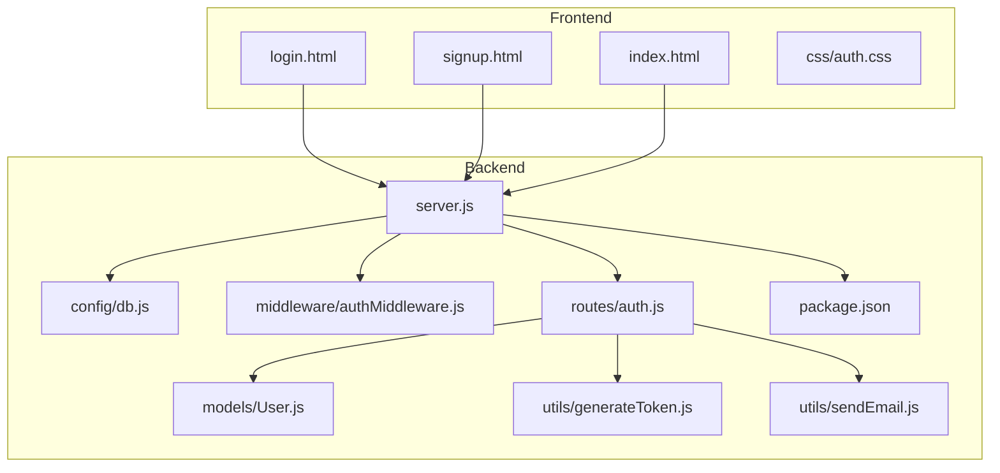
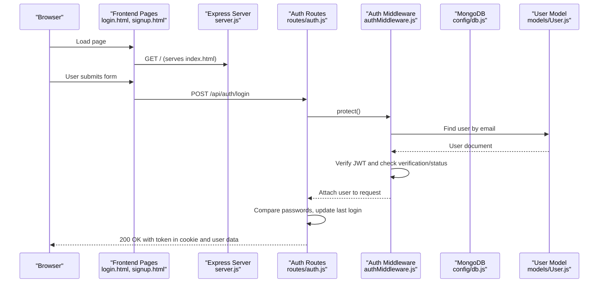
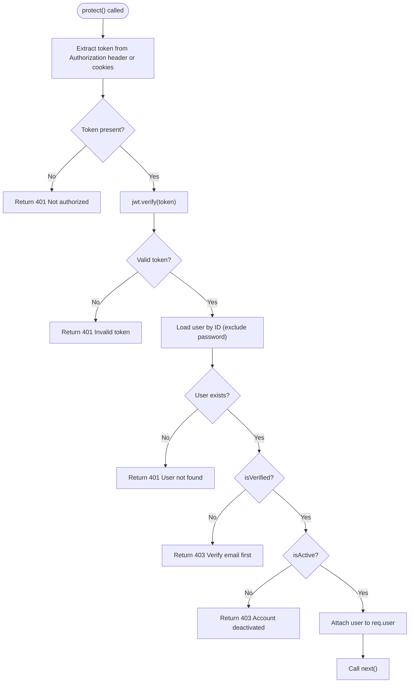
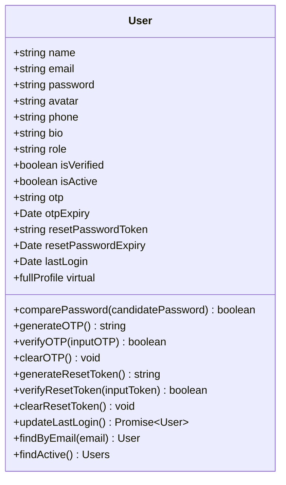
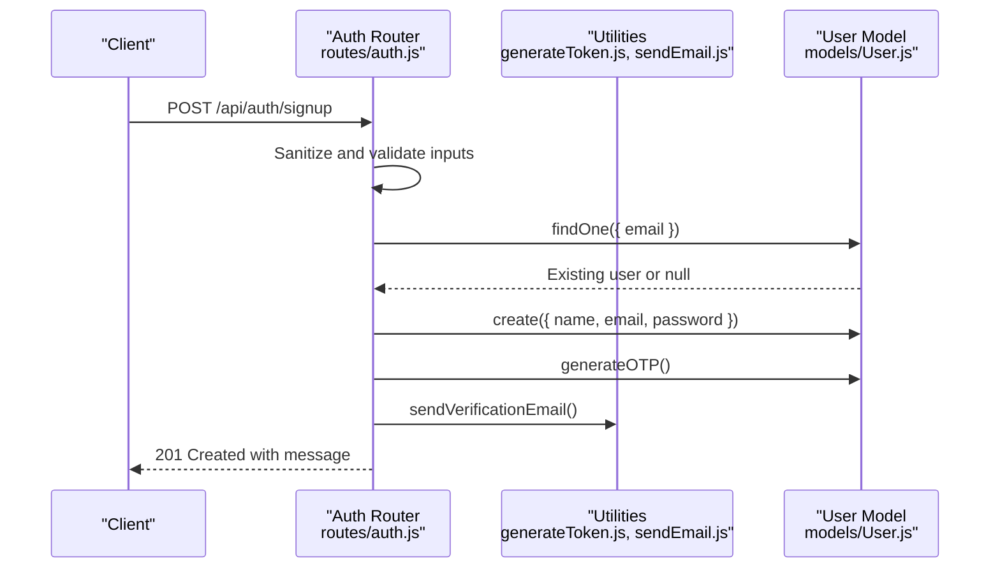
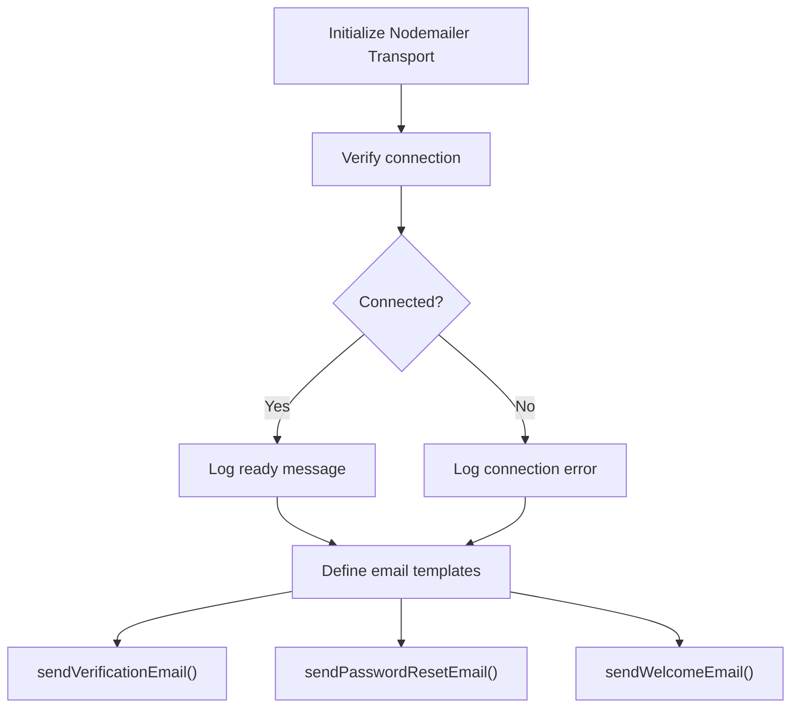
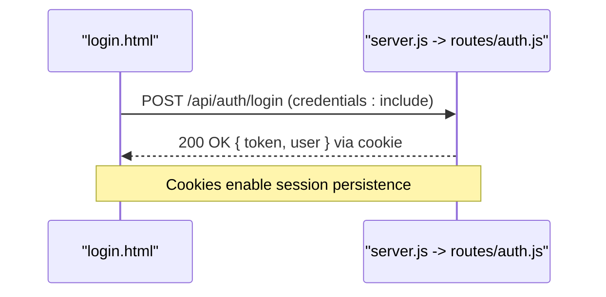
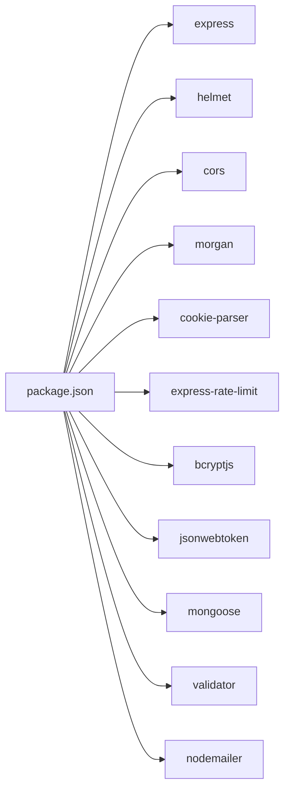

# Development Guidelines

<cite>
**Referenced Files in This Document**
- [backend/package.json](file://backend/package.json)
- [backend/server.js](file://backend/server.js)
- [backend/config/db.js](file://backend/config/db.js)
- [backend/middleware/authMiddleware.js](file://backend/middleware/authMiddleware.js)
- [backend/models/User.js](file://backend/models/User.js)
- [backend/routes/auth.js](file://backend/routes/auth.js)
- [backend/utils/generateToken.js](file://backend/utils/generateToken.js)
- [backend/utils/sendEmail.js](file://backend/utils/sendEmail.js)
- [frontend/index.html](file://frontend/index.html)
- [frontend/login.html](file://frontend/login.html)
- [frontend/signup.html](file://frontend/signup.html)
- [frontend/css/auth.css](file://frontend/css/auth.css)
</cite>

## Table of Contents
1. [Introduction](#introduction)
2. [Project Structure](#project-structure)
3. [Core Components](#core-components)
4. [Architecture Overview](#architecture-overview)
5. [Detailed Component Analysis](#detailed-component-analysis)
6. [Dependency Analysis](#dependency-analysis)
7. [Performance Considerations](#performance-considerations)
8. [Troubleshooting Guide](#troubleshooting-guide)
9. [Development Workflow](#development-workflow)
10. [Contribution Standards](#contribution-standards)
11. [Build and Deployment](#build-and-deployment)
12. [Continuous Integration](#continuous-integration)
13. [Conclusion](#conclusion)

## Introduction
This document provides comprehensive development guidelines for the quiz application. It covers code organization, best practices, contribution standards, development workflow, debugging, logging, error handling, extension guidelines, and deployment considerations. The project follows a layered backend architecture with Express.js and a separate frontend folder containing static assets and HTML pages.

## Project Structure
The repository is organized into two primary areas:
- backend: Node.js/Express server, database configuration, models, routes, middleware, and utilities
- frontend: Static HTML pages, CSS stylesheets, and associated assets

**Diagram sources**
- [backend/server.js](file://backend/server.js#L1-L99)
- [backend/config/db.js](file://backend/config/db.js#L1-L43)
- [backend/middleware/authMiddleware.js](file://backend/middleware/authMiddleware.js#L1-L132)
- [backend/models/User.js](file://backend/models/User.js#L1-L208)
- [backend/routes/auth.js](file://backend/routes/auth.js#L1-L715)
- [backend/utils/generateToken.js](file://backend/utils/generateToken.js#L1-L18)
- [backend/utils/sendEmail.js](file://backend/utils/sendEmail.js#L1-L159)
- [frontend/index.html](file://frontend/index.html#L1-L200)
- [frontend/login.html](file://frontend/login.html#L1-L200)
- [frontend/signup.html](file://frontend/signup.html#L1-L200)
- [frontend/css/auth.css](file://frontend/css/auth.css#L1-L200)

**Section sources**
- [backend/server.js](file://backend/server.js#L1-L99)
- [backend/package.json](file://backend/package.json#L1-L36)

## Core Components
- Server bootstrap and middleware pipeline
- Database connection and event logging
- Authentication middleware with JWT and cookie-based sessions
- User model with validation, hashing, and OTP/reset token utilities
- Authentication routes for signup, login, verification, password reset, profile updates, and logout
- Token generation utility and email sending utilities

Key conventions observed:
- Layered architecture with clear separation of concerns
- Environment validation at startup
- Centralized error handling via a global error handler
- Rate limiting per-route for security
- Static file serving for frontend assets

**Section sources**
- [backend/server.js](file://backend/server.js#L1-L99)
- [backend/config/db.js](file://backend/config/db.js#L1-L43)
- [backend/middleware/authMiddleware.js](file://backend/middleware/authMiddleware.js#L1-L132)
- [backend/models/User.js](file://backend/models/User.js#L1-L208)
- [backend/routes/auth.js](file://backend/routes/auth.js#L1-L715)
- [backend/utils/generateToken.js](file://backend/utils/generateToken.js#L1-L18)
- [backend/utils/sendEmail.js](file://backend/utils/sendEmail.js#L1-L159)

## Architecture Overview
The system integrates a Node.js backend with an Express server that serves both API endpoints and static frontend files. The frontend communicates with the backend via fetch requests with credentials enabled for cookie-based authentication.

**Diagram sources**
- [frontend/login.html](file://frontend/login.html#L164-L200)
- [backend/server.js](file://backend/server.js#L70-L75)
- [backend/routes/auth.js](file://backend/routes/auth.js#L299-L377)
- [backend/middleware/authMiddleware.js](file://backend/middleware/authMiddleware.js#L8-L79)
- [backend/config/db.js](file://backend/config/db.js#L1-L43)
- [backend/models/User.js](file://backend/models/User.js#L1-L208)

## Detailed Component Analysis

### Authentication Middleware
The middleware enforces authentication via JWT tokens received from headers or cookies, verifies user existence and verification status, and supports optional auth for hybrid routes.

**Diagram sources**
- [backend/middleware/authMiddleware.js](file://backend/middleware/authMiddleware.js#L8-L79)

**Section sources**
- [backend/middleware/authMiddleware.js](file://backend/middleware/authMiddleware.js#L1-L132)

### User Model
The User model defines schema fields, indexes, pre-save hooks for password hashing, and methods for OTP generation/verification, password reset tokens, and last login updates.

**Diagram sources**
- [backend/models/User.js](file://backend/models/User.js#L5-L208)

**Section sources**
- [backend/models/User.js](file://backend/models/User.js#L1-L208)

### Authentication Routes
The auth routes implement signup, email verification, resend OTP, login, forgot password, reset password, get current user, update profile, change password, logout, and refresh token. Each route includes input sanitization, validation, rate limiting, and appropriate error handling.

**Diagram sources**
- [backend/routes/auth.js](file://backend/routes/auth.js#L81-L178)
- [backend/utils/generateToken.js](file://backend/utils/generateToken.js#L1-L18)
- [backend/utils/sendEmail.js](file://backend/utils/sendEmail.js#L51-L86)
- [backend/models/User.js](file://backend/models/User.js#L114-L140)

**Section sources**
- [backend/routes/auth.js](file://backend/routes/auth.js#L1-L715)

### Email Utilities
Email utilities configure a Nodemailer transport, verify connectivity, and provide functions to send verification, password reset, and welcome emails with styled HTML templates.

**Diagram sources**
- [backend/utils/sendEmail.js](file://backend/utils/sendEmail.js#L7-L31)
- [backend/utils/sendEmail.js](file://backend/utils/sendEmail.js#L51-L157)

**Section sources**
- [backend/utils/sendEmail.js](file://backend/utils/sendEmail.js#L1-L159)

### Frontend Integration
Frontend pages (login, signup, index) communicate with backend APIs using fetch with credentials enabled. They implement client-side validation, loading states, and toast notifications.

**Diagram sources**
- [frontend/login.html](file://frontend/login.html#L180-L188)
- [backend/server.js](file://backend/server.js#L70-L75)
- [backend/routes/auth.js](file://backend/routes/auth.js#L299-L377)

**Section sources**
- [frontend/login.html](file://frontend/login.html#L1-L200)
- [frontend/signup.html](file://frontend/signup.html#L1-L200)
- [frontend/index.html](file://frontend/index.html#L1-L200)
- [frontend/css/auth.css](file://frontend/css/auth.css#L1-L200)

## Dependency Analysis
Backend dependencies include Express, Helmet, CORS, Morgan, cookie-parser, rate limiter, bcryptjs, jsonwebtoken, mongoose, validator, and nodemailer. Development dependencies include nodemon.

**Diagram sources**
- [backend/package.json](file://backend/package.json#L18-L34)

**Section sources**
- [backend/package.json](file://backend/package.json#L1-L36)

## Performance Considerations
- Connection pooling and timeouts are configured for MongoDB to improve reliability under load.
- Rate limiting is applied per route to prevent abuse and reduce server strain.
- Static file serving is enabled to serve frontend assets efficiently.
- Logging is environment-aware, enabling verbose logs in development.

Recommendations:
- Monitor database connection events and errors to proactively address connectivity issues.
- Tune rate limit windows and max values based on traffic patterns.
- Consider implementing caching for frequently accessed user profiles.
- Use environment-specific configurations for production deployments.

**Section sources**
- [backend/config/db.js](file://backend/config/db.js#L6-L11)
- [backend/server.js](file://backend/server.js#L59-L64)
- [backend/server.js](file://backend/server.js#L54-L56)

## Troubleshooting Guide
Common issues and resolutions:
- Missing environment variables: The server validates required variables and exits if any are missing. Ensure MONGODB_URI, JWT_SECRET, and FRONTEND_URL are set.
- Database connection failures: Check credentials, network connectivity, and server availability. The connection module logs specific hints for MongoServerError and server selection errors.
- Authentication errors: Verify JWT secret correctness, token expiration, and user verification status. The middleware handles invalid/expired tokens and inactive/deactivated accounts.
- Email delivery issues: Confirm email transport configuration and SMTP settings. The email utility logs connection verification outcomes and errors during sending.

Debugging techniques:
- Enable development logging via Morgan for detailed request/response traces.
- Use console.error for centralized error logging in routes and middleware.
- Validate frontend fetch calls with credentials enabled for cookie-based auth.

**Section sources**
- [backend/server.js](file://backend/server.js#L17-L23)
- [backend/config/db.js](file://backend/config/db.js#L29-L40)
- [backend/middleware/authMiddleware.js](file://backend/middleware/authMiddleware.js#L60-L78)
- [backend/utils/sendEmail.js](file://backend/utils/sendEmail.js#L24-L31)

## Development Workflow
Local setup:
- Install dependencies: npm install
- Start in development mode: npm run dev (uses nodemon for auto-restarts)
- Start in production mode: npm start

Environment configuration:
- Required variables: MONGODB_URI, JWT_SECRET, FRONTEND_URL
- Optional variables: NODE_ENV, PORT, EMAIL_USER, EMAIL_PASS

Testing procedures:
- Manual testing: Use frontend pages to exercise authentication flows.
- API testing: Use curl or Postman to hit endpoints under /api/auth.
- Cookie handling: Ensure credentials: include is used in fetch calls for cross-origin requests with cookies.

Frontend integration:
- The server serves index.html at root and static files from the frontend directory.
- Frontend pages reference the backend base URL conditionally based on hostname.

**Section sources**
- [backend/package.json](file://backend/package.json#L6-L10)
- [backend/server.js](file://backend/server.js#L1-L99)
- [frontend/login.html](file://frontend/login.html#L98-L100)
- [frontend/signup.html](file://frontend/signup.html#L138-L140)

## Contribution Standards
Code organization:
- Keep route handlers focused and delegate to utilities and models.
- Use middleware for cross-cutting concerns like authentication and authorization.
- Place reusable logic in utilities and leverage Mongoose models for data operations.

Naming standards:
- Use descriptive filenames and consistent casing (e.g., auth.js, generateToken.js).
- Group related files by domain (auth routes, user model, auth middleware).

Coding patterns:
- Validate inputs early and return structured error responses.
- Use async/await consistently for database and external service calls.
- Centralize error handling with a global error handler.
- Apply rate limiting per endpoint to mitigate abuse.

Quality assurance:
- Add unit tests for utilities and models.
- Perform integration tests for critical auth flows.
- Use linters and formatters to maintain code consistency.

[No sources needed since this section provides general guidance]

## Build and Deployment
Build process:
- No transpilation or bundling required for backend; deploy server.js directly.
- Frontend is static; ensure the frontend directory is served alongside backend.

Deployment preparation:
- Set production environment variables (NODE_ENV=production, secure cookies).
- Configure CORS origins for production domains.
- Set JWT expiration and secure cookie flags appropriately for HTTPS.

Containerization:
- Package backend and frontend into a single container or separate containers.
- Mount persistent volumes for logs and cache if needed.

Monitoring:
- Enable Morgan in production with combined or production-friendly format.
- Monitor database connection events and error logs.

[No sources needed since this section provides general guidance]

## Continuous Integration
CI considerations:
- Run dependency installation and linting on pull requests.
- Execute tests for backend utilities and models.
- Validate environment variable presence and basic server startup.
- Perform smoke tests against key API endpoints.

Security scanning:
- Scan dependencies for vulnerabilities.
- Enforce secrets detection in CI logs.

[No sources needed since this section provides general guidance]

## Conclusion
This guide consolidates the project’s architecture, conventions, and operational practices. By adhering to the outlined patterns—layered design, robust middleware, validated inputs, centralized error handling, and environment-aware configurations—you can extend functionality safely, maintain code quality, and deploy reliably.