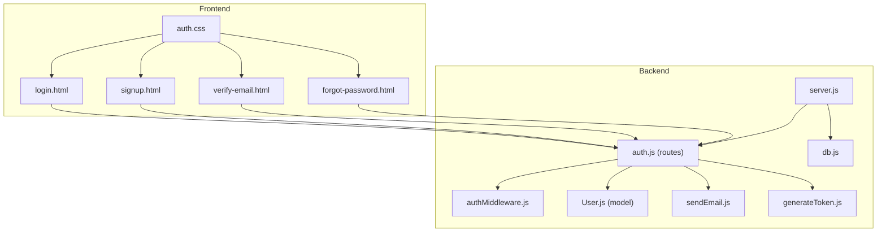
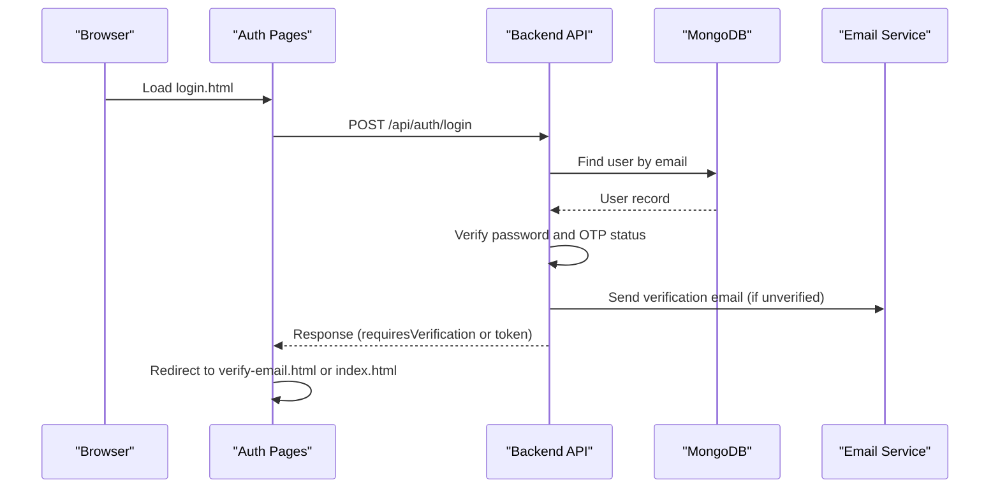
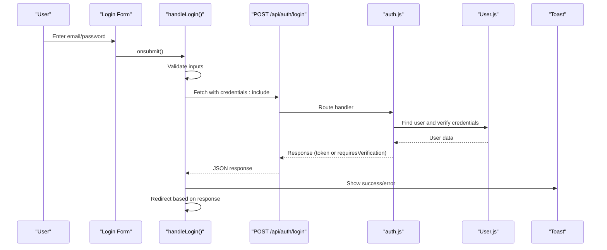
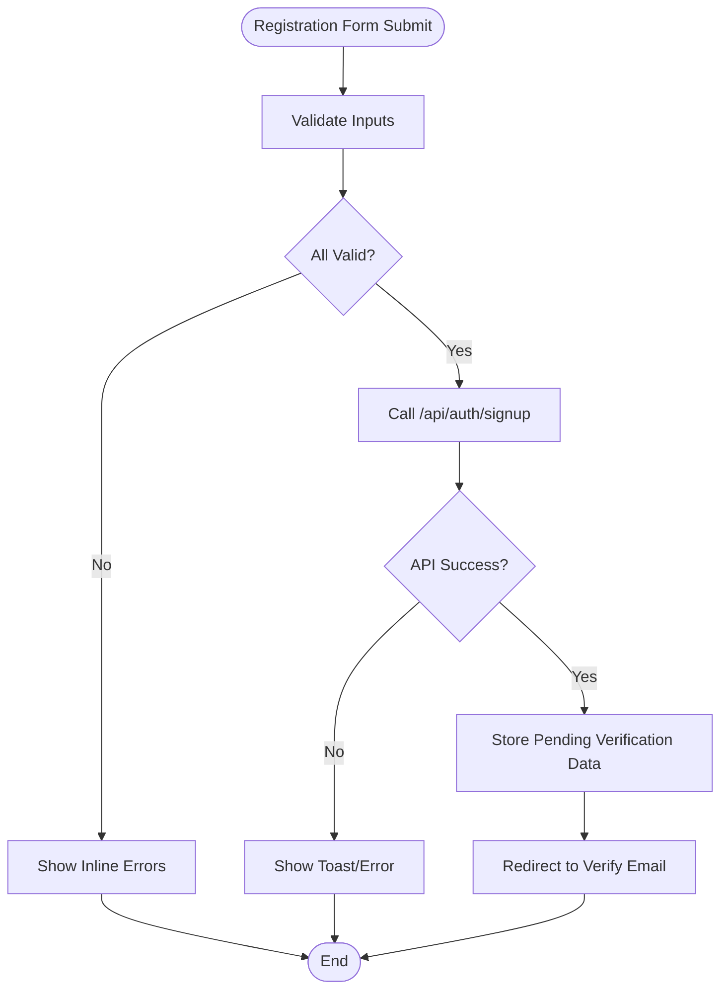
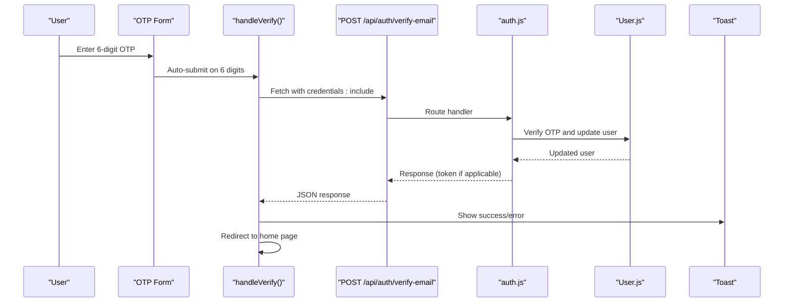
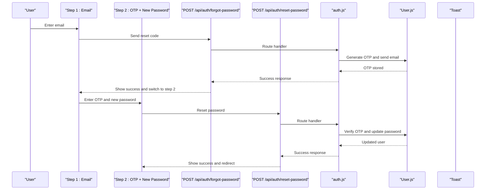
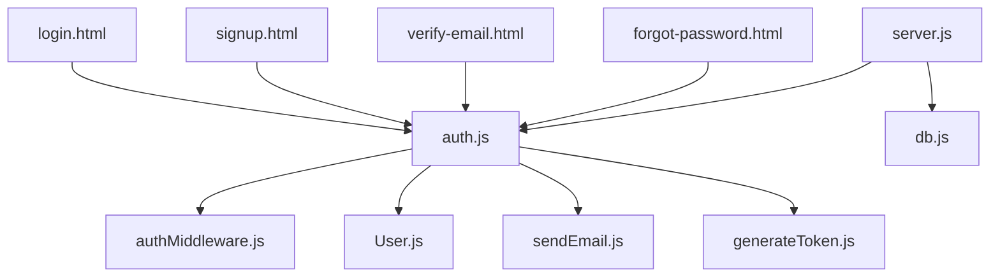

# Authentication Pages

<cite>
**Referenced Files in This Document**
- [login.html](file://frontend/login.html)
- [signup.html](file://frontend/signup.html)
- [verify-email.html](file://frontend/verify-email.html)
- [forgot-password.html](file://frontend/forgot-password.html)
- [auth.css](file://frontend/css/auth.css)
- [auth.js](file://backend/routes/auth.js)
- [authMiddleware.js](file://backend/middleware/authMiddleware.js)
- [User.js](file://backend/models/User.js)
- [sendEmail.js](file://backend/utils/sendEmail.js)
- [generateToken.js](file://backend/utils/generateToken.js)
- [server.js](file://backend/server.js)
- [db.js](file://backend/config/db.js)
</cite>

## Table of Contents
1. [Introduction](#introduction)
2. [Project Structure](#project-structure)
3. [Core Components](#core-components)
4. [Architecture Overview](#architecture-overview)
5. [Detailed Component Analysis](#detailed-component-analysis)
6. [Dependency Analysis](#dependency-analysis)
7. [Performance Considerations](#performance-considerations)
8. [Troubleshooting Guide](#troubleshooting-guide)
9. [Conclusion](#conclusion)

## Introduction
This document provides comprehensive documentation for the authentication pages in the quiz application, covering the login, registration, email verification, and password reset workflows. It explains the HTML structure, form validation logic, user interaction patterns, error handling mechanisms, JavaScript functionality for form submission, API integration, loading states, and toast notifications. It also covers responsive design implementation, accessibility features, cross-browser compatibility, and security considerations for form handling and user data protection.

## Project Structure
The authentication system consists of four frontend pages and a backend API with associated middleware and utilities. The frontend pages share a common stylesheet for consistent styling and responsive behavior. The backend exposes REST endpoints for authentication operations, rate limiting, and protected routes.

**Diagram sources**
- [login.html](file://frontend/login.html#L1-L260)
- [signup.html](file://frontend/signup.html#L1-L341)
- [verify-email.html](file://frontend/verify-email.html#L1-L213)
- [forgot-password.html](file://frontend/forgot-password.html#L1-L448)
- [auth.css](file://frontend/css/auth.css#L1-L552)
- [auth.js](file://backend/routes/auth.js#L1-L715)
- [authMiddleware.js](file://backend/middleware/authMiddleware.js#L1-L132)
- [User.js](file://backend/models/User.js#L1-L208)
- [sendEmail.js](file://backend/utils/sendEmail.js#L1-L159)
- [generateToken.js](file://backend/utils/generateToken.js#L1-L18)
- [server.js](file://backend/server.js#L1-L99)
- [db.js](file://backend/config/db.js#L1-L43)

**Section sources**
- [login.html](file://frontend/login.html#L1-L260)
- [signup.html](file://frontend/signup.html#L1-L341)
- [verify-email.html](file://frontend/verify-email.html#L1-L213)
- [forgot-password.html](file://frontend/forgot-password.html#L1-L448)
- [auth.css](file://frontend/css/auth.css#L1-L552)
- [auth.js](file://backend/routes/auth.js#L1-L715)
- [authMiddleware.js](file://backend/middleware/authMiddleware.js#L1-L132)
- [User.js](file://backend/models/User.js#L1-L208)
- [sendEmail.js](file://backend/utils/sendEmail.js#L1-L159)
- [generateToken.js](file://backend/utils/generateToken.js#L1-L18)
- [server.js](file://backend/server.js#L1-L99)
- [db.js](file://backend/config/db.js#L1-L43)

## Core Components
- Login Page: Handles user authentication, password visibility toggle, form validation, loading states, and redirects based on verification status.
- Registration Page: Manages user sign-up, password strength validation, terms acceptance, and OTP-based email verification flow.
- Email Verification Page: Implements OTP input handling, auto-submission, resend timer, and verification logic.
- Password Reset Page: Provides email-based reset code delivery, OTP verification, new password setting, and success feedback.
- Shared Stylesheet: Defines responsive design, animations, input styling, toast notifications, and OTP input behavior.
- Backend Routes: Implements authentication endpoints, rate limiting, input sanitization, OTP generation/verification, and token issuance.
- Middleware: Protects routes using JWT tokens and enforces verification and activity checks.
- Model: Defines user schema, password hashing, OTP handling, and helper methods.
- Utilities: Email transport configuration and templates for verification, password reset, and welcome emails.
- Server Configuration: CORS setup, cookie handling, static file serving, and environment validation.

**Section sources**
- [login.html](file://frontend/login.html#L1-L260)
- [signup.html](file://frontend/signup.html#L1-L341)
- [verify-email.html](file://frontend/verify-email.html#L1-L213)
- [forgot-password.html](file://frontend/forgot-password.html#L1-L448)
- [auth.css](file://frontend/css/auth.css#L1-L552)
- [auth.js](file://backend/routes/auth.js#L1-L715)
- [authMiddleware.js](file://backend/middleware/authMiddleware.js#L1-L132)
- [User.js](file://backend/models/User.js#L1-L208)
- [sendEmail.js](file://backend/utils/sendEmail.js#L1-L159)
- [generateToken.js](file://backend/utils/generateToken.js#L1-L18)
- [server.js](file://backend/server.js#L1-L99)
- [db.js](file://backend/config/db.js#L1-L43)

## Architecture Overview
The authentication architecture follows a client-server model with a frontend SPA-like structure and a Node.js/Express backend. The frontend communicates with the backend via REST APIs, while the backend manages user sessions through HTTP-only cookies and JWT tokens. The system includes rate limiting, input validation, and email-based verification for enhanced security.

**Diagram sources**
- [login.html](file://frontend/login.html#L164-L226)
- [auth.js](file://backend/routes/auth.js#L298-L377)
- [User.js](file://backend/models/User.js#L182-L184)
- [sendEmail.js](file://backend/utils/sendEmail.js#L51-L86)

## Detailed Component Analysis

### Login Page Analysis
The login page provides a clean form with email and password fields, optional "Remember me" and "Forgot password" links, social login placeholders, and responsive design. JavaScript handles form submission, validation, loading states, and redirects based on backend responses.

Key features:
- Form validation: Email format validation and required field checks.
- Password visibility toggle: Toggles between masked and visible passwords.
- Loading states: Disables submit button and shows spinner during submission.
- Error handling: Displays inline errors and toast notifications.
- Redirect logic: Redirects to verification page if user is unverified; otherwise to home page.
- Social login: Placeholder for future OAuth integration.

**Diagram sources**
- [login.html](file://frontend/login.html#L164-L226)
- [auth.js](file://backend/routes/auth.js#L298-L377)
- [User.js](file://backend/models/User.js#L108-L111)

**Section sources**
- [login.html](file://frontend/login.html#L1-L260)
- [auth.js](file://backend/routes/auth.js#L298-L377)
- [User.js](file://backend/models/User.js#L108-L111)

### Registration Page Analysis
The registration page collects user details, validates input, checks password strength, and initiates email verification. It includes a terms agreement checkbox and social signup placeholder.

Key features:
- Input validation: Name length, email format, password length, and terms acceptance.
- Password strength meter: Real-time strength assessment with visual indicators.
- OTP resend: Stores pending verification data in session storage for subsequent pages.
- Error handling: Displays inline errors and toast notifications for various failure scenarios.

**Diagram sources**
- [signup.html](file://frontend/signup.html#L238-L324)
- [auth.js](file://backend/routes/auth.js#L81-L178)

**Section sources**
- [signup.html](file://frontend/signup.html#L1-L341)
- [auth.js](file://backend/routes/auth.js#L81-L178)

### Email Verification Page Analysis
The email verification page presents a 6-digit OTP input with auto-focus and auto-submission when all digits are entered. It includes a resend timer and OTP error handling.

Key features:
- OTP input handling: Numeric-only input, auto-focus between inputs, paste handling.
- Auto-submit: Submits automatically when 6 digits are entered.
- Resend timer: Disables resend button for 60 seconds with countdown.
- Error handling: Visual feedback for invalid OTP entries and toast notifications.

**Diagram sources**
- [verify-email.html](file://frontend/verify-email.html#L114-L146)
- [auth.js](file://backend/routes/auth.js#L183-L241)
- [User.js](file://backend/models/User.js#L123-L133)

**Section sources**
- [verify-email.html](file://frontend/verify-email.html#L1-L213)
- [auth.js](file://backend/routes/auth.js#L183-L241)
- [User.js](file://backend/models/User.js#L123-L133)

### Password Reset Page Analysis
The password reset page implements a two-step process: email submission to receive a reset code, and OTP verification with new password setting.

Key features:
- Two-step flow: Email input -> OTP + new password.
- OTP input handling: Similar to verification page with numeric-only and auto-focus behavior.
- Resend timer: Disables resend button for 60 seconds with countdown.
- Password strength meter: Real-time strength assessment for new password.
- Error handling: Displays inline errors and toast notifications for validation failures.

**Diagram sources**
- [forgot-password.html](file://frontend/forgot-password.html#L299-L424)
- [auth.js](file://backend/routes/auth.js#L382-L507)
- [User.js](file://backend/models/User.js#L123-L133)

**Section sources**
- [forgot-password.html](file://frontend/forgot-password.html#L1-L448)
- [auth.js](file://backend/routes/auth.js#L382-L507)
- [User.js](file://backend/models/User.js#L123-L133)

### Shared Styles and Responsive Design
The shared stylesheet defines a dark theme with gradient accents, responsive breakpoints, and interactive elements. It includes:
- CSS variables for consistent theming across components.
- Animations for card appearance and toast notifications.
- Input styling with icons and focus states.
- Password strength meter with dynamic color coding.
- OTP input styling with filled and error states.
- Responsive adjustments for mobile devices.

Accessibility features include:
- Focus-visible indicators for keyboard navigation.
- Sufficient color contrast for text and backgrounds.
- Semantic HTML structure with labels and error messages.

Cross-browser compatibility considerations:
- Vendor prefixes for gradients and transitions.
- Flexbox for layout compatibility.
- Feature detection for modern APIs (fetch, cookies).

**Section sources**
- [auth.css](file://frontend/css/auth.css#L1-L552)

## Dependency Analysis
The authentication system exhibits clear separation of concerns with explicit dependencies between frontend pages and backend routes. The backend depends on the user model, JWT utilities, and email utilities. The server configuration integrates CORS, cookies, and static file serving.

**Diagram sources**
- [login.html](file://frontend/login.html#L1-L260)
- [signup.html](file://frontend/signup.html#L1-L341)
- [verify-email.html](file://frontend/verify-email.html#L1-L213)
- [forgot-password.html](file://frontend/forgot-password.html#L1-L448)
- [auth.js](file://backend/routes/auth.js#L1-L715)
- [authMiddleware.js](file://backend/middleware/authMiddleware.js#L1-L132)
- [User.js](file://backend/models/User.js#L1-L208)
- [sendEmail.js](file://backend/utils/sendEmail.js#L1-L159)
- [generateToken.js](file://backend/utils/generateToken.js#L1-L18)
- [server.js](file://backend/server.js#L1-L99)
- [db.js](file://backend/config/db.js#L1-L43)

**Section sources**
- [auth.js](file://backend/routes/auth.js#L1-L715)
- [authMiddleware.js](file://backend/middleware/authMiddleware.js#L1-L132)
- [User.js](file://backend/models/User.js#L1-L208)
- [sendEmail.js](file://backend/utils/sendEmail.js#L1-L159)
- [generateToken.js](file://backend/utils/generateToken.js#L1-L18)
- [server.js](file://backend/server.js#L1-L99)
- [db.js](file://backend/config/db.js#L1-L43)

## Performance Considerations
- Rate limiting: Implemented at the route level to prevent abuse and reduce server load.
- Input sanitization: Uses validator library to sanitize and validate inputs before processing.
- Cookie security: HTTP-only, secure, and strict SameSite policies for token cookies.
- Database indexing: Indexes on email and verification status improve query performance.
- Connection pooling: MongoDB connection pool configuration for efficient resource utilization.
- Static file serving: Express static middleware serves frontend assets efficiently.

## Troubleshooting Guide
Common issues and resolutions:
- CORS errors: Ensure frontend URL is included in CORS origin list and credentials are enabled.
- Cookie not set: Verify secure and sameSite settings match frontend requests.
- Email delivery failures: Check SMTP configuration and credentials in environment variables.
- OTP expiration: Ensure OTP expiry is handled correctly and resend functionality is available.
- Password validation: Backend enforces minimum length and strength requirements; adjust frontend messaging accordingly.
- Rate limiting: Excessive requests trigger rate limit responses; implement user-friendly retry mechanisms.

**Section sources**
- [server.js](file://backend/server.js#L38-L43)
- [auth.js](file://backend/routes/auth.js#L14-L33)
- [sendEmail.js](file://backend/utils/sendEmail.js#L7-L22)
- [authMiddleware.js](file://backend/middleware/authMiddleware.js#L54-L58)

## Conclusion
The authentication system provides a robust, secure, and user-friendly experience across login, registration, email verification, and password reset workflows. The frontend pages offer responsive design and intuitive interactions, while the backend ensures data integrity, security, and scalability through rate limiting, input validation, and secure token management. The modular architecture facilitates maintenance and extension of authentication features.