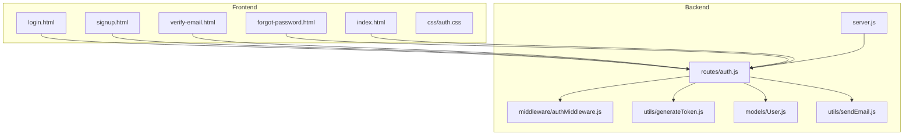
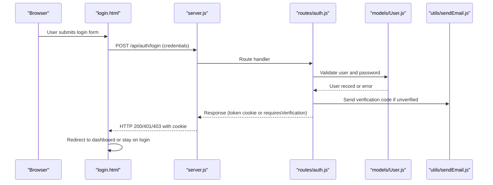
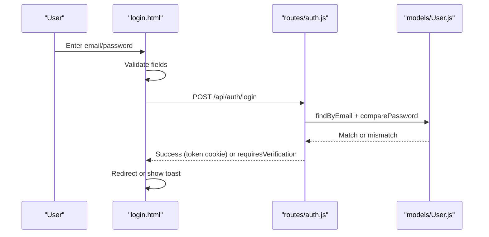
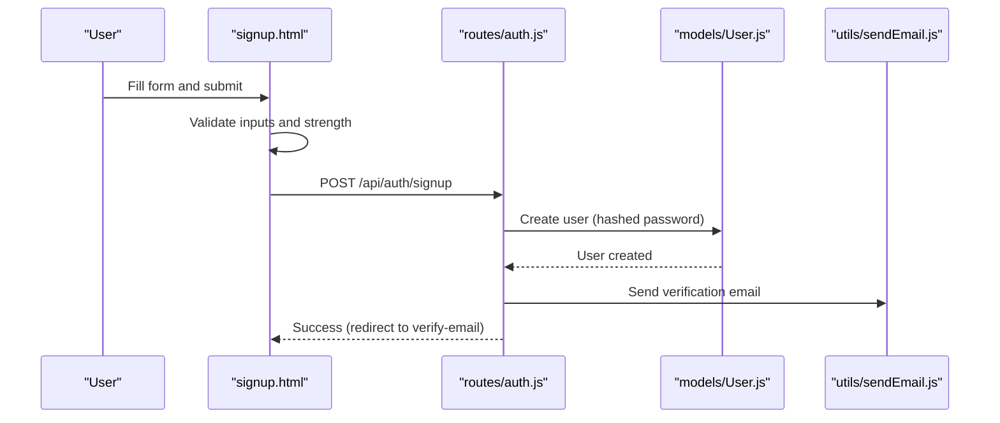
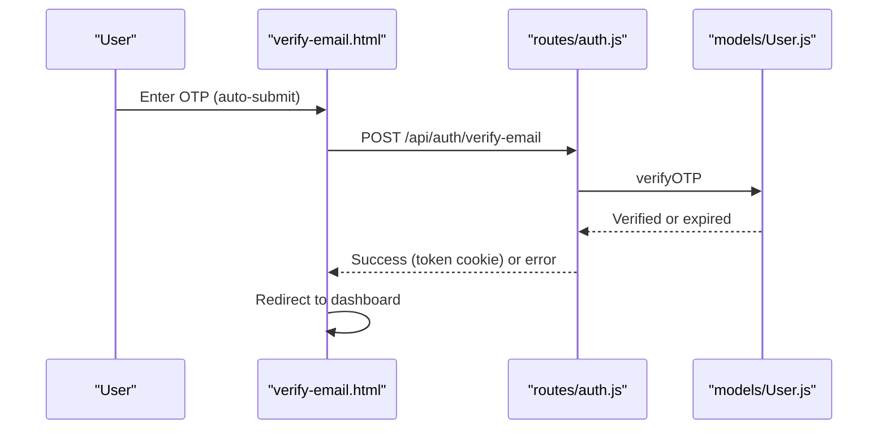
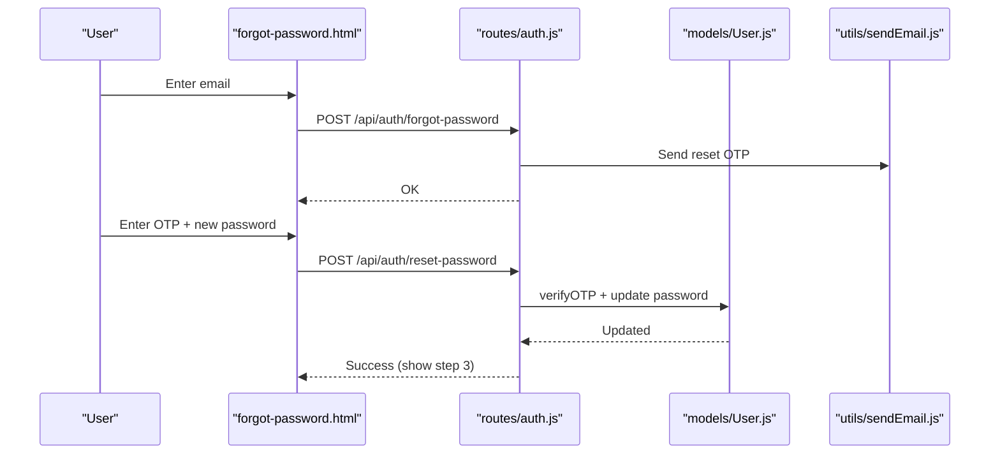
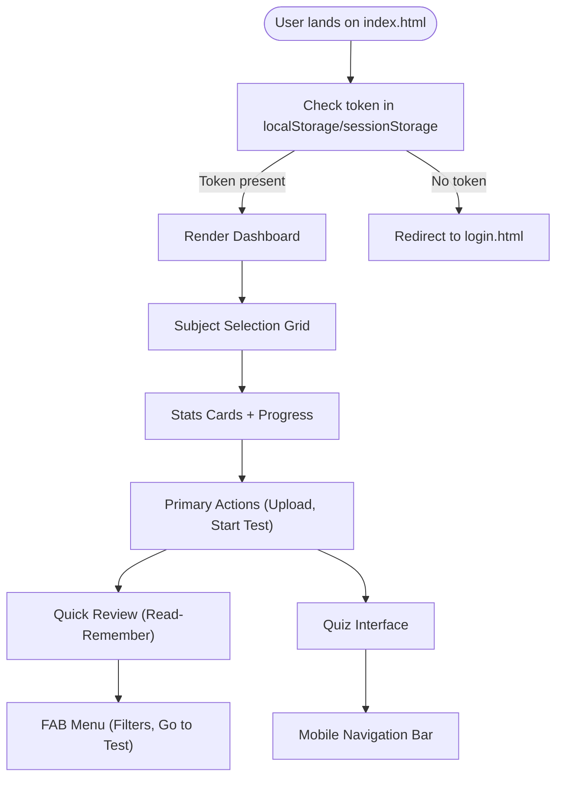
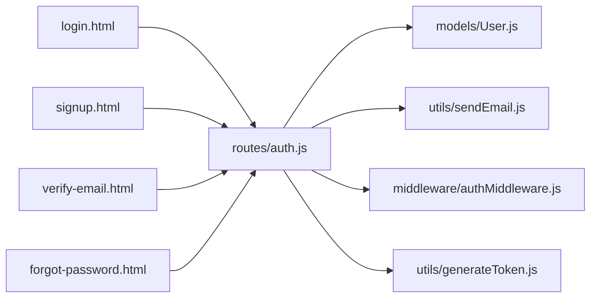

# Frontend Interface

<cite>
**Referenced Files in This Document**
- [login.html](file://frontend/login.html)
- [signup.html](file://frontend/signup.html)
- [verify-email.html](file://frontend/verify-email.html)
- [forgot-password.html](file://frontend/forgot-password.html)
- [auth.css](file://frontend/css/auth.css)
- [index.html](file://frontend/index.html)
- [auth.js](file://backend/routes/auth.js)
- [User.js](file://backend/models/User.js)
- [sendEmail.js](file://backend/utils/sendEmail.js)
- [server.js](file://backend/server.js)
- [authMiddleware.js](file://backend/middleware/authMiddleware.js)
- [generateToken.js](file://backend/utils/generateToken.js)
</cite>

## Table of Contents
1. [Introduction](#introduction)
2. [Project Structure](#project-structure)
3. [Core Components](#core-components)
4. [Architecture Overview](#architecture-overview)
5. [Detailed Component Analysis](#detailed-component-analysis)
6. [Dependency Analysis](#dependency-analysis)
7. [Performance Considerations](#performance-considerations)
8. [Troubleshooting Guide](#troubleshooting-guide)
9. [Conclusion](#conclusion)

## Introduction
This document describes the frontend interface components and user experience for the quiz application. It covers authentication pages (login, registration, email verification, and password reset), the main application dashboard and interactive quiz interface, responsive design and accessibility, cross-browser compatibility, performance optimization, and the integration between frontend pages and backend API endpoints. It also documents state management patterns and error handling in the user interface.

## Project Structure
The frontend is organized into separate HTML pages for authentication and a single-page application (SPA) shell for the main application. Shared styles are centralized in a stylesheet. The backend exposes REST endpoints under `/api/auth` and serves static frontend files.

**Diagram sources**
- [server.js](file://backend/server.js#L50-L75)
- [auth.js](file://backend/routes/auth.js#L1-L715)
- [auth.css](file://frontend/css/auth.css#L1-L552)
- [login.html](file://frontend/login.html#L1-L260)
- [signup.html](file://frontend/signup.html#L1-L341)
- [verify-email.html](file://frontend/verify-email.html#L1-L213)
- [forgot-password.html](file://frontend/forgot-password.html#L1-L448)
- [index.html](file://frontend/index.html#L1-L200)

**Section sources**
- [server.js](file://backend/server.js#L50-L75)
- [auth.js](file://backend/routes/auth.js#L1-L715)
- [auth.css](file://frontend/css/auth.css#L1-L552)
- [login.html](file://frontend/login.html#L1-L260)
- [signup.html](file://frontend/signup.html#L1-L341)
- [verify-email.html](file://frontend/verify-email.html#L1-L213)
- [forgot-password.html](file://frontend/forgot-password.html#L1-L448)
- [index.html](file://frontend/index.html#L1-L200)

## Core Components
- Authentication Pages
  - Login: Email/password with optional "Remember me", social login placeholder, and password visibility toggle.
  - Registration: Full name, email, password with strength meter, confirm password, terms agreement, and social signup placeholder.
  - Email Verification: Six-digit OTP input with auto-focus, paste support, resend timer, and masked email display.
  - Password Reset: Two-step process with email input, OTP + new password, strength meter, and resend timer.
- Main Application Shell
  - Dashboard: Welcome header, subject selection, stats cards, progress bar, and primary actions.
  - Quick Review (Read-Remember): Sticky header with search and zoom controls, sheet filters, and FAB menu.
  - Quiz Interface: Question navigation, timer, options, explanation panel, mobile-friendly navigation bar.
  - Popups: Settings, upload manager, custom test setup, library, test history, help guide, AI assistant, and notifications.
- Styling and Theming
  - Dark/light theme toggle, dynamic CSS variables, responsive breakpoints, and consistent component styles.
- State Management
  - Uses localStorage/sessionStorage for tokens and user data; backend manages session via HttpOnly cookies.

**Section sources**
- [login.html](file://frontend/login.html#L10-L90)
- [signup.html](file://frontend/signup.html#L19-L131)
- [verify-email.html](file://frontend/verify-email.html#L22-L48)
- [forgot-password.html](file://frontend/forgot-password.html#L17-L142)
- [auth.css](file://frontend/css/auth.css#L1-L552)
- [index.html](file://frontend/index.html#L1330-L1442)

## Architecture Overview
The frontend communicates with the backend via REST endpoints under `/api/auth`. The backend enforces authentication via cookies and JWT middleware, rate limits sensitive endpoints, and sends transactional emails for verification and resets.

**Diagram sources**
- [login.html](file://frontend/login.html#L164-L226)
- [server.js](file://backend/server.js#L69-L75)
- [auth.js](file://backend/routes/auth.js#L299-L377)
- [User.js](file://backend/models/User.js#L108-L139)
- [sendEmail.js](file://backend/utils/sendEmail.js#L51-L86)

## Detailed Component Analysis

### Authentication Pages

#### Login Page
- Structure: Logo, form with email/password fields, "Remember me", "Forgot password", submit button, divider, and social login placeholder.
- Interactions:
  - Toggle password visibility.
  - Real-time validation and error display per field.
  - Loading state during submission.
  - Redirect to dashboard on success; show toast on failure.
- Backend Integration:
  - Sends credentials to `/api/auth/login`.
  - Handles unverified accounts by redirecting to verification flow.
  - Uses credentials: include for cookie-based auth.

**Diagram sources**
- [login.html](file://frontend/login.html#L164-L226)
- [auth.js](file://backend/routes/auth.js#L299-L377)
- [User.js](file://backend/models/User.js#L108-L139)

**Section sources**
- [login.html](file://frontend/login.html#L10-L90)
- [auth.js](file://backend/routes/auth.js#L299-L377)

#### Registration Page
- Structure: Logo, form with name/email/password/confirm password, terms checkbox, submit button, divider, and social signup placeholder.
- Interactions:
  - Real-time password strength meter.
  - Validation feedback and toast notifications.
  - Redirect to verification page after successful signup.
- Backend Integration:
  - Sends `{name, email, password}` to `/api/auth/signup`.
  - Handles duplicate email detection and resend logic.

**Diagram sources**
- [signup.html](file://frontend/signup.html#L238-L324)
- [auth.js](file://backend/routes/auth.js#L81-L178)
- [User.js](file://backend/models/User.js#L92-L103)
- [sendEmail.js](file://backend/utils/sendEmail.js#L51-L86)

**Section sources**
- [signup.html](file://frontend/signup.html#L19-L131)
- [auth.js](file://backend/routes/auth.js#L81-L178)

#### Email Verification Page
- Structure: Back link, masked email display, six-digit OTP inputs, submit button, resend timer with countdown.
- Interactions:
  - Auto-focus and forward/back navigation between OTP inputs.
  - Paste support for OTP.
  - Immediate auto-submit when all digits are entered.
  - Resend OTP with cooldown timer.
- Backend Integration:
  - Validates OTP via `/api/auth/verify-email`.
  - Stores token and user data in localStorage/sessionStorage.

**Diagram sources**
- [verify-email.html](file://frontend/verify-email.html#L114-L146)
- [auth.js](file://backend/routes/auth.js#L183-L241)
- [User.js](file://backend/models/User.js#L123-L139)

**Section sources**
- [verify-email.html](file://frontend/verify-email.html#L22-L48)
- [auth.js](file://backend/routes/auth.js#L183-L241)

#### Password Reset Page
- Structure: Step 1 (email input), Step 2 (OTP + new password with strength meter, confirm password, resend), Step 3 (success).
- Interactions:
  - Multi-step wizard with masking and validation.
  - OTP auto-submit and paste support.
  - Resend code with cooldown.
- Backend Integration:
  - Step 1: `/api/auth/forgot-password` (resend or initiate reset).
  - Step 2: `/api/auth/reset-password` (update password).

**Diagram sources**
- [forgot-password.html](file://frontend/forgot-password.html#L299-L424)
- [auth.js](file://backend/routes/auth.js#L382-L507)
- [User.js](file://backend/models/User.js#L123-L139)
- [sendEmail.js](file://backend/utils/sendEmail.js#L91-L123)

**Section sources**
- [forgot-password.html](file://frontend/forgot-password.html#L17-L142)
- [auth.js](file://backend/routes/auth.js#L382-L507)

### Main Application Interface and Dashboard
- Dashboard
  - Welcome header with user name, subject selection grid, stats cards (tests taken, average score, total questions), progress bar, and primary actions.
  - Theme toggle and navigation to library/reports/revision/weakness practice.
- Quick Review (Read-Remember)
  - Sticky header with universal search trigger, zoom controls, and FAB menu with sheet filters and go-to-test option.
- Quiz Interface
  - Question navigation bar, timer, options with selection states, explanation panel, and mobile navigation bar.
- Popups and Modals
  - Settings (appearance, preferences, data export/import), upload manager, custom test setup, library tabs, test history, help guide, AI assistant, and notifications.

**Diagram sources**
- [index.html](file://frontend/index.html#L1274-L1284)
- [index.html](file://frontend/index.html#L1330-L1442)

**Section sources**
- [index.html](file://frontend/index.html#L1274-L1284)
- [index.html](file://frontend/index.html#L1330-L1442)

### Styling and Responsive Design
- Global Styles
  - CSS custom properties define theme variables (dark/light modes), typography, spacing, and gradients.
  - Body and component styles enforce consistent fonts, transitions, and shadows.
- Authentication Page Styles
  - Card-based layout with animated entrance, input focus states, password toggle, strength meter, OTP inputs with shake animation, toast notifications, and responsive adjustments for smaller screens.
- Main App Styles
  - Glass panels, theme toggle slider, navigation bars, progress indicators, and popup overlays with backdrop effects.

**Section sources**
- [auth.css](file://frontend/css/auth.css#L1-L552)
- [index.html](file://frontend/index.html#L11-L1271)

### Accessibility Considerations
- Focus Management
  - Proper focus order in forms and modals; autofocus on first input where appropriate.
- Keyboard Navigation
  - Tab order preserved; Enter key triggers form submission.
- ARIA and Semantics
  - Semantic HTML structure; labels associated with inputs; role and aria-* attributes can be added for complex widgets.
- Color and Contrast
  - Dark/light theme toggle; sufficient contrast in both modes; visual indicators for errors and selections.
- Screen Readers
  - Descriptive labels and alt texts for icons; ensure dynamic updates announce changes (e.g., toast notifications).

### Cross-Browser Compatibility
- Modern APIs
  - Uses fetch, cookies, localStorage/sessionStorage, and modern CSS features.
- Polyfills and Fallbacks
  - Consider adding polyfills for older browsers if needed (e.g., Promise, fetch).
- Testing
  - Validate on Chrome, Firefox, Safari, and Edge; test on mobile devices and tablets.

### Performance Optimization
- Frontend
  - Single-page app reduces round trips; lazy loading for heavy assets; minimize DOM updates; debounced search inputs.
  - Local storage for user preferences and cached data; avoid unnecessary re-renders.
- Backend
  - Rate limiting for sensitive endpoints; efficient database queries with indexes; optimized email sending.

**Section sources**
- [auth.js](file://backend/routes/auth.js#L14-L33)
- [User.js](file://backend/models/User.js#L86-L89)

## Dependency Analysis
- Frontend to Backend
  - All auth pages call `/api/auth/*` endpoints; backend responds with cookies for session management.
- Backend Components
  - Routes depend on User model for persistence, JWT generation, and email utilities.
  - Middleware protects protected routes and verifies tokens.

**Diagram sources**
- [login.html](file://frontend/login.html#L164-L226)
- [signup.html](file://frontend/signup.html#L238-L324)
- [verify-email.html](file://frontend/verify-email.html#L114-L146)
- [forgot-password.html](file://frontend/forgot-password.html#L299-L424)
- [auth.js](file://backend/routes/auth.js#L1-L715)
- [User.js](file://backend/models/User.js#L1-L208)
- [sendEmail.js](file://backend/utils/sendEmail.js#L1-L159)
- [authMiddleware.js](file://backend/middleware/authMiddleware.js#L1-L132)
- [generateToken.js](file://backend/utils/generateToken.js#L1-L18)

**Section sources**
- [auth.js](file://backend/routes/auth.js#L1-L715)
- [User.js](file://backend/models/User.js#L1-L208)
- [sendEmail.js](file://backend/utils/sendEmail.js#L1-L159)
- [authMiddleware.js](file://backend/middleware/authMiddleware.js#L1-L132)
- [generateToken.js](file://backend/utils/generateToken.js#L1-L18)

## Performance Considerations
- Minimize HTTP Requests
  - Bundle and minify CSS/JS; reuse libraries via CDN.
- Optimize Rendering
  - Virtualize long lists; throttle/Debounce frequent events (search, resize).
- Caching
  - Use ETags/Cache-Control for static assets; cache user preferences locally.
- Network Efficiency
  - Use gzip/brotli compression; keep payload small; batch requests where possible.

## Troubleshooting Guide
- Authentication Issues
  - Invalid credentials: Ensure email format and password length; check backend validation messages.
  - Unverified email: Trigger resend OTP; verify email display masking.
  - Rate limiting: Wait for cooldown timers before retrying.
- Session Problems
  - Missing token: Redirect to login; ensure cookies are accepted and SameSite settings are compatible.
  - Token expiration: Use refresh endpoint if implemented; re-authenticate.
- UI Feedback
  - Toast notifications: Check for duplicate toasts and removal timing.
  - Form errors: Clear per-field error classes on input; validate on submit.
- Backend Errors
  - Inspect network tab for 4xx/5xx responses; verify CORS and credentials settings.
  - Email delivery: Confirm SMTP configuration and logs.

**Section sources**
- [login.html](file://frontend/login.html#L133-L151)
- [signup.html](file://frontend/signup.html#L207-L226)
- [verify-email.html](file://frontend/verify-email.html#L182-L208)
- [forgot-password.html](file://frontend/forgot-password.html#L201-L239)
- [server.js](file://backend/server.js#L38-L43)

## Conclusion
The frontend provides a cohesive, responsive, and accessible user experience across authentication and the main application. It integrates tightly with backend endpoints for secure authentication, robust state management via cookies and local storage, and a polished UI with theming and interactive features. Following the outlined best practices will help maintain performance, accessibility, and reliability as the application evolves.