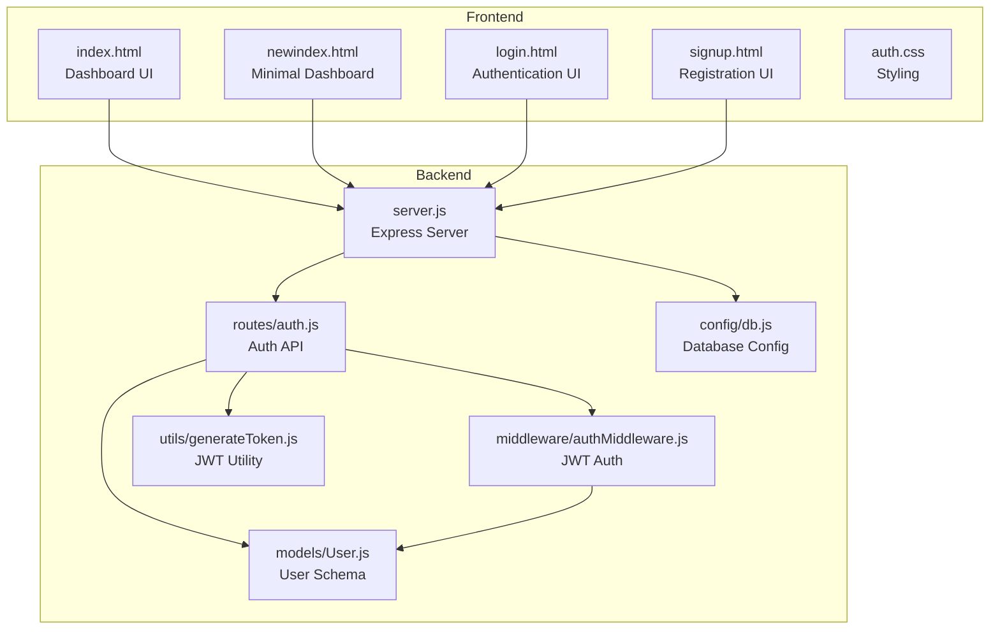
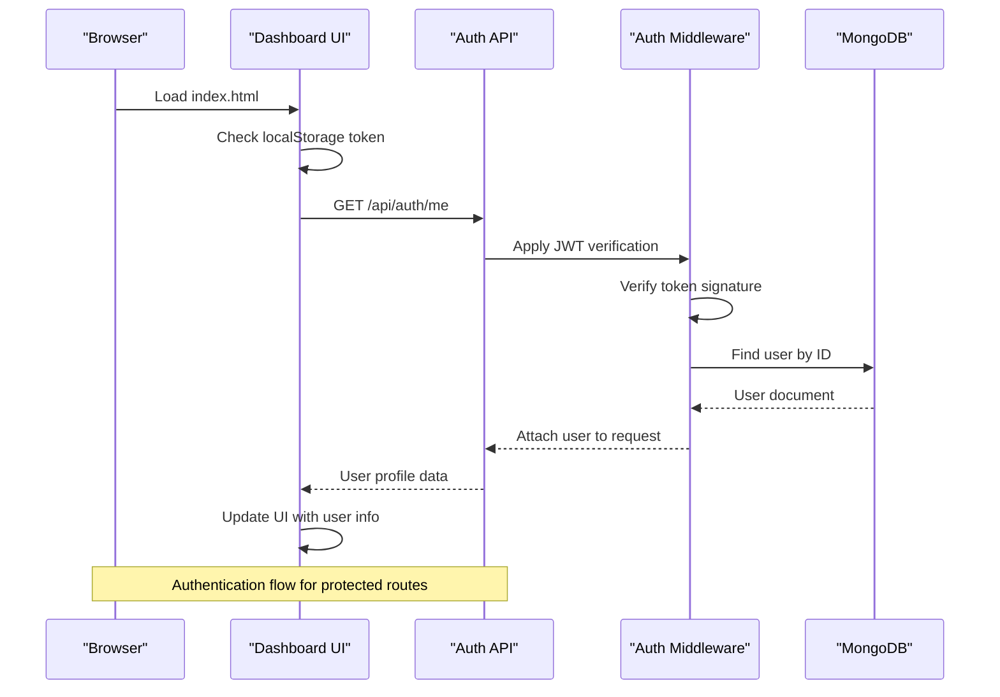
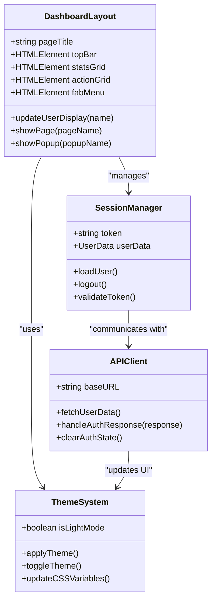
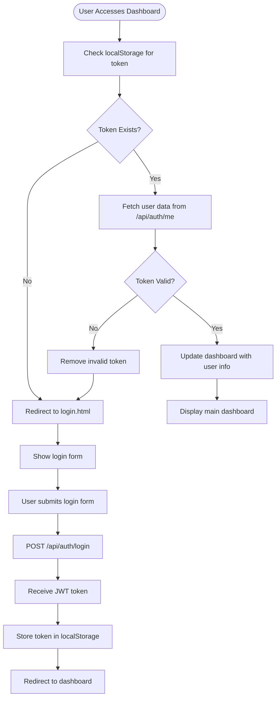
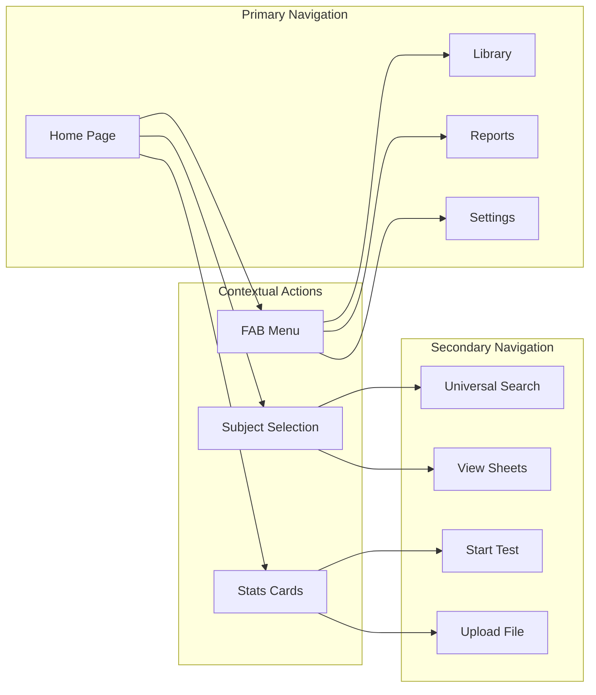
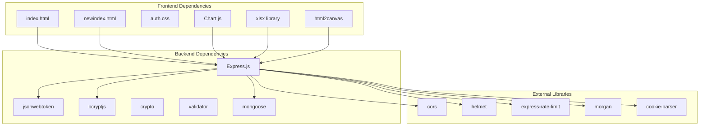

# Main Dashboard Interface

<cite>
**Referenced Files in This Document**
- [index.html](file://frontend/index.html)
- [newindex.html](file://frontend/newindex.html)
- [login.html](file://frontend/login.html)
- [signup.html](file://frontend/signup.html)
- [auth.css](file://frontend/css/auth.css)
- [server.js](file://backend/server.js)
- [auth.js](file://backend/routes/auth.js)
- [authMiddleware.js](file://backend/middleware/authMiddleware.js)
- [User.js](file://backend/models/User.js)
- [generateToken.js](file://backend/utils/generateToken.js)
- [db.js](file://backend/config/db.js)
</cite>

## Table of Contents
1. [Introduction](#introduction)
2. [Project Structure](#project-structure)
3. [Core Components](#core-components)
4. [Architecture Overview](#architecture-overview)
5. [Detailed Component Analysis](#detailed-component-analysis)
6. [Dependency Analysis](#dependency-analysis)
7. [Performance Considerations](#performance-considerations)
8. [Troubleshooting Guide](#troubleshooting-guide)
9. [Conclusion](#conclusion)

## Introduction
This document provides comprehensive documentation for the main application dashboard interface of the Quiz application. It covers the user dashboard layout, navigation components, interactive elements, JavaScript functionality for user session management and profile display, application state handling, backend API integration, responsive design patterns, component organization, and user experience considerations.

## Project Structure
The project follows a classic frontend-backend separation:
- Frontend: Single-page application built with HTML, CSS, and JavaScript, served statically by the backend
- Backend: Express.js server with RESTful API endpoints for authentication and user management

**Diagram sources**
- [server.js](file://backend/server.js#L1-L99)
- [auth.js](file://backend/routes/auth.js#L1-L715)
- [authMiddleware.js](file://backend/middleware/authMiddleware.js#L1-L132)
- [User.js](file://backend/models/User.js#L1-L208)
- [generateToken.js](file://backend/utils/generateToken.js#L1-L18)
- [db.js](file://backend/config/db.js#L1-L43)

**Section sources**
- [server.js](file://backend/server.js#L1-L99)
- [index.html](file://frontend/index.html#L1-L5356)
- [newindex.html](file://frontend/newindex.html#L1-L373)

## Core Components
The dashboard interface consists of several key components:

### Navigation and Layout
- **Top Bar**: Contains user greeting, subject selection, and action buttons
- **Stats Cards**: Display test statistics (total tests, average score, total questions)
- **Action Grid**: Primary navigation buttons for major features
- **Floating Action Button (FAB)**: Central control hub with overlay menu
- **Theme Toggle**: Light/dark mode switching

### Interactive Elements
- **Subject Selection**: Dynamic grid for choosing learning subjects
- **File Upload**: Integration with spreadsheet processing libraries
- **Quiz Controls**: Navigation and timing during test-taking
- **Popup System**: Modal dialogs for various actions and information display

### Session Management
- **Token Storage**: LocalStorage-based JWT token management
- **Auto-redirect**: Automatic redirection for unauthenticated users
- **Profile Loading**: Real-time user data fetching and display

**Section sources**
- [index.html](file://frontend/index.html#L140-L310)
- [newindex.html](file://frontend/newindex.html#L190-L244)
- [auth.js](file://backend/routes/auth.js#L510-L537)

## Architecture Overview
The dashboard implements a client-server architecture with JWT-based authentication:

**Diagram sources**
- [newindex.html](file://frontend/newindex.html#L276-L323)
- [auth.js](file://backend/routes/auth.js#L510-L537)
- [authMiddleware.js](file://backend/middleware/authMiddleware.js#L8-L79)
- [User.js](file://backend/models/User.js#L108-L121)

## Detailed Component Analysis

### Dashboard Layout and Styling
The dashboard uses a sophisticated CSS architecture with theme variables and responsive design:

**Diagram sources**
- [index.html](file://frontend/index.html#L11-L120)
- [newindex.html](file://frontend/newindex.html#L276-L370)

### Authentication Flow
The authentication system implements a robust JWT-based session management:

**Diagram sources**
- [newindex.html](file://frontend/newindex.html#L276-L323)
- [login.html](file://frontend/login.html#L164-L226)

### Navigation Components
The dashboard provides multiple navigation pathways through its component system:

**Diagram sources**
- [newindex.html](file://frontend/newindex.html#L190-L244)
- [index.html](file://frontend/index.html#L190-L244)

### Responsive Design Patterns
The dashboard implements comprehensive responsive design:

| Breakpoint | Device Type | Key Features |
|------------|-------------|--------------|
| 320px | Mobile Phones | Touch-friendly controls, simplified layouts |
| 480px | Small Tablets | Optimized spacing, readable fonts |
| 768px | Tablets | Grid adjustments, expanded controls |
| 1024px | Desktops | Full feature set, advanced interactions |

Responsive patterns include:
- Flexible grid layouts for stats cards
- Adaptive button sizing and positioning
- Touch-optimized navigation elements
- Dynamic typography scaling

**Section sources**
- [index.html](file://frontend/index.html#L288-L309)
- [auth.css](file://frontend/css/auth.css#L535-L552)

### JavaScript Functionality
The dashboard JavaScript handles complex state management and user interactions:

#### Session Management Functions
- `loadUserAndAuth()`: Validates JWT token and loads user profile
- `logout()`: Clears authentication state and redirects to login
- `showPage()`: Manages visibility of different dashboard sections
- `showPopup()`: Controls modal dialog visibility

#### State Management
- Application state stored in DOM elements and localStorage
- Real-time UI updates based on user actions
- Persistent settings across browser sessions

#### API Integration
- Dynamic API base URL detection (localhost vs production)
- Error handling for network failures
- Token-based authentication for protected routes

**Section sources**
- [newindex.html](file://frontend/newindex.html#L276-L370)
- [login.html](file://frontend/login.html#L164-L226)

## Dependency Analysis
The dashboard components have well-defined dependencies:

**Diagram sources**
- [server.js](file://backend/server.js#L1-L99)
- [auth.js](file://backend/routes/auth.js#L1-L10)
- [User.js](file://backend/models/User.js#L1-L4)

**Section sources**
- [server.js](file://backend/server.js#L1-L99)
- [auth.js](file://backend/routes/auth.js#L1-L10)
- [User.js](file://backend/models/User.js#L1-L4)

## Performance Considerations
Several performance optimizations are implemented:

### Frontend Performance
- **Lazy Loading**: Heavy libraries loaded conditionally
- **CSS Optimization**: Minimal reflows through efficient selectors
- **Event Delegation**: Reduced event listener overhead
- **Memory Management**: Proper cleanup of intervals and timeouts

### Backend Performance
- **Connection Pooling**: MongoDB connection pooling for scalability
- **Rate Limiting**: Protection against abuse and DoS attacks
- **CORS Configuration**: Secure cross-origin resource sharing
- **Security Headers**: Comprehensive protection against common threats

### Caching Strategies
- **Static Assets**: CDN-ready for optimal delivery
- **Session Tokens**: Efficient JWT-based stateless authentication
- **Database Queries**: Indexed fields for fast lookups

## Troubleshooting Guide

### Common Issues and Solutions

#### Authentication Problems
- **Symptom**: Users redirected to login despite having a token
- **Cause**: Expired or invalid JWT token
- **Solution**: Clear localStorage and re-authenticate

#### API Connectivity Issues
- **Symptom**: Dashboard loads but user data doesn't appear
- **Cause**: Network connectivity or CORS configuration problems
- **Solution**: Check browser console for CORS errors and verify backend configuration

#### Responsive Design Issues
- **Symptom**: Elements overlap or display incorrectly on mobile devices
- **Cause**: Viewport meta tag issues or CSS conflicts
- **Solution**: Verify viewport settings and inspect element styles

#### Performance Issues
- **Symptom**: Slow loading or laggy interactions
- **Cause**: Large DOM manipulation or excessive reflows
- **Solution**: Optimize CSS selectors and reduce DOM operations

**Section sources**
- [newindex.html](file://frontend/newindex.html#L276-L323)
- [server.js](file://backend/server.js#L38-L43)

## Conclusion
The main dashboard interface demonstrates a well-architected single-page application with robust authentication, responsive design, and comprehensive user experience considerations. The implementation balances functionality with performance while maintaining clean separation between frontend and backend concerns. The modular component structure and clear API boundaries facilitate future enhancements and maintenance.

Key strengths include:
- Secure JWT-based authentication system
- Responsive design that works across all device sizes
- Clean separation of concerns between UI and business logic
- Comprehensive error handling and user feedback mechanisms
- Scalable backend architecture with proper security measures

The dashboard provides an excellent foundation for educational applications requiring user session management, data visualization, and interactive learning experiences.