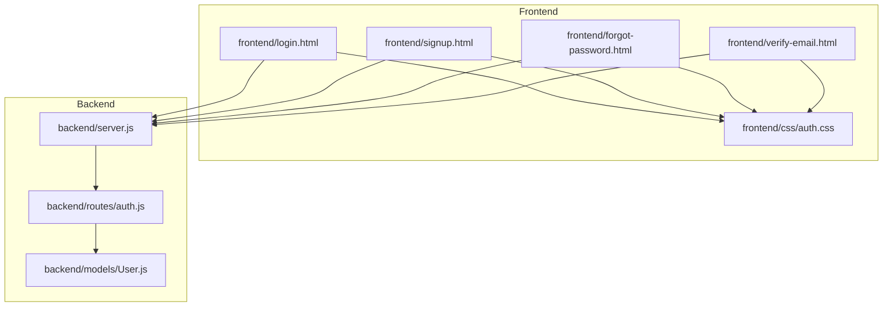
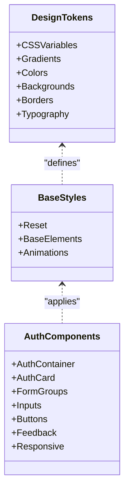
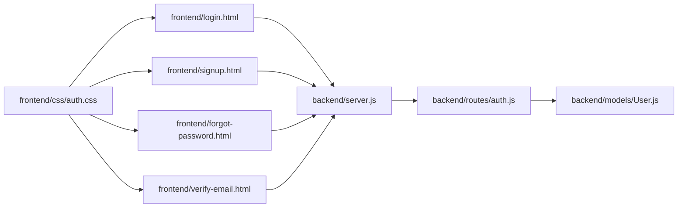

# Styling and Design System

<cite>
**Referenced Files in This Document**
- [auth.css](file://frontend/css/auth.css)
- [login.html](file://frontend/login.html)
- [signup.html](file://frontend/signup.html)
- [forgot-password.html](file://frontend/forgot-password.html)
- [verify-email.html](file://frontend/verify-email.html)
- [server.js](file://backend/server.js)
- [auth.js](file://backend/routes/auth.js)
- [User.js](file://backend/models/User.js)
</cite>

## Table of Contents
1. [Introduction](#introduction)
2. [Project Structure](#project-structure)
3. [Core Components](#core-components)
4. [Architecture Overview](#architecture-overview)
5. [Detailed Component Analysis](#detailed-component-analysis)
6. [Dependency Analysis](#dependency-analysis)
7. [Performance Considerations](#performance-considerations)
8. [Troubleshooting Guide](#troubleshooting-guide)
9. [Conclusion](#conclusion)

## Introduction
This document describes the frontend styling system and design patterns used in the quiz application. It covers the CSS architecture, component styling approach, design tokens, responsive design implementation, color schemes, typography choices, spacing systems, and styling patterns for authentication forms, interactive elements, and visual feedback components. It also provides guidelines for maintaining design consistency and extending the styling system.

## Project Structure
The styling system is centralized in a single CSS file that is shared across all authentication pages. The frontend consists of HTML pages that include the shared stylesheet and JavaScript for form interactions. The backend serves the frontend files statically and exposes authentication APIs consumed by the frontend.

**Diagram sources**
- [auth.css](file://frontend/css/auth.css#L1-L552)
- [login.html](file://frontend/login.html#L1-L260)
- [signup.html](file://frontend/signup.html#L1-L341)
- [forgot-password.html](file://frontend/forgot-password.html#L1-L448)
- [verify-email.html](file://frontend/verify-email.html#L1-L213)
- [server.js](file://backend/server.js#L1-L99)
- [auth.js](file://backend/routes/auth.js#L1-L715)
- [User.js](file://backend/models/User.js#L1-L208)

**Section sources**
- [auth.css](file://frontend/css/auth.css#L1-L552)
- [login.html](file://frontend/login.html#L1-L260)
- [signup.html](file://frontend/signup.html#L1-L341)
- [forgot-password.html](file://frontend/forgot-password.html#L1-L448)
- [verify-email.html](file://frontend/verify-email.html#L1-L213)
- [server.js](file://backend/server.js#L1-L99)

## Core Components
The styling system is built around a set of reusable components and design tokens:

- Design tokens: CSS variables define gradients, colors, backgrounds, borders, and text colors.
- Base styles: Reset and base element styles ensure consistent typography and layout.
- Background animation: A subtle animated background enhances visual appeal.
- Authentication container and card: Centralized layout and shadow for forms.
- Form groups and inputs: Consistent input styling with icons and focus states.
- Interactive elements: Buttons, toggles, social buttons, and loading indicators.
- Feedback components: Toast notifications, error messages, success boxes, and OTP inputs.
- Responsive design: Media queries adapt layouts for mobile devices.

Key design token categories:
- Gradients: primary, success, danger
- Backgrounds: dark background, card background, input background
- Text colors: primary, secondary
- Borders: card border color
- Status colors: error, success
- Typography: font family, sizes, weights, transforms

**Section sources**
- [auth.css](file://frontend/css/auth.css#L5-L18)
- [auth.css](file://frontend/css/auth.css#L20-L36)
- [auth.css](file://frontend/css/auth.css#L38-L50)
- [auth.css](file://frontend/css/auth.css#L52-L77)
- [auth.css](file://frontend/css/auth.css#L106-L162)
- [auth.css](file://frontend/css/auth.css#L246-L290)
- [auth.css](file://frontend/css/auth.css#L444-L474)
- [auth.css](file://frontend/css/auth.css#L535-L552)

## Architecture Overview
The styling architecture follows a component-based approach with shared design tokens and consistent class naming. Each authentication page uses the same CSS file and applies consistent classes to build cohesive forms and interactions.

**Diagram sources**
- [auth.css](file://frontend/css/auth.css#L5-L18)
- [auth.css](file://frontend/css/auth.css#L20-L50)
- [auth.css](file://frontend/css/auth.css#L52-L552)

## Detailed Component Analysis

### Design Tokens and CSS Variables
The design system uses CSS variables to centralize theme values. These variables are used consistently across components to ensure visual coherence.

- Color palette: Dark theme with gradient accents, neutral backgrounds, and status colors.
- Typography: Sans-serif font stack with consistent sizing and weight scaling.
- Spacing: Consistent margins, paddings, and gaps for form groups and interactive elements.

Guidelines for extending tokens:
- Add new variables under the design tokens section.
- Reference variables using var(--token-name) in all components.
- Maintain semantic names for tokens (e.g., --primary-gradient, --text-primary).

**Section sources**
- [auth.css](file://frontend/css/auth.css#L5-L18)
- [auth.css](file://frontend/css/auth.css#L27-L36)

### Base Styles and Reset
Base styles establish a consistent foundation:
- Universal reset for margins and padding.
- Box sizing for predictable layouts.
- Body styles with dark background, centered alignment, and responsive padding.

These styles ensure that all components inherit consistent typography and spacing defaults.

**Section sources**
- [auth.css](file://frontend/css/auth.css#L20-L36)

### Background Animation
A subtle animated background enhances the user experience without distracting from content. The animation uses radial gradients positioned around the viewport.

Best practices:
- Keep animations lightweight to preserve performance.
- Ensure sufficient contrast with foreground content.

**Section sources**
- [auth.css](file://frontend/css/auth.css#L38-L50)

### Authentication Container and Card
The auth container centers content and applies entrance animations. The auth card provides a distinct surface with rounded corners, borders, and shadows.

Implementation notes:
- Max-width ensures readability on larger screens.
- Animations provide smooth transitions for improved UX.

**Section sources**
- [auth.css](file://frontend/css/auth.css#L52-L77)
- [auth.css](file://frontend/css/auth.css#L59-L68)

### Form Groups and Inputs
Form groups encapsulate labels, inputs, and error messages. Input wrappers integrate icons and focus states for better affordance.

Patterns:
- Consistent padding and border radius across inputs.
- Focus states with border color changes and subtle glow effects.
- Placeholder text styling for guidance.

Password toggle and strength meter:
- Toggle visibility with icon changes.
- Strength meter updates dynamically based on input criteria.

**Section sources**
- [auth.css](file://frontend/css/auth.css#L106-L162)
- [auth.css](file://frontend/css/auth.css#L164-L208)

### Buttons and Interactions
Button variants provide consistent affordances for primary actions, success states, and destructive actions. Interactive states include hover, active, and disabled conditions.

Patterns:
- Gradient backgrounds for primary actions.
- Hover effects with elevation and shadow enhancements.
- Disabled states with reduced opacity and no interaction.

Social buttons offer alternative authentication pathways with consistent styling and hover effects.

**Section sources**
- [auth.css](file://frontend/css/auth.css#L246-L290)
- [auth.css](file://frontend/css/auth.css#L327-L360)

### Loading and Feedback Components
Loading indicators use CSS animations for spinners. Toast notifications provide contextual feedback with slide-in animations and color-coded variants.

Patterns:
- Consistent timing and easing for animations.
- Fixed positioning for non-blocking feedback.
- Color-coded messages for success, error, and informational states.

OTP input components enforce numeric input, auto-focus behavior, and visual feedback for filled and error states.

**Section sources**
- [auth.css](file://frontend/css/auth.css#L292-L304)
- [auth.css](file://frontend/css/auth.css#L444-L474)
- [auth.css](file://frontend/css/auth.css#L379-L420)

### Responsive Design
Responsive breakpoints adapt the layout for smaller screens:
- Reduced padding in the auth card.
- Smaller input sizes for OTP fields.
- Reordered form options for mobile-friendly layouts.

Responsive patterns:
- Flexible containers with max-width constraints.
- Adjusted typography and spacing for mobile.
- Adaptive input sizes and alignment.

**Section sources**
- [auth.css](file://frontend/css/auth.css#L535-L552)

### Authentication Page Integration
Each authentication page integrates the shared CSS and JavaScript to implement form validation, API communication, and user feedback. Pages share common components while adapting content and interactions.

Patterns:
- Shared CSS for consistent styling across pages.
- JavaScript functions for form interactions and API calls.
- Toast notifications for user feedback.
- Conditional rendering for multi-step flows (forgot password, verify email).

**Section sources**
- [login.html](file://frontend/login.html#L1-L260)
- [signup.html](file://frontend/signup.html#L1-L341)
- [forgot-password.html](file://frontend/forgot-password.html#L1-L448)
- [verify-email.html](file://frontend/verify-email.html#L1-L213)

## Dependency Analysis
The styling system depends on the shared CSS file across all authentication pages. The backend serves the frontend files and exposes authentication APIs consumed by the frontend JavaScript.

**Diagram sources**
- [auth.css](file://frontend/css/auth.css#L1-L552)
- [login.html](file://frontend/login.html#L1-L260)
- [signup.html](file://frontend/signup.html#L1-L341)
- [forgot-password.html](file://frontend/forgot-password.html#L1-L448)
- [verify-email.html](file://frontend/verify-email.html#L1-L213)
- [server.js](file://backend/server.js#L1-L99)
- [auth.js](file://backend/routes/auth.js#L1-L715)
- [User.js](file://backend/models/User.js#L1-L208)

**Section sources**
- [auth.css](file://frontend/css/auth.css#L1-L552)
- [server.js](file://backend/server.js#L50-L52)
- [auth.js](file://backend/routes/auth.js#L70-L75)

## Performance Considerations
- Minimize repaints and reflows by using transform and opacity for animations.
- Prefer hardware-accelerated properties for smoother transitions.
- Keep CSS selectors simple and avoid deep nesting to reduce specificity conflicts.
- Use efficient media queries and avoid excessive recalculations on scroll.

## Troubleshooting Guide
Common styling issues and resolutions:
- Inconsistent colors: Ensure all color references use CSS variables.
- Layout shifts: Verify padding and margin values are consistent across components.
- Animation performance: Reduce animation complexity or duration for low-end devices.
- Mobile responsiveness: Test breakpoint adjustments and ensure touch targets are adequately sized.

Validation and error handling patterns:
- Form validation displays error messages and highlights invalid fields.
- Toast notifications provide immediate feedback for API responses.
- Loading states prevent duplicate submissions and improve perceived performance.

**Section sources**
- [login.html](file://frontend/login.html#L133-L151)
- [signup.html](file://frontend/signup.html#L207-L225)
- [forgot-password.html](file://frontend/forgot-password.html#L229-L239)
- [verify-email.html](file://frontend/verify-email.html#L182-L208)

## Conclusion
The styling system employs a component-based architecture with centralized design tokens, consistent base styles, and responsive patterns. By adhering to established naming conventions and extending the CSS variables, teams can maintain design consistency while adding new components and interactions. The shared CSS file simplifies maintenance and ensures uniform experiences across authentication pages.