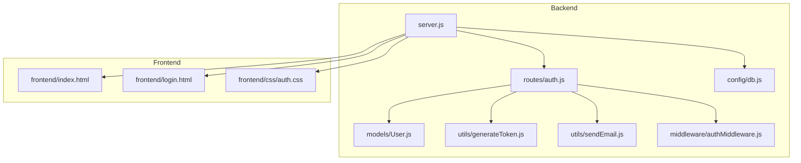
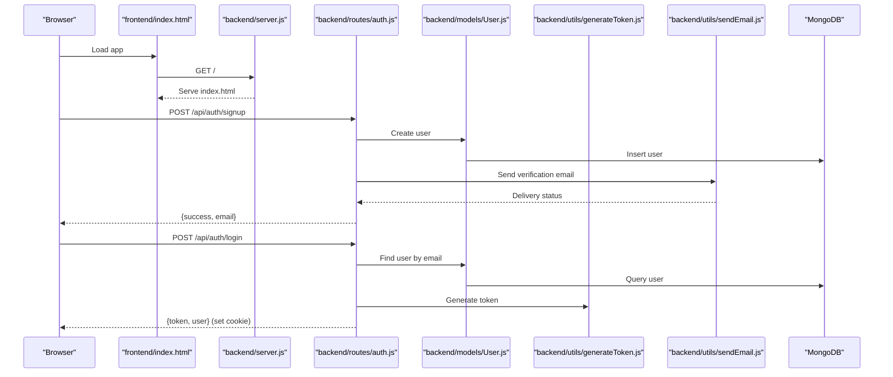

# Getting Started

<cite>
**Referenced Files in This Document**
- [backend/package.json](file://backend/package.json)
- [package.json](file://package.json)
- [backend/server.js](file://backend/server.js)
- [backend/config/db.js](file://backend/config/db.js)
- [backend/routes/auth.js](file://backend/routes/auth.js)
- [backend/models/User.js](file://backend/models/User.js)
- [backend/utils/generateToken.js](file://backend/utils/generateToken.js)
- [backend/utils/sendEmail.js](file://backend/utils/sendEmail.js)
- [backend/middleware/authMiddleware.js](file://backend/middleware/authMiddleware.js)
- [frontend/index.html](file://frontend/index.html)
- [frontend/login.html](file://frontend/login.html)
- [frontend/css/auth.css](file://frontend/css/auth.css)
</cite>

## Table of Contents
1. [Introduction](#introduction)
2. [Project Structure](#project-structure)
3. [Prerequisites](#prerequisites)
4. [Environment Setup](#environment-setup)
5. [Installation Steps](#installation-steps)
6. [Database Setup](#database-setup)
7. [Initial User Account](#initial-user-account)
8. [Basic Usage Examples](#basic-usage-examples)
9. [Architecture Overview](#architecture-overview)
10. [Troubleshooting Guide](#troubleshooting-guide)
11. [Verification Checklist](#verification-checklist)
12. [Conclusion](#conclusion)

## Introduction
This guide helps you set up and run the quiz application locally. It covers installing prerequisites, configuring environment variables, installing dependencies, connecting to MongoDB, creating an initial admin user, and verifying the setup works correctly. The application includes a backend built with Express and a frontend served statically from the backend.

## Project Structure
The project follows a split structure:
- Backend: Express server, authentication routes, database connection, JWT utilities, email utilities, and user model
- Frontend: Static HTML/CSS/JS pages for login, signup, and other UI components

**Diagram sources**
- [backend/server.js](file://backend/server.js#L1-L99)
- [backend/routes/auth.js](file://backend/routes/auth.js#L1-L715)
- [backend/models/User.js](file://backend/models/User.js#L1-L208)
- [backend/config/db.js](file://backend/config/db.js#L1-L43)
- [backend/utils/generateToken.js](file://backend/utils/generateToken.js#L1-L18)
- [backend/utils/sendEmail.js](file://backend/utils/sendEmail.js#L1-L159)
- [backend/middleware/authMiddleware.js](file://backend/middleware/authMiddleware.js#L1-L132)
- [frontend/index.html](file://frontend/index.html#L1-L200)
- [frontend/login.html](file://frontend/login.html#L1-L200)
- [frontend/css/auth.css](file://frontend/css/auth.css#L1-L200)

**Section sources**
- [backend/server.js](file://backend/server.js#L1-L99)
- [frontend/index.html](file://frontend/index.html#L1-L200)

## Prerequisites
Before installing the application, ensure you have the following:
- Node.js: Required to run the backend server
- npm: Package manager for Node.js
- MongoDB: Database for storing user accounts and related data

Installers and setup instructions for each are widely available online. Confirm your installations by running:
- node --version
- npm --version
- mongod --version (or equivalent for your MongoDB client)

**Section sources**
- [backend/package.json](file://backend/package.json#L18-L31)
- [package.json](file://package.json#L10-L26)

## Environment Setup
Create a .env file in the backend directory with the following required variables:
- MONGODB_URI: MongoDB connection string
- JWT_SECRET: Secret key for signing JWT tokens
- FRONTEND_URL: Origin of your frontend (used for CORS)

Additionally, configure email service credentials for sending verification and password reset emails:
- EMAIL_USER: Email address used to send mails
- EMAIL_PASS: App-specific password or token for the email account

Notes:
- The backend validates that MONGODB_URI, JWT_SECRET, and FRONTEND_URL are present at startup
- The email utility expects EMAIL_USER and EMAIL_PASS to be configured

**Section sources**
- [backend/server.js](file://backend/server.js#L15-L23)
- [backend/utils/sendEmail.js](file://backend/utils/sendEmail.js#L7-L22)
- [backend/utils/generateToken.js](file://backend/utils/generateToken.js#L4-L16)

## Installation Steps
Follow these steps to install and run the application:

1. Clone the repository to your local machine
2. Navigate to the project root directory
3. Install backend dependencies:
   - Run: npm install (from the project root)
4. Start the backend server:
   - Development mode: npm run dev (requires nodemon installed globally or as dev dependency)
   - Production mode: npm start
5. Access the application:
   - The backend serves the frontend from the frontend directory and logs the base URL and mapped frontend path

Verification:
- Confirm the server prints a startup message with the base URL and frontend mapping
- Open the browser and navigate to the logged base URL

**Section sources**
- [backend/package.json](file://backend/package.json#L6-L10)
- [package.json](file://package.json#L6-L10)
- [backend/server.js](file://backend/server.js#L91-L99)

## Database Setup
The backend connects to MongoDB using the MONGODB_URI environment variable. The connection script includes logging for successful connections and common failure scenarios.

Steps:
1. Ensure MongoDB is running locally or you have a remote MongoDB URI
2. Set MONGODB_URI in your .env file
3. Start the backend server; it will attempt to connect on startup
4. Observe console logs for connection success or failure messages

Common connection errors and remedies:
- Authentication failures: Verify credentials and permissions
- Network issues: Check connectivity and firewall settings
- Invalid URI: Ensure the URI format is correct

**Section sources**
- [backend/config/db.js](file://backend/config/db.js#L4-L41)

## Initial User Account
The application does not include an automated admin account creation endpoint. To create an initial admin user:
- Use the frontend signup page to register an account
- Complete the email verification flow
- Manually update the user's role to admin in the database if needed

Note:
- The user model supports roles: user, admin, moderator
- The authentication middleware checks user verification and activity status

**Section sources**
- [backend/models/User.js](file://backend/models/User.js#L54-L60)
- [backend/middleware/authMiddleware.js](file://backend/middleware/authMiddleware.js#L40-L54)

## Basic Usage Examples
After starting the server and ensuring the frontend is served:

- Visit the home page at the base URL printed by the server
- Use the login page to authenticate
- Use the signup page to create a new account
- Use the forgot password flow to reset your password via email

Frontend integration details:
- The backend serves static files from the frontend directory
- The login page sets credentials: include to enable cookie-based sessions
- The frontend uses a base API URL that matches the backend’s API prefix

**Section sources**
- [backend/server.js](file://backend/server.js#L50-L75)
- [frontend/login.html](file://frontend/login.html#L98-L100)
- [frontend/login.html](file://frontend/login.html#L180-L188)

## Architecture Overview
High-level flow of the authentication system:

**Diagram sources**
- [backend/server.js](file://backend/server.js#L70-L75)
- [backend/routes/auth.js](file://backend/routes/auth.js#L81-L178)
- [backend/models/User.js](file://backend/models/User.js#L108-L177)
- [backend/utils/generateToken.js](file://backend/utils/generateToken.js#L4-L16)
- [backend/utils/sendEmail.js](file://backend/utils/sendEmail.js#L51-L86)
- [backend/config/db.js](file://backend/config/db.js#L4-L41)

## Troubleshooting Guide
Common setup issues and resolutions:

- Missing environment variables:
  - Symptom: Server exits immediately after startup
  - Fix: Add MONGODB_URI, JWT_SECRET, and FRONTEND_URL to .env

- MongoDB connection failures:
  - Symptom: Connection error logs and process exit
  - Fix: Verify URI, network, and credentials

- Email delivery errors:
  - Symptom: Email utility reports connection errors
  - Fix: Confirm EMAIL_USER and EMAIL_PASS are set and the SMTP settings are correct

- CORS or cookie issues:
  - Symptom: Frontend cannot communicate with backend or session not persisting
  - Fix: Ensure FRONTEND_URL matches the origin and credentials: true is enabled

- Port conflicts:
  - Symptom: Server fails to bind to the configured port
  - Fix: Change PORT or stop the conflicting service

**Section sources**
- [backend/server.js](file://backend/server.js#L15-L23)
- [backend/config/db.js](file://backend/config/db.js#L29-L40)
- [backend/utils/sendEmail.js](file://backend/utils/sendEmail.js#L24-L31)
- [backend/server.js](file://backend/server.js#L38-L43)

## Verification Checklist
To confirm a successful installation:

- Backend starts without errors and logs the base URL and frontend mapping
- MongoDB connection logs show success
- Email utility logs indicate readiness
- Frontend loads and displays the home page
- Login and signup forms submit without CORS errors
- Cookies are set during login and persist across requests

**Section sources**
- [backend/server.js](file://backend/server.js#L91-L99)
- [backend/config/db.js](file://backend/config/db.js#L13-L27)
- [backend/utils/sendEmail.js](file://backend/utils/sendEmail.js#L24-L31)
- [frontend/login.html](file://frontend/login.html#L180-L188)

## Conclusion
You now have the quiz application running locally with a working backend, database connection, and frontend. Use the provided environment variables and configuration to tailor the setup to your needs, and refer to the troubleshooting section if you encounter issues.