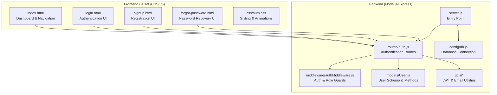
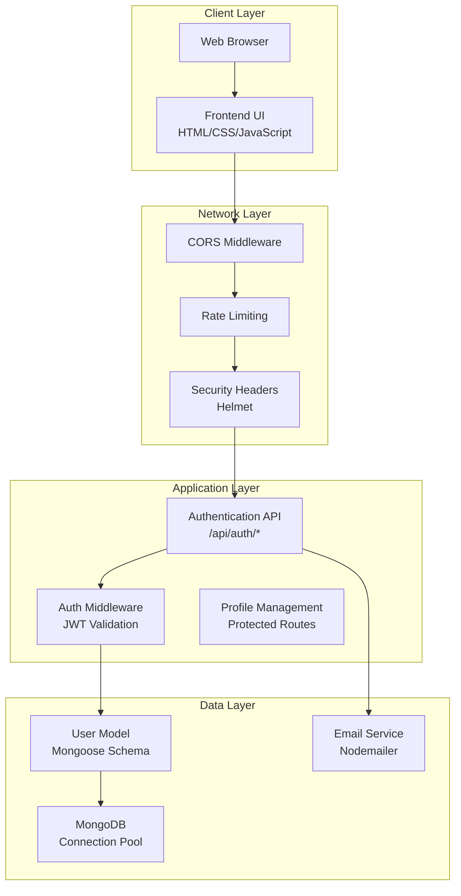
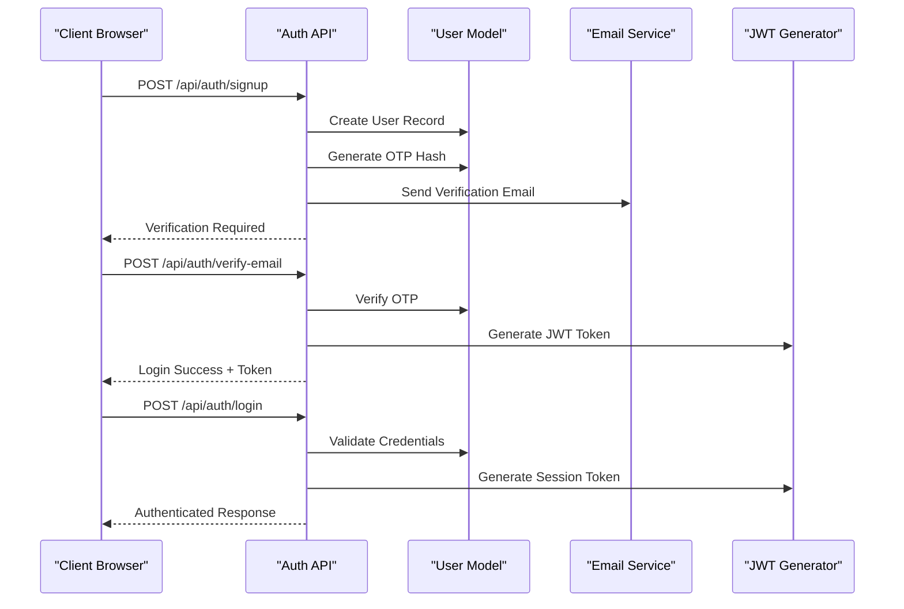
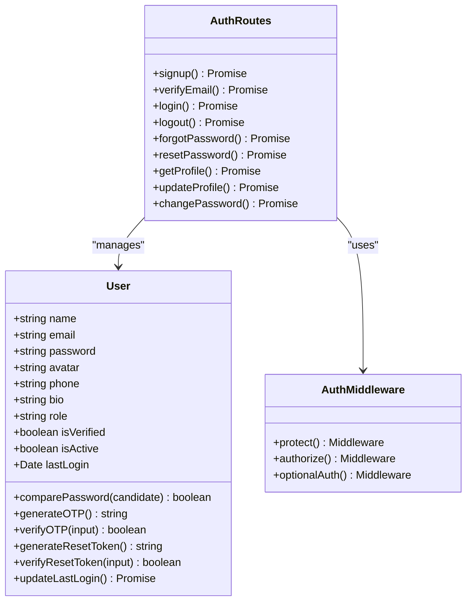
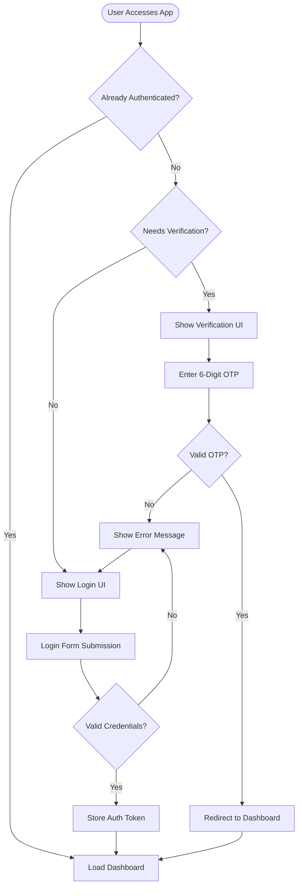
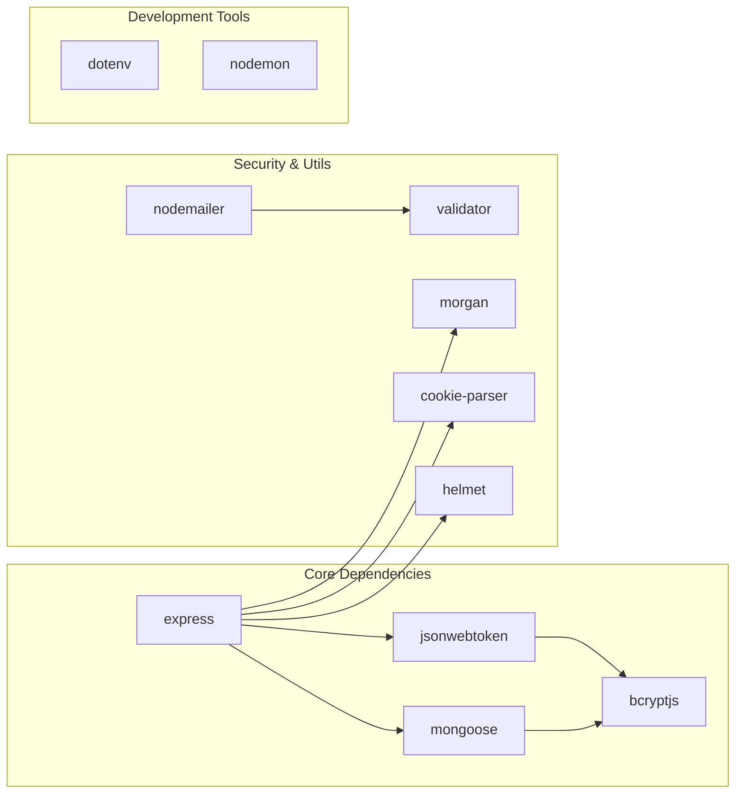

# Project Overview

<cite>
**Referenced Files in This Document**
- [backend/package.json](file://backend/package.json)
- [backend/server.js](file://backend/server.js)
- [backend/config/db.js](file://backend/config/db.js)
- [backend/models/User.js](file://backend/models/User.js)
- [backend/routes/auth.js](file://backend/routes/auth.js)
- [backend/middleware/authMiddleware.js](file://backend/middleware/authMiddleware.js)
- [backend/utils/generateToken.js](file://backend/utils/generateToken.js)
- [backend/utils/sendEmail.js](file://backend/utils/sendEmail.js)
- [frontend/index.html](file://frontend/index.html)
- [frontend/login.html](file://frontend/login.html)
- [frontend/signup.html](file://frontend/signup.html)
- [frontend/forgot-password.html](file://frontend/forgot-password.html)
- [frontend/css/auth.css](file://frontend/css/auth.css)
</cite>

## Table of Contents
1. [Introduction](#introduction)
2. [Project Structure](#project-structure)
3. [Core Components](#core-components)
4. [Architecture Overview](#architecture-overview)
5. [Detailed Component Analysis](#detailed-component-analysis)
6. [Dependency Analysis](#dependency-analysis)
7. [Performance Considerations](#performance-considerations)
8. [Troubleshooting Guide](#troubleshooting-guide)
9. [Conclusion](#conclusion)

## Introduction
This quiz application is an educational platform designed to deliver interactive assessments and learning experiences. It provides a complete user authentication system with secure registration, email verification, login/logout, password management, and profile handling. The platform targets learners and educators who need a reliable, secure, and user-friendly environment for taking quizzes, managing accounts, and tracking progress.

The application combines a modern frontend built with HTML, CSS, and JavaScript for an engaging user interface with a robust Node.js/Express backend for scalable API services and database connectivity. It emphasizes security through JWT-based sessions stored in HttpOnly cookies, comprehensive input validation, rate limiting, and secure password hashing.

## Project Structure
The project follows a clear separation of concerns with distinct backend and frontend directories:

**Diagram sources**
- [backend/server.js](file://backend/server.js#L1-L99)
- [backend/routes/auth.js](file://backend/routes/auth.js#L1-L715)
- [backend/middleware/authMiddleware.js](file://backend/middleware/authMiddleware.js#L1-L132)
- [backend/models/User.js](file://backend/models/User.js#L1-L208)
- [backend/utils/sendEmail.js](file://backend/utils/sendEmail.js#L1-L159)
- [frontend/index.html](file://frontend/index.html#L1-L5333)
- [frontend/login.html](file://frontend/login.html#L1-L260)
- [frontend/signup.html](file://frontend/signup.html#L1-L341)
- [frontend/forgot-password.html](file://frontend/forgot-password.html#L1-L448)

**Section sources**
- [backend/server.js](file://backend/server.js#L1-L99)
- [frontend/index.html](file://frontend/index.html#L1-L5333)

## Core Components
The application consists of several interconnected components that work together to provide a seamless user experience:

### Backend Services
- **Authentication API**: Comprehensive authentication endpoints for registration, login, logout, email verification, and password management
- **User Management**: Complete user lifecycle management with role-based access control
- **Security Layer**: JWT-based authentication with HttpOnly cookies, rate limiting, and input sanitization
- **Email Service**: Automated email notifications for verification, password resets, and welcome messages
- **Database Integration**: MongoDB connectivity with connection pooling and error handling

### Frontend Interfaces
- **Dashboard**: Central hub for quiz navigation, progress tracking, and user controls
- **Authentication Forms**: Secure login and registration interfaces with real-time validation
- **Password Recovery**: Multi-step password reset workflow with OTP verification
- **Responsive Design**: Adaptive UI that works across desktop and mobile devices

### Technology Stack
- **Backend**: Node.js, Express.js, MongoDB, Mongoose
- **Security**: JWT, bcryptjs, Helmet, rate limiting
- **Frontend**: HTML5, CSS3, JavaScript ES6+, Chart.js, XLSX
- **Infrastructure**: Nodemailer for email delivery, dotenv for environment management

**Section sources**
- [backend/package.json](file://backend/package.json#L1-L36)
- [backend/server.js](file://backend/server.js#L1-L99)
- [backend/models/User.js](file://backend/models/User.js#L1-L208)

## Architecture Overview
The application follows a client-server architecture with clear separation between frontend presentation and backend services:

**Diagram sources**
- [backend/server.js](file://backend/server.js#L25-L86)
- [backend/routes/auth.js](file://backend/routes/auth.js#L1-L715)
- [backend/middleware/authMiddleware.js](file://backend/middleware/authMiddleware.js#L1-L132)
- [backend/models/User.js](file://backend/models/User.js#L1-L208)
- [backend/utils/sendEmail.js](file://backend/utils/sendEmail.js#L1-L159)

The architecture ensures:
- **Security**: All authentication data flows through HTTPS with JWT tokens stored in HttpOnly cookies
- **Scalability**: MongoDB connection pooling and efficient route organization
- **Maintainability**: Clear separation of concerns with modular components
- **Reliability**: Comprehensive error handling and graceful degradation

## Detailed Component Analysis

### Authentication System
The authentication system provides comprehensive user lifecycle management with multiple security layers:

**Diagram sources**
- [backend/routes/auth.js](file://backend/routes/auth.js#L81-L241)
- [backend/models/User.js](file://backend/models/User.js#L114-L177)
- [backend/utils/generateToken.js](file://backend/utils/generateToken.js#L1-L18)
- [backend/utils/sendEmail.js](file://backend/utils/sendEmail.js#L51-L86)

Key authentication features include:
- **Multi-factor verification**: Email-based OTP system for account security
- **Password security**: bcrypt hashing with configurable salt rounds
- **Session management**: JWT tokens with automatic refresh capabilities
- **Rate limiting**: Protection against brute force attacks on all endpoints
- **Input validation**: Comprehensive sanitization and validation for all user inputs

**Section sources**
- [backend/routes/auth.js](file://backend/routes/auth.js#L1-L715)
- [backend/middleware/authMiddleware.js](file://backend/middleware/authMiddleware.js#L1-L132)

### User Profile Management
The user profile system supports comprehensive user data management with validation and security:

**Diagram sources**
- [backend/models/User.js](file://backend/models/User.js#L1-L208)
- [backend/routes/auth.js](file://backend/routes/auth.js#L1-L715)
- [backend/middleware/authMiddleware.js](file://backend/middleware/authMiddleware.js#L1-L132)

**Section sources**
- [backend/models/User.js](file://backend/models/User.js#L1-L208)
- [backend/routes/auth.js](file://backend/routes/auth.js#L512-L660)

### Frontend Authentication Interfaces
The frontend provides intuitive and responsive authentication interfaces:

**Diagram sources**
- [frontend/login.html](file://frontend/login.html#L165-L226)
- [frontend/signup.html](file://frontend/signup.html#L239-L324)
- [frontend/forgot-password.html](file://frontend/forgot-password.html#L300-L424)

**Section sources**
- [frontend/login.html](file://frontend/login.html#L1-L260)
- [frontend/signup.html](file://frontend/signup.html#L1-L341)
- [frontend/forgot-password.html](file://frontend/forgot-password.html#L1-L448)
- [frontend/css/auth.css](file://frontend/css/auth.css#L1-L552)

## Dependency Analysis
The application maintains clean dependency relationships that support maintainability and scalability:

**Diagram sources**
- [backend/package.json](file://backend/package.json#L18-L31)

**Section sources**
- [backend/package.json](file://backend/package.json#L1-L36)

## Performance Considerations
The application incorporates several performance optimization strategies:

- **Database Connection Pooling**: Configured with optimized pool sizes for concurrent connections
- **Rate Limiting**: Strategic rate limiting to prevent abuse while maintaining responsiveness
- **Static Asset Serving**: Efficient serving of frontend assets directly from the backend
- **JWT Token Expiration**: Balanced token lifetime for security and performance
- **Input Validation**: Early validation reduces unnecessary database queries
- **Environment-Based Logging**: Reduced logging overhead in production environments

## Troubleshooting Guide
Common issues and their resolutions:

### Authentication Issues
- **Login failures**: Verify email verification status and check password validation requirements
- **Token expiration**: Implement automatic token refresh for seamless user experience
- **CORS errors**: Ensure frontend and backend origins are properly configured in CORS settings

### Database Connectivity
- **Connection timeouts**: Check MongoDB URI configuration and network connectivity
- **Authentication failures**: Verify MongoDB credentials and network permissions
- **Connection pooling**: Monitor pool usage and adjust maxPoolSize based on traffic patterns

### Email Delivery
- **Verification emails not received**: Check SMTP configuration and email provider settings
- **Rate limiting**: Implement appropriate delays between verification attempts
- **Template rendering**: Validate HTML email templates and content encoding

**Section sources**
- [backend/config/db.js](file://backend/config/db.js#L1-L43)
- [backend/utils/sendEmail.js](file://backend/utils/sendEmail.js#L1-L159)

## Conclusion
This quiz application provides a comprehensive educational assessment platform with enterprise-grade security and user experience. The full-stack architecture delivers a robust foundation for interactive learning with:

- **Secure Authentication**: Multi-layered security with email verification and JWT-based sessions
- **Scalable Backend**: Well-structured Node.js/Express API with MongoDB integration
- **Modern Frontend**: Responsive UI with intuitive user workflows
- **Educational Focus**: Features designed to support effective learning assessment
- **Developer Experience**: Clean code structure with comprehensive error handling

The platform is well-positioned to support both individual learners seeking assessment practice and educational institutions requiring a reliable quiz infrastructure. Its modular design facilitates future enhancements including advanced quiz features, analytics dashboards, and expanded user management capabilities.