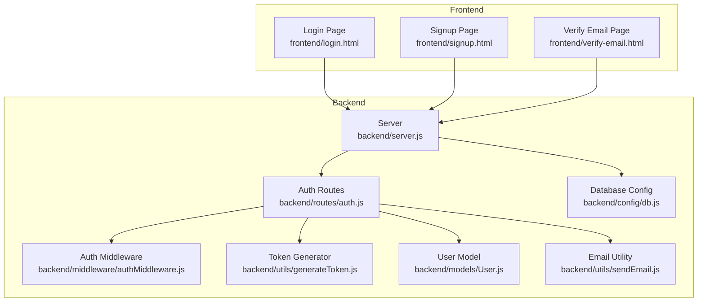
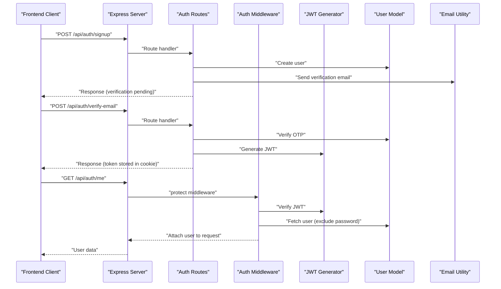
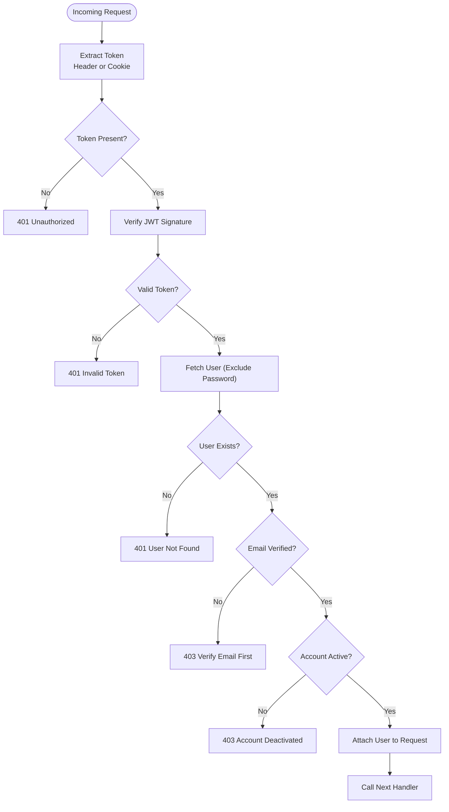
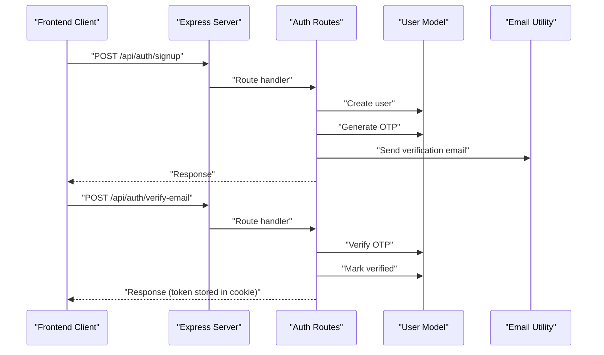
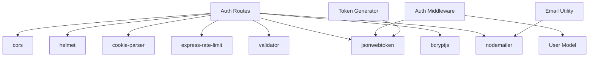

# Authentication Security

<cite>
**Referenced Files in This Document**
- [authMiddleware.js](file://backend/middleware/authMiddleware.js)
- [generateToken.js](file://backend/utils/generateToken.js)
- [User.js](file://backend/models/User.js)
- [auth.js](file://backend/routes/auth.js)
- [server.js](file://backend/server.js)
- [sendEmail.js](file://backend/utils/sendEmail.js)
- [db.js](file://backend/config/db.js)
- [package.json](file://backend/package.json)
- [login.html](file://frontend/login.html)
- [signup.html](file://frontend/signup.html)
- [verify-email.html](file://frontend/verify-email.html)
</cite>

## Table of Contents
1. [Introduction](#introduction)
2. [Project Structure](#project-structure)
3. [Core Components](#core-components)
4. [Architecture Overview](#architecture-overview)
5. [Detailed Component Analysis](#detailed-component-analysis)
6. [Dependency Analysis](#dependency-analysis)
7. [Performance Considerations](#performance-considerations)
8. [Troubleshooting Guide](#troubleshooting-guide)
9. [Conclusion](#conclusion)

## Introduction
This document provides comprehensive documentation for the authentication security implementation in the quiz application. It covers JWT token generation and validation, the three-tier authentication middleware system (protect routes, role-based authorization, and optional authentication), token storage mechanisms (cookies and headers), user validation checks, security measures such as email verification and account deactivation checks, and error handling for invalid/expired tokens. Practical examples demonstrate how to implement protected routes, role-based access control, and secure token management patterns.

## Project Structure
The authentication system spans the backend server, middleware, models, routes, utilities, and frontend pages. The backend uses Express.js with JWT for authentication, Mongoose for user persistence, and Nodemailer for email verification. The frontend handles user interactions and integrates with the backend APIs.



**Diagram sources**
- [server.js](file://backend/server.js#L1-L99)
- [auth.js](file://backend/routes/auth.js#L1-L715)
- [authMiddleware.js](file://backend/middleware/authMiddleware.js#L1-L132)
- [generateToken.js](file://backend/utils/generateToken.js#L1-L18)
- [User.js](file://backend/models/User.js#L1-L208)
- [sendEmail.js](file://backend/utils/sendEmail.js#L1-L159)
- [db.js](file://backend/config/db.js#L1-L43)

**Section sources**
- [server.js](file://backend/server.js#L1-L99)
- [auth.js](file://backend/routes/auth.js#L1-L715)

## Core Components
- JWT Token Generation: Creates signed tokens with user ID and role, configurable expiration.
- Authentication Middleware: Three-tier system for protecting routes, role-based authorization, and optional authentication.
- User Model: Defines user schema, validation, and helper methods for OTP and password reset.
- Email Utility: Sends verification emails, password reset emails, and welcome emails.
- Frontend Pages: Handle user interactions, form submissions, and token storage.

**Section sources**
- [generateToken.js](file://backend/utils/generateToken.js#L1-L18)
- [authMiddleware.js](file://backend/middleware/authMiddleware.js#L1-L132)
- [User.js](file://backend/models/User.js#L1-L208)
- [sendEmail.js](file://backend/utils/sendEmail.js#L1-L159)
- [login.html](file://frontend/login.html#L1-L260)
- [signup.html](file://frontend/signup.html#L1-L341)
- [verify-email.html](file://frontend/verify-email.html#L1-L213)

## Architecture Overview
The authentication architecture follows a layered approach:
- Frontend pages communicate with the backend via REST APIs.
- The server applies security middleware and CORS policies.
- Routes handle authentication actions (signup, login, verify-email, logout, refresh-token).
- Middleware validates tokens, enforces role-based access, and attaches user context.
- The database stores user data with verification and activity flags.
- Emails are sent for verification and password resets.



**Diagram sources**
- [auth.js](file://backend/routes/auth.js#L1-L715)
- [authMiddleware.js](file://backend/middleware/authMiddleware.js#L1-L132)
- [generateToken.js](file://backend/utils/generateToken.js#L1-L18)
- [User.js](file://backend/models/User.js#L1-L208)
- [sendEmail.js](file://backend/utils/sendEmail.js#L1-L159)

## Detailed Component Analysis

### JWT Token Generation and Expiration
- Token payload includes user ID and role.
- Secret key is loaded from environment variables.
- Expiration is configurable via environment variable with a default of seven days.
- Issuer is set for token provenance.

Implementation highlights:
- Token signing with secret and expiration configuration.
- Role inclusion in token payload for downstream authorization.

**Section sources**
- [generateToken.js](file://backend/utils/generateToken.js#L1-L18)

### Authentication Middleware System
The middleware provides three layers of authentication:

1) Protect Routes (Authentication)
- Extracts token from Authorization header or HttpOnly cookie.
- Verifies token signature using JWT secret.
- Fetches user from database excluding password field.
- Enforces email verification requirement and active account checks.
- Attaches user object to request for downstream handlers.

2) Role-Based Authorization
- Higher-order function that accepts roles and validates user role against allowed roles.
- Returns 401 if user is not authenticated.
- Returns 403 if user lacks required role.

3) Optional Authentication
- Attempts to extract and verify token similarly to protect.
- If token is present and user is verified, attaches user to request.
- Silently continues without user if token is absent or invalid.



**Diagram sources**
- [authMiddleware.js](file://backend/middleware/authMiddleware.js#L1-L132)

**Section sources**
- [authMiddleware.js](file://backend/middleware/authMiddleware.js#L1-L132)

### Token Storage in Cookies and Headers
- Backend sets HttpOnly, secure, and sameSite cookies for token storage.
- Frontend uses credentials: include for cross-origin requests to enable cookie transmission.
- Logout clears the token cookie immediately.

```mermaid
sequenceDiagram
participant Client as "Frontend Client"
participant Server as "Express Server"
participant Routes as "Auth Routes"
Client->>Server : "POST /api/auth/login"
Server->>Routes : "Route handler"
Routes->>Routes : "Generate JWT"
Routes-->>Client : "Set-Cookie : token=JWT; HttpOnly; Secure; SameSite=Strict"
Note over Client,Server : "Subsequent requests include cookie automatically"
Client->>Server : "POST /api/auth/logout"
Server->>Routes : "Route handler"
Routes-->>Client : "Set-Cookie : token=none; Expires=now"
```

**Diagram sources**
- [auth.js](file://backend/routes/auth.js#L49-L76)
- [auth.js](file://backend/routes/auth.js#L665-L676)
- [login.html](file://frontend/login.html#L180-L188)

**Section sources**
- [auth.js](file://backend/routes/auth.js#L49-L76)
- [auth.js](file://backend/routes/auth.js#L665-L676)
- [login.html](file://frontend/login.html#L180-L188)

### User Validation Checks
- Email verification requirement enforced during authentication.
- Account deactivation check prevents access for inactive accounts.
- User model includes flags for verification and activity status.

Validation flow:
- On login, if email is not verified, OTP is regenerated and sent, and client is informed to verify.
- On protected routes, middleware checks verification and activity flags.

**Section sources**
- [auth.js](file://backend/routes/auth.js#L339-L351)
- [authMiddleware.js](file://backend/middleware/authMiddleware.js#L40-L54)
- [User.js](file://backend/models/User.js#L61-L69)

### Email Verification and Password Reset
- OTP generation and verification with expiry handling.
- Email templates for verification, password reset, and welcome.
- Rate limiting for OTP-related endpoints.



**Diagram sources**
- [auth.js](file://backend/routes/auth.js#L183-L241)
- [User.js](file://backend/models/User.js#L114-L139)
- [sendEmail.js](file://backend/utils/sendEmail.js#L51-L86)

**Section sources**
- [auth.js](file://backend/routes/auth.js#L183-L241)
- [User.js](file://backend/models/User.js#L114-L139)
- [sendEmail.js](file://backend/utils/sendEmail.js#L51-L86)

### Protected Routes and Role-Based Access Control
- Protected routes use the protect middleware to ensure authentication and verification.
- Role-based authorization middleware restricts access based on user role.
- Example protected routes include fetching current user and updating profile.

Implementation patterns:
- Apply protect middleware to routes requiring authentication.
- Chain authorize middleware with allowed roles for admin-only endpoints.
- Use optionalAuth middleware for routes that should work whether authenticated or not.

**Section sources**
- [auth.js](file://backend/routes/auth.js#L512-L537)
- [auth.js](file://backend/routes/auth.js#L542-L608)
- [authMiddleware.js](file://backend/middleware/authMiddleware.js#L84-L102)

### Token Refresh Mechanism
- Refresh endpoint accepts token from cookie or body.
- Validates existing token and ensures user is verified and active.
- Issues a new token with updated cookie settings.

**Section sources**
- [auth.js](file://backend/routes/auth.js#L681-L712)

## Dependency Analysis
The authentication system relies on several key dependencies:
- jsonwebtoken: JWT token creation and verification.
- bcryptjs: Password hashing and comparison.
- validator: Input sanitization and validation.
- express-rate-limit: Rate limiting for security.
- nodemailer: Email delivery for verification and reset.
- cookie-parser: Parsing cookies for token extraction.
- helmet: Security headers.
- cors: Cross-origin resource sharing with credentials support.



**Diagram sources**
- [package.json](file://backend/package.json#L18-L31)
- [auth.js](file://backend/routes/auth.js#L1-L715)
- [authMiddleware.js](file://backend/middleware/authMiddleware.js#L1-L132)
- [generateToken.js](file://backend/utils/generateToken.js#L1-L18)
- [sendEmail.js](file://backend/utils/sendEmail.js#L1-L159)

**Section sources**
- [package.json](file://backend/package.json#L18-L31)

## Performance Considerations
- Token verification occurs on every protected request; keep JWT_SECRET secure and consider short-lived tokens for sensitive endpoints.
- Rate limiting reduces brute force attacks on login and OTP endpoints.
- Database queries for user lookup should leverage indexes on email and verification status.
- Cookie settings (HttpOnly, Secure, SameSite) prevent XSS and CSRF while maintaining functionality.

## Troubleshooting Guide
Common issues and resolutions:
- Invalid token errors: Occur when JWT signature is invalid or token is expired. Clients should prompt re-authentication.
- Email verification required: If login fails due to unverified email, regenerate and resend OTP.
- Account deactivated: Ensure user.isActive is true before allowing access.
- CORS and cookies: Ensure credentials: include is used in frontend requests and CORS allows credentials.
- Environment variables: Missing JWT_SECRET, MONGODB_URI, or FRONTEND_URL will cause server startup failures.

**Section sources**
- [authMiddleware.js](file://backend/middleware/authMiddleware.js#L60-L78)
- [auth.js](file://backend/routes/auth.js#L339-L351)
- [server.js](file://backend/server.js#L17-L23)
- [login.html](file://frontend/login.html#L180-L188)

## Conclusion
The authentication security implementation provides a robust foundation with JWT-based session management, comprehensive middleware layers, email verification, and role-based access control. By following the documented patterns for token generation, validation, storage, and user checks, developers can implement secure protected routes and maintain strong security practices across the application.