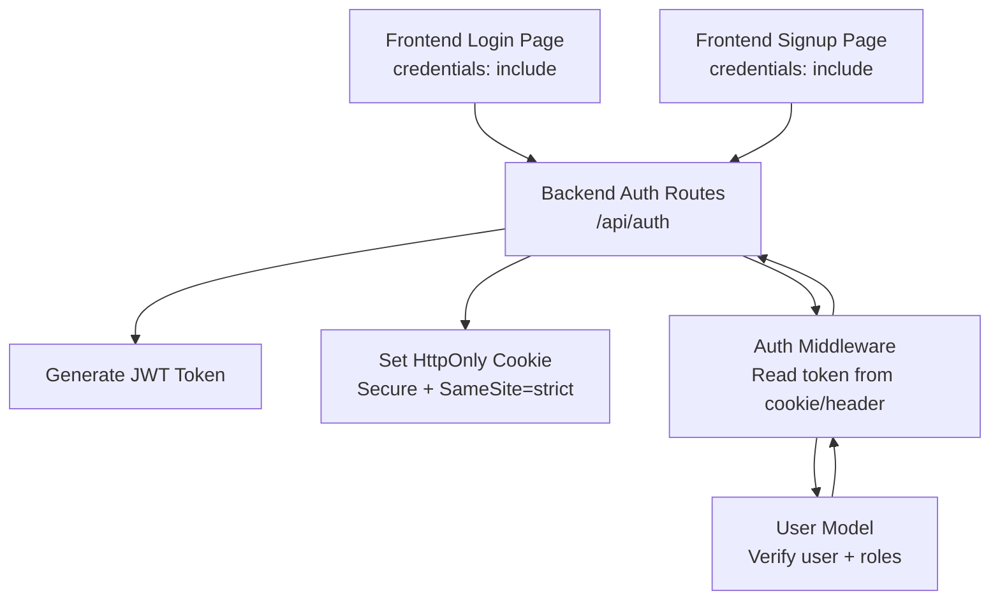
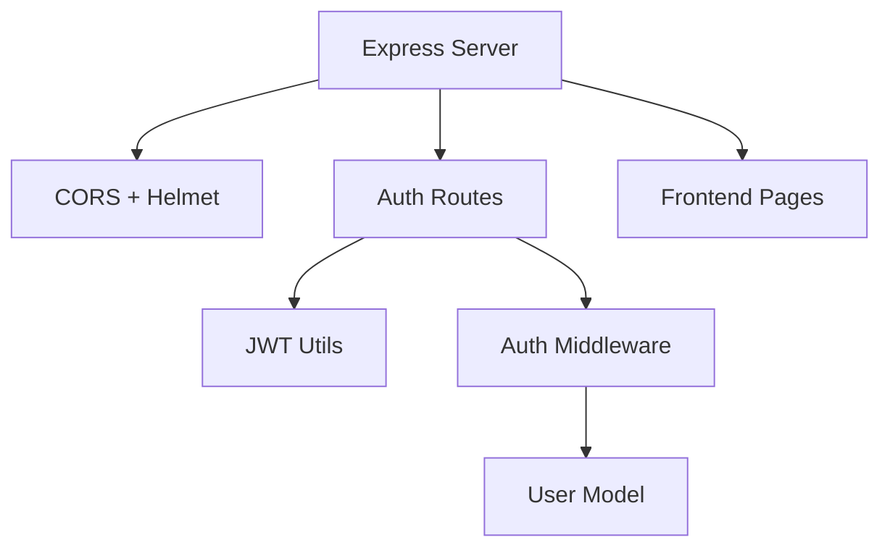

# Cookie Security Settings

<cite>
**Referenced Files in This Document**
- [server.js](file://backend/server.js)
- [auth.js](file://backend/routes/auth.js)
- [authMiddleware.js](file://backend/middleware/authMiddleware.js)
- [generateToken.js](file://backend/utils/generateToken.js)
- [User.js](file://backend/models/User.js)
- [sendEmail.js](file://backend/utils/sendEmail.js)
- [login.html](file://frontend/login.html)
- [signup.html](file://frontend/signup.html)
- [package.json](file://package.json)
</cite>

## Table of Contents
1. [Introduction](#introduction)
2. [Project Structure](#project-structure)
3. [Core Components](#core-components)
4. [Architecture Overview](#architecture-overview)
5. [Detailed Component Analysis](#detailed-component-analysis)
6. [Dependency Analysis](#dependency-analysis)
7. [Performance Considerations](#performance-considerations)
8. [Troubleshooting Guide](#troubleshooting-guide)
9. [Conclusion](#conclusion)

## Introduction
This document explains how the quiz application secures authentication cookies and JWT tokens, and documents the configuration choices made in the backend and frontend. It covers HttpOnly, Secure, SameSite, and domain/path considerations; compares cookie-based JWT storage versus localStorage; details CSRF protection via SameSite strict and CORS configuration; and outlines session management, cookie encryption, and environment-specific cookie handling. Practical best practices, potential vulnerabilities, and mitigation strategies are included for the quiz application context.

## Project Structure
The authentication flow spans the backend Express server, route handlers, middleware, and the frontend pages that initiate authenticated requests. The backend sets cookies with security flags and validates tokens from cookies or Authorization headers. The frontend uses credentials-enabled fetch requests to enable cross-origin cookie exchange.



**Diagram sources**
- [server.js](file://backend/server.js#L38-L43)
- [auth.js](file://backend/routes/auth.js#L49-L76)
- [authMiddleware.js](file://backend/middleware/authMiddleware.js#L8-L79)
- [User.js](file://backend/models/User.js#L108-L121)

**Section sources**
- [server.js](file://backend/server.js#L38-L43)
- [auth.js](file://backend/routes/auth.js#L49-L76)
- [authMiddleware.js](file://backend/middleware/authMiddleware.js#L8-L79)
- [login.html](file://frontend/login.html#L180-L188)
- [signup.html](file://frontend/signup.html#L287-L295)

## Core Components
- Backend server initializes CORS with credentials enabled and Helmet for security headers. It serves static frontend files and exposes the authentication API.
- Authentication routes generate a signed JWT and set it in an HttpOnly cookie with Secure and SameSite=strict flags. They also support token retrieval from Authorization headers for clients that need bearer token fallback.
- Authentication middleware reads tokens from cookies or Authorization headers, verifies them, and attaches the user to the request.
- Frontend login and signup pages use fetch with credentials: include to ensure cookies are sent cross-origin.

Key security-related behaviors:
- Cookie flags: httpOnly, secure (production), sameSite strict
- Token generation with expiration and issuer
- CORS allows credentials and specific origins
- Frontend fetch uses credentials: include for cookie exchange

**Section sources**
- [server.js](file://backend/server.js#L38-L43)
- [auth.js](file://backend/routes/auth.js#L49-L76)
- [authMiddleware.js](file://backend/middleware/authMiddleware.js#L8-L79)
- [generateToken.js](file://backend/utils/generateToken.js#L4-L16)
- [login.html](file://frontend/login.html#L180-L188)
- [signup.html](file://frontend/signup.html#L287-L295)

## Architecture Overview
The authentication flow integrates frontend fetch requests with backend cookie setting and middleware token verification.

```mermaid
sequenceDiagram
participant Client as "Browser"
participant FE as "Frontend Pages"
participant API as "Backend Auth Routes"
participant MW as "Auth Middleware"
participant DB as "User Model"
Client->>FE : User submits login/signup
FE->>API : POST /api/auth/login (credentials : include)
API->>API : Generate JWT token
API->>Client : Set-Cookie : token=...; HttpOnly; Secure; SameSite=Strict
API-->>FE : JSON { token, user }
FE->>API : Subsequent requests (cookies sent automatically)
API->>MW : protect()
MW->>DB : Verify token + load user
DB-->>MW : User data
MW-->>API : req.user attached
API-->>FE : Protected resource
```

**Diagram sources**
- [auth.js](file://backend/routes/auth.js#L49-L76)
- [authMiddleware.js](file://backend/middleware/authMiddleware.js#L8-L79)
- [User.js](file://backend/models/User.js#L108-L121)
- [login.html](file://frontend/login.html#L180-L188)

## Detailed Component Analysis

### Cookie Security Flags and Configuration
- HttpOnly: Enabled via the cookie library; prevents client-side JavaScript access to the token.
- Secure: Enabled in production; ensures cookies are transmitted only over HTTPS.
- SameSite: Set to strict; mitigates CSRF by preventing third-party contexts from sending the cookie.
- Expires: Set to 7 days; balances usability and risk.
- Domain/Path: Not explicitly configured; defaults apply. For production behind a reverse proxy or CDN, consider explicit domain/path to minimize exposure.

These settings are applied consistently across login and refresh flows.

**Section sources**
- [auth.js](file://backend/routes/auth.js#L54-L59)
- [auth.js](file://backend/routes/auth.js#L667-L670)

### JWT Token Storage: Cookies vs localStorage
- Backend behavior: Tokens are stored in an HttpOnly cookie. The frontend optionally stores token in localStorage or sessionStorage for convenience, but the server primarily relies on the cookie for authentication.
- Frontend behavior: On successful login, the frontend conditionally stores user and token in either localStorage (persistent) or sessionStorage (session-scoped) depending on the "Remember me" option. This is a pragmatic UX choice, while the backend’s primary authentication mechanism remains cookie-based.

Implications:
- Cookies are inherently safer against XSS than localStorage.
- localStorage can be accessed by scripts, increasing XSS risk.
- Using cookies removes the need to manually manage tokens in local storage.

**Section sources**
- [auth.js](file://backend/routes/auth.js#L50-L76)
- [login.html](file://frontend/login.html#L208-L211)

### CSRF Protection Mechanisms
- SameSite=strict: Blocks cross-site requests from including cookies, significantly reducing CSRF risk.
- CORS credentials: Enabled to allow cross-origin cookie exchange for legitimate frontend-backend communication.
- Additional CSRF safeguards: While SameSite strict is the primary defense, consider adding anti-CSRF tokens for form submissions if the app evolves to include forms with CSRF vulnerability surface.

**Section sources**
- [auth.js](file://backend/routes/auth.js#L58)
- [server.js](file://backend/server.js#L38-L43)

### Cookie Encryption and Session Management
- Transport encryption: Secure flag enforces HTTPS-only cookies in production.
- Cookie encryption at rest: Not implemented in this codebase. Consider encrypting sensitive session data if persisted outside the cookie value itself.
- Session lifecycle: The cookie expires in 7 days. Logout clears the cookie immediately with a short expiry and HttpOnly flag.

Recommendations:
- For highly sensitive applications, consider rotating tokens and short-lived sessions with refresh token rotation.
- Monitor and enforce revocation lists if tokens are ever compromised.

**Section sources**
- [auth.js](file://backend/routes/auth.js#L55-L59)
- [auth.js](file://backend/routes/auth.js#L667-L670)

### CORS Configuration for Cross-Origin Requests and Cookie Handling
- Origins: Explicitly allows the frontend origin and common development origins.
- Credentials: Enabled to permit cookies to be sent cross-origin.
- Methods and headers: Limited to necessary HTTP verbs and headers.

Environment-specific notes:
- Development: Localhost and 127.0.0.1 origins are allowed.
- Production: Ensure FRONTEND_URL matches the deployed origin to avoid SameSite nuances and cookie acceptance.

**Section sources**
- [server.js](file://backend/server.js#L38-L43)

### Token Generation and Expiration
- Token payload includes user id and role.
- Expiration controlled by environment variable with a default of 7 days.
- Issuer set for traceability.

**Section sources**
- [generateToken.js](file://backend/utils/generateToken.js#L4-L16)

### Frontend Fetch and Cookie Exchange
- Both login and signup pages use fetch with credentials: include to ensure cookies accompany cross-origin requests.
- This is essential for SameSite=strict cookies to work across origins.

**Section sources**
- [login.html](file://frontend/login.html#L180-L188)
- [signup.html](file://frontend/signup.html#L287-L295)

## Dependency Analysis
The authentication stack depends on Express middleware, cookie parser, JWT utilities, and the user model.



**Diagram sources**
- [server.js](file://backend/server.js#L38-L43)
- [auth.js](file://backend/routes/auth.js#L4-L7)
- [authMiddleware.js](file://backend/middleware/authMiddleware.js#L1-L4)
- [User.js](file://backend/models/User.js#L1-L5)
- [login.html](file://frontend/login.html#L180-L188)
- [signup.html](file://frontend/signup.html#L287-L295)

**Section sources**
- [package.json](file://package.json#L10-L22)
- [server.js](file://backend/server.js#L38-L43)
- [auth.js](file://backend/routes/auth.js#L4-L7)
- [authMiddleware.js](file://backend/middleware/authMiddleware.js#L1-L4)
- [User.js](file://backend/models/User.js#L1-L5)

## Performance Considerations
- Cookie size: Keep JWT small; only include necessary claims.
- SameSite strict: Improves security but may require careful redirect handling if cross-site navigation is involved.
- CORS: Limit allowed origins and headers to reduce overhead and attack surface.

## Troubleshooting Guide
Common issues and resolutions:
- Cookies not sent cross-origin:
  - Ensure frontend fetch uses credentials: include.
  - Verify CORS origin list includes the frontend origin and credentials: true is set.
- SameSite blocking requests:
  - Confirm SameSite=strict is appropriate for your deployment; adjust if cross-site navigation is required.
- Token not accepted:
  - Check JWT_SECRET environment variable is consistent across deployments.
  - Verify token expiration and issuer claims.
- Logout not effective:
  - Confirm the logout endpoint clears the cookie with HttpOnly and a past date.

**Section sources**
- [login.html](file://frontend/login.html#L180-L188)
- [server.js](file://backend/server.js#L38-L43)
- [auth.js](file://backend/routes/auth.js#L667-L670)
- [generateToken.js](file://backend/utils/generateToken.js#L4-L16)

## Conclusion
The quiz application employs secure cookie practices by defaulting to HttpOnly, enabling Secure in production, and using SameSite=strict to mitigate CSRF. JWT tokens are stored in cookies, with optional frontend storage in localStorage/sessionStorage for UX convenience. CORS is configured to allow credentials and specific origins. For further hardening, consider token rotation, encrypted session storage, and anti-CSRF tokens for forms. These measures collectively reduce XSS, CSRF, and token theft risks while maintaining a smooth user experience.