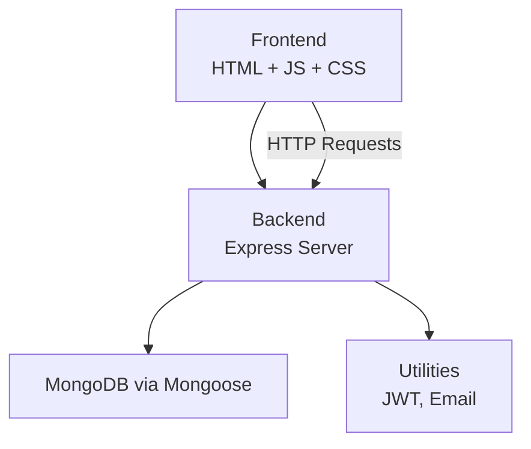
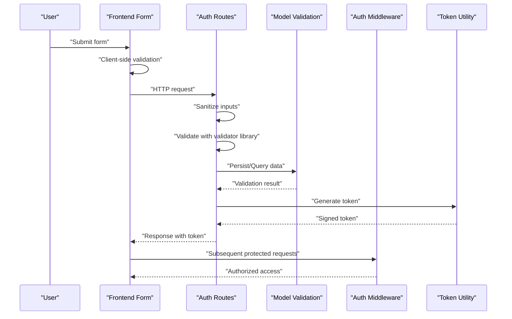
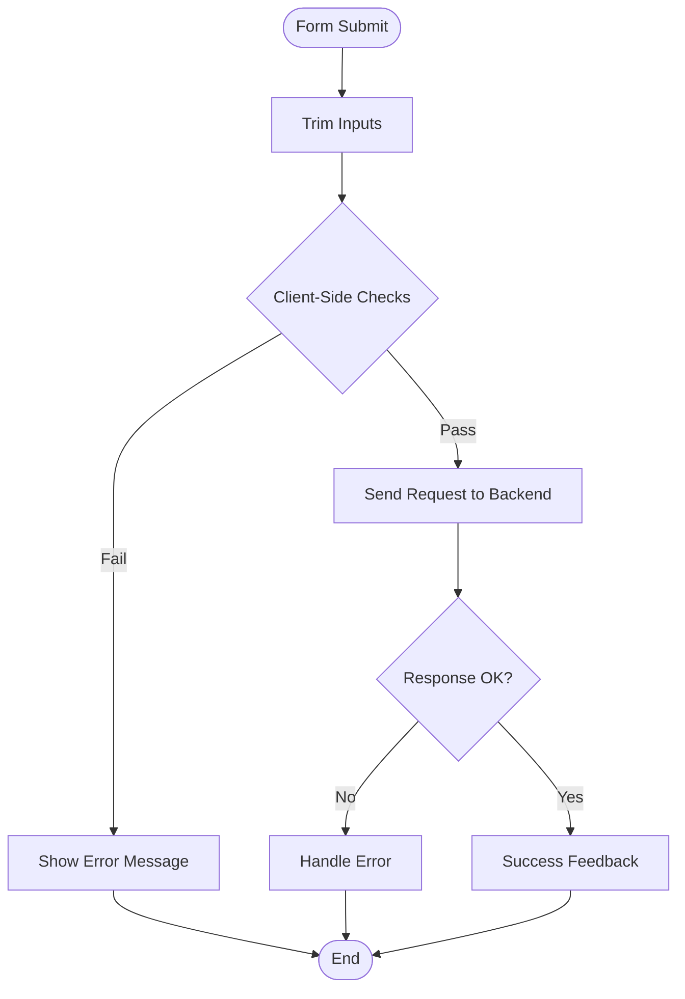
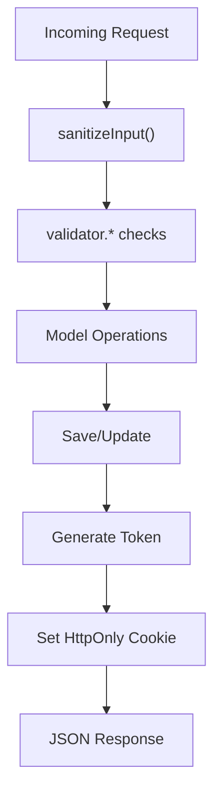
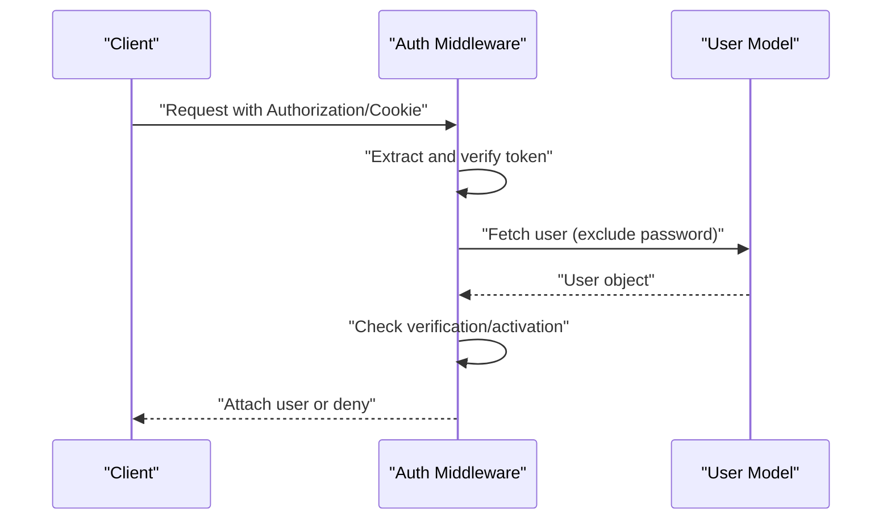
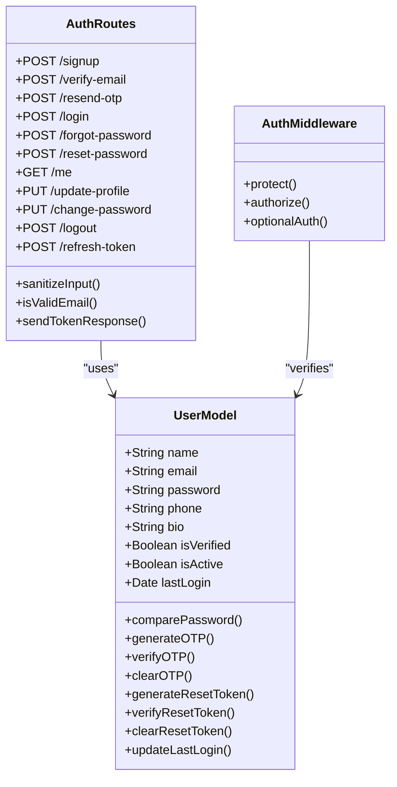
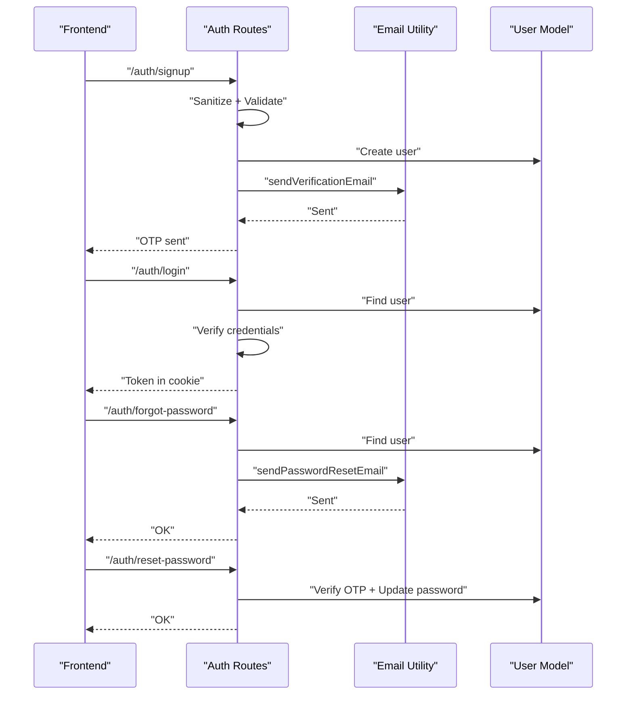
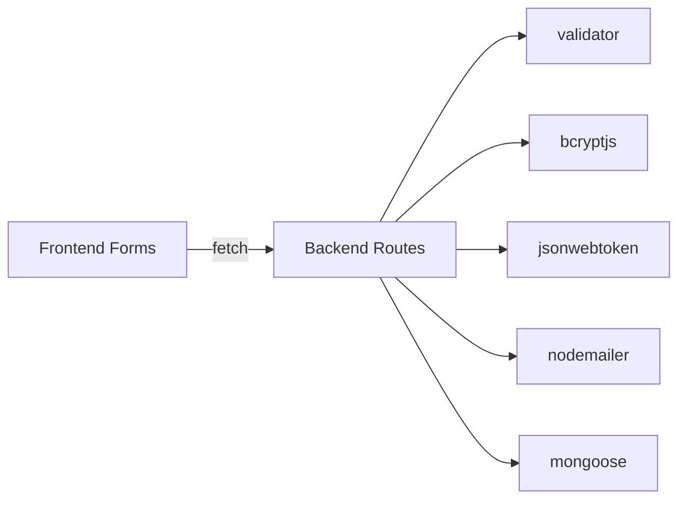

# Input Validation & Sanitization

<cite>
**Referenced Files in This Document**
- [server.js](file://backend/server.js)
- [auth.js](file://backend/routes/auth.js)
- [authMiddleware.js](file://backend/middleware/authMiddleware.js)
- [User.js](file://backend/models/User.js)
- [generateToken.js](file://backend/utils/generateToken.js)
- [sendEmail.js](file://backend/utils/sendEmail.js)
- [package.json](file://backend/package.json)
- [signup.html](file://frontend/signup.html)
- [login.html](file://frontend/login.html)
- [forgot-password.html](file://frontend/forgot-password.html)
- [verify-email.html](file://frontend/verify-email.html)
- [auth.css](file://frontend/css/auth.css)
</cite>

## Table of Contents
1. [Introduction](#introduction)
2. [Project Structure](#project-structure)
3. [Core Components](#core-components)
4. [Architecture Overview](#architecture-overview)
5. [Detailed Component Analysis](#detailed-component-analysis)
6. [Dependency Analysis](#dependency-analysis)
7. [Performance Considerations](#performance-considerations)
8. [Troubleshooting Guide](#troubleshooting-guide)
9. [Conclusion](#conclusion)

## Introduction
This document provides comprehensive guidance on input validation and sanitization practices across the application’s frontend and backend. It covers:
- Frontend validation patterns in HTML forms and JavaScript
- Backend validation using the validator library and model-level constraints
- Input sanitization techniques and data sanitization before processing
- Form validation for registration, login, and password reset workflows
- Error handling, user feedback mechanisms, and security implications
- Practical examples for preventing XSS attacks, SQL injection prevention, and enforcing data integrity

## Project Structure
The application follows a clear separation of concerns:
- Backend: Express server, routes, middleware, models, and utilities
- Frontend: Static HTML pages with embedded JavaScript and CSS for user interactions

**Diagram sources**
- [server.js](file://backend/server.js#L25-L99)
- [auth.js](file://backend/routes/auth.js#L1-L715)
- [User.js](file://backend/models/User.js#L1-L208)

**Section sources**
- [server.js](file://backend/server.js#L1-L99)
- [auth.js](file://backend/routes/auth.js#L1-L715)

## Core Components
- Frontend forms with client-side validation and user feedback
- Backend routes with robust input validation and sanitization
- Middleware for authentication and authorization
- Model-level validation and sanitization
- Utilities for token generation and email delivery

Key validation and sanitization points:
- Frontend: Trim inputs, basic format checks, and user feedback
- Backend: Validator library usage, sanitization helpers, model constraints, and rate limiting
- Middleware: Token verification and user state checks
- Utilities: Secure token generation and email templates

**Section sources**
- [signup.html](file://frontend/signup.html#L238-L324)
- [login.html](file://frontend/login.html#L164-L226)
- [forgot-password.html](file://frontend/forgot-password.html#L299-L424)
- [verify-email.html](file://frontend/verify-email.html#L114-L146)
- [auth.js](file://backend/routes/auth.js#L39-L47)
- [User.js](file://backend/models/User.js#L5-L83)
- [authMiddleware.js](file://backend/middleware/authMiddleware.js#L8-L79)

## Architecture Overview
The validation and sanitization pipeline spans frontend and backend layers:

**Diagram sources**
- [signup.html](file://frontend/signup.html#L238-L324)
- [auth.js](file://backend/routes/auth.js#L81-L178)
- [User.js](file://backend/models/User.js#L92-L103)
- [authMiddleware.js](file://backend/middleware/authMiddleware.js#L8-L79)
- [generateToken.js](file://backend/utils/generateToken.js#L4-L16)

## Detailed Component Analysis

### Frontend Validation Patterns
- Registration form validates name length, email format, password length, password confirmation, and terms acceptance. It trims inputs and provides immediate feedback via error messages and toast notifications.
- Login form validates email format and password presence, with loading states and error handling.
- Password reset form includes OTP input handling, password strength meter, and resend timer.
- Verify email form uses numeric-only OTP inputs with auto-focus and paste handling.

**Diagram sources**
- [signup.html](file://frontend/signup.html#L238-L324)
- [login.html](file://frontend/login.html#L164-L226)
- [forgot-password.html](file://frontend/forgot-password.html#L299-L424)
- [verify-email.html](file://frontend/verify-email.html#L114-L146)

**Section sources**
- [signup.html](file://frontend/signup.html#L208-L282)
- [login.html](file://frontend/login.html#L133-L175)
- [forgot-password.html](file://frontend/forgot-password.html#L172-L200)
- [verify-email.html](file://frontend/verify-email.html#L78-L112)

### Backend Validation and Sanitization
- Sanitization helper trims and escapes inputs before validation.
- Email validation uses the validator library for format checks.
- Strong password validation ensures minimum length and character variety.
- Model-level constraints enforce field lengths, uniqueness, and formats.
- Rate limiting protects sensitive endpoints against abuse.
- Token generation uses a signed JWT with secure cookie options.

**Diagram sources**
- [auth.js](file://backend/routes/auth.js#L39-L47)
- [auth.js](file://backend/routes/auth.js#L105-L125)
- [User.js](file://backend/models/User.js#L5-L83)
- [auth.js](file://backend/routes/auth.js#L49-L76)

**Section sources**
- [auth.js](file://backend/routes/auth.js#L39-L47)
- [auth.js](file://backend/routes/auth.js#L105-L125)
- [User.js](file://backend/models/User.js#L5-L83)
- [auth.js](file://backend/routes/auth.js#L49-L76)

### Authentication Middleware
- Extracts tokens from headers or cookies, verifies them, and attaches user context.
- Enforces verification and activity checks for protected routes.
- Handles token errors and returns appropriate responses.

**Diagram sources**
- [authMiddleware.js](file://backend/middleware/authMiddleware.js#L8-L79)

**Section sources**
- [authMiddleware.js](file://backend/middleware/authMiddleware.js#L8-L79)

### Data Integrity and Security Measures
- Model constraints prevent invalid data at persistence time.
- Password hashing with bcrypt secures stored credentials.
- JWT cookies configured with HttpOnly, Secure, and SameSite attributes to mitigate XSS and CSRF risks.
- Rate limiting reduces brute-force and abuse potential.
- Email transport uses environment variables and structured templates.

**Diagram sources**
- [User.js](file://backend/models/User.js#L5-L208)
- [auth.js](file://backend/routes/auth.js#L39-L715)
- [authMiddleware.js](file://backend/middleware/authMiddleware.js#L8-L132)

**Section sources**
- [User.js](file://backend/models/User.js#L92-L103)
- [auth.js](file://backend/routes/auth.js#L49-L76)
- [authMiddleware.js](file://backend/middleware/authMiddleware.js#L8-L79)

### Form Workflows: Registration, Login, Password Reset
- Registration: Trims and sanitizes inputs, validates email and password strength, checks duplicates, generates OTP, and sends verification email.
- Login: Validates credentials, enforces verification and activation, updates last login, and issues a token via cookie.
- Password Reset: Sends OTP securely, validates OTP and new password, and updates the user record.

**Diagram sources**
- [auth.js](file://backend/routes/auth.js#L81-L178)
- [auth.js](file://backend/routes/auth.js#L299-L377)
- [auth.js](file://backend/routes/auth.js#L381-L432)
- [auth.js](file://backend/routes/auth.js#L437-L507)
- [sendEmail.js](file://backend/utils/sendEmail.js#L51-L86)
- [sendEmail.js](file://backend/utils/sendEmail.js#L91-L123)

**Section sources**
- [auth.js](file://backend/routes/auth.js#L81-L178)
- [auth.js](file://backend/routes/auth.js#L299-L377)
- [auth.js](file://backend/routes/auth.js#L381-L432)
- [auth.js](file://backend/routes/auth.js#L437-L507)
- [sendEmail.js](file://backend/utils/sendEmail.js#L51-L86)
- [sendEmail.js](file://backend/utils/sendEmail.js#L91-L123)

## Dependency Analysis
- Backend depends on validator for format and strength checks, bcrypt for password hashing, JWT for tokens, and Nodemailer for emails.
- Frontend relies on built-in browser APIs and DOM manipulation for validation and user feedback.

**Diagram sources**
- [package.json](file://backend/package.json#L18-L31)
- [auth.js](file://backend/routes/auth.js#L9-L10)
- [User.js](file://backend/models/User.js#L2-L3)
- [generateToken.js](file://backend/utils/generateToken.js#L2)
- [sendEmail.js](file://backend/utils/sendEmail.js#L2)

**Section sources**
- [package.json](file://backend/package.json#L18-L31)

## Performance Considerations
- Rate limiting reduces load on sensitive endpoints and prevents abuse.
- Model-level validations occur during save operations, ensuring minimal redundant checks.
- Frontend validation reduces unnecessary network requests by catching errors early.

[No sources needed since this section provides general guidance]

## Troubleshooting Guide
Common validation and sanitization issues:
- Missing or invalid email format: Ensure frontend trims and validates email; backend re-validates with the validator library.
- Weak passwords: Enforce minimum length and character variety; provide user feedback via the frontend strength meter.
- Duplicate accounts: Backend checks for existing users and responds appropriately; frontend displays targeted error messages.
- OTP verification failures: Validate OTP presence and expiry; provide clear user feedback and enable resend with cooldown.
- Token errors: Middleware handles invalid/expired tokens and returns appropriate responses.

**Section sources**
- [auth.js](file://backend/routes/auth.js#L98-L103)
- [auth.js](file://backend/routes/auth.js#L114-L125)
- [auth.js](file://backend/routes/auth.js#L214-L220)
- [auth.js](file://backend/routes/auth.js#L481-L487)
- [authMiddleware.js](file://backend/middleware/authMiddleware.js#L61-L72)

## Conclusion
The application implements layered input validation and sanitization:
- Frontend provides immediate user feedback and basic checks.
- Backend enforces strict validation, sanitization, and integrity constraints.
- Middleware secures protected routes and user state.
- Utilities ensure secure token handling and safe email delivery.

These practices collectively mitigate XSS, reduce SQL injection risks, and maintain data integrity across the system.