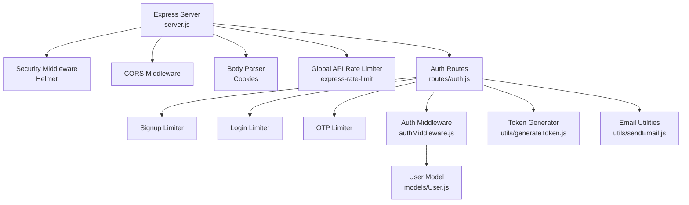
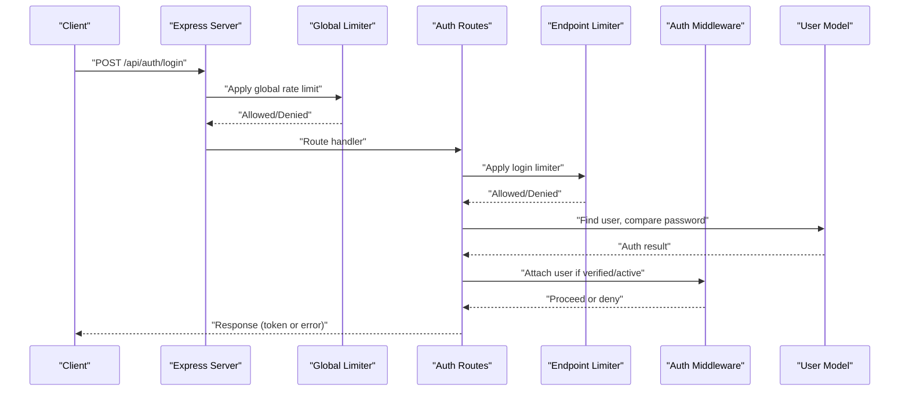
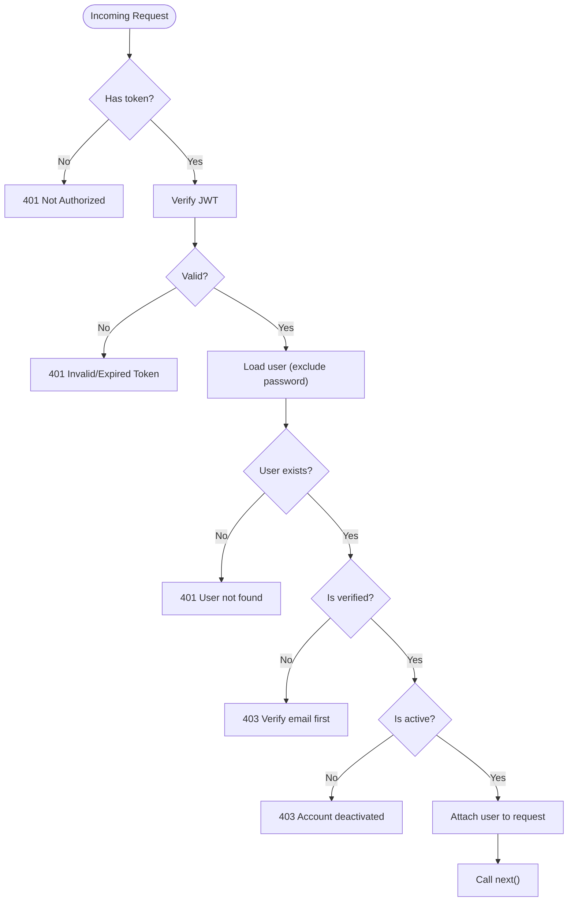
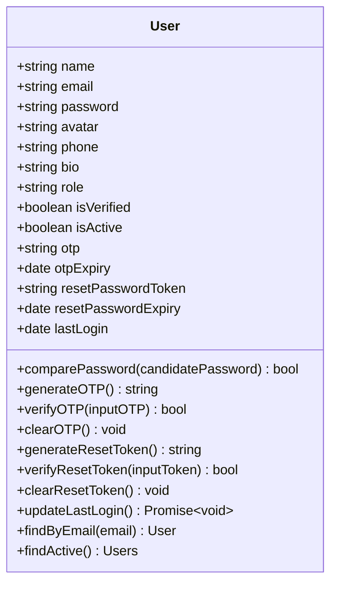
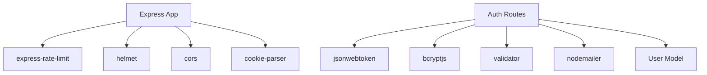

# Rate Limiting & Protection

<cite>
**Referenced Files in This Document**
- [server.js](file://backend/server.js)
- [auth.js](file://backend/routes/auth.js)
- [authMiddleware.js](file://backend/middleware/authMiddleware.js)
- [User.js](file://backend/models/User.js)
- [generateToken.js](file://backend/utils/generateToken.js)
- [sendEmail.js](file://backend/utils/sendEmail.js)
- [package.json](file://backend/package.json)
- [db.js](file://backend/config/db.js)
</cite>

## Table of Contents
1. [Introduction](#introduction)
2. [Project Structure](#project-structure)
3. [Core Components](#core-components)
4. [Architecture Overview](#architecture-overview)
5. [Detailed Component Analysis](#detailed-component-analysis)
6. [Dependency Analysis](#dependency-analysis)
7. [Performance Considerations](#performance-considerations)
8. [Troubleshooting Guide](#troubleshooting-guide)
9. [Conclusion](#conclusion)

## Introduction
This document explains the rate limiting and brute force protection mechanisms implemented in the backend. It covers request throttling for authentication endpoints, global API rate limiting, OTP and login attempt controls, and integration with security middleware. It also details configuration options, monitoring approaches for suspicious activity, and practical examples for implementing protective measures.

## Project Structure
The backend follows a layered architecture:
- Server bootstrap and middleware stack
- Authentication routes with endpoint-specific rate limiters
- JWT-based authentication middleware
- User model with OTP and security-related fields
- Token generation utility
- Email utilities for verification and password reset
- Database connection configuration

**Diagram sources**
- [server.js](file://backend/server.js#L25-L64)
- [auth.js](file://backend/routes/auth.js#L1-L33)
- [authMiddleware.js](file://backend/middleware/authMiddleware.js#L1-L79)
- [User.js](file://backend/models/User.js#L1-L208)
- [generateToken.js](file://backend/utils/generateToken.js#L1-L18)
- [sendEmail.js](file://backend/utils/sendEmail.js#L1-L159)

**Section sources**
- [server.js](file://backend/server.js#L25-L64)
- [auth.js](file://backend/routes/auth.js#L1-L33)

## Core Components
- Global API rate limiter: Applies a baseline cap on total API requests per IP.
- Endpoint-specific rate limiters:
  - Signup limiter: Limits sign-up attempts per IP over a 1-hour window.
  - Login limiter: Limits login attempts per IP over a 15-minute window; skips counting successful logins.
  - OTP limiter: Limits OTP resend and password reset requests per IP over a 15-minute window.
- Authentication middleware: Validates tokens, checks email verification, and enforces account activation status.
- User model: Provides OTP generation/verification, password comparison, and last login updates.
- Token generator: Creates signed JWTs with configurable expiry and issuer.
- Email utilities: Handles verification and password reset emails.

**Section sources**
- [server.js](file://backend/server.js#L58-L64)
- [auth.js](file://backend/routes/auth.js#L14-L33)
- [authMiddleware.js](file://backend/middleware/authMiddleware.js#L8-L79)
- [User.js](file://backend/models/User.js#L108-L177)
- [generateToken.js](file://backend/utils/generateToken.js#L4-L16)
- [sendEmail.js](file://backend/utils/sendEmail.js#L51-L157)

## Architecture Overview
The rate limiting architecture combines global and endpoint-specific protections:
- Global limiter protects all routes under /api/.
- Endpoint-specific limiters protect sensitive actions (signup, login, OTP).
- Authentication middleware ensures only verified, active users can access protected routes.

**Diagram sources**
- [server.js](file://backend/server.js#L58-L64)
- [auth.js](file://backend/routes/auth.js#L299-L377)
- [authMiddleware.js](file://backend/middleware/authMiddleware.js#L8-L79)
- [User.js](file://backend/models/User.js#L108-L177)

## Detailed Component Analysis

### Global API Rate Limiter
- Purpose: Prevents API abuse by enforcing a maximum number of requests per IP over a fixed time window.
- Configuration:
  - Window: 15 minutes
  - Max requests: 100 per IP/window
  - Message: Standardized JSON response on violation
- Scope: Applied to all routes under /api/.

Implementation highlights:
- Uses express-rate-limit to track requests per IP.
- Integrates early in middleware chain to protect all downstream routes.

**Section sources**
- [server.js](file://backend/server.js#L58-L64)

### Endpoint-Specific Rate Limiters

#### Signup Limiter
- Purpose: Throttle new account creation attempts to mitigate account enumeration and spam.
- Configuration:
  - Window: 1 hour
  - Max requests: 5 per IP/window
  - Message: Standardized JSON response on violation

Behavior:
- Counts failed and successful signups.
- Helps prevent brute force registration attempts.

**Section sources**
- [auth.js](file://backend/routes/auth.js#L14-L20)

#### Login Limiter
- Purpose: Protect login endpoints from brute force attacks.
- Configuration:
  - Window: 15 minutes
  - Max requests: 10 per IP/window
  - Skip successful requests: Prevents counting valid logins toward the limit
  - Message: Standardized JSON response on violation

Behavior:
- Successful logins are excluded from the counter.
- Helps reduce risk of credential stuffing and OTP guessing.

**Section sources**
- [auth.js](file://backend/routes/auth.js#L22-L27)

#### OTP Limiter
- Purpose: Limit OTP resend and password reset requests to prevent abuse.
- Configuration:
  - Window: 15 minutes
  - Max requests: 5 per IP/window
  - Message: Standardized JSON response on violation

Behavior:
- Protects both resend-OTP and forgot-password endpoints.
- Reduces OTP guessing and account takeover attempts.

**Section sources**
- [auth.js](file://backend/routes/auth.js#L29-L33)

### Authentication Middleware
- Purpose: Enforce authentication and authorization for protected routes.
- Checks:
  - Presence and validity of JWT token (from Authorization header or cookie)
  - User existence and verification status
  - Account activation status
- On failure: Returns standardized JSON error responses with appropriate HTTP status codes.

**Diagram sources**
- [authMiddleware.js](file://backend/middleware/authMiddleware.js#L8-L79)

**Section sources**
- [authMiddleware.js](file://backend/middleware/authMiddleware.js#L8-L79)

### User Model and OTP Management
- OTP lifecycle:
  - Generation: Random 6-digit code, stored as SHA-256 hash with expiry in 10 minutes.
  - Verification: Compares input against stored hash and checks expiry.
  - Clearing: Removes OTP and expiry after successful verification.
- Password handling:
  - Hashing with bcrypt during save.
  - Comparison using bcrypt for login.
- Additional security fields:
  - isVerified and isActive flags.
  - lastLogin timestamp updated on successful login.

**Diagram sources**
- [User.js](file://backend/models/User.js#L5-L83)
- [User.js](file://backend/models/User.js#L108-L177)

**Section sources**
- [User.js](file://backend/models/User.js#L108-L177)

### Token Generation
- Purpose: Create signed JWTs with configurable expiry and issuer.
- Includes role in token payload for role-based authorization.
- Uses environment variable for expiry and issuer.

**Section sources**
- [generateToken.js](file://backend/utils/generateToken.js#L4-L16)

### Email Utilities
- Purpose: Send verification, password reset, and welcome emails.
- Uses Nodemailer with Gmail SMTP.
- Provides standardized HTML templates for OTP delivery.

**Section sources**
- [sendEmail.js](file://backend/utils/sendEmail.js#L51-L157)

## Dependency Analysis
Key dependencies and their roles:
- express-rate-limit: Implements rate limiting for endpoints and globally.
- helmet: Adds security headers to responses.
- cors: Enables cross-origin requests with credentials.
- cookie-parser: Parses cookies for JWT retrieval.
- jsonwebtoken: Generates and verifies JWTs.
- bcryptjs: Hashes and compares passwords.
- validator: Sanitizes and validates inputs.
- nodemailer: Sends transactional emails.

**Diagram sources**
- [package.json](file://backend/package.json#L18-L31)
- [auth.js](file://backend/routes/auth.js#L1-L9)
- [User.js](file://backend/models/User.js#L1-L3)

**Section sources**
- [package.json](file://backend/package.json#L18-L31)

## Performance Considerations
- Rate limiter memory footprint: Default in-memory store scales well for small to medium deployments. For horizontal scaling, consider a shared store (e.g., Redis) to maintain consistent counters across instances.
- Window sizing: Short windows reduce burstiness but increase false positives; long windows improve user experience but allow more abuse.
- Max requests: Tune per endpoint based on legitimate usage patterns and threat modeling.
- Skip successful requests: Recommended for login limiter to avoid penalizing legitimate users.
- Logging and observability: Use structured logs to monitor rate limit hits and correlate with suspicious activity.

## Troubleshooting Guide
Common issues and resolutions:
- Missing environment variables:
  - Ensure MONGODB_URI, JWT_SECRET, and FRONTEND_URL are set. The server validates these at startup and exits if any are missing.
- Rate limit exceeded:
  - Clients receive a standardized JSON response indicating too many requests. Adjust thresholds or wait until the window elapses.
- Login failures:
  - Invalid credentials return 401. Ensure email is verified and account is active.
- OTP invalid/expired:
  - OTPs expire after 10 minutes. Regenerate OTP if needed.
- Email delivery errors:
  - Verify SMTP configuration and network connectivity. Check logs for transport errors.

**Section sources**
- [server.js](file://backend/server.js#L17-L23)
- [auth.js](file://backend/routes/auth.js#L300-L377)
- [User.js](file://backend/models/User.js#L114-L133)
- [sendEmail.js](file://backend/utils/sendEmail.js#L24-L31)

## Conclusion
The backend implements a layered defense-in-depth strategy:
- Global API rate limiting prevents overall abuse.
- Endpoint-specific limiters protect high-risk actions (signup, login, OTP).
- Authentication middleware ensures only verified, active users can access protected resources.
- User model and OTP utilities support secure verification and password reset flows.
- Email utilities enable timely notifications for verification and resets.

These mechanisms collectively mitigate brute force login attempts, OTP guessing, and API abuse while maintaining a good user experience. For production deployments, consider adding centralized logging, alerting, and a shared rate limiter store for multi-instance setups.