# Security Implementation

<cite>
**Referenced Files in This Document**
- [server.js](file://backend/server.js)
- [authMiddleware.js](file://backend/middleware/authMiddleware.js)
- [generateToken.js](file://backend/utils/generateToken.js)
- [auth.js](file://backend/routes/auth.js)
- [sendEmail.js](file://backend/utils/sendEmail.js)
- [db.js](file://backend/config/db.js)
- [User.js](file://backend/models/User.js)
- [package.json](file://backend/package.json)
- [login.html](file://frontend/login.html)
- [signup.html](file://frontend/signup.html)
- [forgot-password.html](file://frontend/forgot-password.html)
</cite>

## Table of Contents
1. [Introduction](#introduction)
2. [Project Structure](#project-structure)
3. [Core Components](#core-components)
4. [Architecture Overview](#architecture-overview)
5. [Detailed Component Analysis](#detailed-component-analysis)
6. [Dependency Analysis](#dependency-analysis)
7. [Performance Considerations](#performance-considerations)
8. [Troubleshooting Guide](#troubleshooting-guide)
9. [Conclusion](#conclusion)

## Introduction
This document provides comprehensive security documentation for the quiz application, focusing on the backend security implementation. It covers JWT token lifecycle, input validation and sanitization, rate limiting and brute-force protections, security middleware, cookie security, CORS configuration, Helmet headers, password security, database security, and email service security. It also addresses common security vulnerabilities specific to the quiz application context and recommended mitigations.

## Project Structure
The security-critical parts of the application are organized as follows:
- Server bootstrap and middleware stack in the backend server
- Authentication routes and controllers
- JWT generation and validation utilities
- Authentication middleware for protecting routes
- User model with password hashing and OTP/token management
- Email utility for verification and password reset
- Frontend pages that integrate with the backend APIs

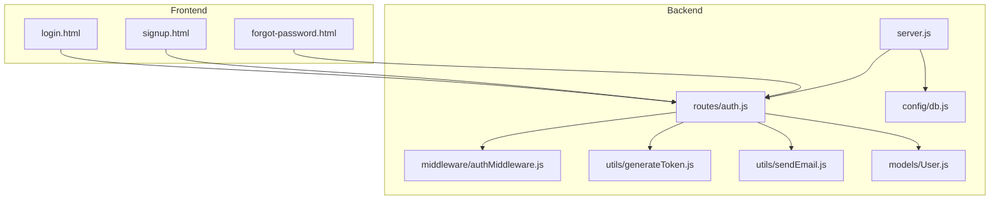

**Diagram sources**
- [server.js](file://backend/server.js#L1-L99)
- [auth.js](file://backend/routes/auth.js#L1-L715)
- [authMiddleware.js](file://backend/middleware/authMiddleware.js#L1-L132)
- [generateToken.js](file://backend/utils/generateToken.js#L1-L18)
- [sendEmail.js](file://backend/utils/sendEmail.js#L1-L159)
- [User.js](file://backend/models/User.js#L1-L208)
- [db.js](file://backend/config/db.js#L1-L43)
- [login.html](file://frontend/login.html#L1-L260)
- [signup.html](file://frontend/signup.html#L1-L341)
- [forgot-password.html](file://frontend/forgot-password.html#L1-L448)

**Section sources**
- [server.js](file://backend/server.js#L1-L99)
- [auth.js](file://backend/routes/auth.js#L1-L715)
- [authMiddleware.js](file://backend/middleware/authMiddleware.js#L1-L132)
- [generateToken.js](file://backend/utils/generateToken.js#L1-L18)
- [sendEmail.js](file://backend/utils/sendEmail.js#L1-L159)
- [User.js](file://backend/models/User.js#L1-L208)
- [db.js](file://backend/config/db.js#L1-L43)
- [login.html](file://frontend/login.html#L1-L260)
- [signup.html](file://frontend/signup.html#L1-L341)
- [forgot-password.html](file://frontend/forgot-password.html#L1-L448)

## Core Components
- JWT implementation: token generation with expiration and issuer, validation in middleware, and refresh endpoint
- Input validation and sanitization: backend validation and sanitization plus frontend basic checks
- Rate limiting: global limiter and per-route limiters for signup, login, and OTP
- Security middleware: authentication guard, optional auth, and role-based authorization
- Cookie security: HttpOnly, secure, sameSite strict, and fixed expiration
- CORS and Helmet: CORS policy for frontend origins and Helmet headers with CSP disabled for inline scripts
- Password security: bcrypt hashing with high cost, password strength validation
- Database security: connection pooling, error logging, and sensitive field indexing
- Email security: Nodemailer transport with TLS and environment-based credentials

**Section sources**
- [generateToken.js](file://backend/utils/generateToken.js#L1-L18)
- [authMiddleware.js](file://backend/middleware/authMiddleware.js#L1-L132)
- [auth.js](file://backend/routes/auth.js#L14-L33)
- [server.js](file://backend/server.js#L32-L43)
- [User.js](file://backend/models/User.js#L93-L103)
- [db.js](file://backend/config/db.js#L4-L11)
- [sendEmail.js](file://backend/utils/sendEmail.js#L7-L22)

## Architecture Overview
The security architecture integrates multiple layers:
- Transport security via Helmet and HTTPS in production
- Cross-origin access controlled by CORS allowing specific frontend origins
- Request throttling at global and route-specific levels
- Authentication enforced by middleware that validates JWT from headers or cookies
- Authorization via role checks
- Secure cookie storage for tokens
- Database and email transport configured with environment variables

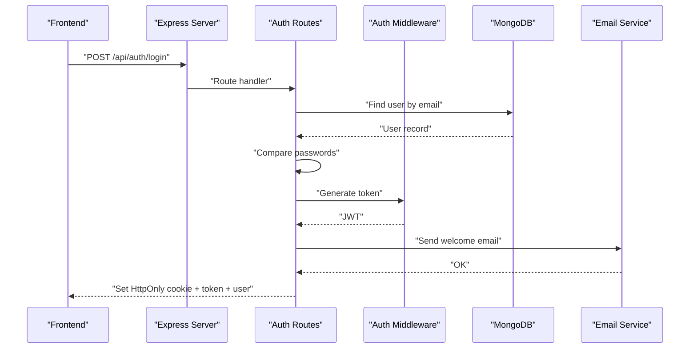

**Diagram sources**
- [server.js](file://backend/server.js#L32-L43)
- [auth.js](file://backend/routes/auth.js#L299-L377)
- [authMiddleware.js](file://backend/middleware/authMiddleware.js#L8-L79)
- [sendEmail.js](file://backend/utils/sendEmail.js#L128-L157)
- [db.js](file://backend/config/db.js#L4-L11)

## Detailed Component Analysis

### JWT Implementation
- Token generation includes issuer and configurable expiration via environment variable
- Validation occurs in middleware using the shared secret
- Token retrieval supports both Authorization header and HttpOnly cookie
- Logout clears the cookie with immediate expiry
- Refresh endpoint verifies the old token and issues a new one

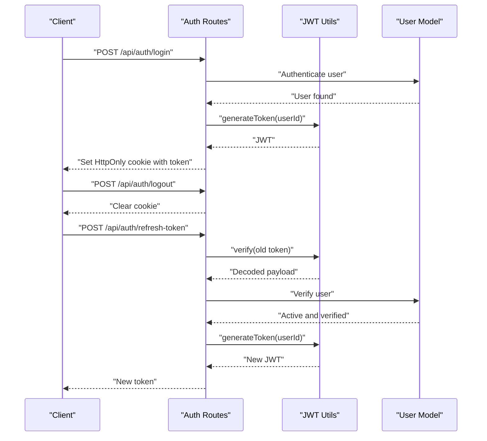

**Diagram sources**
- [generateToken.js](file://backend/utils/generateToken.js#L4-L16)
- [auth.js](file://backend/routes/auth.js#L665-L712)
- [authMiddleware.js](file://backend/middleware/authMiddleware.js#L8-L79)
- [User.js](file://backend/models/User.js#L1-L208)

**Section sources**
- [generateToken.js](file://backend/utils/generateToken.js#L1-L18)
- [authMiddleware.js](file://backend/middleware/authMiddleware.js#L8-L79)
- [auth.js](file://backend/routes/auth.js#L49-L76)
- [auth.js](file://backend/routes/auth.js#L665-L712)

### Input Validation and Sanitization
- Backend validation and sanitization:
  - Email normalization and validation
  - Password length and strength checks
  - OTP generation and verification with expiry
  - Profile updates sanitized and validated
- Frontend validation:
  - Basic form-level checks and real-time feedback
  - Credentials include for cross-origin cookies

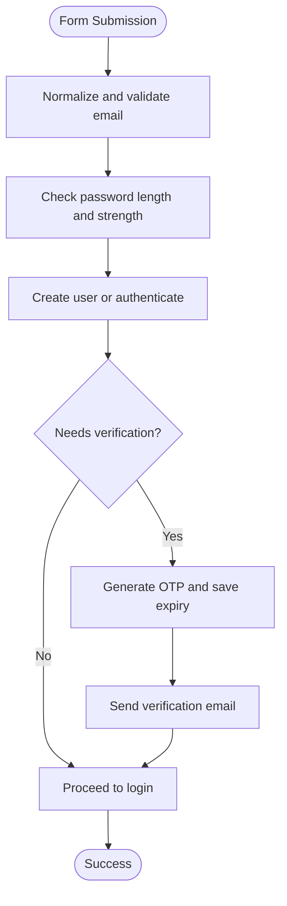

**Diagram sources**
- [auth.js](file://backend/routes/auth.js#L81-L178)
- [auth.js](file://backend/routes/auth.js#L299-L377)
- [User.js](file://backend/models/User.js#L108-L139)

**Section sources**
- [auth.js](file://backend/routes/auth.js#L39-L47)
- [auth.js](file://backend/routes/auth.js#L81-L178)
- [auth.js](file://backend/routes/auth.js#L299-L377)
- [login.html](file://frontend/login.html#L164-L226)
- [signup.html](file://frontend/signup.html#L238-L324)

### Rate Limiting and Brute Force Protection
- Global rate limiter protects all API endpoints
- Route-specific limiters:
  - Signup: limited attempts per hour
  - Login: limited failed attempts with skip for successful requests
  - OTP: limited resend attempts
- These measures reduce brute-force login and OTP abuse risks

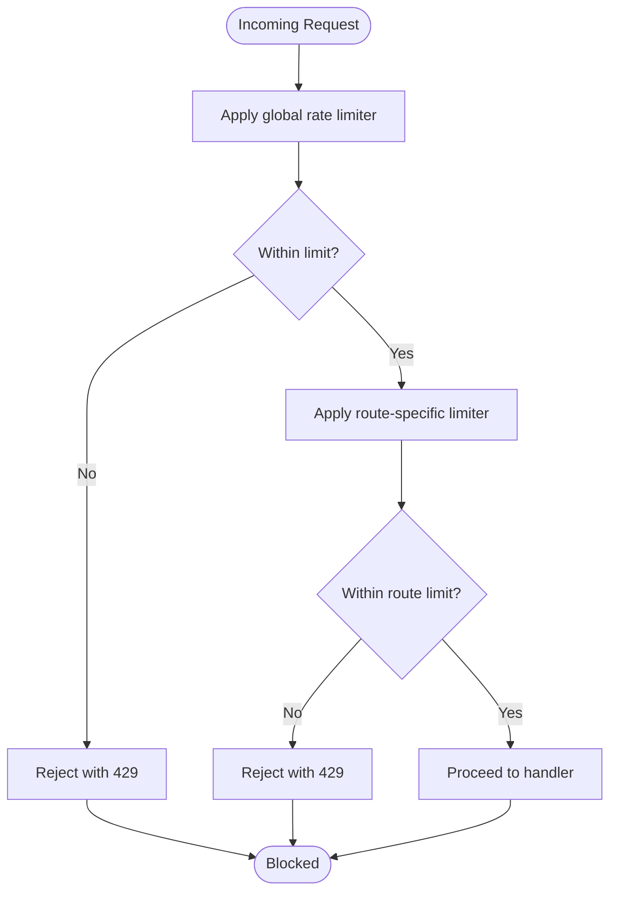

**Diagram sources**
- [server.js](file://backend/server.js#L58-L64)
- [auth.js](file://backend/routes/auth.js#L14-L33)

**Section sources**
- [server.js](file://backend/server.js#L58-L64)
- [auth.js](file://backend/routes/auth.js#L14-L33)

### Security Middleware Functionality
- protect: extracts token from header or cookie, verifies it, ensures user exists and is verified/active, attaches user to request
- authorize: role-based gatekeeping
- optionalAuth: attempts to authenticate without failing the request

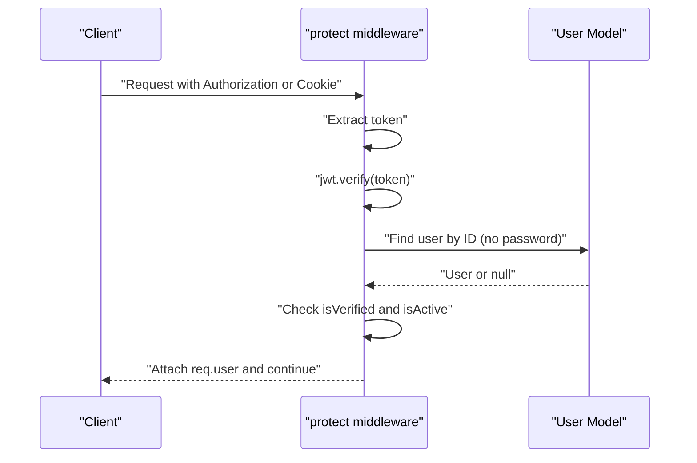

**Diagram sources**
- [authMiddleware.js](file://backend/middleware/authMiddleware.js#L8-L79)
- [User.js](file://backend/models/User.js#L31-L54)

**Section sources**
- [authMiddleware.js](file://backend/middleware/authMiddleware.js#L8-L132)

### Cookie Security Settings
- HttpOnly: prevents XSS access to the token
- Secure: restricts transmission to HTTPS in production
- SameSite: strict to mitigate CSRF
- Fixed expiry: 7 days for convenience and security balance

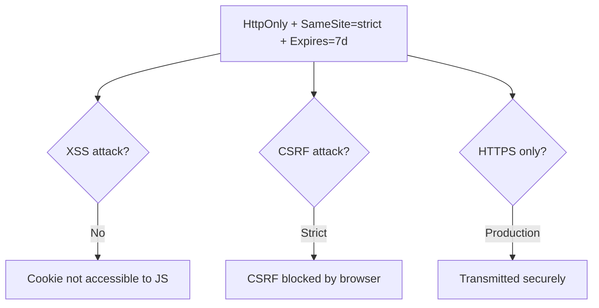

**Diagram sources**
- [auth.js](file://backend/routes/auth.js#L53-L62)

**Section sources**
- [auth.js](file://backend/routes/auth.js#L49-L76)

### CORS Configuration
- Origins explicitly allowed include development and production frontend URLs
- Credentials enabled to support cookies
- Methods and headers restricted to necessary ones

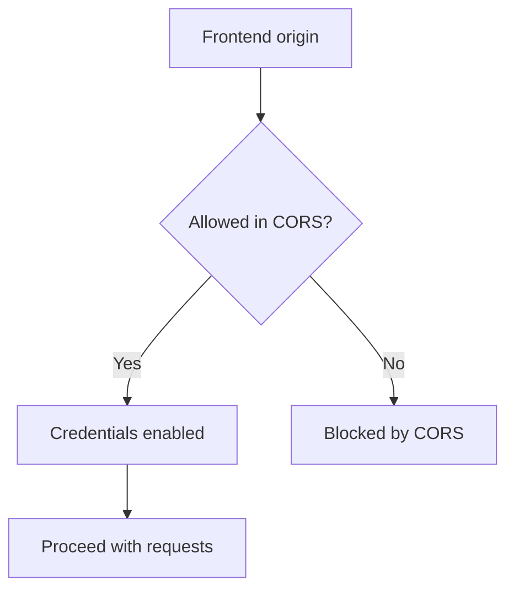

**Diagram sources**
- [server.js](file://backend/server.js#L38-L43)

**Section sources**
- [server.js](file://backend/server.js#L38-L43)

### Helmet Security Headers
- Helmet applied with CSP disabled and COEP disabled to accommodate inline scripts
- Other security headers remain active

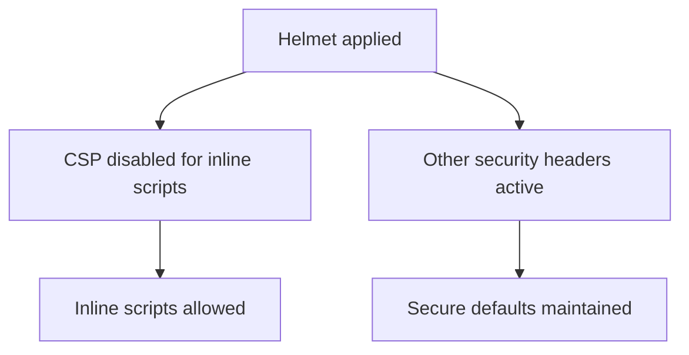

**Diagram sources**
- [server.js](file://backend/server.js#L32-L35)

**Section sources**
- [server.js](file://backend/server.js#L32-L35)

### Password Security Practices
- Passwords are hashed using bcrypt with a high cost factor during save hooks
- Password strength enforced via validator library for signup and reset flows
- No plaintext passwords stored; sensitive fields excluded from queries

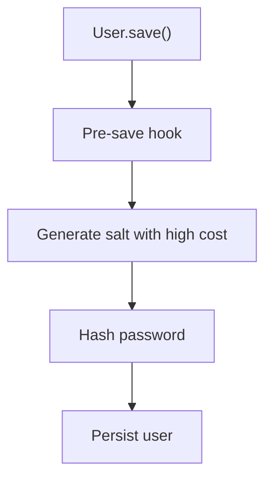

**Diagram sources**
- [User.js](file://backend/models/User.js#L93-L103)

**Section sources**
- [User.js](file://backend/models/User.js#L25-L30)
- [User.js](file://backend/models/User.js#L93-L103)
- [auth.js](file://backend/routes/auth.js#L113-L125)
- [auth.js](file://backend/routes/auth.js#L458-L469)

### Database Security Measures
- MongoDB connection configured with pooling and timeout options
- Environment-based URI and credentials
- Connection event logging for monitoring and alerting

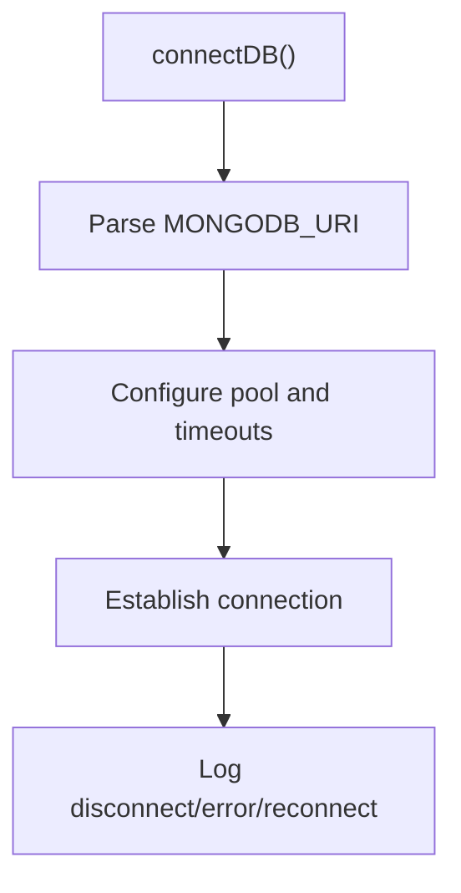

**Diagram sources**
- [db.js](file://backend/config/db.js#L4-L27)

**Section sources**
- [db.js](file://backend/config/db.js#L1-L43)

### Email Service Security
- Nodemailer configured with TLS and SMTP host/port
- Credentials loaded from environment variables
- Emails sent with minimal HTML and no external resources to reduce risk

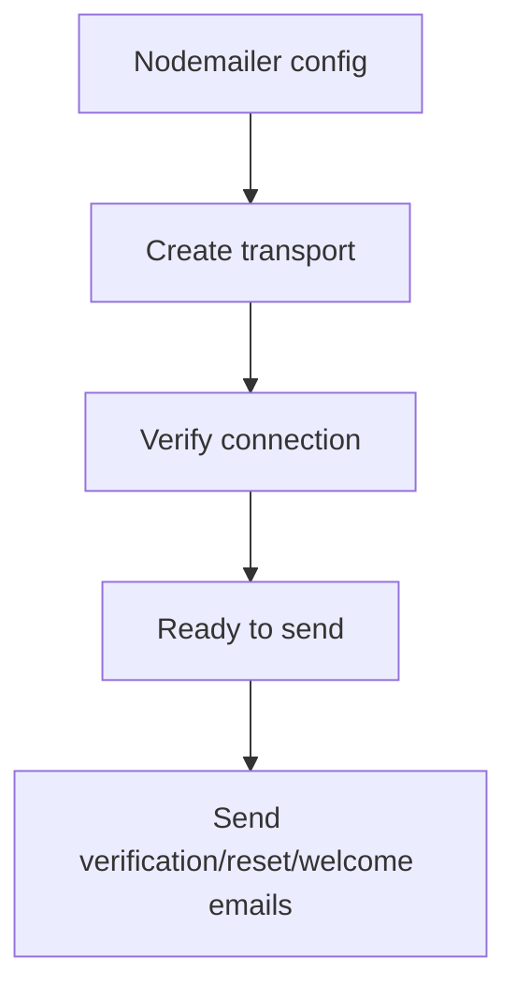

**Diagram sources**
- [sendEmail.js](file://backend/utils/sendEmail.js#L7-L31)
- [sendEmail.js](file://backend/utils/sendEmail.js#L51-L86)
- [sendEmail.js](file://backend/utils/sendEmail.js#L91-L123)
- [sendEmail.js](file://backend/utils/sendEmail.js#L128-L157)

**Section sources**
- [sendEmail.js](file://backend/utils/sendEmail.js#L1-L159)

### Frontend Security Considerations
- Frontend pages set credentials to include for cross-origin cookie support
- Real-time validation and user feedback
- OTP input masking and numeric constraints for password reset flow

**Section sources**
- [login.html](file://frontend/login.html#L185-L188)
- [signup.html](file://frontend/signup.html#L292-L295)
- [forgot-password.html](file://frontend/forgot-password.html#L320-L324)
- [forgot-password.html](file://frontend/forgot-password.html#L242-L271)

## Dependency Analysis
Security-related dependencies and their roles:
- jsonwebtoken: JWT signing and verification
- bcryptjs: Password hashing
- express-rate-limit: Request throttling
- helmet: Security headers
- cors: Cross-origin policy
- cookie-parser: Cookie parsing
- validator: Input validation and strength checks
- nodemailer: Email delivery
- dotenv: Environment variable loading

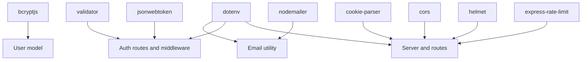

**Diagram sources**
- [package.json](file://backend/package.json#L18-L31)
- [auth.js](file://backend/routes/auth.js#L1-L10)
- [authMiddleware.js](file://backend/middleware/authMiddleware.js#L1-L4)
- [User.js](file://backend/models/User.js#L1-L4)
- [server.js](file://backend/server.js#L1-L8)
- [sendEmail.js](file://backend/utils/sendEmail.js#L1-L3)

**Section sources**
- [package.json](file://backend/package.json#L1-L36)

## Performance Considerations
- JWT verification is lightweight; ensure secrets are long and random
- bcrypt cost factor balances security and performance; monitor slow requests
- Rate limiters prevent resource exhaustion but may impact legitimate users under load
- Email sending is asynchronous; consider queueing for high volume
- Database connection pooling improves throughput; tune based on traffic patterns

## Troubleshooting Guide
Common issues and resolutions:
- Missing environment variables cause early termination; ensure MONGODB_URI, JWT_SECRET, FRONTEND_URL are set
- Authentication failures: invalid/expired tokens, unverified users, inactive accounts
- Rate limit exceeded: adjust windows and max values or implement client-side backoff
- CORS errors: verify allowed origins and credentials settings
- Email delivery failures: check credentials and TLS configuration

**Section sources**
- [server.js](file://backend/server.js#L15-L23)
- [authMiddleware.js](file://backend/middleware/authMiddleware.js#L60-L78)
- [auth.js](file://backend/routes/auth.js#L14-L33)
- [server.js](file://backend/server.js#L38-L43)
- [sendEmail.js](file://backend/utils/sendEmail.js#L24-L31)

## Conclusion
The quiz application implements a layered security approach combining transport security, robust authentication and authorization, input validation, rate limiting, secure cookies, and careful database and email configurations. While the current setup provides strong baseline protections, continuous monitoring, regular security audits, and adherence to least privilege principles are essential for maintaining security posture.